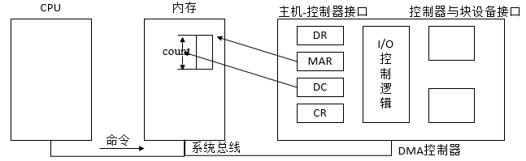

##【操作系统】设备管理（五）

##
##一、前言

##
##　　学习了存储器管理后，继续学习设备管理，设备管理的主要功能有缓冲区管理、设备分配、设备处理、虚拟设备及实现设备独立性等，由于I/O设备不仅种类繁多，而且他们的特性和操作方式往往相差甚大，使得设备管理称为操作系统中最繁杂且与硬件最紧密的部分，下面开始正式的学习。

##
##二、I/O系统

##
##　　2.1 I/O设备

##
##　　I/O设备类型繁多，在OS观点看，设备使用特性、数据传输速率、数据的传输单位、设备共享属性等都是重要的性能指标。可以按照不同角度对他们进行分类

##
##　　① 按设备的使用特性分类，可把设备分为两类，第一类是存储设备，也称为外存活后备存储器、辅助存储器，是计算机系统用于存储信息的主要设备，该设备速度慢，容量大，价格便宜。第二类是输入/输出设备，可分为输入设备、输出设备和交互式设备，如键盘，鼠标，扫描仪，打印机，显示器等。

##
##　　② 按传输速率分类，可将I/O设备分为三类，第一类是低速设备，其传输速率仅为每秒钟几个字节至几百个字节的设备，如键盘、鼠标等。第二类是中速设备，其传输速率为每秒数千个字节至十万个字节的设备，如行式打印机、激光打印机等。第三类是高速设备，其传输速率在数百个千字节至千兆字节的设备，如磁带机、磁盘机、光盘机等。

##
##　　③ 按信息交换的单位分类，可把I/O设备分为两类，第一类为块设备，这类设备用于存储信息，信息以数据块为单位，如磁盘，每个盘块512B~4KB，传输速率较高，通常每秒钟几兆位，另一特征是可寻址，即对它可随机地读/写任一块，磁盘设备的I/O常采用DMA方式。第二类是字符设备，用于数据的输入和输出，其基本单位是字符，属于无结构类型，如打印机等，其传输速率较低，通常为几个字节至数千个字节，另一特征是不可寻址，即输入/出时不能指定数据的输入源地址及输出的目标地址，此外，常采用中断驱动方式。

##
##　　④ 按设备的共享属性分类，可以分为三类，独占设备，在一段时间内只允许一个用户（进程）访问的设备，即临界资源。共享设备，在一段时间内允许多个进程同时访问的设备，当然，每一时刻仍然只允许一个进程访问，如磁盘（可寻址和可随机访问）。虚拟设备，通过虚拟技术将一台设备变换为若干台逻辑设备，供若干个用户（进程）同时使用。

##
##　　通常，设备并不是直接与CPU进行通信，而是与设备控制器通信，因此，在I/O设备中应该含有与设备控制器之间的接口，在该接口有三种类型的信号，各对应一条信号线。

##
##　　① 数据信号线，用于在设备控制器之间传送数据信号，对于输入设备而言，由外界输入的信号经转换器转换后所形成的数据，通常先送入缓冲器中，当数量达到一定的比特（字符）数后，再从缓冲器通过一组信号线传送给设备控制器。对输出设备而言，则先将从设备控制器经过数据信号线传送来的一批数据先暂存于缓冲器中，经转换器做适当转换后，再逐个字符地输出。

##
##　　② 控制信号线，作为由设备控制器向I/O设备发送控制信号时的通路，该信号规定了设备将要执行的操作，如读操作（指由设备向控制器传送数据）或写操作（由控制器接受数据），或执行磁头移动等操作。

##
##　　③ 状态信号线，用于传送设备当前状态的信号，设备的当前状态有正在读（或写）；设备已读（写）完成，并准备好新的数据传送。

##
## 

##
##　　2.2 设备控制器

##
##　　设备控制器是计算机中的一个实体，其主要职责是控制一个或多个I/O设备，以实现I/O设备和计算机之间的数据交换，它是CPU与I/O设备之间的接口，它接收从CPU发来的命令，并去控制I/O设备工作，以使处理从繁杂的设备控制事务中解脱出来。其是一个可编址的设备，当它仅控制一个设备时，它只有一个唯一的设备地址，若控制器可连接多个设备时，则应该含有多个设备地址，并使每个设备地址对应一个设备。设备控制器可以分为用于控制字符设备的控制器和用于控制块设备的控制器。

##
##　　设备控制器的基本功能如下

##
##　　① 接收和识别命令，CPU可以向控制器发送多种不同的命令，设备控制器应能够接收并识别这些命令，为此，控制器中应具有相应的控制寄存器，用来存放接收的命令和参数，并对所接收的命令进行译码，相应的，在磁盘控制器中有多个寄存器和命令译码器。

##
##　　② 数据交换，实现CPU与控制器之间、控制器与设备之间的数据交换，对于前者，通过数据总线，由CPU并行地将数据写入控制器，或从控制器中并行地读出数据，对于后者，是是被将数据输入到控制器，或从控制器传送给设备，为此，在控制器中必须设置一个数据寄存器。

##
##　　③ 标识和报告设备的状态，控制器应该几下设备的状态供CPU了解，在控制器中设置一状态寄存器，用其中的每一位来反映设备的某一种状态，当CPU将该寄存器的内存读入后，便可了解该设备的状态。

##
##　　④ 地址识别，系统中的每一个设备都有一个地址，而设备控制器又必须能够识别它所控制的每个设备的地址，此外，为使CPU能向（或从）寄存器中写入（或读出）数据，这些寄存器都应该具有唯一的地址，如硬盘控制器中各寄存器的地址分别为320~32F之一，控制器应该能正确识别这些地址，为此，需要在控制器中配置地址译码器。

##
##　　⑤ 数据缓冲，由于I/O设备的速率较低而CPU和内存速率很高，故在控制器中必须设置一个缓冲器，在输出时，用此缓冲器暂存由主机高速传来的数据，然后才以I/O设备所具有的速率将缓冲器的数据传送给I/O设备，在输入时，缓冲器则用于暂存从I/O设备送来的数据，待接收一批数据后，再将缓冲器中的数据高速地传送至主机。

##
##　　⑥ 差错控制，设备控制器监管对I/O设备传送来的数据进行差错检测，若发现传送中出现了错误，则向CPU报告，于是CPU将本次传送的数据作废，并重新传送一次，这样便可以确保数据输入的正确性。

##
##　　由于设备控制器位于CPU与设备之间，既要与CPU通信，又要与设备通信，还应具有按照CPU所发来的命令去控制设备工作的功能，因此，现有的大多数控制器都是由如下的三部分组成。

##
##　　① 设备控制器与处理机的接口，该接口用于实现CPU与设备控制器之间的通信，共有三类信号线，数据线、地址线、控制线，数据线与两类寄存器相连接，第一类是数据寄存器，第二类是控制/状态寄存器。

##
##　　② 设备控制器与设备的接口，设备控制器可以连接一个或多个设备，相应地，在控制器中便有一个或多个设备接口，一个接口连接一台设备，在每个接口中都存在数据、控制和状态三种类型的信号，控制器中的I/O逻辑根据处理机发来的地址信号去选择一个设备接口。

##
##　　③ I/O逻辑，用于实现对设备的控制，通过一组控制线与处理机交互，处理机利用该逻辑向控制器发送I/O命令，I/O逻辑对收到的命令进行译码，每当CPU要启动一个设备时，一方面将启动命令发送给控制器，另一方面又同时通过地址线把地址发送给控制器，由控制器的I/O逻辑对收到的地址进行译码，再根据所译出的命令对所选设备进行控制。

##
## 

##
##　　2.2 I/O通道

##
##　　虽然在CPU与I/O设备之间增加了设备控制器后，可以大大减少CPU对I/O的干预，但是当主机所配置的外设很多时，CPU的负担仍然很重，因此，在CPU和设备控制器之间又增设了通道。其主要目的是为了建立独立的I/O操作，不仅使数据的传送能独立于CPU，而且也希望有关对I/O操作的组织、管理及其结束处理尽量独立，以保证CPU有更多的时间去进行数据处理。在设置了通道后，CPU只需要向通道发送一条I/O指令，通道在收到该指令后，便从内存中取出本次要执行的通道程序，然后执行该通道程序，仅当通道完成了规定的I/O任务后，才向CPU发中断信号。I/O通道是一种特殊的处理机，具有执行I/O指令的能力，并通过执行通道（I/O）程序来控制I/O操作，但I/O通道与一般的处理机不同，因为其指令类型单一同时没有自己的内存，与CPU共享主内存。

##
##　　通道用于控制外围设备（包括字符设备和块设备），由于外围设备的类型较多，传输速率相差甚大，因为使通道具有多种类型，根据信息交换方式的不同，将通道分为以下三种。

##
##　　① 字节多路通道，这是一种按照字节交叉方式工作的通道，通常都含有许多非分配型子通道，其数量可以几十到数百个，每个子通道连接一台I/O设备，并控制该设备的I/O操作，这些子通道按照时间片轮转方式共享主通道。

##
## 

##
##　　② 数组选择通道，字节多路通道不适合连接高速设备，数组选择通道按数组进行数据传送，其通常只含有一个分配型子通道，在一段时间内只能执行一道通道程序，控制一台设备进行数据传送，致使当某台设备占用了该通道后，便一直由它独占，即使是它无数据传送，通道被闲置，也不允许其他设备使用该通道，直至该设备传送完毕释放该通道，其利用率很低。

##
##　　③ 数组多路通道，由于数组选择通道每次只允许一个设备传送数据，数组多路通道是将数组选择通道传输速率高和字节多路通道能使各子通道（设备）分时并行操作的优点相结合而形成的一种新通道，其含有多个非分配型子通道，具有很高的数据传输速率，其数据传输是按数组方式进行的。

##
##　　由于通道价格昂贵，计算所设置的通道较少，提高通道的利用率的一种很有效的方法是增加设备到主机间的通路而不增加通道。

##
## 三、I/O控制方式

##
##　　3.1 程序I/O方式

##
##　　在早起计算机系统中，由于无中断机构，处理机对I/O设备的控制采取程序I/O方式，或称为忙-等待方式，即在处理机向控制器发出一条I/O指令启动输入设备输入数据时，要同时把状态寄存器中的忙/闲标志busy设置为1，然后便不断地循环测试busy，只有当其为0时，表示输入已经送入控制器的数据寄存器中，于是处理机将数据寄存器中的数据取出，送入内存指定单元中，这样便完成了一个字（符）的I/O。

##
##　　在程序I/O方式中，由于CPU的高速性和I/O设备的低速性，致使CPU的绝大部分时间都处于等待I/O设备完成数据I/O的循环测试中，造成对CPU的极大浪费。

##
##　　3.2 中断驱动I/O控制方式

##
##　　当某进程要启动某个I/O设备工作时，便由CPU向相应的设备控制器发出一条I/O命令，然后立即返回继续执行原来的任务，设备控制器于是按照该命令的要求去控制指定I/O设备，此时，CPU与I/O设备并行操作。一旦数据进入数据寄存器，控制器便通过控制线向CPU发送一个中断信号，由CPU检查输入过程中是否出错，若无错，便由控制器发送取走数据的信号，再通过控制器及数据线将数据写入内存指定单元中。

##
##　　在I/O设备输入每个数据的过程中，由于无需CPU干预，因而可使CPU与I/O设备并行工作，仅当完成一个数据输入时，才需CPU花费极短的时间去做一些中断处理。

##
##　　3.3 直接存储器访问（DMA）I/O控制方式

##
##　　虽然中断驱动I/O比程序I/O方式更有效，但是，它仍是以字（节）为单位进行I/O的，每当完成一个字（节）的I/O时，控制器便要向CPU请求一次中断，换言之，采用中断驱动I/O方式时的CPU是以字（节）为单位进行干预的，将这种方式用于块设备的I/O是非常低效的，例如，为了从磁盘读取1KB的数据块，需要中断CPU1K次，为了进一步减少CPU对I/O的干预而引入了直接存储器访问方式，该方式的特点如下

##
##　　① 数据传输的基本单位是数据块，即在CPU与I/O设备之间，每次传送至少一个数据块。

##
##　　② 所传送的数据是从设备直接送入内存的，或者相反。

##
##　　③ 仅在传送一个或多个数据块的开始和结束时，需要CPU干预，整块数据的传送是在控制器的控制下完成的。

##
##　　DMA控制器由三部分组成，主机与DMA控制器的接口；DMA控制器与块设备的接口；I/O控制逻辑。

##
## 

##
##　　说明：DMA控制器中的寄存器说明如下

##
##　　① 命令/状态寄存器（CR），用于接收从CPU发送来的I/O命令，或有关控制信息，或设备的状态。

##
##　　② 内存地址寄存器（MAR），在输入时，它存放把数据从设备传送到内存的起始目标地址，在输出时，它存放由内存到设备的内存源地址。

##
##　　③ 数据寄存器（DR），用于暂存从设备到内存，或从内存到设备的数据。

##
##　　④ 数据计数器（DC），存放本次CPU要读或写的字（节）数。

##
##　　当CPU要从磁盘读入一个数据块时，便向磁盘控制器发送一条读命令，该命令被送到其中的命令寄存器（CR）中，同时，还需要发送本次要将数据读入的内存起始目标地址，该地址被送入内存地址寄存器（MAR）中，本次要读数据的字（节）数被送入数据寄存器（DC）中，还须将磁盘中的源地址直接送至DMA控制器的I/O控制逻辑上，然后，启动DMA控制器进行数据传送，以后，CPU便可去处理其他任务，此后，整个数据传送过程便由DMA控制器进行控制，当DMA控制器已从磁盘中读入一个字（节）的数据并送入数据寄存器（DR）后，再挪用一个存储器周期，将该字（节）传送到MAR所指示的内存单元中，接着便对MAR内容加1，将DC内存减1，若减后DC内存不为0，表示传送未完成，便继续传送下一个字（节），否则，由DMA控制发出中断请求。

##
## 

##
##　　下图展示了三种不同方式的流程。

##
## 　　3.4 I/O通道控制方式

##
##　　虽然DMA方式比起中断方式已经显著地减少CPU的干预，即已由以字（节）为单位的干预减少到了以数据块为单位进行干预，但CPU没发出一条I/O指令，也只能去读（或写）一个连续的数据块，而当我们需要一次去读多个数据块且将他们分别传送到不同的内存区域，或者相反时，则须由CPU分别发出多条I/O指令及进行多次中断才能完成。I/O通道方式是DMA的发展，它可以进一步减少CPU的干预，即把一个数据块的读（或写）为单位的干预减少为对一组数据块的读（或写）及有关的控制和管理为单位的干预。同时，可以实现CPU、通道、I/O设备的并行操作，提高资源利用率。

##
##　　通道是通过执行通道程序，并与设备控制器共同实现对I/O设备的控制的，通道程序是由一系列通道指令（或称为通道命令）所构成的，通道指令与一般的机器指令不同，它的每条指令都包含下列的信息。

##
##　　① 操作码，操作码规定了指令所执行的操作，如读、写、控制等操作。

##
##　　② 内存地址，内存地址标明字符送入内存（读操作）和从内存取出（写操作）时的内存首址。

##
##　　③ 计数，该信息表示本条指令所要读（或写）数据的字节数。

##
##　　④ 通道程序结束位P，该位用于表示通道程序是否结束，P=1表示本条指令是通道程序的最后一条指令。

##
##　　⑤ 记录结束标志R，R=0表示本通道指令与下一条指令所处理的数据是同属于一个记录，R=1表示这是处理某记录的最后一条指令。

##
##　　下面给出了一个由六条通道指令所构成的简单通道程序，该程序的功能是将内存中不同地址的数据携程多个记录，其中，前三条指令是分别将813~892单元中的80个字符和1034~1173单元中的140个字符及5830~5889单元的60个字符携程一个记录，第四条指令是单独写一个具有300个字符的记录，第五、六条指令共写含500个字符的记录。

##
## 

##
##四、缓冲管理

##
##　　在设备管理中，为了缓和CPU与I/O设备速度不匹配的矛盾，提高CPU与I/O设备的并行性，在I/O设备与处理机交换数据时都用到了缓冲区。

##
##　　① 缓和CPU和I/O设备间速度不匹配的矛盾。

##
##　　② 减少对CPU的中断频率，放宽对CPU中断响应时间的限制。

##
##　　③ 提高CPU和I/O设备之间的并行性。

##
##　　4.1 单缓冲

##
##　　每当用户进程发出一个I/O请求时，操作系统便在主存中为之分配一个缓冲区，假定从磁盘把一块数据输入到缓冲区的时间为T，操作系统将该缓冲区中的数据传送到用户区的时间为M，而CPU对这一块数据处理（计算）的时间为C，由于T和C是可以并行的，当T>C时，系统对每一块数据的处理时间为M+T，反之，为M+C，系统对每一块数据的处理时间为Max(C，T) + M。

##
## 

##
##　　在字符设备输入时，缓冲区用于暂存用户输入的一行数据，在输入期间，用户进程被挂起以等待数据输入完毕，在输出时，用户进程将一行数据输入到缓冲区后，继续进行处理，当用户进程已有第二行数据输出时，如果第一行数据尚未被提取完毕，则此时用户进程应该阻塞。

##
##　　4.2 双缓冲

##
##　　为了加快输入和输出的速度，提高设备利用率，人们又引入了双缓冲区机制，称为缓冲对换，在设备输入时，先将数据送入第一个缓冲区，装满后便转向第二个缓冲区，此时操作系统可以从第一缓冲区中移出数据，并送入用户进程，接着由CPU对数据进行计算，在双缓冲时，系统处理一块数据的时间可以粗略地认为是Max(C，T)，如果C<T，可使块设备连续输入，如果C>T，则可使CPU不必等待设备输入。对于字符设备，若采用行输入方式，则采用双缓冲通常能消除用户的等待时间，即用户在输入完第一行后，在CPU执行第一行中的命令时，用户可继续向第二缓冲区输入下一行数据。

##
## 

##
##　　4.3 循环缓冲

##
##　　当输入与输出或生产者与消费者的速度基本相匹配时，采用双缓冲能获得较好的效果，可使生产者和消费者基本上能并行操作，但若两者速度相差甚远，双缓冲的效果则不够理想，因此，引入了多缓冲机制，可将多个缓冲组织成循环缓冲形式。对于用作输入的循环缓冲，通常是提供给输入进程或计算进程使用，输入进程不断向空缓冲去输入数据，而计算进程则从中提取数据进行计算。

##
##　　循环缓冲区的组成如下

##
##　　① 多个缓冲区，在循环缓冲区中包括多个缓冲区，每个缓冲区的大小相同，作为输入的多缓冲区可分为三种类型，用于装输入数据的空缓冲区R、已装满数据的缓冲区G以及计算进程正在使用的先行工作缓冲区C

##
##　　② 多个指针，作为输入的缓冲区可设置三个指针，用于指示计算进程下一个可用缓冲区G的指针Nextg、指示输入进程下次可用的空缓冲区R的指针Nexti、以及用于指示计算进程正在使用的缓冲区C的指针Current。

##
## 

##
##　　计算进程和输入进程可以利用下述两个过程来使用循环缓冲区（循环缓冲的使用）。

##
##　　① Getbuf过程，当计算进程要使用缓冲区中的数据时，可调用Getbuf过程，该过程将由指针Nextg所指示的缓冲区提供给进程使用，相应的，须把它改为现行工作缓冲区，并将Current指针指向该缓冲区的第一个单元，同时将Nextg移向下一个G缓冲区，类似地，当输入进程要使用空缓冲区来装入数据时，调用Getbuf过程，由该过程将指针Nexti所指示的缓冲区提供给输入进程使用，同时将Nexti指针移向下一个R缓冲区。

##
##　　② Releasebuf过程，当计算进程把C缓冲区中的数据提取完毕时，便调用Releasebuf过程，将缓冲区C释放，此时，把该缓冲区由当前（现行）工作缓冲区C改为空缓冲区R，类似地，当输入进程把缓冲区装满时，也应该调用Releasebuf过程，将该缓冲区释放，并改为G缓冲区。

##
##　　使用输入循环缓冲，可使输入进程和计算进程并行执行（进程同步），相应地，指针Nexti和指针Nextg将不断地沿着顺时针方向移动，这样就会出现如下两种情况。

##
##　　① Nexti指针追赶上Nextg指针，这意味着输入进程的速度大于计算进程处理数据的速度，已把全部可用的空缓冲区装满，再无缓冲区可用，此时，输入进程应该阻塞，直到计算进程把某个缓冲区中的数据全部提取完，使之成为空缓冲区R，并调用Releasebuf过程将它释放时，才将输入进程唤醒，这种情况称为系统受计算限制。

##
##　　② Nextg指针追赶上Nexti指针，这意味着输入数据的速度低于计算进程处理数据的速度，使全部装有输入数据的缓冲区都被抽空，再无装有数据的缓冲区供计算进程提取数据，这时，计算进程应该阻塞，直至输入进程又装满某个缓冲区，并调用Releasebuf过程将它释放时，才去唤醒计算进程，这种情况称为系统受I/O限制。

##
##　　4.4 缓冲池

##
##　　上述的缓冲区仅适用于某特定的I/O进程和计算进程，因而它们属于专用缓冲，当系统较大时，将会有许多这样的循环缓冲，这样会消耗大量的内存空间，而且利用率不高，为了提高缓冲区的利用率，引入缓冲池，在池中设置了多个可供若干个进程共享的缓冲区。

##
##　　对于既可以用于输出的共用缓冲池，其中至少包含有一下三种类型的缓冲区。

##
##　　① 空（闲）缓冲区。

##
##　　② 装满输入数据的缓冲区。

##
##　　③ 装满输出数据的缓冲区。

##
##　　为了管理方便，将相同类型的缓冲区链成一个队列，形成了空缓冲队列emq、输入队列inq、输出队列outq。还具有四种工作缓冲区，用于收容输入数据的工作缓冲区、用于提取输入数据的工作缓冲区、用于收容输出数据的工作缓冲区、用于提取输出数据的工作缓冲区。

##
##　　缓冲区可以工作在收容输入、提取输入、收容输出、提取输出四种工作方式下。

##
## 

##
##　　① 收容输入，在输入进程需要输入数据时，便调用Getbuf(emp)过程，从空缓冲队列的队首取出一个空缓冲区，把它作为收容输入工作缓冲hin，然后，把数据输入其中，装满后再调用Putbuf(inq,hin)过程，将该缓冲区挂在输入队列上。

##
##　　② 提取输入，当计算进程需要输入数据时，调用Getbuf(inq)过程，从输入队列队首取出一个缓冲区，作为提取输入工作缓冲区sin，计算进程从中提取数据，计算进程用完该数据后，再调用Putbuf(emq,sin)过程，将该缓冲区挂到空缓冲队列emq上。

##
##　　③ 收容输入，当计算进程需要输出时，调用Getbuf(emq)过程从空缓冲区队列emq的队首取出一个空缓冲区，作为收容输出工作缓冲区hout，当其中装满输出数据后，又调用Putbuf(outq,hout)过程，将该缓冲区挂在outq末尾。

##
##　　④ 提取输出，由输出进程调用Getbuf(outq)过程，从输出队列队首取出一个装满输出数据的缓冲区，作为提取输出工作缓冲区sout，在数据提取完后，再调用Putbuf(emq,sout)过程，将该缓冲区挂在空缓冲队列末尾。

##
##五、I/O软件

##
##　　5.1 设备独立性软件

##
##　　应用程序独立于具体使用的物理设备，为了实现设备独立性而引入了逻辑设备和物理设备这两个概念，在应用程序中，使用逻辑设备名称来请求使用某类设备，而系统在实际执行时，还必须使用物理设备名称。因此，系统需具有将逻辑设备名称转换为某物理设备名称的功能，这非常类似于存储器管理所介绍的逻辑地址和物理地址的概念，在应用程序中使用的是逻辑地址，系统在分配和使用内存时，必须使用物理地址。在实现了设备独立性功能后，可带来以下好处。

##
##　　① 设备分配时的灵活性，当应用程序（进程）以物理名称来请求使用指定的某台设备时，如果该设备已经分配给其他进程或正在检修，而此时尽管还有几台其他的相同设备正在空闲，该进程仍然阻塞，但若进程能够以逻辑设备名称来请求某类设备时，系统可立即将该类设备中的任一台分配给进程，仅当所有此类设备全部分配完毕时，进程才会阻塞。

##
##　　② 易于实现I/O重定向，用于I/O操作的设备可以更换，而不必改变应用程序。　　

##
##　　5.2 逻辑设备名到物理设备名映射的实现

##
##　　① 逻辑设备表，为了实现设备的独立性，系统必须设置一张逻辑设备表LUT(Logical Unit Table)，用于将应用程序中所使用的逻辑设备名映射为物理设备名，该表的每个表目中包含了三项，逻辑设备名、物理设备名、设备驱动程序的入口地址。

##
## 

##
##　　通过逻辑设备名，系统可以查找LUT，便可找到物理设备和驱动程序。

##
##　　② LUT的设置问题，LUT的设置可以采用两种方式：在整个系统中设置一张LUT（由于系统中所有进程的设备分配情况都记录在同一张LUT中，因而不允许在LUT中具有相同的逻辑设备名，这就要求所有用户都不能使用相同的逻辑设备名，多用户下难以做到，单用户很好实现）。为每个用户设置一张LUT（每当用户登录时，便为该用户建立一个进程，同时建立一张LUT，并将该表放入进程的PCB中）

##
## 

##
##六、设备分配

##
##　　6.1 设备分配中的数据结构

##
##　　在进行设备分配时，通常都需要借助于一些表格的帮助，在表格中记录了相应设备或控制器的状态及对设备或控制器进行控制所需的信息，在进行设备分配时所需要的数据结构有设备控制表、控制器控制表、通道控制表和系统设备表等。

##
##　　① 设备控制表（DCT），系统为每个设备都配置了一张设备控制表，用于记录本设备的情况。

##
## 

##
##　　说明：设备队列队首指针（凡因为请求本设备而未得到满足的进程，其PCB都应按照一定的策略排成一个队，称该队列为设备请求队列或简称设备队列，其队首指针指向队首PCB），设备状态（当设备处于使用状态时，应该设备设置为忙/闲标志置为1），与设备连接的控制器表指针（该指针指向该设备所连接的控制器的控制表），重复执行次数（由于外部设备在传送数据时，较容易发生数据传送错误，因而在许多系统中，如果发生传送错误，并不立即认为传送失败，而是令它重传，并由系统规定设备在工作中发生错误时应重复执行的次数）

##
##　　② 控制器控制表（COCT)，系统为每个控制器都设置了一张用于记录本控制器情况的控制器控制表。

##
##　　③ 通道控制表（CHCT），每个通道都配有一张通道控制表。

##
##　　④ 系统设备表（SDT），系统范围的数据结构，记录了系统中全部设备的情况，每个设备占用一个表目，其中包括有设备类型、设备标识符、设备控制表及设备驱动程序的入口等。

##
## 

##
##　　6.2 SPOOLing技术

##
##　　通过SPOOLing技术可将一台物理I/O设备虚拟为多台逻辑I/O设备，允许多个用户共享一台物理I/O设备。

##
##　　为了缓和CPU的高速性和I/O设备的低速性间的矛盾而引入的脱机输入、脱机输出技术，该技术是利用专门的外围控制机，将低速I/O设备上的数据传送到高速磁盘上，或者相反。事实上，当系统中引入了多道程序技术后，可以利用其中的一道程序，来模拟脱机输入时的外围控制机的功能，把低速I/O设备上的数据传送到高速磁盘上，再利用另一道程序来模拟脱机输出时外围控制机的功能，把数据从磁盘上传送到低速输出设备上，这样，便可在主机的直接控制下，实现脱机输入、输出的功能。此时的外围操作与CPU对数据的处理同时进行，我们把这种在联机情况下实现的同时外围操作称为SPOOLing，或称为假脱机操作。

##
##　　SPOOLing技术是对脱机输入、输出系统的恶魔你，相应地，SPOOLing系统必须建立在具有多道程序功能的操作系统上，而且还应有高速随机外存的支持，这通常采用磁盘存储技术。

##
##　　SPOOLing系统由一下三部分组成。

##
##　　① 输入井和输出井，这是在磁盘上开辟的两个大存储空间。输入井是模拟脱机输入时的磁盘设备，用于暂存I/O设备输入的数据，输出井是模拟脱机输出时的磁盘，用于暂存用户程序和输出数据。

##
##　　② 输入缓冲区和输出缓冲区，缓和CPU与磁盘之间速度不匹配，在内存中开辟的两个缓冲区，输入缓冲区用于暂存由输入设备送来的数据，以后再传送到输入井，输出缓冲区用于暂存从输出井送来的数据，以后再传送给输出设备。

##
##　　③ 输入进程SPi和输出进程SPo，利用两个进程来模拟脱机I/O时的外围控制机，其中，进程SPi模拟脱机输入时的外围控制机，将用户要求的数据从输入机通过输入缓冲区再送到输入井，当CPU需要输入数据时，直接从输入井读入内存；进程SPo模拟脱机输出时的外围控制机，把用户要求输出的数据先从内存送到输出井，待输出设备空闲时，再将输出井中的数据经过输出缓冲区送到输出设备上。

##
## 

##
##　　利用SPOOLing技术，可以将独占设备打印机改造为一台供多个用户共享的设备，从而提高设备的利用率，也方便了用户。当用户进程请求打印输出时 ，SPOOLing系统统一为它打印输出，但是并不真正立即把打印机分配给该用户进程，而只为它做两件事。

##
##　　① 由输出进程在输出井中为之申请一个空闲磁盘块区，并将要打印的数据送入其中。

##
##　　② 输出进程再为用户进程申请一张空白的用户请求打印表，并将该用户的打印要求填入其中，再将该表挂到请求打印队列上。

##
##　　如果还有进程要求打印输出，系统仍可以接受该请求，也同样为该进程做上述两件事情。

##
##　　如果打印机空闲，输出进程将从请求打印队列的队首取出一张请求打印表，根据表中的要求打印数据，从输出井传送到内存缓冲区，再由打印机进行打印。打印完后，输出进程再查看请求打印队列中是否还有等待打印的请求表，若有，又取出队列中的第一张表，继续打印，直至请求打印队列为空，输出进程才将自己阻塞起来，仅当下次再有打印请求时，输出进程才被唤醒。

##
##　　SPOOLing系统主要有如下的特点

##
##　　① 提高了I/O速度，对数据所进行的I/O操作，已从对低速的I/O设备进行I/O操作，演变为对输入井或输出井中数据的存取，如同脱机输入输出一样，提高了I/O速度，缓和了CPU与低速I/O设备之间速度不匹配。

##
##　　② 将独占设备改造为共享设备，因为在SPOOLing系统中，实际上并没有任何进程分配设备，而只是在输入井或输出井中为进程分配一个存储区和建立一张I/O请求表，这样，便把独占设备改造为共享设备。

##
##　　③ 实现了虚拟设备功能，宏观上，虽然是多个进程在同时使用一台独占设备，而对于每个进程而言，他们都会认为自己是独占了一个设备，当然，只是逻辑上的设备，SPOOLing系统实现了将独占设备变换为若干个对应的逻辑设备的功能。

##
##七、磁盘存储器的管理

##
##　　磁盘设备包括一个或多个物理盘片，每个盘片分一个或两个存储面，每个磁盘面被组织成若干个同心环，这种环称为磁道，各磁道之间留有必要的缝隙。每条磁道上可存储相同数目的二进制位，这样，磁盘密度即每英寸中所存储的位数，显然是内层磁道密度较外层磁道的密度高，每条磁道又被逻辑上划分成若干个扇区，一个扇区称为一个盘块（数据块）或称为磁盘扇区。一个物理记录存储在一个扇区上，磁盘上存储的物理记录块数目是由扇区数、磁道数以及盘面数决定的。

##
##　　7.1 磁盘调度

##
##　　磁盘是多个进程共享的设备，当有多个进程都要求访问磁盘时，应采用一种最佳的调度算法，使各进程对磁盘的平均访问时间最小。由于在访问磁盘中，主要是寻道时间，因此，磁盘调度的目标是使磁盘的平均寻道时间最少。目前常用的磁盘调度算法有先来先服务、最短寻道时间优先及扫描等算法。

##
##　　① 先来先服务（FCFS, First Come First Service），这是一种最简单的磁盘调度算法，其根据进程请求访问磁盘的先后顺序进行调度，优点是公平、简单，每个进程的请求都能得到依次处理，不会出现某个进程的请求长期得不到满足的情况。

##
## 

##
##　　② 最短寻道时间优先（SSTF，Shortest Seek Time First），要求访问的磁道与当前磁头所在的磁道距离最近，以使每次的寻道时间最短。但这种算法不能保证平均寻道时间最短。 

##
##　　③ 扫描（SCAN）算法，SSTF算法虽然能获得较好的寻道性能，但可能会导致某个进程发生饥饿现象，因为只要有新进程的请求到达，且其所要访问的磁道与磁头当前所在磁道的距离较近，这种新进程的I/O请求必然先满足，对SSTF算法修改后形成SCAN算法，可防止老进程出现饥饿现象。该算法不仅考虑到欲访问的磁盘与当前磁道之间的距离，更优先考虑的是磁头当前的移动方向。例如，当磁头正在自里向外移动时，SCAN算法所考虑的下一个访问对象，应是其欲访问的磁道既在当前磁道之外，又是距离最近的。其类似电梯的运行，也称为电梯调度算法。

##
## 

##
##　　④ 循环扫描（CSCAN）算法，SCAN算法既能够获得较好的寻道性能，又能防止饥饿现象，但是，当磁头刚从里向外移动而越过了某个磁道时，恰好又有一进程请求访问此磁道，这时，该进程必须等待，待磁头继续从里向外，然后再从外向里扫描完所有要访问的磁道后，才处理该进程的请求，致使该进程的请求被大大地推迟。为了减少这种延迟，CSCAN算法规定磁头单向移动，例如，致使自里向外移动，当磁头移到最外的磁道访问后，磁头立即返回最里的欲访问的磁道，即将最小的磁道号紧接着最大的磁道号构成循环，进行循环扫描。

##
## 

##
##　　⑤ NStepSCAN算法，在SSTF、SCAN、CSCAN几种调度算法中，都可能会出现磁臂停留在某处不动的情况，例如，有一个或几个进程对某个磁道具有较高的访问频率，即这些进程反复请求对某一磁道的I/O操作，从而垄断了整个磁盘设备，这一现象称为磁臂粘着。NStepSCAN算法将磁盘请求队列分成若干个长度为N的子队列，磁盘调度将按FCFS算法一次处理这些子队列，当正在处理某子队列时，如果又出现了新的磁盘请求，便将新的请求进程放入其他队列，这样就避免了出现粘着现象。当N很大时，会使N步扫描算法性能接近于SCAN算法，当N=1时，退化为FCFS算法。

##
##　　⑥ FSCAN算法，其是NStepSCAN的简化，即FSCAN只将磁盘请求队列分成两个子队列，一个是由当前所有请求磁盘I/O的进程所形成的队列，由磁盘调度按SCAN算法进行处理，在扫描期间，将新出现的请求磁盘I/O的进程放入另一个等待处理的请求队列。这样，所有的新请求都被推迟到下一次扫描时处理。

##
##　　7.2 磁盘高速缓存

##
##　　利用内存中的存储空间来暂存从磁盘上读出的一系列盘块中的信息，这里的高速缓存是一组在逻辑上属于磁盘，物理上是驻留在内存中的盘块，高速缓存在内存中可以分成两种形式，第一种是在内存中开辟一个单独的存储空间来作为磁盘高速缓存，其大小是固定的，不会受到应用程序的影响。第二种是把所有未利用的内存空间变为一个缓冲池，供请求分页系统和磁盘I/O时（作为磁盘高速缓存）共享。此时的高速缓存大小不再固定。

##
##八、总结

##
##　　本篇学习了设备管理的主要内容，明白了主机如何与设备打交道的细节。也谢谢各位园友的观看~

##
##

##
##

##
##　　