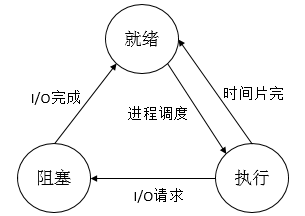
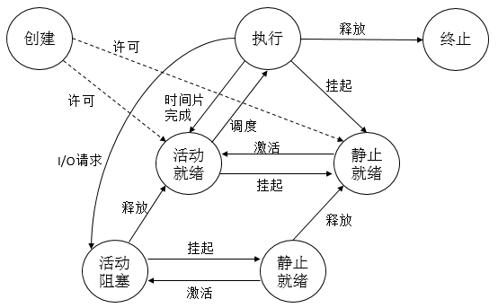
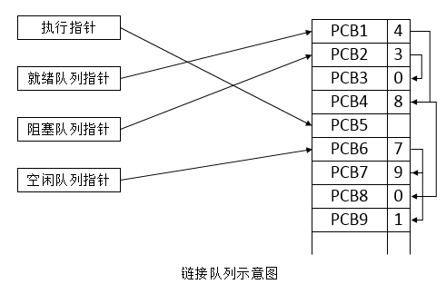
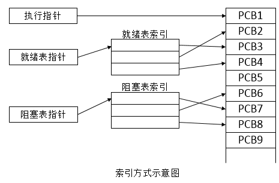

##【操作系统】进程管理（二）

##
##一、前言

##
##　　之前已经介绍了操作系统的各个模块，现在来具体深入学习操作系统中的进程管理。

##
##二、进程的基本概念

##
##　　在未配置OS的系统中，程序的执行方式是顺序执行，即必须在一个程序执行完成后，才允许另外一个程序执行；在多道程序环境下，则允许多个程序并发执行。也正是程序的并发执行，才导致引入进程。

##
##　　2.1 程序的顺序执行

##
##　　通常可以把一个应用程序分成若干个程序段，在各程序段之间，必须按照某种先后次序顺序执行，仅当前一操作（程序段）执行完后，才能执行后继操作。如典型的输入->计算->打印任务就是顺序执行。

##
##　　程序顺序执行时的特征如下

##
##　　① 顺序性，处理机的操作严格按照程序锁规定的顺序执行，即每一操作必须在上一个操作结束之后开始。

##
##　　② 封闭性，程序是在封闭的环境下执行的，即程序运行时独占全机资源，资源的状态（除初始状态外）只有本程序才能改变它，程序一旦开始执行，其执行结果不受外界因素影响。

##
##　　③ 可再现性，只要程序执行时的环境和初始条件相同，当程序重复执行时，无论它是从头到尾不停顿地执行，还是走走停停地执行，都将获得相同的结果。

##
##　　在程序顺序执行时的特征，为程序员检测和校正程序的错误带来了很大的方便。

##
##　　2.2 程序的并发执行

##
##　　多个程序可以并发执行，并发执行可以提高CPU的效率和系统吞吐率。其特征如下

##
##　　① 间断性，程序在并发执行时，由于它们共享系统资源，以及为完成同一项任务而相互合作，致使在这些并发执行的程序之间，形成了相互制约的关系。如计算操作必须在输入操作之后。

##
##　　② 失去封闭性，程序在并发执行时，是多个程序共享系统中的各种资源，因而这些资源的状态将由多个程序来改变，只是程序的运行失去了封闭性，这样，某程序在运行时，必然会收到其他程序的影响。如当某个程序占用了处理机资源后，另外一个程序必须等待。

##
##　　③ 不可再现性，程序在并发执行时，由于失去了封闭性，也将导致其再失去可再现性。可能由于不同的操作顺序产生不同的结果。

##
##　　2.3 进程的特征

##
##　　由于程序并发执行时，它们失去了封闭性，间断性和不可再现性，这决定了一般的程序是不能参与并发执行的，因为程序执行的结果是不可再现的。这样，程序的运行也就失去了意义，为了能够是程序能够正确的并发，引入了进程的概念。进程具有如下的特征。

##
##　　① 结构特性，为使程序能够独立运行，应为之配置一进程控制块，即PCB（Process Control Block）。而程序段、相关的数据段和PCB三部分构成进程实体。所谓创建进程，实质上是创建进程实体中的PCB，撤销进程也是撤销进程中的PCB。

##
##　　② 动态性，进行的实质是进程实体的一次执行过程，因此，动态性是进程最基本的特性，进程实体是有一个的生命周期，而程序则只是一组有序指令的集合，并存放在某种介质上（如硬盘），其本身不具有运动的含义，因而是静态的。

##
##　　③ 并发性，多个进程实体同存于内存中，并且能够在一段时间内同时运行。并发性是进程的重要特征， 同时也成为OS的重要特征。

##
##　　④ 独立性，进程实体是一个能独立运行、独立分配资源和独立接受调度的基本单位。凡未建立PCB的程序都不能作为一个独立的单位参与运行。

##
##　　⑤ 异步性，进程按各自独立的、不可预知的速度向前推进，或者说进程实体按照异步方式运行。

##
##　　进程是进程实体的运行过程，是系统进行资源分配和调度（在线程未出现之前）的一个独立单位。

##
##　　2.4 进程的状态

##
##　　进程执行时的间断性决定了进程可能具有多种状态，最基本的三种状态如下

##
##　　① 就绪状态，当进程已分配到除CPU以外的所有必要资源后，只要再获得CPU，就可以立即运行，进程这时的状态称为就绪状态。在一个系统中可能多个进程处于就绪状态，通常将它们排成一个队列，称为就绪队列。

##
##　　② 执行状态，进程已获得CPU，其程序正在执行。在单处理机系统中，只有一个进程处于执行状态，在多处理机系统中，则有多个进程处于执行状态。

##
##　　③ 阻塞状态，处于执行状态的线程由于发生某事件而暂停无法继续执行时，便放弃处理机而处于暂停状态，此时进程的状态称为阻塞状态，或等待状态或封锁状态。如IO请求，申请缓存空间等，处于阻塞状态的进程也会排成一个队列，可能还会根据不同的阻塞原因排成多个队列。

##
## 

##
##　　说明：上图表示三种基本状态之间的相互转化。

##
##　　除了上述三种基本状态外，在一些系统中，新增了挂起状态，引入挂起状态的原因如下

##
##　　① 终端用户的请求，当终端用户在自己的程序运行期间发现有可疑问题时，希望暂时使自己的程序静止下来，即使正在执行的进程暂停执行；若此时用户进程正处于就绪状态而未执行，则该进程暂不接受调度，以便用户研究其执行情况或对程序进行修改，这种状态就称为挂起状态。

##
##　　② 父进程请求，有时父进程希望挂起自己的某个子进程，以便考查和修改该子进程，或者协调各子进程间的活动。

##
##　　③ 负荷调节的需要，当实时系统中的工作负荷较重，已可能影响到对实时任务的控制时，可由系统把一些不重要的进程挂起，以保证系统能够正常运行。

##
##　　④ 操作系统的需要，操作系统有时希望挂起某些进程，以便检查运行中的资源使用情况或进行记账。

##
##　　引入了挂起状态后，又增加了如下几种状态的转化

##
##　　① 活动就绪->静止就绪，当进程处于未被挂起的就绪状态时，称为活动就绪状态；当挂起时，变为静止就绪状态，处于静止就绪状态的进程不接受调度。

##
##　　② 活动阻塞->静止阻塞，当进程处于未被挂起的阻塞状态时，称为活动阻塞状态；当挂起时，变为静止阻塞状态，处于该状态的进程在其所期待的事件发生后，将从静止阻塞变为静止就绪。

##
##　　③ 静止就绪->活动就绪，使用激活原语激活。

##
##　　④ 静止阻塞->活动阻塞，使用激活原语激活。

##
##　　为了进程的管理，还存在着两种常见的状态，即创建状态和终止状态。

##
##　　① 创建状态，创建一个进程一般需要两步。首先，为一个新进程常见PCB，并填写必要的管理信息；其次，把该进程转入就绪状态并插入就绪队列之中。当创建一个新进程时，系统为其分配了PCB，填写了进程标志等信息，但由于该进程所必需的资源或其他信息（如内存）尚未分配等，此时，进程虽拥有了PCB，但是其自身却未进入内存，即创建工作尚未完成，此时进程还不能被调度运行，其所处的状态就是创建状态。

##
##　　② 终止状态，进程的终止也需要两步。首先，等待操作系统进行善后处理，其次，将其PCB清零，并将PCB空间返回给操作系统。进入终止状态的进程以后不能再执行，但是在操作系统中任然保留一个记录，其中保存状态码和一些计时统计数据，供其它进程收集，一旦其它进程完成对终止状态进程的信息提取后，操作系统将删除该进程。

##
## 

##
##　　说明：上述为七种状态之间的转化。

##
##　　2.5 进程控制块

##
##　　2.5.1 进程控制块的作用

##
##　　为了描述和控制进程的运行，系统为每个进程定义了一个数据结构，进程控制块PCB，它是进程实体的一部分，是操作系统中最重要的记录型数据结构，PCB中记录了操作系统所需的，用于描述进程当前情况以及控制进程运行的全部信息。

##
##　　进程控制块的作用是使一个在多道程序环境下能独立运行的程序，成为一个能独立运行的基本单位，一个能与其他进程并发执行的进程。或者说，OS是根据PCB来对并发执行的进程进行控制和管理的。PCB是进程存在的唯一标识。

##
##　　当创建一个进程时，就为它创建一个PCB，进程结束时又回收其PCB，进程于是随之消亡，PCB可以被操作系统中的多个模块读或修改，如被调度程序、资源分配程序、中断处理程序及监督分析程序等读或修改，因为PCB是经常被系统访问，尤其是被运行频率很高的进程及分派程序访问，故PCB应常驻内存。系统将所有的PCB组织成若干个链表（或队列），存放在操作系统中专门开辟的PCB区内。

##
##　　2.5.1 进程控制块的信息

##
##　　进程控制块PCB主要包含如下信息。

##
##　　① 进程标识符，用于唯一地标识一个进程，有内部标识符（由系统赋予的唯一一个数字，通常为进程的序号，为方便系统使用）和外部标识符（由创建者提供，可描述进程的家族关系）。

##
##　　② 处理机的状态，当处理机被中断时，其寄存器的信息都必须保存在进程的PCB中，以便该进程重新执行时，能从断点继续执行。

##
##　　③ 进程调度信息，包括进程状态（指明进程的当前状态，作为进程调度和对换时的依据），进程优先级（用于描述进程使用处理机的优先级别，优先级高的进程应该优先获取处理机），进程调度所需的其他信息（与进程调度算法有关，如进程已等待CPU的时间总和，进程已执行的时间总和等），事件（进程由执行状态转变为阻塞状态所等待发生的事件，即阻塞原因）。

##
##　　④ 进程控制信息，包括程序和数据的地址（进程的程序和数据所在的内存或外存首址，以便在调度该进程时，能从PCB中找到其程序和数据），进程同步和通信机制（实现进程同步和进程通信时必需的机制，如消息队列指针，信号量等），资源清单（除CPU以外的进程所需的全部资源以及已经分配到该进程的资源的清单），链接地址（本进程PCB所在队列中的下一个进程的PCB的首地址）。

##
##　　2.5.3 进程控制块的组织方式　　 

##
##　　为了有效的对PCB进行管理，应该用适当的方式将这些PCB组织起来，常用的组织方式如下

##
##　　① 链接方式，把具有同一状态的PCB，链接成一个队列，这样可以形成若干就绪队列、阻塞队列和空白队列等，优先级高的进程的PCB排在前面。

##
##　　② 索引方式，系统根据所有进程的状态建立几张索引表，如就绪索引表，阻塞索引表等，并把各索引表在内存的首地址记录在内存的一些专用单元中，在每个索引表的表目中，记录具有相应状态的某个PCB在PCB表中的地址。

##
##  

##
##三、进程控制

##
##　　3.1 进程的创建

##
##　　一个进程可以创建一个子进程，子进程会继承父进程所拥有的资源，如继承父进程打开的文件、分配到的缓冲区等，当子进程被撤销时，应该讲其从父进程哪里获得的资源归还给父进程，此外，撤销父进程时，也必须同时撤销其所有的子进程。

##
##　　引起创建进程的事件如下

##
##　　① 用户登录。② 作业调度。③ 提供服务。④ 应用请求。

##
##　　进程创建的步骤如下 

##
##　　① 申请空白PCB，为新进程申请获得唯一的数字标识符，并从PCB集合中索取一个空白的PCB。

##
##　　② 为新进程分配资源，为新进程的程序和数据以及用户栈分配必要的内存空间。

##
##　　③ 初始化进程控制块，PCB的初始化包括：初始化标识信息，将系统分配的标识符和父进程标识符填入新的PCB中；初始化处理机状态信息，使程序计数器指向程序的入口地址，使栈指针指向栈顶；初始化处理机控制信息，将进程的状态设置为就绪状态或静止就绪状态。

##
##　　④ 将新进程插入到就绪队列，如果进程就绪队列能够接纳新进程，便将新进程插入就绪队列。

##
##　　3.2 进程的终止

##
##　　引起进程终止的事件如下

##
##　　① 正常结束，在任何计算机系统中，都应有一个用于表示进程已经运行完成的指示。

##
##　　② 异常结束，在进程运行期间，由于出现某些错误和故障而迫使进程终止。如越界错误（程序所访问的存储区已越出该进程的区域），保护错（进程试图去访问一个不允许访问的资源或文件，或者以不当的方式进行访问，如写一个只读文件），非法指令（进程试图去执行一个不存在的指令），特权指令错（进程试图执行一条只允许OS执行的指令），等待超时（进程等待谋事件的时间超过了规定的最大值），算术运算错（进程试图执行一个被禁止的运算，如被0除），I/O故障（I/O过程中发生了错误）。

##
##　　③ 外界干预，进程应外界的请求而终止运行，如操作员或操作系统干预，父进程请求（父进程具有终止自己任何子孙进程的能力），父进程终止（父进程终止，其所有子孙进程也将终止）。

##
##　　终止进程的步骤如下

##
##　　① 根据被终止的进程的标识符，从PCB集合汇总检索除该进程的PCB，从中读出该进程的状态。

##
##　　② 若被终止的进程正处于执行状态，应立即终止该进程的执行，并置调度标志位真，用于指示该进程被终止后应重新进行调度。

##
##　　③ 若该进程还有子孙进程，还应将其子孙进程予以终止，以防他们成为不可控的进程。

##
##　　④ 将被终止的进程所拥有的全部资源，或者归还给其父进程，或者归还给操作系统。

##
##　　⑤ 将被终止的进程PCB从所在队列或链表中移出，等待其他程序来搜集信息。

##
##　　3.3 进程的阻塞与唤醒

##
##　　引起进程阻塞与唤醒的事件如下

##
##　　① 请求系统服务，当正在执行的进程请求操作系统提供服务时，由于某种原因，操作系统并不立即满足该进程的要求，该进程只能转变为阻塞状态来等待。

##
##　　② 启动某种操作，当进程启动某种操作后，如果该进程必须在该操作完成之后才能继续执行，则必须先使该进程阻塞，以等待该操作完成。

##
##　　③ 新数据尚未到达，对于相互合作的进程，如果其中一个进程需要先获得另一合作进程提供的数据后才能对数据进行处理，则只要其所需数据尚未到达，该进程只有（等待）阻塞。

##
##　　④ 无新工作可做，系统往往设置一些具有某些特定功能的系统进程，每当这种进程完成任务后，便把自己阻塞起来以等待新任务到来。

##
##　　进程阻塞步骤如下

##
##　　正在执行的进程发现上述某件事情时，由于无法继续运行，于是进程便通过调用阻塞原语block把自己阻塞，可见，进程的阻塞是进程自身的一种主动行为，之后进程会停止执行，并将进程控制块的状态由执行改为阻塞，并将PCB插入阻塞队列，如果系统中设置了因不同事件而阻塞的多个阻塞队列，则应将本进程插入到具有相同事件的阻塞队列中，最后，转调度程序进行重新调度，将处理机分配给另一就绪进程并进行切换。即保留被阻塞进程的处理机状态到PCB中，再按新进程的PCB中的处理机状态设置CPU环境。

##
##　　进程唤醒步骤如下

##
##　　当被阻塞进程所期待的时间出现时，如I/O完成获其所期待的数据已经到达，则由有关进程（如用完并释放I/O设备的进程）调用唤醒原语wakeup，将等待该事件的进程唤醒，首先将被阻塞的进程从等待该事件的阻塞队列中移出，将其PCB中的现行状态由阻塞改为就绪，然后再将该PCB插入到就绪队列中。值得注意的是，block原语与wakeup原因应该在不同进程中执行。

##
##　　3.4 进程的挂起与激活

##
##　　进程挂起步骤如下

##
##　　当出现引起进程挂起的事件时，如用户进程请求将自己挂起或父进程请求将自己的某个子进程挂起，系统将利用挂起原语suspend将指定进程或处于阻塞状态的进程挂起。 检查被挂起进程的状态，若处于活动就绪状态，便将其改为静止就绪，对于活动阻塞状态的进程，则将其改为静止阻塞，若被挂起的状态正在执行，则转向调度程序重新调度。

##
##　　进程激活步骤如下

##
##　　当发生激活进程的事件时，例如，父进程或用户进程请求激活指定进程，若该进程驻在外存而内存中已有足够的空间时，则可将在外存处于静止就绪状态的该进程换入内存，这时，利用激活原语active将指定进程激活，激活原语先将进程从外存调入内存，检查该进程的现行状态，由对应的静止状态改为活动状态，若使用抢占式调度策略，则有新进程如就绪队列时，应检查是否要进行重新调度，即由调度程序将被激活进程与当前进程进行优先级的比较，如果被激活进程的优先级更低，就不必重新调度，否则，立即剥夺当前进程的运行，把处理机分配给刚被激活的进程。

##
##四、进程同步

##
##　　进程同步主要是对多个相关进程在执行次序上进行协调，以使并发执行的诸进程之间能有效共享资源和相互合作，而从使程序的执行具有可再现性。在多道程序环境下，当程序并发执行时，由于资源共享和进程合作，使处于一个系统中的诸进程之间可能存在着以下两种形式的制约关系。

##
##　　① 间接相互制约关系，同处于一个系统中的进程，通常都共享着某种系统资源，如共享CPU、I/O设备等，间接相互制约即源于这种资源共享。

##
##　　② 直接相互制约关系，这种制约主要源于进程间的合作，如A进程通过缓冲向B进程提供数据，当缓冲为空时，B阻塞，待A输入数据后，B被唤醒，缓冲满时，A阻塞，待B取出数据后，A被唤醒。

##
##　　4.1 临界区

##
##　　许多硬件资源如打印机，磁带机等，都属于临界资源，诸进程应该采取互斥方式，实现对这种资源的共享。人们把在每个进程中访问临界资源的那段代码成为临界区，显然，若能保证诸进程互斥地进入自己的临界区，便可实现诸进程对临界资源的互斥访问。

##
##　　4.2 同步机制遵循的原则

##
##　　① 空闲让进，当无进程处于临界区时，表明临界资源处于空闲状态，应允许一个请求进入临界区的进程立即进入自己的临界区，以有效的利用临界资源。

##
##　　② 忙则等待，当已有进程进入临界区时，表明临界资源正在被访问，因而其他视图进入临界区的进程必须等待，以保证对临界资源的互斥访问。

##
##　　③ 有限等待，对要求访问临界资源的进程 ，应保证在有限时限内能进入自己的临界区，以免陷入死等状态。

##
##　　④ 让权等待，当进程不能进入自己的临界区时，应立即释放处理机，以免进程陷入忙等状态。

##
##　　4.3 进程同步进程问题

##
##　　1. 生产者/消费者问题

##
##　　2. 哲学家进餐问题

##
##　　3. 读写问题

##
##五、进程通信

##
##　　进程通信，是指进程之间的信息交换，进程的互斥和同步，由于只能交换很少量的信息而被归结为低级通信，目前的高级通信机制可归结为三大类

##
##　　① 共享存储器系统

##
##　　相互通信的进程共享某些数据结构或共享存储区，进程之间能够通过这些空间进行通信，基于此，又可以分为如下两种类型：基于共享数据结构的通信方式，在这种通信中，要求诸进程共用某些数据结构，借此实现进程间的信息交换。基于共享存储区的通信方式，为了传输大量数据，在存储器中划出一块共享存储区，诸进程可通过对共享存储区中的数据的读或写来实现通信。

##
##　　② 消息传递系统

##
##　　进程间的数据交换是以格式化的消息为单位，程序员直接利用操作系统提供的一组通信命令（原语），不仅能实现大量数据的传递，而且还隐藏了通信的实现细节，使通信过程对用户是透明的，从而大幅减少通信程序编制的复杂性。

##
##　　③ 管道通信

##
##　　连接一个读进程和一个写进程以实现它们之间通信的一个共享文件，又名pipe文件，向管道（共享文件）提供输入的发送进程，以字符流形式将大量的数据送入管道；而接受管道输出的接受进程，则从管道中接受数据，由于发送和接受进程是利用管道进行通信的，因此叫做管道通信。管道通信需要具有三方面的协调能力：互斥（当一个进程正在对pipe执行读/写时，其他进程必须等待），同步（当写进程把一定数量的数据写入pipe，便去睡眠等待，到读进程取走数据后，再把它唤醒，当读进程读一个空pipe时，也应该睡眠等待，直到有数据写入管道，才将其唤醒），确定对方是否存在，只有确定了对方已存在时，才能进行通信。

##
##六、线程

##
##　　6.1 线程与进程的比较

##
##　　线程称为轻型进程或进程元，在引入线程的操作系统，一个进程往往都拥有多个线程，至少有一个线程，下面从不同的方面将线程与进程进行比较（前提是操作系统引入了线程）。

##
##　　① 调度

##
##　　线程作为调度和分派的基本单位，而进程作为资源拥有的基本单位。同一进程中，线程的切换不会引起进程的切换，但从一个进程中的线程切换到另外一个进程中的线程时，将会引起进程切换。

##
##　　② 并发性

##
##　　不仅进程间可以并发执行，同一个进程中的多个线程之间亦可并发执行，是的操作系统具有更好的并发性，从而能更加有效地提高系统资源利用率和系统吞吐率。

##
##　　③ 拥有资源

##
##　　线程一般不拥有系统资源（除少量必不可少的资源），但它可以访问其隶属的进程的资源，即一个进程的代码段，数据段以及拥有的系统资源，如已打开的文件、I/O设备等。

##
##　　④ 系统开销

##
##　　在创建和撤销进程时，系统都要为之创建和回收进程控制块，分配或回收资源，操作系统付出的开销明显大于线程创建或撤销时的开销，在进程切换时，涉及到当前进程CPU环境的保存和新被调度运行进程的CPU环境的设置，而线程的切换则仅需保存和设置少量寄存器内容，不涉及存储器管理方面的操作，所以线程的切换开销远小于进程切换开销，以外，由于一个进程中的多个线程具有相同的地址空间，在同步和通信的实现上也比较容易，在一些操作系统中，线程的切换，同步和通信都无需操作系统内核的干预。

##
##　　6.2 线程的属性

##
##　　① 轻型实体，每个线程都具有一个用于控制线程运行的线程控制块TCB，用于指示被执行指令序列的程序计数器，保留局部变量，少量状态参数合返回地址等。

##
##　　② 独立调度和分派的基本单位，线程是能独立运行的基本单位，切换非常迅速且开销小。

##
##　　③ 可并发执行，一个进程、不同进程的线程均可并发执行。

##
##　　④ 共享进程资源，同一进程中的线程共享该进程所拥有的资源，所有线程拥有相同的地址空间（进程的地址空间），这意味着线程可以访问该地址空间中的每一个虚地址，此外，还可以访问进程所拥有的已打开文件，定时器，信号量机构等。

##
##　　6.3 线程的状态

##
##　　① 状态参数，每一个线程可利用线程标识符和一组状态参数进行描述。状态参数包括寄存器状态（包括程序计数器和堆栈指针中的内容）、堆栈（保存的局部变量和返回地址）、线程运行状态、优先级、线程专有存储器（保存线程自己的具有变量拷贝）、信号屏蔽（对某些信息加以屏蔽）。

##
##　　② 线程运行状态，运行状态包括执行状态、就绪状态、阻塞状态。

##
##　　6.4 线程的创建和终止

##
##　　在创建新线程时，需要利用一个线程创建函数（或系统调用），并根据相应的参数，如指向线程主程序的入口指针、堆栈的大小、调度的优先级等。在线程创建函数执行完后，将返回一个线程标识符供以后使用。

##
##　　终止线程的方式有两种，线程完成工作后自愿退出或者线程在运行中出现错误或由于某种原因而被其他线程强行终止。在大多数OS中，线程被终止后并不立即释放它所占有的资源，只有当进程中的其他线程执行了分离函数后，被终止的线程才与资源分离，此时的资源才能被其他线程利用。虽然已被终止但尚未释放资源的线程，仍可以被需要它的线程所调用，以使被终止线程重新恢复运行。

##
##　　6.5 多线程OS中的进程

##
##　　① 作为系统资源分配的单位，任一进程中所拥有的资源包括受到分别保护的用户地址空间、用于实现进程间和线程间同步和通信的机制、已打开的文件和已申请到的I/O设备，以及一张由核心进程维护的地址映射表，该表用于实现用户程序的逻辑地址到内存地址的映射。

##
##　　② 可包括多个线程，一个进程至少要有一个线程，有进程为线程提供资源及运行环境，使这些线程可并发执行。所有线程只能隶属于某一个特定进程。

##
##　　③ 进程不是一个可执行的实体，进程仍具有与执行相关的状态，如执行状态，表示进程中的某个线程正在执行，对进程所施加的与进程状态有关的操作，也对其线程其作用，例如，把某个进程挂起时，该进程中的所有线程也都将被挂起，激活某个进程时，属于该进程的所有线程也都将被激活。

##
##　　6.6 线程间的同步和通信

##
##　　① 互斥锁，互斥锁是一种比较简单的、用于实现线程间对资源互斥访问的机制。由于操作互斥锁的时间和空间开销较低，因为较适合高频度使用的关键共享数据和程序段。

##
##　　② 条件变量，创建一个互斥锁时便联系着一个条件变量，单纯的互斥锁用于短期锁定，主要用来保证对临界区的互斥进入，条件变量则用于线程的长期等待，直至所等待的资源成为可用的资源。

##
##　　③ 信号量机制，包括私有信号量（同一进程的不同线程需要同步时，可调用创建信号量的命令来创建私有信号量，其数据结构存放在应用程序的地址空间中，私有信号量属于特定的进程所有，OS并不知道私有信号量的存在，当发生私有信号量的占用者异常或正常结束，但并未释放私有信号量所占有的空间的情况时，系统将无法使它恢复为0，也不能将它传送到下一个请求它的线程），公用信号量（其实现不同进程间或不同进程中各线程之间的同步而设置，由所有进程使用，其数据结构放在手保护的系统存储区中，由OS为它分配空间并进行管理，也称为系统信号量，OS会自动回收其空间，其是一种比较安全的同步机制）

##
##　　6.7 线程的实现方式

##
##　　① 内核支持线程（Kernel Supported Threads）

##
##　　无论用户进程中的线程，还是系统进程中的线程，它们的创建、撤销和切换等也是依靠内核，在内核空间中实现。内核空间为每个内核支持线程设置了一个线程控制块，内核是根据该控制块而感知某个线程的存在，并对其加以控制。其优点如下

##
##　　1. 多处理机系统中，内存能够同时调度同一个进程中多个线程并行执行。

##
##　　2. 进程中一个线程被阻塞了，内核可以调度该进程中的其他线程，也可以运行其他进程中的线程。

##
##　　3. 内核支持线程具有很小的数据结构和堆栈，线程切换快，开销小。

##
##　　4. 内核本身采用多线程技术，提高系统的执行速度和效率。

##
##　　其缺点是对用户的线程切换而言，切换开销较大，因为需要进行模式的切换。

##
##　　② 用户级线程（User Level Thread）

##
##　　用户级线程仅存在于用户空间中。对于线程的创建、撤销、同步和通信等，无需利用系统调用来实现，对于用户级线程的切换，通常发生在一个应用进程的诸多线程之间。线程的任务控制块都是设置在用户空间，线程所执行的操作也无需内核的帮助，因而内核完全不知道用户级线程的存在。设置了用户级线程的系统，仍可以以进程为单位进行调度，而设置的是内核支持线程，则以线程为单位进行调度。其优点如下

##
##　　1. 线程切换不需要转换到内核空间，节省了切换开销。 

##
##　　2. 调度算法可以是进程专用的，进程可以选择不同的调度算法对自己的线程进行管理和调度，而与操作系统的低级调度算法无关。

##
##　　3. 用户级线程的实现与操作系统平台无关，在所有的应用程序中都可以对其进行共享。

##
##　　其缺点如下

##
##　　1. 系统调用的阻塞问题，当线程执行一个系统调用时，不仅该线程被阻塞，而且进程内的所有线程都会被阻塞，而在内核支持线程方式中，进程中的其他线程仍可以执行。

##
##　　2. 在单纯的用户级线程实现方式中，多线程应用不能利用多处理机进行多处理的优点，内核每次分配给一个进程的仅有一个CPU，因此进程中仅有一个线程能执行，在该线程放弃CPU之前，其他线程只能等待。

##
##　　③ 组合方式

##
##　　内核支持多KST线程的建立、调度和管理，同时也允许用户应用程序简历、调度和管理用户级线程。

##
##　　6.8 线程的实现

##
##　　① 内核支持线程的实现

##
##　　系统在创建一个新进程时，便为它分配一个任务数据区PTAD(Per Task Data Area)，其中包括若干个线程控制块TCB空间，其保存在内核空间中。当进程要创建一个新线程时，便为其分配一个TCB，填入相关的信息，分配必要的资源，于是新创建的线程便有机会执行。当PTAD中的所有TCB分配完后，进程又要创建新的线程时，只要其所创建的线程数量未超过系统的允许值是，系统可再为之分配新的TCB空间。在撤销一个线程时，也回收该线程的所有资源和TCB，有的系统为了减少创建和撤销一个线程时的开销，在撤销一个线程时，并不立即回收该线程的资源和TCB，当以后要创建一个新线程时，便可利用已被撤销但仍保持有资源和TCB的线程作为新线程。

##
##　　② 用户级线程的实现

##
##　　用户级线程是在用户空间实现的，所有的用户级线程都具有相同的结构，他们都运行在一个中间系统上面，当前有两种方式实现中间系统，即运行时系统和内核控制线程。

##
##　　运行时系统是用于管理和控制线程的函数（过程）的集合，其中包括用于创建和撤销线程的函数、线程同步和通信的函数以及实现线程调度的函数等，正因为有了这些函数，才使得用户级线程与内核无关，运行时系统中的所有函数都驻留在用户空间，并作为用户级线程与内核之间的接口。用户级线程在切换时不需要转入核心态，而是由运行时系统中的线程切换过程来执行切换任务。

##
##　　内核控制线程又称为轻型进程LWP（Light Weight Process），每一个进程都可拥有多个LWP，同用户级线程一样，每个LWP都有自己的数据结构（如TCB），其中包括线程标识符，优先级，状态、栈、局部存储区等。它们也可以享受进程所拥有的资源，LWP可通过系统调用来获得内核提供的服务，当一个用户级线程运行时，只要将它连接到一个LWP上，此时它便具有了内核提供支持线程的所有属性，这种线程实现方式就是组合方式。LWP会做成一个缓冲池，用户级线程都可以连接到任何一个LWP上，为了使每一用户级线程都能利用LWP与内核通信，可以使多个用户级线程多路复用一个LWP，但只有当前连接到LWP上的线程才能与内核通信，其余进程或者阻塞，或者等待LWP，每一个LWP也需要连接到一个内核级线程上，这样，通过LWP可把用户级线程与内核线程连接起来，用户级线程可通过LWP来访问内核，内核看不到用户级线程，LWP实现了内核与用户级线程的隔离。

##
##　　③ 用户级线程与内核控制线程的连接

##
##　　1. 一对一模型

##
##　　为每一个用户线程都设置一个内核控制线程与之连接，当一个线程阻塞时，允许调度另一个线程运行，在多处理机系统中，则有多个线程并行执行。

##
##　　2. 多对一模型

##
##　　将多个用户线程映射到一个内核控制线程，为了管理方便，这些用户线程一般属于一个进程，运行在该进程的用户空间，对这些线程的调度和管理也是在该进程的用户空间完成的，当用户线程需要访问内核时，才将其映射到一个内核控制线程上，但每次只允许一个线程进行映射。 线程管理开销小，效率高，但当一个线程在访问内核时发生阻塞，则整个进程都会被阻塞，并且在多处理机系统中，一个进程的多个线程无法实现并行。

##
##　　3. 多对多模型

##
##　　将多个用户线程映射到多个内核控制线程，内核控制线程的数目可以根据应用进程和系统的不同而变化。

##
##七、总结

##
##　　关于进程和线程的介绍就到这里，进程和线程是操作系统里面非常核心的概念，弄懂这些概念对于之后的学会会很有好处，谢谢各位园友的观看~