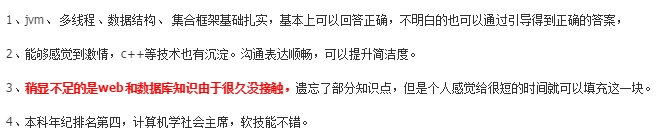

**一、前言**

笔者的校招其实早就告一段落了，一直到现在才动笔写这份校招的心得。

**二、实习**

实习招聘早在去年过年（2月份）就已经开始内推了。当时，在师兄的推荐下笔者怀着忐忑的心情参加了腾讯的内推，当时还没有准备好，也不知道面试中的套路，所以免不了有些担心，后来发现此次担心是完全多余的，因为压根就没有收到回应。有点不甘心，托师兄问了HR，得到的回复是简历被刷了，照理说内推简历刷的是很少的，客观来说有可能是笔者和招聘的岗位不匹配，亦或是简历做得太烂（回头看笔者的简历，确实有点惨不忍睹），主观来说就是缘分还没到。第一次的内推流程就这样还没开始就结束了。

春季开学后，各大公司开始实习生招聘，由于第一次内推的惨痛经历，笔者开始修改简历，后来简历看起来至少觉得简洁美观。

后来参加了阿里内推，这一次有了回应，早上10点左右接到杭州的电话，在紧张的心情下进行第一次的电话面试，问的知识点主要集中如下：

**· 集合框架、多线程、对象锁和类锁区别、JVM（垃圾回收算法）、Object有哪些方法**

**· 有哪几种内置对象、Servlet生命周期**

**· 左连接、内连接、索引**

**· TCP的三次握手及为什么**

整个过程持续差不多半个小时，后来面试官发邮件对我的这次面试进行了反馈，

一面完了之后临阵磨枪的把不懂的问题解决了，可以看到面试官是非常nice的，还提醒我接下来看看数据库和JAVAWEB的知识点，整个过程持续差不多30分钟。

中午一点左右接到了二面面试电话，来得猝不及防，又开始进行第二轮面试，首先自我介绍，然后二面面试官说他从一面面试官得知笔者数据库知识有点薄弱，就象征性的问了点，巧合的是又问到了左连接，由于一面完后查找了资料，所以就没啥问题，之后的问题主要集中在项目，面试官对我项目（爬虫）中的细节进行了连环发问，由于笔者没有在此之前对项目中的知识点和技术难点做总结，所以回答的磕磕碰碰，面试官还对我的项目技术方案提出了质疑，给出了更好的解决方案，二面总体下来感觉很一般，以为已经挂了，整个过程持续20分钟不到。完了后笔者把项目中的一些知识点和技术难点进行了梳理。

在下午五点左右又接到了三面面试官的电话，首先自我介绍，然后又开始针对另外笔者大数据的研究课题进行了一系列的发问，由于笔者对研究内容比较熟悉，所以回答得自我感觉还是比较满意，整个过程持续差不多30分钟。

第二天早上接到HR的电话，不聊技术，随便聊，聊人生，聊理想，侃大山，如井盖为什么是圆的（这个问题之前和女朋友讨论过，窃喜）。整个过程持续10分钟不到，笔者问了HR笔者表现如何，HR说不错，后续等通知。

至此，阿里的内推面试全部完成，四面总共两天之内搞定，效率非常高。

在京东内推笔试完成了后就再也没有收到任何消息。

之后参加了腾讯的实习生招聘笔试，之后进行面试，一面大致问了如下技术问题

**·** **最小二叉树合并的时间复杂度**

**· JVM、集合框架、并发**

**· 如何取海量记录中出现次数最多的十条记录**

快完了面试官说你的研究方向和我们部门下的一个组的研究内容很匹配（其实这就是最主要的部分），就这样过了一面。

首先自我介绍，之后二面面试官针对项目（爬虫）进行了提问，主要针对爬虫中的多线程模块，由于之前的总结，这次回答的就好很多了。完了之后面试官觉得时间有点短，然后开始看我的博客，然后说笔者博客写的还不错，比较有条理（之前的付出在某个时候会帮到你）。

之后就是HR面试

**· 自我介绍（一遍比一遍溜）**

**· 女朋友情况**

**· 笔者是否拿到其他公司的offer**

**· 安利腾讯的福利、技术优势，深圳的好天气**

就这样，HR面试完了。

在面试腾讯的过程中收到了阿里的录用函，同时，过了不久，也收到了腾讯的录用函。

对选择有过挣扎（阿里：应该是Javaer很想去的一个公司，笔者也不例外）、（腾讯：毕业后想先去深圳发展、女朋友在那边、从师兄得知实习留下来基本没太大问题）。最后还是选择了腾讯。

在腾讯实习了一个半月，做的主要是和大数据相关的事情，参与了线上项目，读源码、写文档，很充实，和组里的同事相处得也相当愉快，组里氛围特别好，之后也顺利的被留用了。

**三、校招**

**** 阿里

在腾讯实习的时候接到了之前阿里一面面试官的电话，说开始内推了，他又帮我内推了，之后接到之前实习二面面试官的电话进行面试。二面面试官说还记得我（惊奇），之后就开始了面试，问到的知识点还是集中于数据库和JAVAWEB。

**· 索引、第二/三范式、左内连接、数据库定义/操作语言**

**· forward和redirect的区别**

**· 数据库怎么选型？考量了哪些指标？**

**· 介绍session**

可能是之前有过印象，所以就让过了。

接着是HR面试

**· 女朋友情况**

**· 项目（大数据）的应用场景**

**· 职业生涯规划**

**· 有哪些不足点，打算如何改进**

完了HR说面试过了还会有一轮技术面试。

接着就是技术面试，主要知识点如下：

**· JAVA与C++的区别、JAVA如何实现C++中的多继承、JAVA垃圾回收、内存分配**

**· Http请求头包含的内容含义**

**· 如何完整的下载一副图片以及如何判断已经下载完成**

**· Spring、** **MyBatis技术框架**

**** 开放题

**· 电商的发展趋势及商业模式**

**· 如何构建一个推荐系统**

**· 有了解过哪些推荐算法**

**· 学习了哪些开源的框架**

笔者自我感觉回答得还不错，面试官也说还不错。之后就是等通知，然而在阿里结束校招的最后一刻被刷了。得知此消息后，给一面面试官发了一封感谢信。

也收到了回信

结束了阿里的校招之路。

阿里校招总结：在数据库和JAVAWEB方面还是准备得不够充分，在这点上吃了亏。总结起来还是实力不够，亦或是不太匹配，或者阿里找到了更合适的人选。

百度

百度一面知识点：

**· JAVA基础特性、创建线程有几种方式、JVM**

**· **左连接、** 现场出两道题，手写SQL**

百度二面知识点：

**· 手写两道算法题（Linux下找出一个文件中出现次数最多的IP地址、最大连续子数组和）**

**· 问实习所做的项目**

**· Spring的优缺点**

**· 了解哪些设计模式及应用场景**

**·** **有一个JAVA WEB（数据库使用MySQL）的系统，系统每天在凌晨1点左右就非常卡顿，请分析原因。**

**· 如何爬取并整合各大搜索引擎针对某个关键字的搜索结果**

二面完了之后就挂了，就没有然后了，百度校招之行结束。

之后笔者面试了深圳的一些公司（招银网络科技、华为、中兴）。

招银网络科技

总共就一面，面了20分钟左右。

知识点：

**· 项目介绍、提问（对广告有没有过滤）**

**· 大数据（对Storm编程是否熟悉）**

**· 设计模式（说常用的设计模式及应用场景）**

**·家庭情况**

之后拿到offer。

华为

总共两面

知识点

一面：

**· ArrayList如何实现动态扩展**

**· 大数据各大组件的相关知识**

**· JVM内存**

二面：项目随便聊了聊

之后拿到offer。

**** 中兴

总共两面，每一次面试两个面试官

知识点

一面：

· **创建对象有几种方式**

**· Scala语言的actor**

**· C++智能指针**

**· 工厂模式**

**· JAVA的前置依赖（笔者没有听过）**

**· 第三范式**

**· 触发器**

二面：

**· 聊了聊自身的优缺点**

**· 职业规划**

**· 英语介绍家乡**

之后拿到offer。

根据笔者的职业规划，考虑了平台、女友、工作环境等因素，最后还是选择了腾讯。

当然也还有一些公司（京东、美团）做了笔试，后来由于个人原因，没有去面试。

**四、工作**

在工作定下来了之后，笔者一边完成论文，一边更深入的学习着大数据的相关组件，为工作的快速融入做好准备。

短暂的停留总结后，继续前行，对自己的薄弱项进行加强，根据职业规划进行有目的学习。

充实完善自己，不惧未来，期待下一段更精彩的旅程。

**五、总结**

找工作笔者觉得看的就是匹配度，匹配度高面试过程会显得非常轻松，否则，除非自身实力相当优秀。

笔者找工作心得：

① 一份好的简历（简洁美观）

② 好的自我介绍（需要简单介绍项目和自己觉得优秀的地方）

③ 夯实基础知识（计算机网络、数据库、操作系统、语言特性）

④ 提炼项目中的闪光点

⑤ 平时的技术积累（博客，在笔者面试腾讯的时候起到了作用，同时在笔者写博客的过程中也收到过几次阿里的面试邀请）

⑥ 面试时放好心态，对等关系看待；做到知之为知之，不知为不知，可适当引导至熟悉领域。

**·** 自己做好准备，平时多积累，多学习，其他的顺其自然就好。

**·** 过程做好了，结果肯定不会差。

**·** 多怀感恩之心，感谢家人的支持，感谢女朋友的理解和陪伴，感谢实习和工作中遇到的人和事。

也感谢各位园友听我的唠嗑，谢谢观看~

