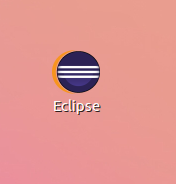

一、首先是下载Java JDK

到目前为止的最新版本为(jdk1.8.0_60)，有两种方式进行下载：

1.使用shell来进行下载，可使用如下命令直接进行下载：

wget --no-check-certificate --no-cookies --header "Cookie:
oraclelicense=accept-securebackup-cookie" http://download.oracle.com/otn-
pub/java/jdk/8u60-b27/jdk-8u60-linux-x64.tar.gz

2.直接登录<http://www.oracle.com/technetwork/java/javase/downloads/jdk8-downloads-2133151.html>选择相应的Java版本进行下载

二、解压缩下载的压缩文件

使用如下命令进行压缩：

tar zcvf jdk-8u60-linux-x64.tar.gz，会出现如下文件夹（jdk1.8.0_60）：

三、配置Java环境

使用shell命令行进行配置，使用如下命令可以进行java环境配置

cd ~ //进行用户目录

sudo vi ./.bashrc //使用vim打开.bashrc，并且配置bashrc文件

（关于vi的使用可以参见如下学习教程<http://c.biancheng.net/cpp/html/2735.html>，本配置中只需要进行如下几个命令，o(光标移到下一行)，i(进行输入)，esc(退出编辑模式)，shift
+ zz (保存设置并退出)）

打开.bashrc文件后，在该文件的末尾添加如下变量

export JAVA_HOME="/home/leesf/program/java/jdk1.8.0_60"
//此时本用户名为leesf,用户根据用户自己的用户名，进行修改（如是zhangsan,则
//为/home/zhangsan/program/java/jdk1.8.0_60）  
export PATH="$PATH:$JAVA_HOME/bin"  
export JRE_HOME="$JAVA_HOME/jre"  
export CLASSPATH=".:JAVA_HOME/lib:$JAVA_HOME/lib"

截图如下：

设置完成后，按shift + zz退出编辑，再输入source ./.bashrc进行更新。

配置完成后查看java环境是否已经配置完成，输入如下命令：

java -version即可查看，配置成功了应该如下：

整个java的配置过程就已经完成了。

PS:其中特别注意的是直接修改.bashrc文件，当修改/etc/profile时，会出现在当前shell命令窗口输入java
-version命令时显示配置信息，但是另外开一个窗口的时候再输入java
-version命令的时候，依然找不到刚刚配置的java信息，关于两者的区别可以参见如下链接内容：<http://forum.ubuntu.org.cn/viewtopic.php?t=246185>

四、配置eclipse环境

1.下载eclipse,有两种方式

1.直接在如下链接，下载最新版本：<http://www.eclipse.org/downloads/download.php?file=/technology/epp/downloads/release/mars/R/eclipse-
jee-mars-R-linux-gtk-x86_64.tar.gz>

2.使用wget命令进行下载，使用如下命令

wget
http://www.eclipse.org/downloads/download.php?file=/technology/epp/downloads/release/mars/R/eclipse-
jee-mars-R-linux-gtk-x86_64.tar.gz

在本机器上发现使用第二种方式下载的速度更快。

2.进行解压缩

使用如下命令进行解压缩

tar -zxvf eclipse-jee-mars-R-linux-
gtk-x86_64.tar.gz，会在当前目录下生成一个名为eclipse的文件夹，截图如下：

3.打开eclipse

打开eclipse有两种方式：

1.使用命令行模式，在shell下进入eclipse/eclipse(也就是主目录)，通过如下命令打开eclipse环境

./eclipse

截图如下：

2.点击eclise主目录下的eclipse直接打开

如果按照上述配置java环境之后，直接打开eclipse会发现找不到jre、jdk，但是直接在shell命令下使用java
-version可以查看到java环境已经配置好了，这是因为在linux环境下配置好了java环境，并不意味着可以直接打开eclipse，因为eclipse会
在自己的目录下面查找jdk或者jre环境，上述的java环境配置并不是在eclipse目录下的，所以采取另外的办法来解决这个问题。解决办法如下：

在shell下进入eclipse的主目录，具体命令如下：

运行完成后，打开eclipse主目录，会发现多出了如下名为jre的一个软链接，截图如下：

至此，可以直接通过主目录下的eclipse直接打开eclipse环境了。

五、创建eclipse桌面快捷方式

如果需要使用eclipse来进行开发时，总是通过进入到对应主目录来打开eclipse环境，这显然不太符合程序员的习惯，能不能直接在桌面建立一个快捷方式，直接点击快捷方式就可以打开eclipse了呢？答案是显然的，可以，下面，就正式开始吧。

1.在桌面上建立一个名为eclipse.desktop的文件，打开编辑，添加如下内容：

[Desktop Entry]  
Encoding=UTF-8  
Name=Eclipse  
Comment=Eclipse IDE  
Exec=/home/leesf/program/eclipse/eclipse/eclipse  
Icon=/home/leesf/program/eclipse/eclipse/icon.xpm  
Terminal=false  
StartupNotify=true  
Type=Application  
Categories=Application;Development;

其中Exec和Icon的路径是在本人机器上的路径，园友在配置时要根据自己的实际路径进行相应的修改。

2.赋予执行权限

在桌面上进入shell终端，执行如下命令进行赋予执行权限：

chmod u+x eclipse.desktop

完成后，会发现桌面出现了eclipse的快捷方式，截图如下：

接下来就可以直接通过这个快捷方式打开eclispe环境了。

六、测试eclipse环境时候搭建完成

新建一个java project进行测试，测试输出hello world! 测试完成，截图如下：

总结：至此，所有的配置就已经完成了，可以进行相应的开发了，祝各位园友配置顺利。

在配置的过程中还是遇到了不少的问题，经过查阅资料，一个个的解决，还是挺开心的，特此做一个总结，方便各位园友的同时也方便了自己，各位园友在配置的过程中有问题可以进行沟通交流。谢谢观看。

参考链接如下：

<http://blog.chinaunix.net/uid-27004869-id-4236240.html>

