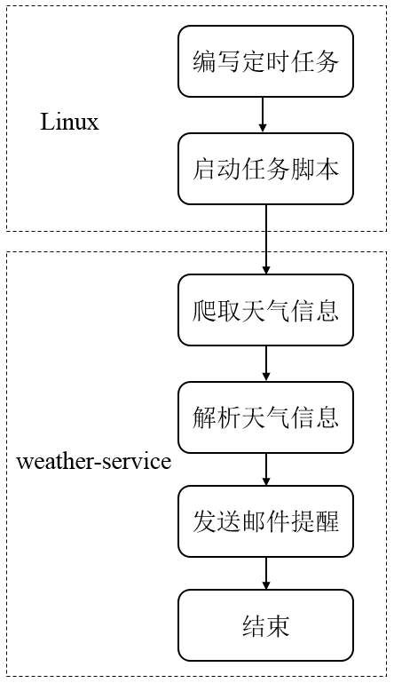
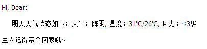

##【生活工具】你能带我回家么，可能明天要下雨了。前言

##
##你是否也这样？每天加班完后只想回家躺着，经常忘记带伞回家。如果第二天早上有雨，往往就会成为落汤鸡，特别是笔者所在的深圳，更是喜欢下雨，稍不注意，就成落汤鸡。其实想想，这种情况也是可以有效避免的，只需要晚上带伞回家，然后第二天早上带出来，最后美滋滋的吃早餐。但前提是晚上带伞回家，你知道的，做IT的都在忙着改变世界，带伞这种小事当然不值一提，华丽忘记。这时候默想，要是有人每天晚上提醒我带伞回家就好了，这种想法似乎有些奢侈。既然别人做不到，那就让程序来做吧。思路

##
##本项目其实就是个天气提醒器，用来提醒我们广大IT同仁们明天天气，思路大致分为如下几步。从网上爬取深圳明天天气情况并解析。解析天气信息后发送邮件提醒。将项目打包后上传至服务器。编写Linux的定时任务，定时运行启动脚本。整体框架

##
##整体框架包括Linux的定时任务部分和weather-service中处理部分，系统会在每天启动定时任务(自动运行指定脚本)，启动脚本会启动weather-service服务完成天气信息的爬取和邮件提醒。

##
## 技术点

##
##整个项目涉及的技术点如下。Crontab，定时任务命令。Shell脚本，启动脚本编写。weather-service涉及技术如下Maven，项目使用Maven构建。HttpClient，爬取网页信息。JSoup，解析网页信息。JavaMail，发送邮件。log4j、slf4j，日志输出。源码

##
##weather-service的核心模块为爬取模块和邮件模块；而完成自动化执行动作则需要编写Crontab定时任务和Shell脚本，定时任务定时启动Shell脚本。爬取模块

##
##主要完成从互联网上爬取天气信息并进行解析。WeatherCrawlerpackage com.hust.grid.weather;import org.apache.http.HttpEntity;import org.apache.http.HttpStatus;import org.apache.http.client.config.RequestConfig;import org.apache.http.client.methods.CloseableHttpResponse;import org.apache.http.client.methods.HttpGet;import org.apache.http.impl.client.CloseableHttpClient;import org.apache.http.impl.client.DefaultHttpRequestRetryHandler;import org.apache.http.impl.client.HttpClients;import org.apache.http.util.EntityUtils;import org.jsoup.Jsoup;import org.jsoup.nodes.Document;import org.jsoup.nodes.Element;import org.jsoup.select.Elements;import com.hust.grid.bean.WeatherInfo;import org.slf4j.Logger;import org.slf4j.LoggerFactory;public class WeatherCrawler {    private Logger logger = LoggerFactory.getLogger(WeatherCrawler.class);    public WeatherInfo crawlWeather(String url) {        CloseableHttpClient client = null;        HttpGet get;        WeatherInfo weatherInfo = null;        try {            client = HttpClients.custom().setRetryHandler(DefaultHttpRequestRetryHandler.INSTANCE).build();            RequestConfig config = RequestConfig                    .custom()                    .setConnectionRequestTimeout(3000)                    .setConnectTimeout(3000)                    .setSocketTimeout(30 * 60 * 1000)                    .build();            get = new HttpGet(url);            get.setHeader("Accept", "text/html,application/xhtml+xml,application/xml;q=0.9,image/webp,image/apng,*/*;q=0.8");            get.setHeader("Accept-Encoding", "gzip, deflate");            get.setHeader("Accept-Language", "zh-CN,zh;q=0.8");            get.setHeader("Host", "www.weather.com.cn");            get.setHeader("Proxy-Connection", "keep-alive");            get.setHeader("User-Agent", "Mozilla/5.0 (Windows NT 6.1; Win64; x64) AppleWebKit/537.36 (KHTML, like Gecko) Chrome/59.0.3071.115 Safari/537.36");            get.setConfig(config);            CloseableHttpResponse response = client.execute(get);            int statusCode = response.getStatusLine().getStatusCode();            if (statusCode == HttpStatus.SC_OK) {                HttpEntity entity = response.getEntity();                String content = EntityUtils.toString(entity, "utf8");                logger.debug("content =====>" + content);                if (content != null)                    weatherInfo = parseResult(content);            	}        	} catch (Exception e) {            logger.error(e.getMessage());        	} finally {            if (client != null) {                try {                    client.close();                	} catch (Exception e) {                   logger.error("close client error " + e.getMessage());                	}            	}        	}        return weatherInfo;    	}    public WeatherInfo parseResult(String content) {        Document document = Jsoup.parse(content);        Element element = document.getElementById("7d");        Elements elements = element.getElementsByTag("ul");        Element clearFix = elements.get(0);        Elements lis = clearFix.getElementsByTag("li");        // 7 days weather info, we just take tomorrow weather info        Element tomorrow = lis.get(1);        logger.debug("tomorrow =====> " + tomorrow);        return parseWeatherInfo(tomorrow);    	}    private WeatherInfo parseWeatherInfo(Element element) {        Elements weathers = element.getElementsByTag("p");        String weather = weathers.get(0).text();        String temp = weathers.get(1).text();        String wind = weathers.get(2).text();        WeatherInfo weatherInfo = new WeatherInfo(weather, temp, wind);        logger.info("---------------------------------------------------------------------------------");        logger.info("---------------------------------------------------------------------------------");        logger.info("weather is " + weather);        logger.info("temp is " + temp);        logger.info("wind is " + wind);        logger.info("---------------------------------------------------------------------------------");        logger.info("---------------------------------------------------------------------------------");        return weatherInfo;    	}    public static void main(String[] args) {        WeatherCrawler crawlWeatherInfo = new WeatherCrawler();        crawlWeatherInfo.crawlWeather("http://www.weather.com.cn/weather/101280601.shtml");    	}	}

##
##可以看到爬取模块首先使用HttpClient从指定网页获取信息，然后对响应结果使用JSoup进行解析，并且只解析了明天的天气信息，最后将解析后的天气信息封装成WeatherInfo对象返回。邮件模块

##
##主要完成将解析的信息以邮件发送给指定收件人。MailSenderpackage com.hust.grid.email;import com.hust.grid.cache.ConstantCacheCenter;import com.hust.grid.bean.WeatherInfo;import com.sun.mail.util.MailSSLSocketFactory;import javax.mail.*;import javax.mail.internet.InternetAddress;import javax.mail.internet.MimeMessage;import java.io.UnsupportedEncodingException;import java.security.GeneralSecurityException;import java.util.ArrayList;import java.util.Date;import java.util.List;import java.util.Properties;public class MailSender {    private WeatherInfo weatherInfo;    private static Properties prop = new Properties();    private ConstantCacheCenter constantCacheCenter = ConstantCacheCenter.getInstance();    private static class MyAuthenticator extends Authenticator {        private String username;        private String password;        public MyAuthenticator(String username, String password) {            this.username = username;            this.password = password;        	}        @Override        protected PasswordAuthentication getPasswordAuthentication() {            return new PasswordAuthentication(username, password);        	}    	}    public MailSender(WeatherInfo weatherInfo) {        this.weatherInfo = weatherInfo;    	}    public void sendToAll() {        List<String> receivers = constantCacheCenter.getReceivers();        for (String receiver : receivers) {            send(receiver);        	}    	}    private void send(String receiver) {        prop.setProperty("mail.transport.protocol", constantCacheCenter.getProtocol());        prop.setProperty("mail.smtp.host", constantCacheCenter.getHost());        prop.setProperty("mail.smtp.port", constantCacheCenter.getPort());        prop.setProperty("mail.smtp.auth", "true");        MailSSLSocketFactory mailSSLSocketFactory = null;        try {            mailSSLSocketFactory = new MailSSLSocketFactory();            mailSSLSocketFactory.setTrustAllHosts(true);        	} catch (GeneralSecurityException e1) {            e1.printStackTrace();        	}        prop.put("mail.smtp.ssl.enable", "true");        prop.put("mail.smtp.ssl.socketFactory", mailSSLSocketFactory);        //        Session session = Session.getDefaultInstance(prop, new MyAuthenticator(constantCacheCenter.getUsername(), constantCacheCenter.getAuthorizationCode()));        session.setDebug(true);        MimeMessage mimeMessage = new MimeMessage(session);        try {            mimeMessage.setFrom(new InternetAddress(constantCacheCenter.getSenderEmail(), constantCacheCenter.getSenderName()));            mimeMessage.addRecipient(Message.RecipientType.TO, new InternetAddress(receiver));            mimeMessage.setSubject("明日天气");            mimeMessage.setSentDate(new Date());            mimeMessage.setText("Hi, Dear: \n\n     明天天气状态如下：" + weatherInfo.toString());            mimeMessage.saveChanges();            Transport.send(mimeMessage);        	} catch (MessagingException e) {            e.printStackTrace();        	} catch (UnsupportedEncodingException e) {            e.printStackTrace();        	}    	}    public static void main(String[] args) {        WeatherInfo weatherInfo = new WeatherInfo("晴朗", "27/33", "3级");        List<String> receivers = new ArrayList<String>();        receivers.add("490081539@qq.com");        MailSender s = new MailSender(weatherInfo);        s.sendToAll();    	}	}

##
##可以看到邮件发送模块需要进行一系列的设置，如端口号、认证、服务、发送人和收信人等信息。本发送邮件模块使用QQ邮箱进行发送，需要在QQ邮箱的设置中获取对应的授权码。微信提醒模块

##
##经过读者提醒，可以使用微信进行提醒，现在使用微信的频率太高了，在网上找到Server酱做微信提醒接口，接口非常简单，源码如下package com.hust.grid.weixin;import com.hust.grid.bean.WeatherInfo;import com.hust.grid.cache.ConstantCacheCenter;import org.apache.http.Consts;import org.apache.http.HttpHost;import org.apache.http.HttpStatus;import org.apache.http.client.config.RequestConfig;import org.apache.http.client.entity.UrlEncodedFormEntity;import org.apache.http.client.methods.CloseableHttpResponse;import org.apache.http.client.methods.HttpPost;import org.apache.http.impl.client.CloseableHttpClient;import org.apache.http.impl.client.DefaultHttpRequestRetryHandler;import org.apache.http.impl.client.HttpClients;import org.apache.http.message.BasicNameValuePair;import org.slf4j.Logger;import org.slf4j.LoggerFactory;import java.util.ArrayList;import java.util.List;public class WeiXinSender {    private Logger logger = LoggerFactory.getLogger(WeiXinSender.class);    private static final String PREFIX = "https://sc.ftqq.com/";    private ConstantCacheCenter constantCacheCenter = ConstantCacheCenter.getInstance();    private WeatherInfo weatherInfo;    public WeiXinSender(WeatherInfo weatherInfo) {        this.weatherInfo = weatherInfo;    	}    public void sendToAll() {        List<String> receiverKeys = constantCacheCenter.getWeixinReceiverKeysList();        logger.info("receiverKeys " + receiverKeys);        for (String key : receiverKeys) {            send(key);        	}    	}    private void send(String key) {        CloseableHttpClient client = null;        HttpPost post;        StringBuffer stringBuffer = new StringBuffer();        stringBuffer.append(PREFIX);        stringBuffer.append(key);        stringBuffer.append(".send");        try {            client = HttpClients.custom().setRetryHandler(DefaultHttpRequestRetryHandler.INSTANCE).build();            RequestConfig config = RequestConfig                    .custom()                    .setConnectionRequestTimeout(3000)                    .setConnectTimeout(3000)                    .setSocketTimeout(30 * 60 * 1000)                    .build();            String text = "明日天气情况";            String desp = weatherInfo.getWeixinFormatString();            List<BasicNameValuePair> postDatas = new ArrayList<>();            postDatas.add(new BasicNameValuePair("text", text));            postDatas.add(new BasicNameValuePair("desp", desp));            logger.info("url is " + stringBuffer.toString());            post = new HttpPost(stringBuffer.toString());            post.setConfig(config);            post.setHeader("Accept", "text/html,application/xhtml+xml,application/xml;q=0.9,image/webp,image/apng,*/*;q=0.8");            post.setHeader("Accept-Encoding", "gzip, deflate, br");            post.setHeader("Accept-Language", "zh-CN,zh;q=0.8");            post.setHeader("Cache-Control", "max-age=0");            post.setHeader("Connection", "keep-alive");            post.setHeader("Host", "sc.ftqq.com");            post.setHeader("Upgrade-Insecure-Requests", "1");            post.setHeader("User-Agent", "Mozilla/5.0 (Windows NT 6.1; Win64; x64) AppleWebKit/537.36 (KHTML, like Gecko) Chrome/59.0.3071.115 Safari/537.36");            UrlEncodedFormEntity formEntity = new UrlEncodedFormEntity(postDatas , Consts.UTF_8) ;            post.setEntity(formEntity);            CloseableHttpResponse response = client.execute(post);            int statusCode = response.getStatusLine().getStatusCode();            if (statusCode == HttpStatus.SC_OK) {                logger.info("call the cgi success");            	}        	} catch (Exception e) {            logger.error(e.getMessage());        	} finally {            if (client != null) {                try {                    client.close();                	} catch (Exception e) {                    logger.error("close client error " + e.getMessage());                	}            	}        	}    	}	}

##
##可以看到只需要使用SCKey调用Server酱提供的接口，并关注该服务号便可完成微信提醒功能。定时任务

##
##本项目使用Linux中定时任务命令crontab完成定时任务的编写，其命令如下。

##
##53 19 * * * (. ~/.bashrc; cd /home/robbinli/weather-service/bin; ~/weather-service/bin/start.sh > /tmp/weather-service-monitor.log  2>&amp;1)

##
##该crontab命令表示在每天的19:53分执行对应的脚本，并将信息定向至指定文件中，关于crontab命令的编写感兴趣的朋友可自行上网查阅。值得注意的是执行的start.sh启动脚本最好使用绝对路径，可避免找不到脚本的问题。启动脚本

##
##启动脚本指定了如何启动weather-service的jar包。#!/bin/sh# export jdk envexport JAVA_HOME=/home/robbinli/program/java/jdk1.8.0_45export PATH=$JAVA_HOME/bin:$PATHexport CLASSPATH=.:$JAVA_HOME/lib/dt.jar:$JAVA_HOME/lib/tools.jar# get root pathbase_path=`cd "$(dirname "$0")"; cd ..; pwd`if [ ! -d "../log" ]; then  mkdir ../logfi# auto format the jars in classpathlib_jars=`ls $base_path/lib/ | grep jar | awk -v apppath=$base_path "BEGIN{jars="";	}{jars=sprintf("%s:%s/lib/%s", jars, apppath, $1);	} END{print jars	}"`conf_path="$base_path/conf"main_class="com.hust.grid.entry.WeatherServiceMain ${conf_path	}"jar_file="weather-service.jar"run_cmd="java -Dlog.home=${base_path	}/log -Dlog4j.configuration=file:${base_path	}/conf/log4j.properties -verbosegc -XX:+PrintGCDetails -cp ${conf_path	}:${base_path	}/bin/${jar_file	}${lib_jars	} ${main_class	} "echo "start command: $run_cmd"echo "start..."       $run_cmd > $base_path/log/jvm.log 2>&amp;1 &amp;

##
##值得注意的是启动脚本中设置了JDK环境，并创建了log目录记录日志文件，然后使用java运行weather-service jar包。的目录结构，若不设置，同时，问题记录

##
##在完成整个项目过程中也遇到了些问题，记录如下。定时任务无法启动脚本

##
##需要在start.sh中设置JDK环境，若不设置，会出现直接使用sh start.sh可启动jar包，而使用crontab定时任务时无法启动，因为crontab启动时不会加载JDK环境变量，因此无法启动，需要在启动脚本中指定JDK环境。运行启动脚本异常

##
##由于笔者是在Windows环境下编程，上传start.sh脚本至Linux后，使用sh start.sh运行启动脚本时出现异常，这是由于Windows和Linux的文件格式不相同，需要使用dos2unix start.sh命令将Windows格式转化为Linux下格式。运行效果

##
##启动脚本后，邮件截图如下。

##
## 开源地址

##
##由于所花时间有限，只完成了很基础的功能，现将其开源，有兴趣的读者可自行修改源码，添加想要的功能，如使用其他邮箱(google、163)发送、添加短信提醒、可直接在配置文件中配置不同地区(非URL)、未来七天的天气；欢迎读者Fork And Star。链接如下：weather-service in github总结

##
##利用差不多1天时间，折腾了这个mini 项目，希望能够发挥它的价值，也感谢各位读者的阅读。