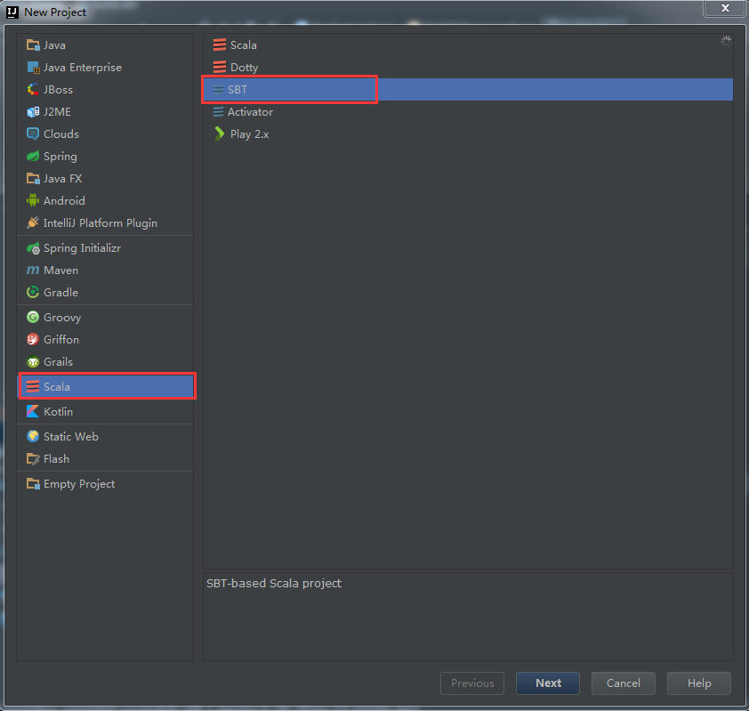
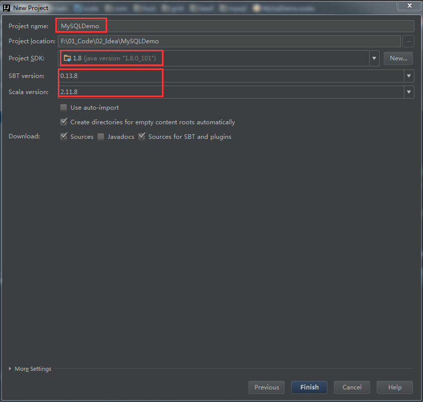
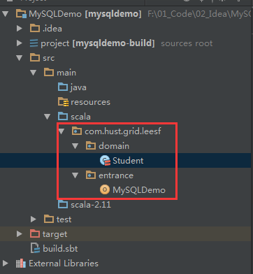

##【知识积累】SBT+Scala+MySQL的Demo

##
##一、背景

##
##　　由于项目需要，需要在Sbt+Scala项目中连接MySQL数据库。由于之前使用Maven+Java进行依赖管理偏多，在Sbt+Scala方面也在不断进行摸索，特此记录，作为小模块知识的积累。

##
##二、系统环境

##
##　　Scala、Sbt、IDE的版本分别如下

##
##　　Scala版本　　 　　==> 2.11.8

##
##　　Sbt版本  　　　　==> 0.13.8

##
##　　Idea Intellij版本  ==> 2016.2.2

##
##三、步骤

##
##　　3.1 新建SBT项目　

##
##　　 

##
##　　 

##
##　　3.2 添加Student类和程序入口

##
##　　项目结构如下图所示

##
##　　 

##
##　　其中Student代码如下

##
##

	package com.hust.grid.leesf.domain

/**
  * Created by LEESF on 2016/8/28.
  */
class Student(val id: Int, val name: String, val age: Int) {
  override def toString = "id = " + id + ", name = " + name + ", age = " + age
	}


##
##　　MySQLDemo代码如下

	package com.hust.grid.leesf.entrance

import java.sql.{Connection, DriverManager, SQLException	}

import com.hust.grid.leesf.domain.Student

/**
  * Created by LEESF on 2016/8/28.
  */
object MySQLDemo {
  def main(args: Array[String]): Unit = {
    val url = "jdbc:mysql://localhost:3306/test?user=root&amp;useUnicode=true&amp;characterEncoding=utf-8"
    var conn: Connection = null
    try {
      // load mysql driver
      classOf[com.mysql.jdbc.Driver]
      conn = DriverManager.getConnection(url)
      val stmt = conn.createStatement
      val sql = "select * from student"
      val rs = stmt.executeQuery(sql)
      while (rs.next) {
        println(new Student(rs.getInt(1), rs.getString(2), rs.getInt(3)))
      	}
    	} catch {
      case e: SQLException => e.printStackTrace
      case e: Exception => e.printStackTrace
    	} finally {
      if (conn != null) {
        conn.close
      	}
    	}
  	}
	}


##
##　　build.sbt代码如下

	name := "MySQLDemo"

version := "1.0"

scalaVersion := "2.11.8"

libraryDependencies += "mysql" % "mysql-connector-java" % "5.1.6"

    


##
##　　3.3 新建Student表

##
##　　选定test数据库

##
##　　执行SQL脚本如下

	CREATE TABLE `student` (
  `id` int(11) NOT NULL AUTO_INCREMENT,
  `name` varchar(20) DEFAULT NULL,
  `age` tinyint(2) DEFAULT NULL,
  PRIMARY KEY (`id`)
);


##
##　　插入记录脚本如下

	insert into student(name, age) values("leesf", 24);
insert into student(name, age) values("dyd", 24);


##
##　　3.4 执行程序

##
##　　执行MySQLDemo

##
##　　结果如下　　

	id = 1, name = leesf, age = 24
id = 2, name = dyd, age = 24


##
##　　说明：以上结果表明已经成功访问数据库，并取得其中的数据。

##
##四、总结

##
##　　以上记录了使用SBT+Scala访问MySQL数据的过程，整个Demo已经上传至github，有需要的园友可以直接fork，谢谢各位园友的观看。　　