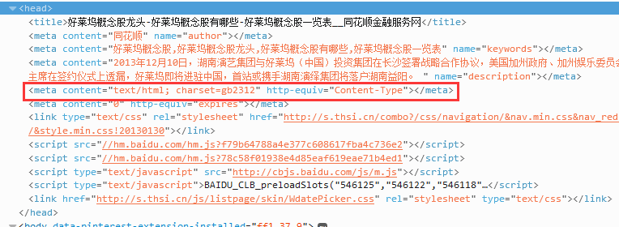

##【知识积累】爬虫之网页乱码解决方法(gb2312 -> utf-8)

##
##前言

##
##　　今天在测试爬虫项目时，发现了一个很严肃的问题，当爬取的网页编码格式为gb2312时，按照一般的办法转化为utf-8编码时总是乱码，PS:爬取的所有网页无论何种编码格式，都转化为utf-8格式进行存储。

##
##一、问题出现

##
##　　使用这篇文章里面的方法可以直接爬取页面信息并保存至本地使用Httpclient实现网页的爬取并保存至本地，当爬取这个网页时http://stock.10jqka.com.cn/zhuanti/hlw_list/，发现使用之前（未知编码 -> utf-8编码）的转化方式总是乱码。于是乎查阅了不少资料，发现都不是太适用。最后自己摸索出了一个解决办法，也特此记录。

##
##二、解决方案

##
##　　1. 将gb2312格式转化为gbk格式

##
##　　2. 将gbk格式转化为utf-8格式

##
##　　这里的转化需要使用gbk作为一个中间格式，作为转化桥梁。

##
##三、具体思路

##
##　　1. 当打开http://stock.10jqka.com.cn/zhuanti/hlw_list/这个链接，我们查看源码会发现编码格式为gb2312，如下图所示

##
##　　 

##
##　　2. 由于本项目之前就已经使用了转化方案，但是此转化方案对网页为gb2312格式无效，本项目之前的转化方案的核心源代码为：　
  

	public void getContent(String url) {
        this.get = new HttpGet(url);
        HttpResponse response = client.execute(this.get);
        HttpEntity entity = response.getEntity();
        byte[] bytes = EntityUtils.toByteArray(entity);
        String content = new String(bytes);
        // 默认为utf-8编码
        String charset = "utf-8";
        // 匹配<head></head>之间，出现在<meta>标签中的字符编码
        Pattern pattern = Pattern.compile("<head>([\\s\\S]*?)<meta([\\s\\S]*?)charset\\s*=(\")?(.*?)\"");
        Matcher matcher = pattern.matcher(content.toLowerCase());
        if (matcher.find()) {    
            charset = matcher.group(4);
        	} 
        // 将目标字符编码转化为utf-8编码
        String temp = new String(bytes, charset);
        byte[] contentData = temp.getBytes("utf-8");
        return contentData;
    	}

View Code

##
##　　这种方案对gb2312转化后还是乱码，之后的解决方案核心源代码为：　　
  

	public void getContent(String url) {
        this.get = new HttpGet(url);
        HttpResponse response = client.execute(this.get);
        HttpEntity entity = response.getEntity();
        byte[] bytes = EntityUtils.toByteArray(entity);
        String content = new String(bytes);
        // 默认为utf-8编码
        String charset = "utf-8";
        // 匹配<head></head>之间，出现在<meta>标签中的字符编码
        Pattern pattern = Pattern.compile("<head>([\\s\\S]*?)<meta([\\s\\S]*?)charset\\s*=(\")?(.*?)\"");
        Matcher matcher = pattern.matcher(content.toLowerCase());
        if (matcher.find()) {    
            charset = matcher.group(4);
            if (charset.equals("gb2312")) {
                byte[] gbkBytes = new String(bytes, "gbk").getBytes();
                return new String(gbkBytes, "utf-8").getBytes();
            	}
        	} 
        // 将目标字符编码转化为utf-8编码
        String temp = new String(bytes, charset);
        byte[] contentData = temp.getBytes("utf-8");
        return contentData;
    	}

View Code

##
##　　通过这种方式我们就可以解决gb2312编码转化为utf-8编码时出现的乱码问题。

##
##四、总结

##
##　　多思考，多动脑，这里只是给出了一个工程解决方案，并没有深入到其中的原理，由此问题可以引申出很多有意思的问题，如，utf-8、gbk、gb2312的编码方式怎样的？为什么这样转化就可以解决问题？这些问题值得我们去深入研究。由于本篇文章主要是讲工程解决方案，感兴趣的读者可以去深入了解。谢谢各位园友观看~

##
##　　附送一篇关于爬虫乱码问题解决的很好的文章，网络爬虫的乱码处理 ，讲得很不错，有做爬虫的园友遇到这一部分的问题时可以好好参考参考。

##
##