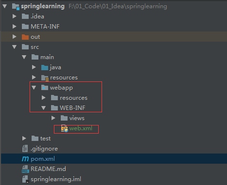
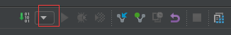
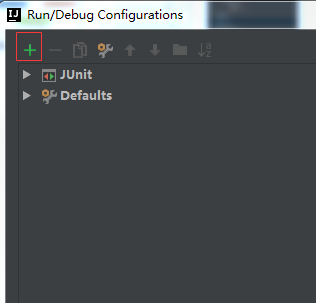
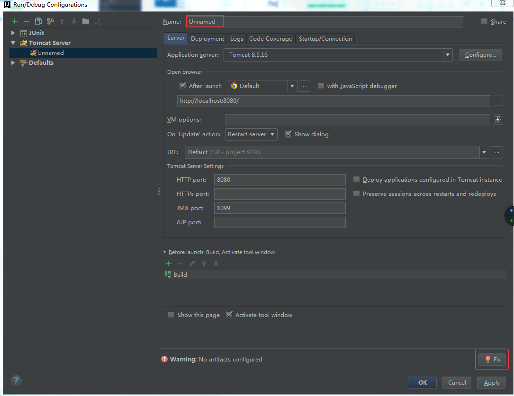
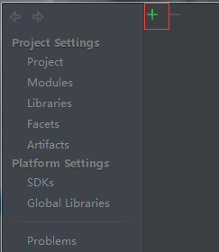
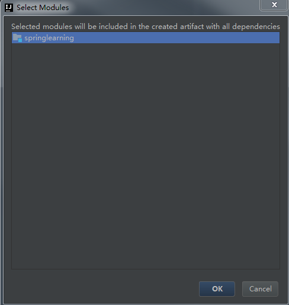
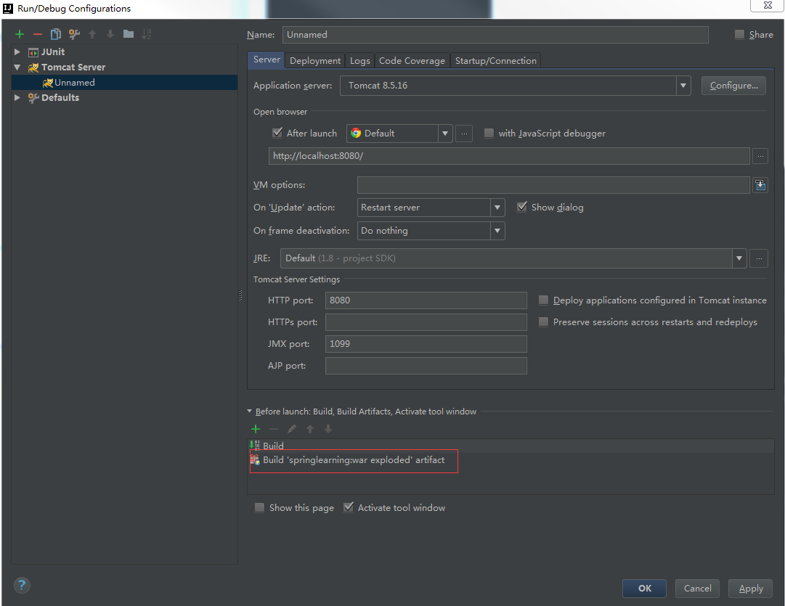
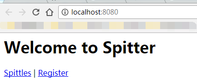

##【记录】Spring项目转化为Spring Web项目前言

##
##在将Spring项目转化为Spring Mvc项目时出现了点问题，总是无法成功部署，查阅资料也并没有找到一个完美的解决方案，最后是参考在idea中创建maven web app项目后的目录才成功运行，并将过程记录下来。转化过程修改pom.xml文件

##
##添加Spring对应的Web依赖，我添加的依赖如下。        <dependency>            <groupId>org.springframework</groupId>            <artifactId>spring-web</artifactId>            <version>${spring.version	}</version>        </dependency>        <dependency>            <groupId>org.springframework</groupId>            <artifactId>spring-webmvc</artifactId>            <version>${spring.version	}</version>        </dependency>        <!--j2ee servlet jsp jstl-->        <dependency>            <groupId>javax.servlet</groupId>            <artifactId>javax.servlet-api</artifactId>            <version>3.1.0</version>        </dependency>        <dependency>            <groupId>javax.servlet.jsp</groupId>            <artifactId>jsp-api</artifactId>            <version>2.2</version>        </dependency>        <dependency>            <groupId>javax.servlet</groupId>            <artifactId>jstl</artifactId>            <version>1.2</version>        </dependency>

##
##主要需要添加spring-web和spring-webmvc两个依赖。修改项目结构

##
##在src/java目录下创建webapp目录，并创建WEB-INF目录，最后在WEB-INF目录下创建web.xml文件，文件内容如下。<!DOCTYPE web-app PUBLIC "-//Sun Microsystems, Inc.//DTD Web Application 2.3//EN" "http://java.sun.com/dtd/web-app_2_3.dtd" ><web-app>  <display-name>Archetype Created Web Application</display-name></web-app>

##
##具体目录如下截图(其中views目录放置jsp文件，不添加不影响)。

##
## 修改pom文件

##
##由于Web应用的打包的方式是war，所以需要在pom.xml文件中申明为war打包方式，需在pom.mxl添加<packaging>war</packaging>。类似如下    <groupId>com.hust.grid.leesf</groupId>    <artifactId>springproject</artifactId>    <packaging>war</packaging>    <version>1.0-SNAPSHOT</version>配置Tomcat

##
##接下配置Tomcat的Servlet容器。首先点击如下按钮，选择Edit Configurations。

##
## 再点击+按钮，选择Tomcat Server的Local。

##
## 再点击如下的fix按钮。

##
## 然后再点击+按钮。

##
## 不用修改，点击确定即可。

##
## 最后如下截图所示。

##
## 启动Tomcat，在浏览器中显示如下，大功告成。

##
## 总结

##
##之前也遇到过类似的问题，解决了之后未记录，事隔很长时间后又遇到这个问题，又花了很长时间才解决，于是将解决过程进行记录，方便以后遇到类似问题时更快速的处理。