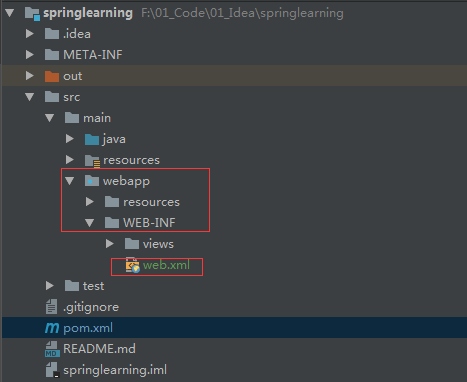
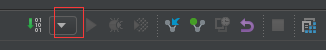
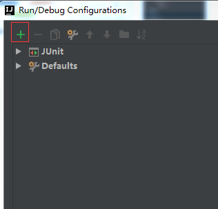
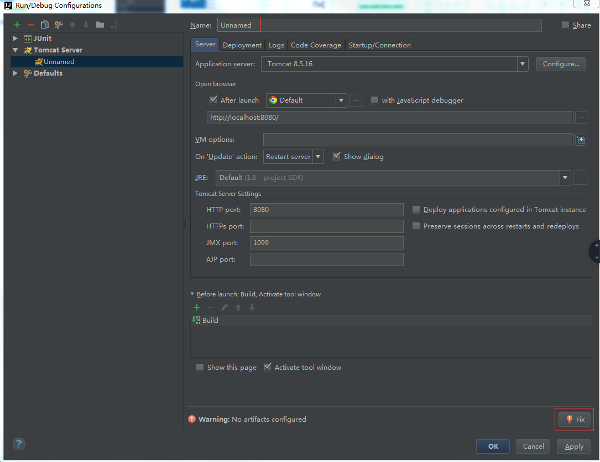
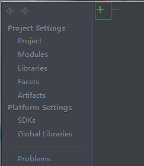
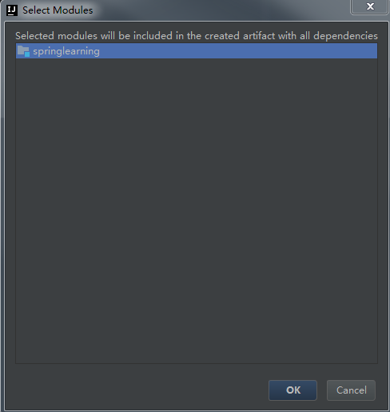
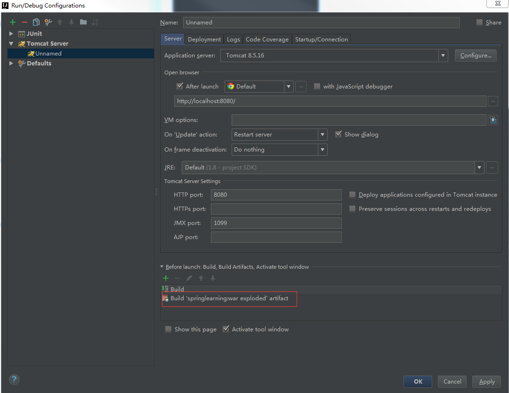
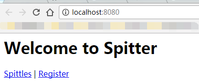

## 前言

> 在将`Spring`项目转化为`Spring
Mvc`项目时出现了点问题，总是无法成功部署，查阅资料也并没有找到一个完美的解决方案，最后是参考在`idea`中创建`maven web
app`项目后的目录才成功运行，并将过程记录下来。

## 转化过程

### 修改pom.xml文件

> 添加`Spring`对应的`Web`依赖，我添加的依赖如下。

    
    
            <dependency>
                <groupId>org.springframework</groupId>
                <artifactId>spring-web</artifactId>
                <version>${spring.version}</version>
            </dependency>
            <dependency>
                <groupId>org.springframework</groupId>
                <artifactId>spring-webmvc</artifactId>
                <version>${spring.version}</version>
            </dependency>
    
            <!--j2ee servlet jsp jstl-->
            <dependency>
                <groupId>javax.servlet</groupId>
                <artifactId>javax.servlet-api</artifactId>
                <version>3.1.0</version>
            </dependency>
            <dependency>
                <groupId>javax.servlet.jsp</groupId>
                <artifactId>jsp-api</artifactId>
                <version>2.2</version>
            </dependency>
            <dependency>
                <groupId>javax.servlet</groupId>
                <artifactId>jstl</artifactId>
                <version>1.2</version>
            </dependency>
    
    

> 主要需要添加`spring-web`和`spring-webmvc`两个依赖。

### 修改项目结构

> 在`src/java`目录下创建`webapp`目录，并创建`WEB-INF`目录，最后在`WEB-
INF`目录下创建`web.xml`文件，文件内容如下。

    
    
    <!DOCTYPE web-app PUBLIC
     "-//Sun Microsystems, Inc.//DTD Web Application 2.3//EN"
     "http://java.sun.com/dtd/web-app_2_3.dtd" >
    
    <web-app>
      <display-name>Archetype Created Web Application</display-name>
    </web-app>
    
    

> 具体目录如下截图(其中`views`目录放置`jsp`文件，不添加不影响)。

### 修改pom文件

>
由于`Web`应用的打包的方式是`war`，所以需要在`pom.xml`文件中申明为`war`打包方式，需在`pom.mxl`添加`<packaging>war</packaging>`。类似如下

    
    
        <groupId>com.hust.grid.leesf</groupId>
        <artifactId>springproject</artifactId>
        <packaging>war</packaging>
        <version>1.0-SNAPSHOT</version>
    

### 配置Tomcat

> 接下配置`Tomcat`的`Servlet容器`。

  * 首先点击如下按钮，选择`Edit Configurations`。

  * 再点击`+`按钮，选择`Tomcat Server`的`Local`。

  * 再点击如下的`fix`按钮。

  * 然后再点击`+`按钮。

  * 不用修改，点击确定即可。

  * 最后如下截图所示。

  * 启动`Tomcat`，在浏览器中显示如下，大功告成。

## 总结

>
之前也遇到过类似的问题，解决了之后未记录，事隔很长时间后又遇到这个问题，又花了很长时间才解决，于是将解决过程进行记录，方便以后遇到类似问题时更快速的处理。

