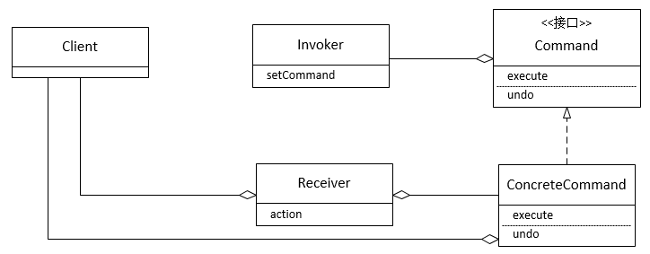

**一、前言**

读完单例模式，接着品命令模式，命令模式在工程实践中有应用，如MVC框架中使用了命令模式，还有日志系统（从异常中恢复）和事务系统都可以使用命令模式，命令模式可以解耦命令请求者和命令执行者，下面开始学习命令模式。

**二、命令模式定义**

定义： **命令模式将请求封装成对象，以便使用不同的请求、队列或者日志来参数化其他对象。命令模式也支持撤销的操作。**

**** 从定义可以看出，命令模式核心的概念就是讲请求封装成为对象，这样，对象可以被传递，从而解耦请求者和执行者。

命令模式的类图如下

说明：对于类图说明如下

① Client负责创建一个ConcreteCommand，并设置接受者。

② Invoker持有一个命令对象，并在某个时间点调用命令对象的execute方法，将请求付诸实行。

③ Command为所有命令声明了一个接口，调用命令对象的execute方法，就可以让接受者进行相关的动作，这个接口也具备一个undo方法。

④
ConcreteCommand定义了动作和接受者之间的绑定关系，调用者只要调用execute方法就可以发出请求，然后由ConcreteCommand调用接受者的一个或多个动作。

⑤ Receiver为接受者，实现请求具体的动作，任何类都可以当接受者。

**三、示例说明**

****
设想如下场景，家里的电器都通过一个遥控器来控制，按下按钮即可控制电器的开关，并且只要在遥控的相关插口插入对应的电器模块，即可控制相应的电器，即可很方便的进行替换。

**** 3.1 v1.0

Command

    
    
    package com.hust.grid.leesf.command;
    
    interface Command {
        void execute();
        void undo();
    }

View Code

LightOnCommand

    
    
    package com.hust.grid.leesf.command;
    
    public class LightOnCommand implements Command {
        private Receiver light;
        
        public LightOnCommand(Receiver receiver) {
            this.light = receiver;
        }
        
        @Override
        public void execute() {
            light.on();
        }
    
        @Override
        public void undo() {
            light.off();
        }
    
    }

View Code

LightOffCommand

    
    
    package com.hust.grid.leesf.command;
    
    public class LightOffCommand implements Command {
        private Receiver light;
        
        public LightOffCommand(Receiver receiver) {
            light = receiver;
        }
        
        @Override
        public void execute() {
            light.off();
        }
    
        @Override
        public void undo() {
            light.on();
        }
        
    }

View Code

CeilingFanOnCommand

    
    
    package com.hust.grid.leesf.command;
    
    public class CeilingFanOnCommand implements Command {
        private Receiver ceilingFan;
        
        public CeilingFanOnCommand(Receiver receiver) {
            ceilingFan = receiver;
        }
        
        @Override
        public void execute() {
            ceilingFan.on();
        }
    
        @Override
        public void undo() {
            ceilingFan.off();
        }
    }

View Code

CeilingFanOffCommand

    
    
    package com.hust.grid.leesf.command;
    
    public class CeilingFanOffCommand implements Command {
        private Receiver ceilingFan;
        
        public CeilingFanOffCommand(Receiver receiver) {
            ceilingFan = receiver;
        }
        
        @Override
        public void execute() {
            ceilingFan.off();
        }
    
        @Override
        public void undo() {
            ceilingFan.on();
        }
    }

View Code

Receiver

    
    
    package com.hust.grid.leesf.command;
    
    public abstract class Receiver {
        protected String name;
        public Receiver(String name) {
            this.name = name;
        }
        
        public void on() {
            System.out.println(this.name + " is on");
        }
        
        public void off() {
            System.out.println(this.name + " is off");
        }
    }

View Code

Light

    
    
    package com.hust.grid.leesf.command;
    
    public class Light extends Receiver {
        public Light(String name) {
            super(name);
        }
    }

View Code

CeilingFan

    
    
    package com.hust.grid.leesf.command;
    
    public class CeilingFan extends Receiver {
        public CeilingFan(String name) {
            super(name);
        }
    }

View Code

RemoteController

    
    
    package com.hust.grid.leesf.command;
    
    public class RemoteController {
        Command[] onCommands;
        Command[] offCommands;
        Command undoCommand;
        
        public RemoteController(int slotSize) {
            onCommands = new Command[slotSize];
            offCommands = new Command[slotSize];
        }
        
        public void setCommand(int slot, Command onCommand, Command offCommand) {
            onCommands[slot] = onCommand;
            offCommands[slot] = offCommand;
        }
        
        public void onButtonWasPushed(int slot) {
            undoCommand = onCommands[slot];
            onCommands[slot].execute();
        }
        
        public void offButtonWasPushed(int slot) {
            undoCommand = offCommands[slot];
            offCommands[slot].execute();
        }
        
        public void undoButtonWasPushed() {
            undoCommand.undo();
        }
    }

View Code

Main（用于测试）

    
    
    package com.hust.grid.leesf.command;
    
    public class Main {
        public static void main(String[] args) {
            // 遥控器
            RemoteController remoteController = new RemoteController(3);
    
            Light livingRoomLight = new Light("LivingRoomLight");
            Light kitchenLight = new Light("KitchenLight");
            CeilingFan ceilingFan = new CeilingFan("CeilingFan");
            
            LightOnCommand livingRoomLightOnCommand = new LightOnCommand(livingRoomLight);
            LightOffCommand livingRoomLightOffCommand = new LightOffCommand(livingRoomLight);
            
            LightOnCommand kitchenLightOnCommand = new LightOnCommand(kitchenLight);
            LightOnCommand kitchenLightOffCommand = new LightOnCommand(kitchenLight);
            
            CeilingFanOnCommand ceilingFanOnCommand = new CeilingFanOnCommand(ceilingFan);
            CeilingFanOffCommand ceilingFanOffCommand = new CeilingFanOffCommand(ceilingFan);
            
            remoteController.setCommand(0, livingRoomLightOnCommand, livingRoomLightOffCommand);
            remoteController.setCommand(1, kitchenLightOnCommand, kitchenLightOffCommand);
            remoteController.setCommand(2, ceilingFanOnCommand, ceilingFanOffCommand);
            
            // 模拟遥控按下按钮
            remoteController.onButtonWasPushed(0);        
            remoteController.onButtonWasPushed(1);
            remoteController.onButtonWasPushed(2);
            remoteController.offButtonWasPushed(2);
            // 撤销操作
            remoteController.undoButtonWasPushed();
        }
    }

View Code

运行结果

    
    
    LivingRoomLight is on  
    KitchenLight is on  
    CeilingFan is on  
    CeilingFan is off  
    CeilingFan is on

说明：使用了命令模式，一切都运行良好，并且可进行撤销操作。

若需要添加这样的功能，当按下按钮时，指定的所有电器都开或者关闭，即宏命令。

3.2 v2.0

添加宏命令，即一次性可以执行多个命令

MacroCommand

    
    
    package com.hust.grid.leesf.command;
    
    public class MacroCommand implements Command {
        private Command[] commands;
        public MacroCommand(Command[] commands) {
            this.commands = commands;
        }
        
        @Override
        public void execute() {
            for (int i = 0; i < commands.length; i++) {
                commands[i].execute();
            }
        }
    
        @Override
        public void undo() {
            for (int i = 0; i < commands.length; i++) {
                commands[i].undo();
            }
        }
    
    }

View Code

Main（用作测试）

    
    
    package com.hust.grid.leesf.command;
    
    public class Main {
        public static void main(String[] args) {
            // 遥控器
            RemoteController remoteController = new RemoteController(4);
    
            Light livingRoomLight = new Light("LivingRoomLight");
            Light kitchenLight = new Light("KitchenLight");
            CeilingFan ceilingFan = new CeilingFan("CeilingFan");
            
            LightOnCommand livingRoomLightOnCommand = new LightOnCommand(livingRoomLight);
            LightOffCommand livingRoomLightOffCommand = new LightOffCommand(livingRoomLight);
            
            LightOnCommand kitchenLightOnCommand = new LightOnCommand(kitchenLight);
            LightOnCommand kitchenLightOffCommand = new LightOnCommand(kitchenLight);
            
            CeilingFanOnCommand ceilingFanOnCommand = new CeilingFanOnCommand(ceilingFan);
            CeilingFanOffCommand ceilingFanOffCommand = new CeilingFanOffCommand(ceilingFan);
            
            Command[] partyOn = {livingRoomLightOnCommand, kitchenLightOnCommand, ceilingFanOnCommand};
            Command[] partyOff = {livingRoomLightOffCommand, kitchenLightOffCommand, ceilingFanOffCommand};
            MacroCommand macroOnCommand = new MacroCommand(partyOn);
            MacroCommand macroOffCommand = new MacroCommand(partyOff);
            
            remoteController.setCommand(0, livingRoomLightOnCommand, livingRoomLightOffCommand);
            remoteController.setCommand(1, kitchenLightOnCommand, kitchenLightOffCommand);
            remoteController.setCommand(2, ceilingFanOnCommand, ceilingFanOffCommand);
            remoteController.setCommand(3, macroOnCommand, macroOffCommand);
            
            // 模拟遥控按下按钮
            remoteController.onButtonWasPushed(3);
            // 撤销操作
            remoteController.undoButtonWasPushed();
        }
    }

View Code

运行结果

    
    
    LivingRoomLight is on
    KitchenLight is on
    CeilingFan is on
    LivingRoomLight is off
    KitchenLight is off
    CeilingFan is off

说明：可以看到，调用了宏命令后，一次性执行了多条命令，并且执行撤消后，会恢复到之前的状态。

命令模式的要点如下：

① 命令模式将发出的请求的对象和执行请求的对象解耦

② 在被解耦的两者之间是通过命令对象进行沟通的。命令对象封装了接受者和一个或一组动作。

③ 调用者通过调用命令对象的execute方法发出请求，这会使得接受者的动作被调用。

④ 调用者可以接受命令当做参数，甚至在运行时动态地进行。

**四、总结**

对于命令模式而言，其应用也相对比较广泛，在工程应用中有适合应用此种模式的地方，不妨使用，所有源代码已经上传至[github](https://github.com/leesf/DesignPattern/tree/master)，欢迎fork，谢谢各位园友的观看~
****

