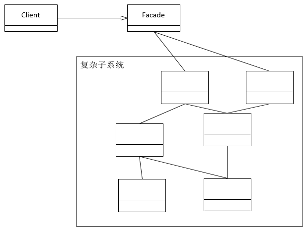

**一、前言**

分析完适配器模式后，接着看外观模式，外观模式很简单，可以理解为在复杂系统上封装了一层，提供了统一的接口，而让客户端只需要与该接口通信便可控制背后复杂的系统。

**二、外观模式定义**

定义： **提供了统一的接口，用来访问子系统中的一群接口。外观定义了一个高层接口，让子系统更容易使用。**

**** 从定义可知，外观模式就是对一组接口的封装，提供统一的接口与客户端之间进行通信，从而达到简化使用的目的。

其类图如下

说明：对类图的说明如下

① Facade类为外观，为复杂的子系统提供了统一的接口，便于操作。

**三、示例**

假设如下场景，当我们睡觉时，多么希望一键就可以关闭电视机，灯泡等电器，而不用起身一个个的关闭，这样的场景可以使用外观模式来完成，从而简化系统的使用。

3.1 v1.0

TV

    
    
    package com.hust.grid.leesf.facade;
    
    public class TV {
        public void on() {
            System.out.println("TV on");
        }
        
        public void off() {
            System.out.println("TV off");
        }
    }

View Code

Light

    
    
    package com.hust.grid.leesf.facade;
    
    public class Light {
        public void on() {
            System.out.println("light is on");
        }
        
        public void off() {
            System.out.println("light off");
        }
    }

View Code

Facade

    
    
    package com.hust.grid.leesf.facade;
    
    public class Facade {
        private Light light;
        private TV tv;
    
        public Facade(Light light, TV tv) {
            this.light = light;
            this.tv = tv;
        }
        
        public void on() {
            this.light.on();
            this.tv.on();
        }
        
        public void off() {
            this.light.off();
            this.tv.off();
        }
    }

View Code

Main（用作测试）

    
    
    package com.hust.grid.leesf.facade;
    
    public class Main {
        public static void main(String[] args) {
            Light light = new Light();
            TV tv = new TV();
            Facade facade = new Facade(light, tv);
            facade.off();
        }
    }

View Code

运行结果

    
    
    light off
    TV off

说明：使用外观模式，可以很简单的使用整个系统，一键式的就可以完成关闭的操作，有点类似之前分析的命令模式中的宏命令。

**四、总结**

外观模式为复杂系统提供了一个很简单的接口，方便客户使用，同时，也允许客户直接与复杂系统进行通信，外观只是提供了一种额外的选择。所有源代码已经上传至[github](https://github.com/leesf/DesignPattern/tree/master)，欢迎fork，谢谢各位园友的观看~

