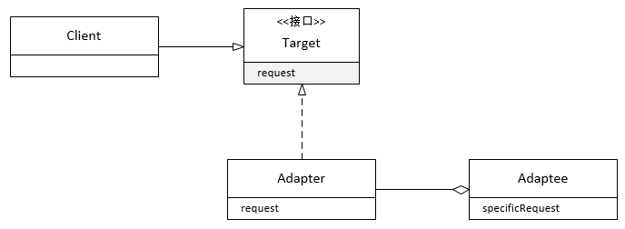

**一、前言**

接着看设计模式，今天介绍的是适配器模式，适配器对于大家应该不陌生，就是适配两种不同类型的物体。如两孔插座和三孔插头之间就需要用到适配器才能正常工作，而在程序世界中，也存在着适配器，下面来分析适配器模式。

**二、适配器模式定义**

定义： **将一个类的接口，转换成客户期望的另一个接口，适配器让原本接口不兼容的类可以合作无间。**

**** 从定义可以看出适配器模式主要起到一个转化的作用，相当于一个中间转化层。其类图如下

说明：对类图的说明如下

① Target是适配器实现目标接口。

② Adapter是适配器，用于进行适配。

③ Adaptee是被适配者，所有的请求都委托给被适配者。

客户端通过目标接口调用适配器的方法对适配器发出请求；适配器使用被适配者接口把请求转化成被适配者的一个或多个调用接口；客户接收到调用的结果，但并未察觉这一切是适配器在起作用。

**三、示例说明**

假设如下的场景，去餐厅就餐时，点了一份牛排，发现上的却是一份香煎猪排，餐厅竟然用猪排代替牛排，可能是餐厅的牛排已经卖完了，就用猪排冒充了牛排，站在餐厅的角度来看，采用适配器模式就可以达到这样的目的。

系统的类图与上面给出的类图相似,
Target对应Steak（牛排），Adapter对应PorkChopAdapter（猪排适配器），Adaptee对应FriedPorkChop。

3.1 v1.0

Steak

    
    package com.hust.grid.leesf.adapter;

    

    interface Steak {

        void taste();

    }

FriedSteak

    
    package com.hust.grid.leesf.adapter;

    

    public class FriedSteak implements Steak {

        public void taste() {

            System.out.println("so delicious");

        }

    }

PorkChopAdapter

    package com.hust.grid.leesf.adapter;

    

    public class PorkChopAdapter implements Steak {

        private PorkChop porkChop;

        

        public PorkChopAdapter(PorkChop porkChop) {

            this.porkChop = porkChop;

        }

        

        public void taste() {

            porkChop.taste();

        }

    }

PorkChop

    package com.hust.grid.leesf.adapter;

    

    public class PorkChop {

        public void taste() {

            System.out.println("not so delicious");

        }

    }

Main（用作测试）

    package com.hust.grid.leesf.adapter;

    

    public class Main {

        public static void main(String[] args) {

            FriedSteak friedSteak = new FriedSteak();

            friedSteak.taste();

            

            PorkChop porkChop = new PorkChop();

            PorkChopAdapter porkChopAdapter = new PorkChopAdapter(porkChop);

            porkChopAdapter.taste();

        }

    }

View Code

运行结果

    
    
    so delicious

    not so delicious

说明：通过适配器模式，这样就完成了从猪排到牛排的转化。

**四、总结**

适配器可以将两个不同类型的接口进行适配，让其之间可以转化，其与装饰者模式有些类似的地方，如都包装了对象，进行方法的转发。但是两者的意图是完全不一样的，装饰者模式是扩展包装的对象的行为或责任，而适配器模式则是对接口进行转化，只是两者都利用了组合来实现不同的目的。所有源代码已经上传至[github](https://github.com/leesf/DesignPattern/tree/master)，欢迎fork，谢谢各位园友的观看~

