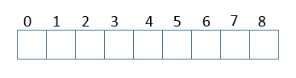
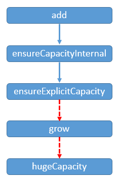
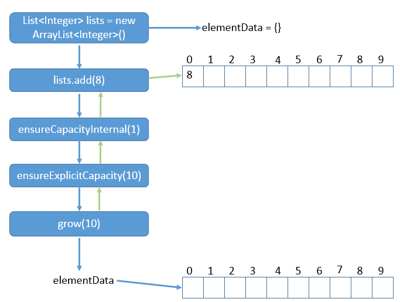
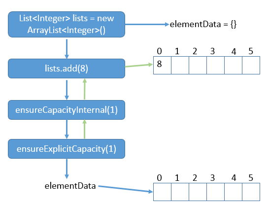

**一、前言**

分析了Map中主要的类之后，下面我们来分析Collection下面几种常见的类，如ArrayList、LinkedList、HashSet、TreeSet等。下面通过JDK源码来一起分析ArrayList底层是如何实现的。（PS：把JVM看完了之后终于可以有成片的时间来阅读源码了，感觉简直不能更爽）。

**二、ArrayList数据结构**

**** 分析一个类的时候，数据结构往往是它的灵魂所在，理解底层的数据结构其实就理解了该类的实现思路，具体的实现细节再具体分析。

ArrayList的数据结构如下：

说明：底层的数据结构就是数组，数组元素类型为Object类型，即可以存放所有类型数据。我们对ArrayList类的实例的所有的操作底层都是基于数组的。下面我们来分析通过数组是如何保证库函数的正确实现的。

**三、ArrayList源码分析**

3.1 类的继承关系

    
    
    public class ArrayList<E> extends AbstractList<E> implements List<E>, RandomAccess, Cloneable, java.io.Serializable

说明：ArrayList继承AbstractList抽象父类，实现了List接口（规定了List的操作规范）、RandomAccess（可随机访问）、Cloneable（可拷贝）、Serializable（可序列化）。

3.2 类的属性

    
    
    public class ArrayList<E> extends AbstractList<E>
            implements List<E>, RandomAccess, Cloneable, java.io.Serializable
    {
        // 版本号
        private static final long serialVersionUID = 8683452581122892189L;
        // 缺省容量
        private static final int DEFAULT_CAPACITY = 10;
        // 空对象数组
        private static final Object[] EMPTY_ELEMENTDATA = {};
        // 缺省空对象数组
        private static final Object[] DEFAULTCAPACITY_EMPTY_ELEMENTDATA = {};
        // 元素数组
        transient Object[] elementData;
        // 实际元素大小，默认为0
        private int size;
        // 最大数组容量
        private static final int MAX_ARRAY_SIZE = Integer.MAX_VALUE - 8;
    }

View Code

说明：类的属性中核心的属性为elementData，类型为Object[]，用于存放实际元素，并且被标记为transient，也就意味着在序列化的时候，此字段是不会被序列化的。

3.3 类的构造函数

1\. ArrayList(int)型构造函数

    
    
        public ArrayList(int initialCapacity) {
            if (initialCapacity > 0) { // 初始容量大于0
                this.elementData = new Object[initialCapacity]; // 初始化元素数组
            } else if (initialCapacity == 0) { // 初始容量为0
                this.elementData = EMPTY_ELEMENTDATA; // 为空对象数组
            } else { // 初始容量小于0，抛出异常
                throw new IllegalArgumentException("Illegal Capacity: "+
                                                   initialCapacity);
            }
        }

View Code

说明：指定elementData数组的大小，不允许初始化大小小于0，否则抛出异常。

2\. ArrayList()型构造函数

    
    
        public ArrayList() { 
            // 无参构造函数，设置元素数组为空 
            this.elementData = DEFAULTCAPACITY_EMPTY_ELEMENTDATA;
        }

View Code

说明：当未指定初始化大小时，会给elementData赋值为空集合。

3\. ArrayList(Collection<? extends E>)型构造函数

    
    
        public ArrayList(Collection<? extends E> c) { // 集合参数构造函数
            elementData = c.toArray(); // 转化为数组
            if ((size = elementData.length) != 0) { // 参数为非空集合
                if (elementData.getClass() != Object[].class) // 是否成功转化为Object类型数组
                    elementData = Arrays.copyOf(elementData, size, Object[].class); // 不为Object数组的话就进行复制
            } else { // 集合大小为空，则设置元素数组为空
                this.elementData = EMPTY_ELEMENTDATA;
            }
        }

View Code

说明：当传递的参数为集合类型时，会把集合类型转化为数组类型，并赋值给elementData。

3.4 核心函数分析

1\. add函数

    
    
        public boolean add(E e) { // 添加元素
            ensureCapacityInternal(size + 1);  // Increments modCount!!
            elementData[size++] = e;
            return true;
        }

View Code

说明：在add函数我们发现还有其他的函数ensureCapacityInternal，此函数可以理解为确保elementData数组有合适的大小。ensureCapacityInternal的具体函数如下

    
    
    private void ensureCapacityInternal(int minCapacity) {
            if (elementData == DEFAULTCAPACITY_EMPTY_ELEMENTDATA) { // 判断元素数组是否为空数组
                minCapacity = Math.max(DEFAULT_CAPACITY, minCapacity); // 取较大值
            }
            
            ensureExplicitCapacity(minCapacity);
        }

View Code

说明：在ensureCapacityInternal函数中我们又发现了ensureExplicitCapacity函数，这个函数也是为了确保elemenData数组有合适的大小。ensureExplicitCapacity的具体函数如下

    
    
    private void ensureExplicitCapacity(int minCapacity) {
            // 结构性修改加1
            modCount++;
            if (minCapacity - elementData.length > 0)
                grow(minCapacity);
        }

View Code

说明：在ensureExplicitCapacity函数我们又发现了grow函数，grow函数才会对数组进行扩容，ensureCapacityInternal、ensureExplicitCapacity都只是过程，最后完成实际扩容操作还是得看grow函数，grow函数的具体函数如下

    
    
        private void grow(int minCapacity) {
            int oldCapacity = elementData.length; // 旧容量
            int newCapacity = oldCapacity + (oldCapacity >> 1); // 新容量为旧容量的1.5倍
            if (newCapacity - minCapacity < 0) // 新容量小于参数指定容量，修改新容量
                newCapacity = minCapacity;
            if (newCapacity - MAX_ARRAY_SIZE > 0) // 新容量大于最大容量
                newCapacity = hugeCapacity(minCapacity); // 指定新容量
            // 拷贝扩容
            elementData = Arrays.copyOf(elementData, newCapacity);
        }

View Code

说明：正常情况下会扩容1.5倍，特殊情况下（新扩展数组大小已经达到了最大值）则只取最大值。

当我们调用add方法时，实际上的函数调用如下

说明：程序调用add，实际上还会进行一系列调用，可能会调用到grow，grow可能会调用hugeCapacity。

下面通过两种方式给出调用add的例子，并分析最后的elementData数组的大小。

示例一（只给出了会影响到最终结果的核心代码）

    
    
    List<Integer> lists = new ArrayList<Integer>();
    lists.add(8);

说明：初始化lists大小为0，调用的ArrayList()型构造函数，那么在调用lists.add(8)方法时，会经过怎样的步骤呢？下图给出了该程序执行过程和最初与最后的elementData的大小

说明：我们可以看到，在add方法之前开始elementData =
{}；调用add方法时会继续调用，直至grow，最后elementData的大小变为10，之后再返回到add函数，把8放在elementData[0]中。

示例二核心代码如下

    
    
    List<Integer> lists = new ArrayList<Integer>(6);
    lists.add(8);

说明：调用的ArrayList(int)型构造函数，那么elementData被初始化为大小为6的Object数组，在调用add(8)方法时，具体的步骤如下：

说明：我们可以知道，在调用add方法之前，elementData的大小已经为6，之后再进行传递，不会进行扩容处理。

2\. set函数

    
    
        public E set(int index, E element) {
            // 检验索引是否合法
            rangeCheck(index);
            // 旧值
            E oldValue = elementData(index);
            // 赋新值
            elementData[index] = element;
            // 返回旧值
            return oldValue;
        }

View Code

说明：设定指定下标索引的元素值。

3\. indexOf函数

    
    
    // 从首开始查找数组里面是否存在指定元素
        public int indexOf(Object o) {
            if (o == null) { // 查找的元素为空
                for (int i = 0; i < size; i++) // 遍历数组，找到第一个为空的元素，返回下标
                    if (elementData[i]==null)
                        return i;
            } else { // 查找的元素不为空
                for (int i = 0; i < size; i++) // 遍历数组，找到第一个和指定元素相等的元素，返回下标
                    if (o.equals(elementData[i]))
                        return i;
            } 
            // 没有找到，返回空
            return -1;
        }

View Code

说明：从头开始查找与指定元素相等的元素，注意，是可以查找null元素的，意味着ArrayList中可以存放null元素的。与此函数对应的lastIndexOf，表示从尾部开始查找。

4\. get函数

    
    
        public E get(int index) {
            // 检验索引是否合法
            rangeCheck(index);
    
            return elementData(index);
        }

View Code

说明：get函数会检查索引值是否合法（只检查是否大于size，而没有检查是否小于0），值得注意的是，在get函数中存在element函数，element函数用于返回具体的元素，具体函数如下

    
    
        E elementData(int index) {
            return (E) elementData[index];
        }

View Code

说明：返回的值都经过了向下转型（Object -> E），这些是对我们应用程序屏蔽的小细节。

5\. remove函数

    
    
        public E remove(int index) {
            // 检查索引是否合法
            rangeCheck(index);
            
            modCount++;
            E oldValue = elementData(index);
            // 需要移动的元素的个数
            int numMoved = size - index - 1;
            if (numMoved > 0)
                System.arraycopy(elementData, index+1, elementData, index,
                                 numMoved);
            // 赋值为空，有利于进行GC
            elementData[--size] = null; 
            // 返回旧值
            return oldValue;
        }

View Code

说明：remove函数用户移除指定下标的元素，此时会把指定下标到数组末尾的元素向前移动一个单位，并且会把数组最后一个元素设置为null，这样是为了方便之后将整个数组不被使用时，会被GC，可以作为小的技巧使用。

**四、总结**  

****
ArrayList有其特殊的应用场景，与LinkedList相对应。其优点是随机读取，缺点是插入元素时需要移动大量元素，效率不太高。至此，ArrayList的源码分析就到这里，总体来说，ArrayList的底层还是很简单的，谢谢各位园友的观看~

