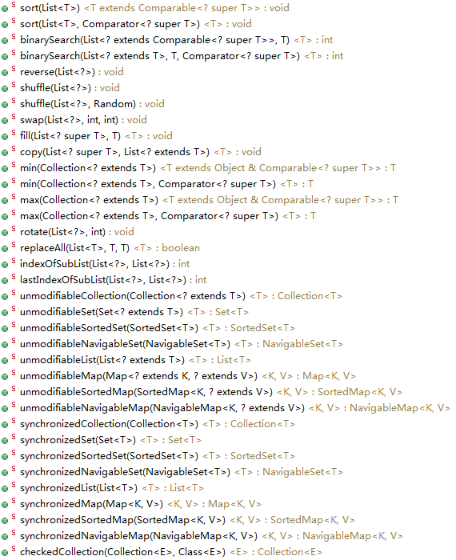
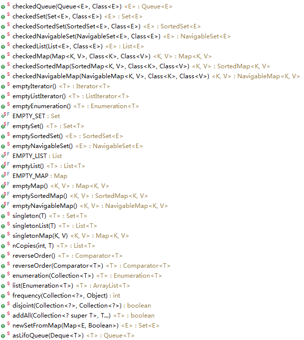
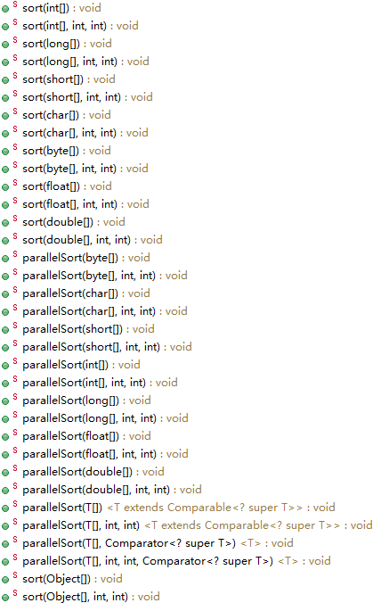
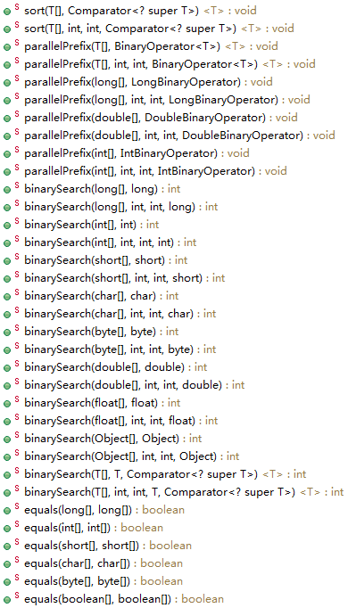
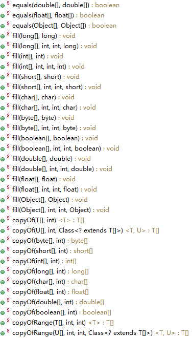
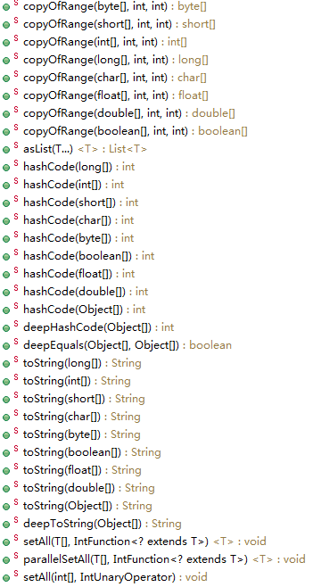
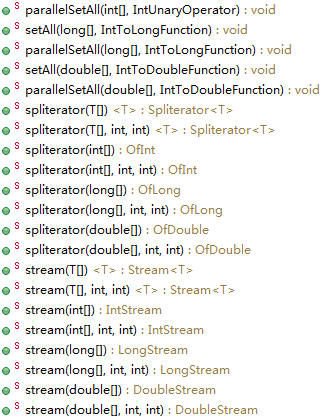

##【集合框架】JDK1.8源码分析之Collections && Arrays（十）

##
##一、前言

##
##　　整个集合框架的常用类我们已经分析完成了，但是还有两个工具类我们还没有进行分析。可以说，这两个工具类对于我们操作集合时相当有用，下面进行分析。

##
##二、Collections源码分析

##
##　　2.1 类的属性　
  

	public class Collections {
    // 二分查找阈值
    private static final int BINARYSEARCH_THRESHOLD   = 5000;
    // 反向阈值
    private static final int REVERSE_THRESHOLD        =   18;
    // 洗牌阈值
    private static final int SHUFFLE_THRESHOLD        =    5;
    // 填充阈值
    private static final int FILL_THRESHOLD           =   25;
    // 旋转阈值
    private static final int ROTATE_THRESHOLD         =  100;
    // 拷贝阈值
    private static final int COPY_THRESHOLD           =   10;
    // 替换阈值
    private static final int REPLACEALL_THRESHOLD     =   11;
    // 子集合索引阈值
    private static final int INDEXOFSUBLIST_THRESHOLD =   35;
	}

View Code

##
##　　2.2 构造函数　　

	private Collections() {   
	}    


##
##　　说明：私有构造函数，在类外无法调用。

##
##　　2.3 方法分析

##
##　　下面是Collections的所有方法。

##
##　　 

##
##　　 

##
##　　可以看到，Collections的方法包含了各种各样的操作。下面分析最常用的方法。

##
##　　1. sort函数

##
##　　该函数有两个重载函数，方法签名分别如下

	public static <T extends Comparable<? super T>> void sort(List<T> list)
public static <T> void sort(List<T> list, Comparator<? super T> c)


##
##　　说明：对于第一个函数，参数为List<T> list，表示只能对List进行排序。由<T extends Comparable<? super T>>可知，T类型或者是T的父类型必须实现了Comparable接口。对于第二个函数，也包含了List<T> list参数，还包含了Comparator<? super T> c，表示可以指定自定义比较器Comparator。而元素类型不需要实现Comparable接口。两个函数都会调用到List类的sort方法。具体如下　
  

	default void sort(Comparator<? super E> c) {
        // 转化为数组
        Object[] a = this.toArray();
        // 调用Arrays类的sort函数
        Arrays.sort(a, (Comparator) c);
        // 迭代器
        ListIterator<E> i = this.listIterator();
        for (Object e : a) {
            i.next();
            i.set((E) e);
        	}
    	}

View Code

##
##　　2. binarySearch函数

##
##　　该函数也有两个重载版本，方法签名分别如下　　

	public static <T> int binarySearch(List<? extends Comparable<? super T>> list, T key)
public static <T> int binarySearch(List<? extends T> list, T key, Comparator<? super T> c)


##
##　　说明：与sort函数的两个重载版本类似，可以指定自定义比较器，特别注意，使用此函数时，必须要保证List已经排好序，并且集合元素是可以比较的。其中，两个binarySearch函数会调用indexedBinarySearch函数，具体函数如下　　
  

	private static <T>
    int indexedBinarySearch(List<? extends Comparable<? super T>> list, T key) {
        int low = 0;
        int high = list.size()-1;
        
        while (low <= high) {
            // 取low - high 的中间索引，直接使用移位操作，效率更高
            int mid = (low + high) >>> 1;
            // 取中间元素
            Comparable<? super T> midVal = list.get(mid);
            // 中间元素与key比较
            int cmp = midVal.compareTo(key);

            if (cmp < 0) // 小于key，在高半部分查找
                low = mid + 1;
            else if (cmp > 0) // 大于key，在低半部分查找
                high = mid - 1;
            else // 找到key，返回位置
                return mid; // key found
        	}
        return -(low + 1);  // 没有找到key,返回负数
    	}

View Code

##
##　　说明：该函数在List可以随机访问时被调用，效率相比iteratorBinarySearch更高，当List不能被随机访问时，将采用iteratorBinarySearch进行二分查找，即采用迭代器模式。iteratorBinarySearch具体代码如下　　
  

	private static <T>
    int iteratorBinarySearch(List<? extends Comparable<? super T>> list, T key)
    {
        int low = 0;
        int high = list.size()-1;
        // 获取迭代器
        ListIterator<? extends Comparable<? super T>> i = list.listIterator();
        // 循环控制
        while (low <= high) {
            // 取得中间索引
            int mid = (low + high) >>> 1;
            // 得到中间元素
            Comparable<? super T> midVal = get(i, mid);
            // 中间元素与key比较
            int cmp = midVal.compareTo(key);
            if (cmp < 0) // 小于key，在高半部分查找
                low = mid + 1;
            else if (cmp > 0) // 大于key，在低半部分查找
                high = mid - 1;
            else // 找到key，返回位置
                return mid; 
        	}
        return -(low + 1);  // 没有找到key,返回负数
    	}

View Code

##
##　　说明：该函数会调用get函数，即遍历集合找元素，所以效率相对较低。get函数如下　　
  

	private static <T> T get(ListIterator<? extends T> i, int index) {
        T obj = null;
        // 下一个结点索引
        int pos = i.nextIndex();
        if (pos <= index) { //下一个结点索引小于index，从前往后 
            do {
                obj = i.next();
            	} while (pos++ < index);
        	} else { // 下一个结点索引不小于index，从后往前
            do {
                obj = i.previous();
            	} while (--pos > index);
        	}
        // 返回元素
        return obj;
    	}

View Code

##
##　　3. reverse函数

##
##　　此函数用于反转集合中的元素，其签名如下

	public static void reverse(List<?> list)


##
##　　具体代码如下
  

	public static void reverse(List<?> list) {
        int size = list.size();
        if (size < REVERSE_THRESHOLD || list instanceof RandomAccess) { // 小于反向阈值或者可以随机访问
            // 把元素从中间分隔为两部分，交换两部分的值
            for (int i=0, mid=size>>1, j=size-1; i<mid; i++, j--) 
                swap(list, i, j);
        	} else { // 否则
            // 获取从头开始的迭代器
            ListIterator fwd = list.listIterator();
            // 获取从size位置（从尾）开始的迭代器
            ListIterator rev = list.listIterator(size);
            // 从开始遍历到中间位置
            for (int i=0, mid=list.size()>>1; i<mid; i++) {
                // 取下一元素
                Object tmp = fwd.next();
                // 交换元素
                fwd.set(rev.previous());
                rev.set(tmp);
            	}
        	}
    	}

View Code

##
##　　说明：若集合支持随机访问或者集合大小小于反转阈值，则采用直接交换操作；否则，就会采用双迭代器模式（从头开始的，从尾开始的）进行交换。

##
##　　4. fill函数

##
##　　此函数用于给集合填充指定元素，签名如下　　

	public static <T> void fill(List<? super T> list, T obj)


##
##　　泛型方法，具体代码如下
  

	    public static <T> void fill(List<? super T> list, T obj) {
        int size = list.size();
    
        if (size < FILL_THRESHOLD || list instanceof RandomAccess) { // 小于填充阈值或者集合可以随机访问
            // 遍历集合
            for (int i=0; i<size; i++)
                list.set(i, obj);
        	} else { // 否则
            // 使用迭代器模式进行填充
            ListIterator<? super T> itr = list.listIterator();
            for (int i=0; i<size; i++) {
                itr.next();
                itr.set(obj);
            	}
        	}
    	}

View Code

##
##　　说明：也是同reverse函数一样，分为两种情况处理。

##
##　　5. copy函数

##
##　　此函数用于拷贝集合，将源集合拷贝至目标集合，签名如下

	public static <T> void copy(List<? super T> dest, List<? extends T> src)


##
##　　其具体代码如下
  

	    public static <T> void copy(List<? super T> dest, List<? extends T> src) {
        // 源集合大小
        int srcSize = src.size();
        if (srcSize > dest.size()) // 源集合大小大于目标集合大小，抛出异常
            throw new IndexOutOfBoundsException("Source does not fit in dest");

        if (srcSize < COPY_THRESHOLD ||
            (src instanceof RandomAccess &amp;&amp; dest instanceof RandomAccess)) { // 小于拷贝阈值或者(src和dest集合都支持随机访问
            // 遍历，拷贝
            for (int i=0; i<srcSize; i++)
                dest.set(i, src.get(i));
        	} else { // 否则
            // 目标集合的迭代器
            ListIterator<? super T> di=dest.listIterator();
            // 源集合的迭代器
            ListIterator<? extends T> si=src.listIterator();
            // 遍历，拷贝
            for (int i=0; i<srcSize; i++) {
                di.next();
                di.set(si.next());
            	}
        	}
    	}

View Code

##
##　　说明：也是分为两种情况进行处理，并且要确保目标集合大小大于源集合大小。

##
##　　6. min函数

##
##　　此函数用于求得集合里最小的元素，有两个重载版本，签名如下　　

	public static <T extends Object &amp; Comparable<? super T>> T min(Collection<? extends T> coll)
public static <T> T min(Collection<? extends T> coll, Comparator<? super T> comp)


##
##　　说明：可以指定比较器，取出自定义的最小的元素。第一个函数具体代码如下
  

	    public static <T extends Object &amp; Comparable<? super T>> T min(Collection<? extends T> coll) {
        // 获取迭代器
        Iterator<? extends T> i = coll.iterator();
        // 第一个元素为候选元素
        T candidate = i.next();
        
        while (i.hasNext()) {
            // 下一个元素
            T next = i.next();
            // 下一个元素小于候选元素
            if (next.compareTo(candidate) < 0)
                // 改变候选元素
                candidate = next;
        	}
        // 返回最小元素
        return candidate;
    	}

View Code

##
##　　说明：只需要遍历一遍集合即可取出最小值，另外一个重载函数类似，不再累赘，max函数与min函数类似，不再累赘。

##
##　　7. rotate函数

##
##　　此函数用于旋转集合元素，实际就是循环右移集合里的元素，签名如下　　

	public static void rotate(List<?> list, int distance)


##
##　　集合元素循环右移，移动的距离为distance，具体代码如下
  

	public static void rotate(List<?> list, int distance) {
        if (list instanceof RandomAccess || list.size() < ROTATE_THRESHOLD) // 可随机访问或小于阈值
            rotate1(list, distance);
        else // 否则
            rotate2(list, distance);
    	}

View Code

##
##　　说明：也分为两种情况进行处理，分别对应rotate1、rotate2。roate1函数具体如下
  

	    private static <T> void rotate1(List<T> list, int distance) {
        // 取得集合大小
        int size = list.size();
        if (size == 0) // 集合为空，返回
            return;
        distance = distance % size; // 取模操作
        if (distance < 0) // 为负数，之后保证为正数
            distance += size;
        if (distance == 0) // 移动距离为0，直接返回
            return;
        // 遍历集合
        for (int cycleStart = 0, nMoved = 0; nMoved != size; cycleStart++) {
            T displaced = list.get(cycleStart);
            int i = cycleStart;
            do {
                i += distance;
                if (i >= size)
                    i -= size;
                displaced = list.set(i, displaced);
                nMoved ++;
            	} while (i != cycleStart);
        	}
    	}

View Code

##
##　　说明：这个算法特别的巧妙，可作为面试考点。rotate2函数具体如下　　
  

	    private static void rotate2(List<?> list, int distance) {
        int size = list.size();
        if (size == 0)
            return;
        int mid =  -distance % size;
        if (mid < 0)
            mid += size;
        if (mid == 0)
            return;
        // 将AB变为BA，可以先对A求逆，再对B求逆，再对整体求逆，则可以得到BA
        // 先反向0到mid的元素
        reverse(list.subList(0, mid));
        // 再反向mid到size的元素
        reverse(list.subList(mid, size));
        // 最后反向整个表
        reverse(list);        
    	}

View Code

##
##　　说明：使用递归进行旋转。

##
##　　8. replaceAll函数

##
##　　用于替换集合中所有指定元素。签名如下　　

	public static <T> boolean replaceAll(List<T> list, T oldVal, T newVal)


##
##　　具体代码如下
  

	public static <T> boolean replaceAll(List<T> list, T oldVal, T newVal) {
        boolean result = false;
        // 集合大小
        int size = list.size();
        if (size < REPLACEALL_THRESHOLD || list instanceof RandomAccess) { // 小于替换阈值或者可以随机访问
            if (oldVal==null) { // 旧值为空
                // 遍历集合
                for (int i=0; i<size; i++) { 
                    if (list.get(i)==null) { // 为空就设置为新值
                        list.set(i, newVal);
                        result = true;
                    	}
                	}
            	} else { // 旧值不为空
                // 遍历集合
                for (int i=0; i<size; i++) {
                    if (oldVal.equals(list.get(i))) { // 与旧值相等就设置为新值
                        list.set(i, newVal);
                        result = true;
                    	}
                	}
            	}
        	} else { // 否则
            // 获取迭代器
            ListIterator<T> itr=list.listIterator();
            if (oldVal==null) { // 旧值为空
                for (int i=0; i<size; i++) { // 遍历
                    if (itr.next()==null) {
                        itr.set(newVal);
                        result = true;
                    	}
                	}
            	} else { // 旧值不为空
                for (int i=0; i<size; i++) {
                    if (oldVal.equals(itr.next())) { // 与旧值相等就设置为新值
                        itr.set(newVal);
                        result = true;
                    	}
                	}
            	}
        	}
        return result;
    	}

View Code

##
##　　说明：可以替换空值null。也是分两种情况进行处理。

##
##　　9. indexOfSubList函数

##
##　　用于在指定集合索引子集合，成功，则返回位置，不成功，则返回-1。签名如下　

	public static int indexOfSubList(List<?> source, List<?> target)


##
##　　具体代码如下　　
  

	    public static int indexOfSubList(List<?> source, List<?> target) {
        // 源集合大小
        int sourceSize = source.size();
        // 目标集合大小
        int targetSize = target.size();
        // 大小差
        int maxCandidate = sourceSize - targetSize;
        
        if (sourceSize < INDEXOFSUBLIST_THRESHOLD ||
            (source instanceof RandomAccess&amp;&amp;target instanceof RandomAccess)) { // 小于子集索引阈值或者(源集合与目标集合都支持随机访问)
        nextCand:
            for (int candidate = 0; candidate <= maxCandidate; candidate++) { // 只需要遍历从0到maxCandidate即可
                for (int i=0, j=candidate; i<targetSize; i++, j++)
                    if (!eq(target.get(i), source.get(j))) // 不相等
                        continue nextCand; // 不匹配，又回到for,此时将不会执行int candidate = 0操作
                return candidate; // 全部匹配，返回索引
            	}
        	} else { // 否则，使用迭代器操作
            // 获取迭代器
            ListIterator<?> si = source.listIterator();
        nextCand:
            for (int candidate = 0; candidate <= maxCandidate; candidate++) {
                ListIterator<?> ti = target.listIterator();
                for (int i=0; i<targetSize; i++) {
                    if (!eq(ti.next(), si.next())) { // 不相等
                        // 回溯源集合迭代器
                        for (int j=0; j<i; j++)
                            si.previous();
                        continue nextCand; // 又回到for,此时将不会执行int candidate = 0操作
                    	}
                	}
                return candidate; // 全部匹配，返回索引
            	}
        	}
        return -1;  // 不匹配，返回-1
    	}

View Code

##
##　　说明：也是分为两种情况进行处理。

##
##　　10. frequency函数

##
##　　用来统计一个元素在集合中出现的次数。签名如下　　

	public static int frequency(Collection<?> c, Object o)


##
##　　具体代码如下　
  

	public static int frequency(Collection<?> c, Object o) {
        int result = 0;
        if (o == null) { // 对象为空
            // 遍历集合
            for (Object e : c) 
                if (e == null) // 为空
                    result++;
        	} else { // 对象不为空
            // 遍历集合
            for (Object e : c)
                if (o.equals(e))
                    result++;
        	}
        return result;
    	}

View Code

##
##　　说明：可以对空值null进行统计。

##
##　　11. reverseOrder函数

##
##　　反转比较逻辑，即反转集合顺序，有两个重载函数，签名如下　　

	public static <T> Comparator<T> reverseOrder()
public static <T> Comparator<T> reverseOrder(Comparator<T> cmp)


##
##　　函数返回类型为Comparator类型，该Comparator的比较逻辑与之前的比较逻辑相反。reverseOrder函数代码如下　
  

	    public static <T> Comparator<T> reverseOrder() {
        return (Comparator<T>) ReverseComparator.REVERSE_ORDER;
    	}

View Code

##
##　　说明：另外一个重载函数与此类似，不再累赘。

##
##　　12. addAll函数

##
##　　用于向集合中添加多个元素，签名如下　　

	public static <T> boolean addAll(Collection<? super T> c, T... elements)


##
##　　说明：第二个参数为变长参数，即可以传递多个值。具体代码如下　
  

	    public static <T> boolean addAll(Collection<? super T> c, T... elements) {
        boolean result = false;
        for (T element : elements)
            result |= c.add(element);
        return result;
    	}

View Code

##
##　　Collections的主要方法就分析到这里。下面分析Arrays类的方法。

##
##三、Arrays源码分析

##
##　　3.1 类的属性　　
  

	public class Arrays {
    // 可以进行并行排序的最小数组长度
    private static final int MIN_ARRAY_SORT_GRAN = 1 << 13;
	}

View Code

##
##　　3.2 构造函数　

	private Arrays() {	}


##
##　　说明：私有构造函数，类外不允许调用。

##
##　　3.3 方法分析

##
##　　Arrays的全部方法如下

##
##　　       　　

##
##　　说明：可以看到，Arrays工具类处理的是数组类型。并且每个方法存在多个重载版本。

##
##　　3.4 核心方法分析

##
##　　由于存在多个重载版本，每个重载版本的逻辑大体一致，故只分析有代表性的版本。

##
##　　1. sort函数

##
##　　用于对数组进行排序，两个主要的重载版本，方法签名如下　　

	public static void sort(int[] a)
public static void sort(int[] a, int fromIndex, int toIndex)


##
##　　说明：第一个版本是对整个数组进行排序，第二个版本只对指定部分进行排序。第一个版本代码如下　　
  

	public static void sort(int[] a) {
        // 使用快速排序
        DualPivotQuicksort.sort(a, 0, a.length - 1, null, 0, 0);
    	}

View Code

##
##　　说明：使用快速排序进行排序。第二个版本与第一个版本类似，不再累赘。

##
##　　2. equals方法

##
##　　用于判断两个数组是否相等，若数组元素重写了equals方法，则按照元素的equals方法进行比较。主要的重载版本，方法签名如下　　

	public static boolean equals(int[] a, int[] a2)
public static boolean equals(Object[] a, Object[] a2)


##
##　　说明：第一个版本具体代码如下　
  

	public static boolean equals(int[] a, int[] a2) {
        if (a==a2)
            return true;
        if (a==null || a2==null) // 任一数组为空，则返回false
            return false;

        int length = a.length;
        if (a2.length != length) // 数组大小不相等，返回false
            return false;

        for (int i=0; i<length; i++) // 遍历比较，元素全部相等则返回true，否则，返回false
            if (a[i] != a2[i])
                return false;

        return true;
    	}

View Code

##
##　　说明：首先，判断是否为同一个数组引用，满足后，再判断是否有数组为空，满足后，再判断两数组长度是否相等，满足后，最后遍历数组进行比较。

##
##　　3. copyOf函数

##
##　　用于复制数组元素至另一个数组。主要重载版本，签名如下　　

	public static <T> T[] copyOf(T[] original, int newLength)
public static <T,U> T[] copyOf(U[] original, int newLength, Class<? extends T[]> newType)


##
##　　第二个版本，具体代码如下　
  

	public static <T,U> T[] copyOf(U[] original, int newLength, Class<? extends T[]> newType) {
        @SuppressWarnings("unchecked")
        T[] copy = ((Object)newType == (Object)Object[].class)
            ? (T[]) new Object[newLength]
            : (T[]) Array.newInstance(newType.getComponentType(), newLength);
        System.arraycopy(original, 0, copy, 0,
                         Math.min(original.length, newLength));
        return copy;
    	}

View Code

##
##　　4. copyOfRange函数

##
##　　指定数组一段元素进行复制（指定了开始位置和结束位置），签名如下　　

	public static <T> T[] copyOfRange(T[] original, int from, int to)
public static <T,U> T[] copyOfRange(U[] original, int from, int to, Class<? extends T[]> newType)


##
##　　第二个版本，具体代码如下　
  

	public static <T,U> T[] copyOfRange(U[] original, int from, int to, Class<? extends T[]> newType) {
        int newLength = to - from;
        if (newLength < 0)
            throw new IllegalArgumentException(from + " > " + to);
        @SuppressWarnings("unchecked")
        T[] copy = ((Object)newType == (Object)Object[].class)
            ? (T[]) new Object[newLength]
            : (T[]) Array.newInstance(newType.getComponentType(), newLength);
        System.arraycopy(original, from, copy, 0,
                         Math.min(original.length - from, newLength));
        return copy;
    	}

View Code

##
##　　5. hashCode函数

##
##　　求得数组的hashCode，主要版本，签名如下　

	public static int hashCode(int a[])


##
##　　代码如下　
  

	    public static int hashCode(int a[]) {
        if (a == null)
            return 0;

        int result = 1;
        for (int element : a)
            result = 31 * result + element;

        return result;
    	}

View Code

##
##　　6. asList函数

##
##　　用于将不定参数转化为List，方法签名如下　　

	public static <T> List<T> asList(T... a)


##
##　　具体代码如下　　
  

	public static <T> List<T> asList(T... a) {
        return new ArrayList<>(a);
    	}

View Code　

##
##　　7. toString函数

##
##　　用于更友好的显示数组信息，签名如下　

	public static String toString(int[] a)


##
##　　注意，并没有覆盖Object类的toString方法，因为方法签名不相同。具体代码如下　
  

	    public static String toString(int[] a) {
        if (a == null)
            return "null";
        int iMax = a.length - 1;
        if (iMax == -1)
            return "[]";

        StringBuilder b = new StringBuilder();
        b.append("[");
        for (int i = 0; ; i++) {
            b.append(a[i]);
            if (i == iMax)
                return b.append("]").toString();
            b.append(", ");
        	}
    	}

View Code

##
##　　Arrays工具类的主要方法就介绍到这里，平时我们可以多用用里面的方法，达到更熟悉的效果。

##
##四、总结

##
##　　Collections与Arrays提供了很多有用的方法，我们平时可以多用用，至此，集合框架的主要源码就分析完了。下面会接着分析并发框架的源码，谢谢各位园友的观看~

##
##　　

##
##　　

##
##

##
##　　

##
##　　