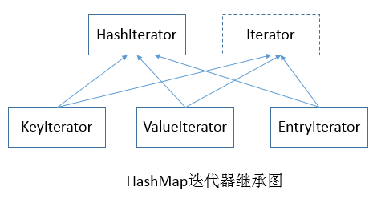
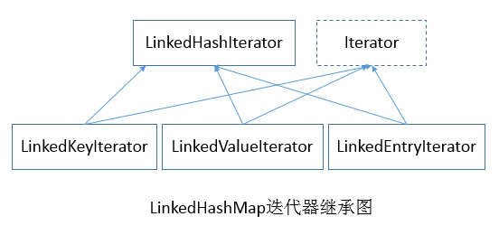

##【集合框架】JDK1.8源码分析之HashMap & LinkedHashMap迭代器（三）

##
##一、前言

##
##　　在遍历HashMap与LinkedHashMap时，我们通常都会使用到迭代器，而HashMap的迭代器与LinkedHashMap迭代器是如何工作的呢？下面我们来一起分析分析。

##
##二、迭代器继承图

##
##　　 

##
##　　 

##
##三、HashMap迭代器

##
##　　3.1 HashIterator

##
##　　HashIterator是一个抽象类，封装了迭代器内部工作的一些操作。

##
##　　HashIterator类属性
  

	abstract class HashIterator {
    // 下一个结点
    Node<K,V> next;        // next entry to return
    // 当前结点
    Node<K,V> current;     // current entry
    // 期望的修改次数
    int expectedModCount;  // for fast-fail
    // 当前桶索引
    int index;             // current slot
	}

View Code

##
##　　说明：其中expectedModCount属性主要用于在遍历HashMap同时，程序对其结构是否进行了修改。若遍历同时修改了，则会抛出异常。

##
##　　HashIterator构造函数　
  

	HashIterator() {
        // 成员变量赋值
        expectedModCount = modCount;
        Node<K,V>[] t = table;
        current = next = null;
        index = 0;
        // table不为空并且大小大于0
        if (t != null &amp;&amp; size > 0) { // advance to first entry
            // 找到table数组中第一个存在的结点，即找到第一个具有元素的桶
            do {	} while (index < t.length &amp;&amp; (next = t[index++]) == null);
        	}
    	}

View Code

##
##　　说明：next将表示第一个非空桶中的第一个结点，index将表示下一个桶。

##
##　　HashIterator核心函数分析

##
##　　1. hasNext函数
  

	// 是否存在下一个结点
public final boolean hasNext() {
    return next != null; 
	}

View Code

##
##　　2. nextNode函数　
  

	final Node<K,V> nextNode() {
    // 记录next结点
    Node<K,V> e = next;
    // 若在遍历时对HashMap进行结构性的修改则会抛出异常
    if (modCount != expectedModCount)
        throw new ConcurrentModificationException();
    // 下一个结点为空，抛出异常
    if (e == null)
        throw new NoSuchElementException();
    // 如果下一个结点为空，并且table表不为空；表示桶中所有结点已经遍历完，需寻找下一个不为空的桶
    if ((next = (current = e).next) == null &amp;&amp; (t = table) != null) {
        // 找到下一个不为空的桶
        do {	} while (index < t.length &amp;&amp; (next = t[index++]) == null);
    	}
    return e;
	}

View Code

##
##　　说明：nextNode函数屏蔽掉了桶的不同所带来的差异，就好像所有元素在同一个桶中，依次进行遍历。

##
##　　3. remove函数
  

	public final void remove() {
    Node<K,V> p = current;
    // 当前结点为空，抛出异常
    if (p == null)
        throw new IllegalStateException();
    // 若在遍历时对HashMap进行结构性的修改则会抛出异常
    if (modCount != expectedModCount)
        throw new ConcurrentModificationException();
    // 当前结点为空
    current = null;
    K key = p.key;
    // 移除结点
    removeNode(hash(key), key, null, false, false);
    // 赋最新值
    expectedModCount = modCount;
	}

View Code

##
##　　3.2 KeyIterator

##
##　　KeyIterator类是键迭代器，继承自HashIterator，实现了Iterator接口，可以对HashMap中的键进行遍历。

##
##　　类定义　
  

	final class KeyIterator extends HashIterator
    implements Iterator<K> {
    public final K next() { return nextNode().key; 	}
	}

View Code

##
##　　3.3 ValueIterator

##
##　　ValueIterator类是值迭代器，继承自HashIterator，实现了Iterator接口，与KeyIterator类似，对值进行遍历。　　
  

	final class ValueIterator extends HashIterator
    implements Iterator<V> {
    public final V next() { return nextNode().value; 	}
	}

View Code

##
##　　3.4 EntryIterator

##
##　　EntryIterator类是结点迭代器，继承自HashIterator，实现了Iterator接口，与KeyIterator、ValueIterator类似，对结点进行遍历。　
  

	final class ValueIterator extends HashIterator
    implements Iterator<V> {
    public final V next() { return nextNode().value; 	}
	}

View Code

##
##四、LinkedHashMap迭代器

##
##　　4.1 LinkedHashIterator

##
##　　LinkedHashIterator是LinkedHashMap的迭代器，为抽象类，用于对LinkedHashMap进行迭代。　

##
##　　LinkedHashIterator类属性
  

	abstract class LinkedHashIterator {
    // 下一个结点
    LinkedHashMap.Entry<K,V> next;
    // 当前结点
    LinkedHashMap.Entry<K,V> current;
    // 期望的修改次数
    int expectedModCount;
	}

View Code

##
##　　LinkedHashIterator构造函数　　
  

	LinkedHashIterator() {
    // next赋值为头结点
    next = head;
    // 赋值修改次数
    expectedModCount = modCount;
    // 当前结点赋值为空
    current = null;
	}

View Code

##
##　　LinkedHashIterator核心函数

##
##　　hasNext函数
  

	// 是否存在下一个结点
public final boolean hasNext() {
    return next != null;
	}

View Code

##
##　　nextNode函数　
  

	final LinkedHashMap.Entry<K,V> nextNode() {
    LinkedHashMap.Entry<K,V> e = next;
    // 检查是否存在结构性修改
    if (modCount != expectedModCount)
        throw new ConcurrentModificationException();
    // 当前结点是否为空
    if (e == null)
        throw new NoSuchElementException();
    // 赋值当前节点
    current = e;
    // 赋值下一个结点
    next = e.after;
    return e;
	}

View Code

##
##　　说明：由于所有的结点构成双链表结构，所以nextNode函数也很好理解，直接取得下一个结点即可。
  

	public final void remove() {
    // 保存当前结点
    Node<K,V> p = current;
    if (p == null)
        throw new IllegalStateException();
    if (modCount != expectedModCount)
        throw new ConcurrentModificationException();
    current = null;
    K key = p.key;
    // 移除结点
    removeNode(hash(key), key, null, false, false);
    // 更新最新修改数
    expectedModCount = modCount;
	}

View Code

##
##　　4.2 LinkedKeyIterator

##
##　　LinkedHashMap的键迭代器，继承自LinkedHashIterator，实现了Iterator接口，对LinkedHashMap中的键进行迭代。　
  

	final class LinkedKeyIterator extends LinkedHashIterator
    implements Iterator<K> {
    public final K next() { return nextNode().getKey(); 	}
	}

View Code

##
##　　4.3 LinkedValueIterator

##
##　　LinkedHashMap的值迭代器，继承自LinkedHashIterator，实现了Iterator接口，对LinkedHashMap中的值进行迭代。
  

	final class LinkedValueIterator extends LinkedHashIterator
    implements Iterator<V> {
    public final V next() { return nextNode().value; 	}
	}

View Code

##
##　　4.4 LinkedEntryIterator

##
##　　LinkedHashMap的结点迭代器，继承自LinkedHashIterator，实现了Iterator接口，对LinkedHashMap中的结点进行迭代。　
  

	final class LinkedEntryIterator extends LinkedHashIterator
    implements Iterator<Map.Entry<K,V>> {
    public final Map.Entry<K,V> next() { return nextNode(); 	}
	}

View Code

##
##五、总结

##
##　　HashMap迭代器与LinkedHashMap迭代器有很多相似的地方，对比进行学习效果更佳。迭代器要屏蔽掉底层的细节，提供统一的接口供用户访问。HashMap与LinkedHashMap的迭代器源码分析就到此为止，还是很简单的，谢谢各位园友观看~

##
##