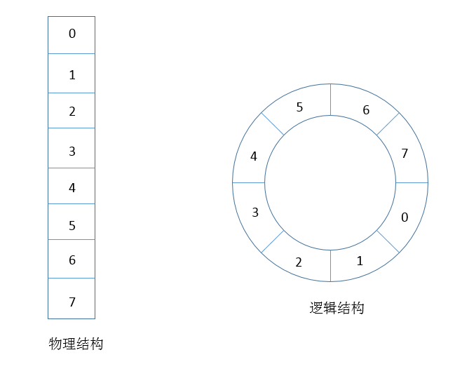
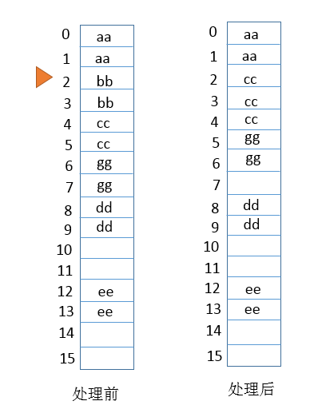

##【集合框架】JDK1.8源码分析之IdentityHashMap（四）

##
##一、前言

##
##　　前面已经分析了HashMap与LinkedHashMap，现在我们来分析不太常用的IdentityHashMap，从它的名字上也可以看出来用于表示唯一的HashMap，仔细分析了其源码，发现其数据结构与HashMap使用的数据结构完全不同，因为在继承关系上面，他们两没有任何关系。下面，进入我们的分析阶段。

##
##二、IdentityHashMap示例　　
  

	import java.util.Map;
import java.util.HashMap;
import java.util.IdentityHashMap;

public class IdentityHashMapTest {
    public static void main(String[] args) {
        Map<String, String> hashMaps = new HashMap<String, String>();
        Map<String, String> identityMaps = new IdentityHashMap<String, String>();
        hashMaps.put(new String("aa"), "aa");
        hashMaps.put(new String("aa"), "bb");
        
        identityMaps.put(new String("aa"), "aa");
        identityMaps.put(new String("aa"), "bb");
        
        System.out.println(hashMaps.size() + " : " + hashMaps);
        System.out.println(identityMaps.size() + " : " + identityMaps);
    	}
	}

View Code

##
##　　运行结果：

##
##1 : {aa=bb	}2 : {aa=bb, aa=aa	}　　

##
##说明：IdentityHashMap只有在key完全相等（同一个引用），才会覆盖，而HashMap则不会。

##
##三、IdentityHashMap数据结构

##
## 

##
##　　说明：IdentityHashMap的数据很简单，底层实际就是一个Object数组，在逻辑上需要看成是一个环形的数组，解决冲突的办法是：根据计算得到散列位置，如果发现该位置上已经有元素，则往后查找，直到找到空位置，进行存放，如果没有，直接进行存放。当元素个数达到一定阈值时，Object数组会自动进行扩容处理。

##
##四、IdentityHashMap源码分析

##
##　　4.1 类的继承关系　

	public class IdentityHashMap<K,V>
    extends AbstractMap<K,V>
    implements Map<K,V>, java.io.Serializable, Cloneable


##
##　　说明：继承了AbstractMap抽象类，实现了Map接口，可序列化接口，可克隆接口。

##
##　　4.2 类的属性　　
  

	public class IdentityHashMap<K,V>
    extends AbstractMap<K,V>
    implements Map<K,V>, java.io.Serializable, Cloneable
{
    // 缺省容量大小
    private static final int DEFAULT_CAPACITY = 32;
    // 最小容量
    private static final int MINIMUM_CAPACITY = 4;
    // 最大容量
    private static final int MAXIMUM_CAPACITY = 1 << 29;
    // 用于存储实际元素的表
    transient Object[] table;
    // 大小
    int size;
    // 对Map进行结构性修改的次数
    transient int modCount;
    // null key所对应的值
    static final Object NULL_KEY = new Object();
	}

View Code

##
##　　说明：可以看到类的底层就是使用了一个Object数组来存放元素。

##
##　　4.3 类的构造函数

##
##　　1. IdentityHashMap()型构造函数　　
  

	public IdentityHashMap() {
    init(DEFAULT_CAPACITY);
	}

View Code

##
##　　2. IdentityHashMap(int)型构造函数
  

	public IdentityHashMap(int expectedMaxSize) {
        if (expectedMaxSize < 0)
            throw new IllegalArgumentException("expectedMaxSize is negative: "
                                               + expectedMaxSize);
        init(capacity(expectedMaxSize));
    	}

View Code

##
##　　3. IdentityHashMap(Map<? extends K, ? extends V>)型构造函数
  

	public IdentityHashMap(Map<? extends K, ? extends V> m) {
        // 调用其他构造函数
        this((int) ((1 + m.size()) * 1.1));
        putAll(m);
    	}

View Code

##
##　　4.4 重要函数分析

##
##　　1. capacity函数　
  

	// 此函数返回的值是最小大于expectedMaxSize的2次幂
    private static int capacity(int expectedMaxSize) {
        // assert expectedMaxSize >= 0;
        return
            (expectedMaxSize > MAXIMUM_CAPACITY / 3) ? MAXIMUM_CAPACITY :
            (expectedMaxSize <= 2 * MINIMUM_CAPACITY / 3) ? MINIMUM_CAPACITY :
            Integer.highestOneBit(expectedMaxSize + (expectedMaxSize << 1));
    	}

View Code

##
##　　说明：此函数返回的值是最小的且大于expectedMaxSize的2次幂的值。

##
##　　2. hash函数　
  

	// hash函数，由于length总是为2的n次幂，所以 &amp; (length - 1)相当于对length取模
    private static int hash(Object x, int length) {
        int h = System.identityHashCode(x);
        // Multiply by -127, and left-shift to use least bit as part of hash
        return ((h << 1) - (h << 8)) &amp; (length - 1);
    	}

View Code

##
##　　说明：hash函数用于散列，并且保证元素的散列值会在数组偶次索引。

##
##　　3. get函数　
  

	public V get(Object key) {
        // 保证null的key会转化为Object(NULL_KEY)
        Object k = maskNull(key);
        // 保存table
        Object[] tab = table;
        int len = tab.length;
        // 得到key的散列位置
        int i = hash(k, len);
        // 遍历table，解决散列冲突的办法是若冲突，则往后寻找空闲区域
        while (true) {
            Object item = tab[i];
            // 判断是否相等(地址是否相等)
            if (item == k)
                // 地址相等，即完全相等的两个对象
                return (V) tab[i + 1];
            // 对应散列位置的元素为空，则返回空
            if (item == null)
                return null;
            // 取下一个Key索引
            i = nextKeyIndex(i, len);
        	}
    	}

View Code

##
##　　说明：该函数比较key值是否完全相同（对象类型则是否为同一个引用，基本类型则是否内容相等）

##
##　　4. nextKeyIndex函数　
  

	// 下一个Key索引
    private static int nextKeyIndex(int i, int len) {
        // 往后移两个单位
        return (i + 2 < len ? i + 2 : 0);
    	}

View Code

##
##　　说明：此函数用于发生冲突时，取下一个位置进行判断。

##
##　　5. put函数　　
  

	public V put(K key, V value) {
        // 保证null的key会转化为Object(NULL_KEY)
        final Object k = maskNull(key);

        retryAfterResize: for (;;) {
            final Object[] tab = table;
            final int len = tab.length;
            int i = hash(k, len);

            for (Object item; (item = tab[i]) != null;
                 i = nextKeyIndex(i, len)) {
                if (item == k) { // 经过hash计算的项与key相等
                    @SuppressWarnings("unchecked")
                        // 取得值
                        V oldValue = (V) tab[i + 1];
                    // 将value存入
                    tab[i + 1] = value;
                    // 返回旧值
                    return oldValue;
                	}
            	}
            
            // 大小加1
            final int s = size + 1;
            // Use optimized form of 3 * s.
            // Next capacity is len, 2 * current capacity.
            // 如果3 * size大于length，则会进行扩容操作
            if (s + (s << 1) > len &amp;&amp; resize(len))
                // 扩容后重新计算元素的值，寻找合适的位置进行存放
                continue retryAfterResize;
            // 结构性修改加1
            modCount++;
            // 存放key与value
            tab[i] = k;
            tab[i + 1] = value;
            // 更新size
            size = s;
            return null;
        	}
    	}

View Code

##
##　　说明：若传入的key在表中已经存在了（强调：是同一个引用），则会用新值代替旧值并返回旧值；如果元素个数达到阈值，则扩容，然后再寻找合适的位置存放key和value。

##
##　　6. resize函数　
  

	private boolean resize(int newCapacity) {
        // assert (newCapacity &amp; -newCapacity) == newCapacity; // power of 2
        int newLength = newCapacity * 2;
        // 保存原来的table
        Object[] oldTable = table;
        int oldLength = oldTable.length;
        // 旧表是否为最大容量的2倍
        if (oldLength == 2 * MAXIMUM_CAPACITY) { // can"t expand any further
            // 之前元素个数为最大容量，抛出异常
            if (size == MAXIMUM_CAPACITY - 1)
                throw new IllegalStateException("Capacity exhausted.");
            return false;
        	}
        // 旧表长度大于新表长度，返回false
        if (oldLength >= newLength)
            return false;
        // 生成新表
        Object[] newTable = new Object[newLength];
        // 将旧表中的所有元素重新hash到新表中
        for (int j = 0; j < oldLength; j += 2) {
            Object key = oldTable[j];
            if (key != null) {
                Object value = oldTable[j+1];
                oldTable[j] = null;
                oldTable[j+1] = null;
                int i = hash(key, newLength);
                while (newTable[i] != null)
                    i = nextKeyIndex(i, newLength);
                newTable[i] = key;
                newTable[i + 1] = value;
            	}
        	}
        // 新表赋值给table
        table = newTable;
        return true;
    	}

View Code

##
##　　说明：当表中元素达到阈值时，会进行扩容处理，扩容后会旧表中的元素重新hash到新表中。

##
##　　7. remove函数　　
  

	public V remove(Object key) {
        // 保证null的key会转化为Object(NULL_KEY)
        Object k = maskNull(key);
        Object[] tab = table;
        int len = tab.length;
        // 计算hash值
        int i = hash(k, len);

        while (true) {
            Object item = tab[i];
            // 找到key相等的项
            if (item == k) {
                modCount++;
                size--;
                @SuppressWarnings("unchecked")
                    V oldValue = (V) tab[i + 1];
                tab[i + 1] = null;
                tab[i] = null;
                // 删除后需要进行后续处理，把之前由于冲突往后挪的元素移到前面来
                closeDeletion(i);
                return oldValue;
            	}
            // 该项为空
            if (item == null)
                return null;
            // 下一项
            i = nextKeyIndex(i, len);
        	}
    	}

View Code

##
##　　8. closeDeletion函数　
  

	private void closeDeletion(int d) {
        // Adapted from Knuth Section 6.4 Algorithm R
        Object[] tab = table;
        int len = tab.length;

        // Look for items to swap into newly vacated slot
        // starting at index immediately following deletion,
        // and continuing until a null slot is seen, indicating
        // the end of a run of possibly-colliding keys.
        Object item;
        // 把该元素后面符合移动规定的元素往前面移动
        for (int i = nextKeyIndex(d, len); (item = tab[i]) != null;
             i = nextKeyIndex(i, len) ) {
            // The following test triggers if the item at slot i (which
            // hashes to be at slot r) should take the spot vacated by d.
            // If so, we swap it in, and then continue with d now at the
            // newly vacated i.  This process will terminate when we hit
            // the null slot at the end of this run.
            // The test is messy because we are using a circular table.
            int r = hash(item, len);
            if ((i < r &amp;&amp; (r <= d || d <= i)) || (r <= d &amp;&amp; d <= i)) {
                tab[d] = item;
                tab[d + 1] = tab[i + 1];
                tab[i] = null;
                tab[i + 1] = null;
                d = i;
            	}
        	}
    	}

View Code

##
##　　说明：在删除一个元素后会进行一次closeDeletion处理，重新分配元素的位置。

##
##　　下图表示在closeDeletion前和closeDeletion后的示意图

##
##　　 

##
##　　说明：假设：其中，（"aa" -> "aa"）经过hash后在第0项，("bb" -> "bb")经过hash后也应该在0项，发生冲突，往后移到第2项，("cc" -> "cc")经过hash后在第2项，发生冲突，往后面移动到第4项，("gg" -> "gg")经过hash在第2项，发生冲突，往后移动到第6项，("dd" -> "dd")在第8项，("ee" -> "ee")在第12项。当删除("bb" -> "bb")后，进行处理后的元素布局如右图所示。

##
##五、总结

##
##　　IdentityHashMap与HashMap在数据结构上很不相同，并且处理hash冲突的方法也不相同。其中，IdentityHashMap只有当key为同一个引用时才认为是相同的，而HashMap还包括equals相等，即内容相同。

##
##