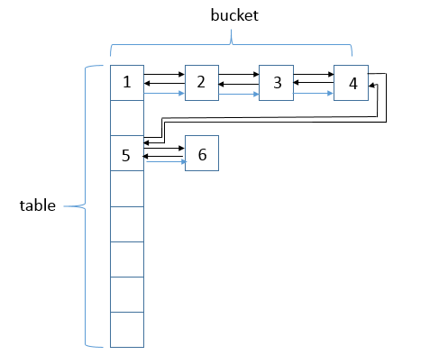
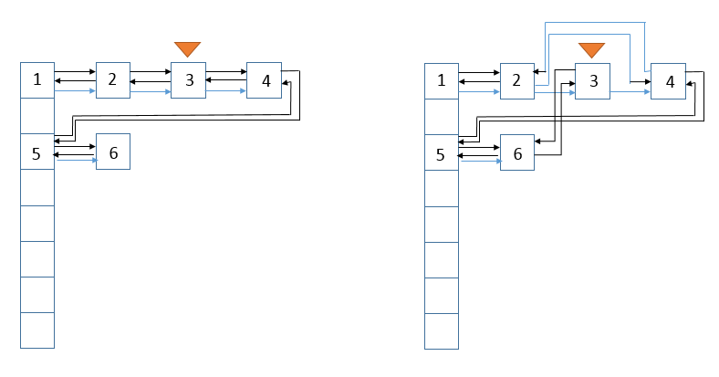
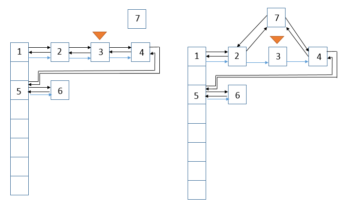

**一、前言**

前面我们已经分析了HashMap的源码，已经知道了HashMap可以用在哪种场合，如果这样一种情形，我们需要按照元素插入的顺序来访问元素，此时，LinkedHashMap就派上用场了，它保存着元素插入的顺序，并且可以按照我们插入的顺序进行访问。

**二、LinkedHashMap用法**

    
    
     import java.util.Map;
    import java.util.LinkedHashMap;
    
    public class Test {
        public static void main(String[] args) {
            Map<String, String> maps = new LinkedHashMap<String, String>();
            maps.put("aa", "aa");
            maps.put("bb", "bb");
            maps.put("cc", "cc");
            
            for (Map.Entry entry : maps.entrySet()) {
                System.out.println(entry.getKey() + " : " + entry.getValue());
            }
        }
    }

View Code

说明：以上是展示LInkedHashMap简单用法的一个示例，可以看到它确实按照元素插入的顺序进行访问，保持了元素的插入顺序。更具体的用户可以去参照API。

**三、LinkedHashMap数据结构**

说明：LinkedHashMap会将元素串起来，形成一个双链表结构。可以看到，其结构在HashMap结构上增加了链表结构。数据结构为（数组 + 单链表 +
红黑树 + 双链表），图中的标号是结点插入的顺序。

**四、LinkedHashMap源码分析**

其实，在分析了HashMap的源码之后，我们来分析LinkedHashMap的源码就会容易很多，因为LinkedHashMap是在HashMap基础上进行了扩展，我们需要注意的就是两者不同的地方。

4.1 类的继承关系

    
    
    public class LinkedHashMap<K,V>  extends HashMap<K,V> implements Map<K,V>

说明：LinkedHashMap继承了HashMap，所以HashMap的一些方法或者属性也会被继承；同时也实现了Map结构，关于HashMap类与Map接口，我们之前已经分析过，不再累赘。

4.2 类的属性

    
    
    public class LinkedHashMap<K,V>  extends HashMap<K,V> implements Map<K,V> {
        static class Entry<K,V> extends HashMap.Node<K,V> {
            Entry<K,V> before, after;
            Entry(int hash, K key, V value, Node<K,V> next) {
                super(hash, key, value, next);
            }
        }
        // 版本序列号
        private static final long serialVersionUID = 3801124242820219131L;
    
        // 链表头结点
        transient LinkedHashMap.Entry<K,V> head;
    
        // 链表尾结点
        transient LinkedHashMap.Entry<K,V> tail;
    
        // 访问顺序
        final boolean accessOrder;
    }

View Code

说明：由于继承HashMap，所以HashMap中的非private方法和字段，都可以在LinkedHashMap直接中访问。

4.3 类的构造函数

1\. LinkedHashMap(int, float)型构造函数

    
    
    public LinkedHashMap(int initialCapacity, float loadFactor) {
            super(initialCapacity, loadFactor);
            accessOrder = false;
    }

View Code

说明：总是会在构造函数的第一行调用父类构造函数，使用super关键字，accessOrder默认为false，access为true表示之后访问顺序按照元素的访问顺序进行，即不按照之前的插入顺序了，access为false表示按照插入顺序访问。

2\. LinkedHashMap(int)型构造函数

    
    
    public LinkedHashMap(int initialCapacity) {
            super(initialCapacity);
            accessOrder = false;
    }

View Code

3\. LinkedHashMap()型构造函数

    
    
    public LinkedHashMap() {
            super();
            accessOrder = false;
    }

View Code

4\. LinkedHashMap(Map<? extends K, ? extends V>)型构造函数

    
    
    public LinkedHashMap(Map<? extends K, ? extends V> m) {
        super();
        accessOrder = false;
        putMapEntries(m, false);
    }

View Code

说明：putMapEntries是调用到父类HashMap的函数

5\. LinkedHashMap(int, float, boolean)型构造函数

    
    
    public LinkedHashMap(int initialCapacity,
                             float loadFactor,
                             boolean accessOrder) {
        super(initialCapacity, loadFactor);
        this.accessOrder = accessOrder;
    }

View Code

说明：可以指定accessOrder的值，从而控制访问顺序。

4.4 类的重要函数分析

1\. newNode函数

    
    
    // 当桶中结点类型为HashMap.Node类型时，调用此函数
    Node<K,V> newNode(int hash, K key, V value, Node<K,V> e) {
        // 生成Node结点
        LinkedHashMap.Entry<K,V> p =
            new LinkedHashMap.Entry<K,V>(hash, key, value, e);
        // 将该结点插入双链表末尾
        linkNodeLast(p);
        return p;
    }

View Code

说明：此函数在HashMap类中也有实现，LinkedHashMap重写了该函数，所以当实际对象为LinkedHashMap，桶中结点类型为Node时，我们调用的是LinkedHashMap的newNode函数，而非HashMap的函数，newNode函数会在调用put函数时被调用。可以看到，除了新建一个结点之外，还把这个结点链接到双链表的末尾了，这个操作维护了插入顺序。

其中LinkedHashMap.Entry继承自HashMap.Node

    
    
    static class Entry<K,V> extends HashMap.Node<K,V> {
        // 前后指针
        Entry<K,V> before, after;
        Entry(int hash, K key, V value, Node<K,V> next) {
            super(hash, key, value, next);
        }
    }

View Code

说明：在HashMap.Node基础上增加了前后两个指针域，注意，HashMap.Node中的next域也存在。

2\. newTreeNode函数

    
    
    // 当桶中结点类型为HashMap.TreeNode时，调用此函数
    TreeNode<K,V> newTreeNode(int hash, K key, V value, Node<K,V> next) {
        // 生成TreeNode结点
        TreeNode<K,V> p = new TreeNode<K,V>(hash, key, value, next);
        // 将该结点插入双链表末尾
        linkNodeLast(p);
        return p;
    }

View Code

说明：当桶中结点类型为TreeNode时候，插入结点时调用的此函数，也会链接到末尾。

3. afterNodeAccess函数 

    
    
    void afterNodeAccess(Node<K,V> e) { // move node to last
        LinkedHashMap.Entry<K,V> last;
        // 若访问顺序为true，且访问的对象不是尾结点
        if (accessOrder && (last = tail) != e) {
            // 向下转型，记录p的前后结点
            LinkedHashMap.Entry<K,V> p =
                (LinkedHashMap.Entry<K,V>)e, b = p.before, a = p.after;
            // p的后结点为空
            p.after = null;
            // 如果p的前结点为空
            if (b == null)
                // a为头结点
                head = a;
            else // p的前结点不为空
                // b的后结点为a
                b.after = a;
            // p的后结点不为空
            if (a != null)
                // a的前结点为b
                a.before = b;
            else // p的后结点为空
                // 后结点为最后一个结点
                last = b;
            // 若最后一个结点为空
            if (last == null)
                // 头结点为p
                head = p;
            else { // p链入最后一个结点后面
                p.before = last;
                last.after = p;
            }
            // 尾结点为p
            tail = p;
            // 增加结构性修改数量
            ++modCount;
        }
    }

View Code

说明：此函数在很多函数（如put）中都会被回调，LinkedHashMap重写了HashMap中的此函数。若访问顺序为true，且访问的对象不是尾结点，则下面的图展示了访问前和访问后的状态，假设访问的结点为结点3

说明：从图中可以看到，结点3链接到了尾结点后面。

4\. transferLinks函数

    
    
    // 用dst替换src
    private void transferLinks(LinkedHashMap.Entry<K,V> src,
                                   LinkedHashMap.Entry<K,V> dst) {
        LinkedHashMap.Entry<K,V> b = dst.before = src.before;
        LinkedHashMap.Entry<K,V> a = dst.after = src.after;
        if (b == null)
            head = dst;
        else
            b.after = dst;
        if (a == null)
            tail = dst;
        else
            a.before = dst;
    }

View Code

说明：此函数用dst结点替换结点，示意图如下

说明：其中只考虑了before与after域，并没有考虑next域，next会在调用tranferLinks函数中进行设定。

5\. containsValue函数

    
    
    public boolean containsValue(Object value) {
        // 使用双链表结构进行遍历查找
        for (LinkedHashMap.Entry<K,V> e = head; e != null; e = e.after) {
            V v = e.value;
            if (v == value || (value != null && value.equals(v)))
                return true;
        }
        return false;
    }

View Code

说明：containsValue函数根据双链表结构来查找是否包含value，是按照插入顺序进行查找的，与HashMap中的此函数查找方式不同，HashMap是使用按照桶遍历，没有考虑插入顺序。

**五、总结**

在HashMap的基础上分析LinkedHashMap会容易很多，读源码好处多多，有时间的话，园友们也可以读读源码，感受一下来自java设计者的智慧。谢谢观看~

