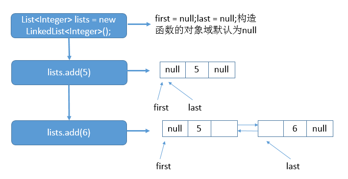

**一、前言**

在分析了ArrayList了之后，紧接着必须要分析它的同胞兄弟：LinkedList，LinkedList与ArrayList在底层的实现上有所不同，其实，只要我们有数据结构的基础，在分析源码的时候就会很简单，下面进入正题，LinkedList源码分析。

**二、LinkedList数据结构**

还是老规矩，先抓住LinkedList的核心部分：数据结构，其数据结构如下

说明：如上图所示，LinkedList底层使用的双向链表结构，有一个头结点和一个尾结点，双向链表意味着我们可以从头开始正向遍历，或者是从尾开始逆向遍历，并且可以针对头部和尾部进行相应的操作。

**三、LinkedList源码分析**

3.1 类的继承关系

    
    
    public class LinkedList<E>
        extends AbstractSequentialList<E>
        implements List<E>, Deque<E>, Cloneable, java.io.Serializable

说明：LinkedList的类继承结构很有意思，我们着重要看是Deque接口，Deque接口表示是一个双端队列，那么也意味着LinkedList是双端队列的一种实现，所以，基于双端队列的操作在LinkedList中全部有效。

3.2 类的内部类

    
    
        private static class Node<E> {
            E item; // 数据域
            Node<E> next; // 后继
            Node<E> prev; // 前驱
            
            // 构造函数，赋值前驱后继
            Node(Node<E> prev, E element, Node<E> next) {
                this.item = element;
                this.next = next;
                this.prev = prev;
            }
        }

View Code

说明：内部类Node就是实际的结点，用于存放实际元素的地方。

3.3 类的属性

    
    
    public class LinkedList<E>
        extends AbstractSequentialList<E>
        implements List<E>, Deque<E>, Cloneable, java.io.Serializable
    {
        // 实际元素个数
        transient int size = 0;
        // 头结点
        transient Node<E> first;
        // 尾结点
        transient Node<E> last;
    }    

View Code

说明：LinkedList的属性非常简单，一个头结点、一个尾结点、一个表示链表中实际元素个数的变量。注意，头结点、尾结点都有transient关键字修饰，这也意味着在序列化时该域是不会序列化的。

3.4 类的构造函数

1\. LinkedList()型构造函数

    
    
    public LinkedList() {
    }

View Code

2\. LinkedList(Collection<? extends E>)型构造函数

    
    
        public LinkedList(Collection<? extends E> c) {
            // 调用无参构造函数
            this();
            // 添加集合中所有的元素
            addAll(c);
        }

View Code

说明：会调用无参构造函数，并且会把集合中所有的元素添加到LinkedList中。

3.5 核心函数分析

1\. add函数

    
    
        public boolean add(E e) {
            // 添加到末尾
            linkLast(e);
            return true;
        }

View Code

说明：add函数用于向LinkedList中添加一个元素，并且添加到链表尾部。具体添加到尾部的逻辑是由linkLast函数完成的。

    
    
        void linkLast(E e) {
            // 保存尾结点，l为final类型，不可更改
            final Node<E> l = last;
            // 新生成结点的前驱为l,后继为null
            final Node<E> newNode = new Node<>(l, e, null);
            // 重新赋值尾结点
            last = newNode;    
            if (l == null) // 尾结点为空
                first = newNode; // 赋值头结点
            else // 尾结点不为空
                l.next = newNode; // 尾结点的后继为新生成的结点
            // 大小加1    
            size++;
            // 结构性修改加1
            modCount++;
        }

View Code

说明：对于添加一个元素至链表中会调用add方法 -> linkLast方法。

对于添加元素的情况我们使用如下示例进行说明

示例一代码如下（只展示了核心代码）

    
    
    List<Integer> lists = new LinkedList<Integer>();
    lists.add(5);
    lists.add(6);

说明：首先调用无参构造函数，之后添加元素5，之后再添加元素6。具体的示意图如下：

说明：上图的表明了在执行每一条语句后，链表对应的状态。

2\. addAll函数

addAll有两个重载函数，addAll(Collection<? extends E>)型和addAll(int, Collection<?
extends E>)型，我们平时习惯调用的addAll(Collection<? extends E>)型会转化为addAll(int,
Collection<? extends E>)型，所以我们着重分析此函数即可。

    
    
    // 添加一个集合
        public boolean addAll(int index, Collection<? extends E> c) {
            // 检查插入的的位置是否合法
            checkPositionIndex(index);
            // 将集合转化为数组
            Object[] a = c.toArray();
            // 保存集合大小
            int numNew = a.length;
            if (numNew == 0) // 集合为空，直接返回
                return false;
    
            Node<E> pred, succ; // 前驱，后继
            if (index == size) { // 如果插入位置为链表末尾，则后继为null，前驱为尾结点
                succ = null;
                pred = last;
            } else { // 插入位置为其他某个位置
                succ = node(index); // 寻找到该结点
                pred = succ.prev; // 保存该结点的前驱
            }
    
            for (Object o : a) { // 遍历数组
                @SuppressWarnings("unchecked") E e = (E) o; // 向下转型
                // 生成新结点
                Node<E> newNode = new Node<>(pred, e, null);
                if (pred == null) // 表示在第一个元素之前插入(索引为0的结点)
                    first = newNode;
                else
                    pred.next = newNode;
                pred = newNode;
            }
    
            if (succ == null) { // 表示在最后一个元素之后插入
                last = pred;
            } else {
                pred.next = succ;
                succ.prev = pred;
            }
            // 修改实际元素个数
            size += numNew;
            // 结构性修改加1
            modCount++;
            return true;
        }

View Code

说明：参数中的index表示在索引下标为index的结点（实际上是第index +
1个结点）的前面插入。在addAll函数中，addAll函数中还会调用到node函数，get函数也会调用到node函数，此函数是根据索引下标找到该结点并返回，具体代码如下

    
    
        Node<E> node(int index) {
            // 判断插入的位置在链表前半段或者是后半段
            if (index < (size >> 1)) { // 插入位置在前半段
                Node<E> x = first; 
                for (int i = 0; i < index; i++) // 从头结点开始正向遍历
                    x = x.next;
                return x; // 返回该结点
            } else { // 插入位置在后半段
                Node<E> x = last; 
                for (int i = size - 1; i > index; i--) // 从尾结点开始反向遍历
                    x = x.prev;
                return x; // 返回该结点
            }
        }

View Code

说明：在根据索引查找结点时，会有一个小优化，结点在前半段则从头开始遍历，在后半段则从尾开始遍历，这样就保证了只需要遍历最多一半结点就可以找到指定索引的结点。

下面通过示例来更深入了解调用addAll函数后的链表状态。

    
    
    List<Integer> lists = new LinkedList<Integer>();
    lists.add(5);
    lists.addAll(0, Arrays.asList(2, 3, 4, 5));

上述代码内部的链表结构如下：

3\. unlink函数

在调用remove移除结点时，会调用到unlink函数，unlink函数具体如下：

    
    
        E unlink(Node<E> x) {
            // 保存结点的元素
            final E element = x.item;
            // 保存x的后继
            final Node<E> next = x.next;
            // 保存x的前驱
            final Node<E> prev = x.prev;
            
            if (prev == null) { // 前驱为空，表示删除的结点为头结点
                first = next; // 重新赋值头结点
            } else { // 删除的结点不为头结点
                prev.next = next; // 赋值前驱结点的后继
                x.prev = null; // 结点的前驱为空，切断结点的前驱指针
            }
    
            if (next == null) { // 后继为空，表示删除的结点为尾结点
                last = prev; // 重新赋值尾结点
            } else { // 删除的结点不为尾结点
                next.prev = prev; // 赋值后继结点的前驱
                x.next = null; // 结点的后继为空，切断结点的后继指针
            }
    
            x.item = null; // 结点元素赋值为空
            // 减少元素实际个数
            size--; 
            // 结构性修改加1
            modCount++;
            // 返回结点的旧元素
            return element;
        }

View Code

说明：将指定的结点从链表中断开，不再累赘。

**四、针对LinkedList的思考**

1\. 对addAll函数的思考

在addAll函数中，传入一个集合参数和插入位置，然后将集合转化为数组，然后再遍历数组，挨个添加数组的元素，但是问题来了，为什么要先转化为数组再进行遍历，而不是直接遍历集合呢？从效果上两者是完全等价的，都可以达到遍历的效果。关于为什么要转化为数组的问题，我的思考如下：1.
如果直接遍历集合的话，那么在遍历过程中需要插入元素，在堆上分配内存空间，修改指针域，这个过程中就会一直占用着这个集合，考虑正确同步的话，其他线程只能一直等待。2.
如果转化为数组，只需要遍历集合，而遍历集合过程中不需要额外的操作，所以占用的时间相对是较短的，这样就利于其他线程尽快的使用这个集合。说白了，就是有利于提高多线程访问该集合的效率，尽可能短时间的阻塞。

**五、总结**

分析完了LinkedList源码，其实很简单，值得注意的是LinkedList可以作为双端队列使用，这也是队列结构在Java中一种实现，当需要使用队列结构时，可以考虑LinkedList。谢谢各位园友观看~

