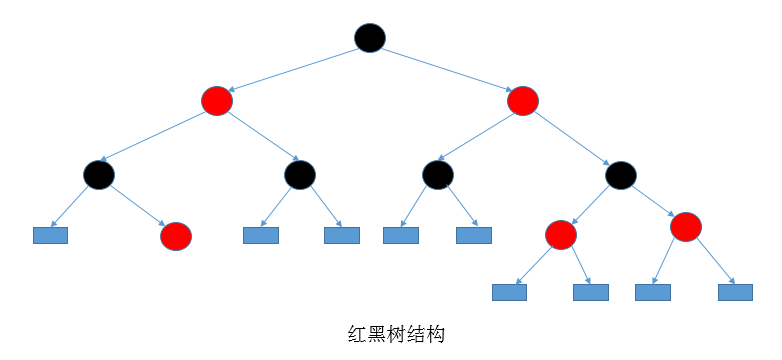
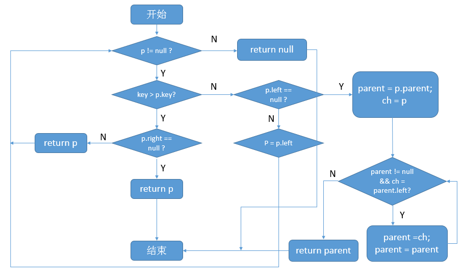

##【集合框架】JDK1.8源码分析之TreeMap（五）

##
##一、前言

##
##　　当我们需要把插入的元素进行排序的时候，就是时候考虑TreeMap了，从名字上来看，TreeMap肯定是和树是脱不了干系的，它是一个排序了的Map,下面我们来着重分析其源码，理解其底层如何实现排序功能。下面，开始分析。

##
##二、TreeMap示例
  

	import java.util.TreeMap;
import java.util.Map;

public class TreeMapTest {
    public static void main(String[] args) {
        Map<String, String> maps = new TreeMap<String, String>();
        maps.put("aa", "aa");
        maps.put("cc", "cc");
        maps.put("bb", "bb");
        
        for (Map.Entry<String, String> entry : maps.entrySet()) {
            System.out.println(entry.getKey() + " : " + entry.getValue());
        	}
    	}
	}

View Code

##
##　　运行结果：

##
##　　aa : aa　　bb : bb　　cc : cc

##
##　　说明：从输出结果可以看到TreeMap对插入的元素进行了排序。

##
##三、TreeMap数据结构

##
##　　TreeMap底层使用的数据结构是红黑树，有印象的的读者，应该知道我们在分析HashMap的时候就已经接触到了红黑树结构，只是没有对红黑树进行详细的分析，现在，笔者也并不打算对红黑树做太过仔细的分析，因为笔者之后会出数据结构的专题（先挖个坑），到时候再来一睹各种数据结构的风采。

##
##　　 

##
##　　说明：上图为典型的红黑树结构，效率很高，具体的细节问题，我们以后详谈。

##
##四、TreeMap源码分析

##
##　　4.1 类的继承关系　　

	public class TreeMap<K,V>
    extends AbstractMap<K,V>
    implements NavigableMap<K,V>, Cloneable, java.io.Serializable


##
##　　说明：继承了抽象类AbstractMap，AbstractMap实现了Map接口，实现了部分方法。不能进行实例化，实现了NavigableMap,Cloneable,Serializable接口，其中NavigableMap是继承自SortedMap的接口，定义了一系列规范。

##
##　　4.2 类的属性　
  

	public class TreeMap<K,V>
    extends AbstractMap<K,V>
    implements NavigableMap<K,V>, Cloneable, java.io.Serializable
{
    // 比较器，用于控制Map中的元素顺序
    private final Comparator<? super K> comparator;
    // 根节点
    private transient Entry<K,V> root;
    // 树中结点个数
    private transient int size = 0;
    // 对树进行结构性修改的次数
    private transient int modCount = 0;
	}

View Code

##
##　　说明：重点是比较器Comparator，此接口实现了对插入元素进行排序。

##
##　　4.3 类的构造函数

##
##　　1. TreeMap()型构造函数
  

	public TreeMap() {
        // 无用户自定义比较器
        comparator = null;
    	}

View Code

##
##　　2. TreeMap(Comparator<? super K>)型构造函数　　
  

	// 自定义了比较器
    public TreeMap(Comparator<? super K> comparator) {
        this.comparator = comparator;
    	}

View Code

##
##　　说明：用户自定义了比较器，可以按照用户的逻辑进行比较，确定元素的访问顺序。

##
##　　3. TreeMap(Map<? extends K, ? extends V>)型构造函数　　
  

	// 从已有map中构造TreeMap
    public TreeMap(Map<? extends K, ? extends V> m) {
        comparator = null;
        putAll(m);
    	}

View Code

##
##　　说明：根据已有的Map构造TreeMap。

##
##　　4. TreeMap(SortedMap<K, ? extends V>)型构造函数　　
  

	// 从SortedMap中构造TreeMap,有比较器
    public TreeMap(SortedMap<K, ? extends V> m) {
        comparator = m.comparator();
        try {
            buildFromSorted(m.size(), m.entrySet().iterator(), null, null);
        	} catch (java.io.IOException cannotHappen) {
        	} catch (ClassNotFoundException cannotHappen) {
        	}
    	}

View Code

##
##　　说明：传入SortedMap型参数，实现SortedMap接口的类都会实现comparator方法，用于返回比较器。

##
##　　4.4 核心函数分析

##
##　　1. put函数
  

	public V put(K key, V value) {
        // 记录根节点
        Entry<K,V> t = root;
        // 根节点为空
        if (t == null) {
            // 比较key
            compare(key, key); // type (and possibly null) check
            // 新生根节点
            root = new Entry<>(key, value, null);
            // 大小加1
            size = 1;
            // 修改次数加1
            modCount++;
            return null;
        	}
        int cmp;
        Entry<K,V> parent;
        // 获取比较器
        Comparator<? super K> cpr = comparator;
        // 比较器不为空
        if (cpr != null) {
            // 找到元素合适的插入位置
            do {
                // parent赋值
                parent = t;
                // 比较key与元素的key值，在Comparator类的compare方法中可以实现我们自己的比较逻辑
                cmp = cpr.compare(key, t.key);
                // 小于结点key值，向左子树查找
                if (cmp < 0)
                    t = t.left;
                // 大于结点key值，向右子树查找
                else if (cmp > 0)
                    t = t.right;
                // 表示相等，直接更新结点的值
                else
                    return t.setValue(value);
            	} while (t != null);
        	}
        // 比较器为空
        else {
            // key为空，抛出异常
            if (key == null)
                throw new NullPointerException();
            @SuppressWarnings("unchecked")
                // 取得K实现的比较器
                Comparable<? super K> k = (Comparable<? super K>) key;
            // 寻找元素插入位置
            do {
                parent = t;
                cmp = k.compareTo(t.key);
                if (cmp < 0)
                    t = t.left;
                else if (cmp > 0)
                    t = t.right;
                else
                    return t.setValue(value);
            	} while (t != null);
        	}
        // 新生一个结点
        Entry<K,V> e = new Entry<>(key, value, parent);
        // 根据比较结果决定存为左结点或右结点
        if (cmp < 0)
            parent.left = e;
        else
            parent.right = e;
        // 插入后进行修正
        fixAfterInsertion(e);
        // 大小加1
        size++;
        // 进行了结构性修改
        modCount++;
        return null;
    	}

View Code

##
##　　说明：插入一个元素时，若用户自定义比较器，则会按照用户自定义的逻辑确定元素的插入位置，否则，将会使用K自身实现的比较器确定插入位置。

##
##　　2. getEntry函数　　
  

	final Entry<K,V> getEntry(Object key) {
        // 判断比较器是否为空
        if (comparator != null)
            // 根据自定义的比较器来返回结果
            return getEntryUsingComparator(key);
        // 比较器为空
        // key为空，抛出异常
        if (key == null)
            throw new NullPointerException();
        @SuppressWarnings("unchecked")
            // 取得K自身实现了比较接口
            Comparable<? super K> k = (Comparable<? super K>) key;
        Entry<K,V> p = root;
        // 根据Comparable接口的compareTo函数来查找元素
        while (p != null) {
            int cmp = k.compareTo(p.key);
            if (cmp < 0)
                p = p.left;
            else if (cmp > 0)
                p = p.right;
            else
                return p;
        	}
        return null;
    	}

View Code

##
##　　说明：当我们调用get函数时，实际上是委托getEntry函数获取元素，对于用户自定义实现的Comparator比较器而言，是使用getEntryUsingComparator函数来完成获取逻辑。

##
##　　具体代码如下
  

	final Entry<K,V> getEntryUsingComparator(Object key) {
        @SuppressWarnings("unchecked")
            // 向下转型
            K k = (K) key;
        // 取得比较器
        Comparator<? super K> cpr = comparator;
        // 比较器不为空
        if (cpr != null) {
            Entry<K,V> p = root;
            // 开始遍历树节点找到对应的结点
            while (p != null) {
                int cmp = cpr.compare(k, p.key);
                // 小于结点key值，向左子树查找
                if (cmp < 0)
                    p = p.left;
                // 大于结点key值，向右子树查找
                else if (cmp > 0)
                    p = p.right;
                // 相等，找到，直接返回
                else
                    return p;
            	}
        	}
        return null;
    	}

View Code

##
##　　说明：会根据用户定义在compare函数里面的逻辑进行元素的查找。

##
##　　3. deleteEntry函数　
  

	private void deleteEntry(Entry<K,V> p) {
        // 结构性修改
        modCount++;
        // 大小减1
        size--;
        // p的左右子结点均不为空
        if (p.left != null &amp;&amp; p.right != null) {
            // 找到p结点的后继
            Entry<K,V> s = successor(p);
            // 将p的值用其后继结点的key-value替换，并且用s指向其后继
            p.key = s.key;
            p.value = s.value;
            p = s;
        	} 

        // 开始进行修正，具体的修正过程我们会在之后的数据结构专区进行讲解
        // 现在可以看成是为了保持红黑树的特性，提高性能
        Entry<K,V> replacement = (p.left != null ? p.left : p.right);

        if (replacement != null) {
            // Link replacement to parent
            replacement.parent = p.parent;
            if (p.parent == null)
                root = replacement;
            else if (p == p.parent.left)
                p.parent.left  = replacement;
            else
                p.parent.right = replacement;

            // Null out links so they are OK to use by fixAfterDeletion.
            p.left = p.right = p.parent = null;

            // Fix replacement
            if (p.color == BLACK)
                fixAfterDeletion(replacement);
        	} else if (p.parent == null) { // return if we are the only node.
            root = null;
        	} else { //  No children. Use self as phantom replacement and unlink.
            if (p.color == BLACK)
                fixAfterDeletion(p);

            if (p.parent != null) {
                if (p == p.parent.left)
                    p.parent.left = null;
                else if (p == p.parent.right)
                    p.parent.right = null;
                p.parent = null;
            	}
        	}
    	}

View Code

##
##　　说明：deleteEntry函数会在remove函数中被调用，它完成了移除元素的主要工作，删除该结点后会对红黑树进行修正，此部分内容以后会详细讲解，同时，在此函数中需要调用successor函数，即找到该结点的后继结点。具体函数代码如下　
  

	// 找到后继
    static <K,V> TreeMap.Entry<K,V> successor(Entry<K,V> t) {
        // t为null，直接返回null
        if (t == null)
            return null;
        // 右孩子不为空
        else if (t.right != null) {
            // 找到右孩子的最底层的左孩子，返回
            Entry<K,V> p = t.right;
            while (p.left != null)
                p = p.left;
            return p;
        	} else { // 右孩子为空
            // 保存t的父节点
            Entry<K,V> p = t.parent;
            // 保存t结点
            Entry<K,V> ch = t;
            // 进行回溯，找到后继，直到p == null || ch != p.right
            while (p != null &amp;&amp; ch == p.right) {
                ch = p;
                p = p.parent;
            	}
            return p;
        	}
    	}

View Code

##
##　　说明：当结点的右子树为空的时候，进行回溯可以找到该结点的后继结点。

##
##五、问题扩展

##
##　　1. 如何找到小于指定结点的最大结点？参考getLowerEntry函数源码

##
##　　2. 如何找到大于指定结点的最小结点？参考getHigherEntry函数源码　

##
##　　对getLowerEntry源码分析如下　
  

	final Entry<K,V> getLowerEntry(K key) {
        // 保存根节点
        Entry<K,V> p = root;
        // 根节点不为空
        while (p != null) {
            // 比较该key与节点的key
            int cmp = compare(key, p.key);
            if (cmp > 0) { // 如果该key大于结点的key
                // 如果结点的右子树不为空，与该结点右结点进行比较
                if (p.right != null)
                    p = p.right;
                else // 右子树为空，则直接返回结点；因为此时已经没有比该结点key更大的结点了(右子树为空)
                    return p;
            	} else { // 如果该key小于等于结点的key
                // 结点的左子树不为空，与该结点的左结点进行比较
                if (p.left != null) { 
                    p = p.left;
                	} else { // 结点的左子树不为空，则开始进行回溯
                    Entry<K,V> parent = p.parent;
                    Entry<K,V> ch = p;
                    while (parent != null &amp;&amp; ch == parent.left) {
                        ch = parent;
                        parent = parent.parent;
                    	}
                    return parent;
                	}
            	}
        	}
        return null;
    	}

View Code

##
##　　流程图如下：

##
##　　 　　

##
##　　getHigherEntry则可以以此类推。

##
##六、总结

##
##　　由TreeMap我们可以知道其底层的数据结构为红黑树，并且可以使用用户自定义的比较器来实现比较逻辑。对于其核心函数的分析就到此为止了，谢谢各位园友的观看~

##
##

##
##　　