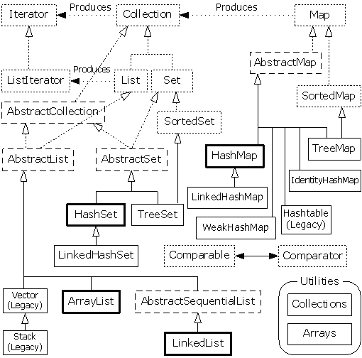

##【集合框架】Java集合框架综述

##
##一、前言

##
##　　现笔者打算做关于Java集合框架的教程，具体是打算分析Java源码，因为平时在写程序的过程中用Java集合特别频繁，但是对于里面一些具体的原理还没有进行很好的梳理，所以拟从源码的角度去熟悉梳理具体类的原理和其中的数据结构。分析源码的好处总结如下三条：

##
##　　1. 提升自身代码水平及写代码能力。

##
##　　2. 可以顺带温习数据结构知识点。

##
##　　3. 以后写代码遇到问题时能够找到最佳的解决办法

##
##二、集合框架图

##
##　　做一件事情时，首先一定要有做事情的总体方法，然后再去抠细节。我们肯定要来看看集合的总体框架图，也好对集合框架有一个很感性的认识。下图展示了Java整个集合框架（没有包括并发），如果不出意外的话，以后也会出并发方面的专题分析，我们从表及里，由浅入深，慢慢来。

##
##　　 

##
##　　说明：对于以上的框架图有如下几点说明

##
##　　1. 集合接口：6个接口（短虚线表示），表示不同集合类型，是集合框架的基础。
　　2. 抽象类：5个抽象类（长虚线表示），对集合接口的部分实现。可扩展为自定义集合类。
　　3. 实现类：8个实现类（实线表示），对接口的具体实现。
　　4. Collection 接口是一组允许重复的对象。　　5. Set 接口继承 Collection，集合元素不重复。
　　6. List 接口继承 Collection，允许重复，维护元素插入顺序。
　　7. Map接口是键－值对象，与Collection接口没有什么关系。

##
##三、接口说明

##
##　　3.1. Collection接口

##
##　　除了Map接口，其他集合都是Collection的子类，并且在我们的实际编程中，由于多态的原因，我们一般都会使用这个的编码方式，如：Inter i1 = new ImplementInter();(其中，Inter表示一个接口，ImplementInter表示对此接口的实现)，此时i1调用的方法只能是Inter接口中的方法，无法调用ImplementInter中新增的方法（除非进行向下类型转化）。所以，很有必要了解一下Collection根接口中都有哪些方法。
  

	public interface Collection<E> extends Iterable<E> {
    int size();
    boolean isEmpty();
    boolean contains(Object o);
    Iterator<E> iterator();
    Object[] toArray();
    <T> T[] toArray(T[] a);
    boolean add(E e);
    boolean remove(Object o);
    boolean containsAll(Collection<?> c);
    boolean addAll(Collection<? extends E> c);
    boolean removeAll(Collection<?> c);
    boolean retainAll(Collection<?> c);
    void clear();
    boolean equals(Object o);
    int hashCode();

    // jdk1.8添加的方法
    default boolean removeIf(Predicate<? super E> filter) {
        Objects.requireNonNull(filter);
        boolean removed = false;
        final Iterator<E> each = iterator();
        while (each.hasNext()) {
            if (filter.test(each.next())) {
                each.remove();
                removed = true;
            	}
        	}
        return removed;
    	}
    @Override
    default Spliterator<E> spliterator() {
        return Spliterators.spliterator(this, 0);
    	}
    default Stream<E> stream() {
        return StreamSupport.stream(spliterator(), false);
    	}
    default Stream<E> parallelStream() {
        return StreamSupport.stream(spliterator(), true);
    	}
	}

View Code

##
##说明：

##
##　　1. 其中在jdk1.8后添加的方法对我们的分析不会产生影响，添加的方法有关键字default修饰，为缺省方法，是一个新特性。

##
##　　2. 对集合而言，都会包含添加、删除、判断、清空、大小等基本操作。

##
##　　3.2. Map接口

##
##　　对于Map接口而言，是键值对集合，特别适用于那种情形，一个主属性，另外一个副属性（如：姓名，性别；leesf,男），添加元素时，若存在相同的键，则会用新值代替旧值。方法如下　
  

	public interface Map<K,V> {
    int size();
    boolean isEmpty();
    boolean containsKey(Object key);
    boolean containsValue(Object value);
    V get(Object key);
    V put(K key, V value);
    V remove(Object key);
    void putAll(Map<? extends K, ? extends V> m);
    void clear();
    Set<K> keySet();
    Collection<V> values();
    Set<Map.Entry<K, V>> entrySet();
    interface Entry<K,V> {
        K getKey();
        V getValue();
        V setValue(V value);
        boolean equals(Object o);
        int hashCode();
    
        // jdk1.8 后添加的方法
        public static <K extends Comparable<? super K>, V> Comparator<Map.Entry<K,V>> comparingByKey() {
            return (Comparator<Map.Entry<K, V>> &amp; Serializable)
                (c1, c2) -> c1.getKey().compareTo(c2.getKey());
        	}
        public static <K, V extends Comparable<? super V>> Comparator<Map.Entry<K,V>> comparingByValue() {
            return (Comparator<Map.Entry<K, V>> &amp; Serializable)
                (c1, c2) -> c1.getValue().compareTo(c2.getValue());
        	}
        public static <K, V> Comparator<Map.Entry<K, V>> comparingByKey(Comparator<? super K> cmp) {
            Objects.requireNonNull(cmp);
            return (Comparator<Map.Entry<K, V>> &amp; Serializable)
                (c1, c2) -> cmp.compare(c1.getKey(), c2.getKey());
        	}
        public static <K, V> Comparator<Map.Entry<K, V>> comparingByValue(Comparator<? super V> cmp) {
            Objects.requireNonNull(cmp);
            return (Comparator<Map.Entry<K, V>> &amp; Serializable)
                (c1, c2) -> cmp.compare(c1.getValue(), c2.getValue());
        	}
    	}
    boolean equals(Object o);
    int hashCode();

    default V getOrDefault(Object key, V defaultValue) {
        V v;
        return (((v = get(key)) != null) || containsKey(key))? v: defaultValue;
    	}
    
    default void forEach(BiConsumer<? super K, ? super V> action) {
        Objects.requireNonNull(action);
        for (Map.Entry<K, V> entry : entrySet()) {
            K k;
            V v;
            try {
                k = entry.getKey();
                v = entry.getValue();
            	} catch(IllegalStateException ise) {
                // this usually means the entry is no longer in the map.
                throw new ConcurrentModificationException(ise);
            	}
            action.accept(k, v);
        	}
    	}
    default void replaceAll(BiFunction<? super K, ? super V, ? extends V> function) {
        Objects.requireNonNull(function);
        for (Map.Entry<K, V> entry : entrySet()) {
            K k;
            V v;
            try {
                k = entry.getKey();
                v = entry.getValue();
            	} catch(IllegalStateException ise) {
                // this usually means the entry is no longer in the map.
                throw new ConcurrentModificationException(ise);
            	}

            // ise thrown from function is not a cme.
            v = function.apply(k, v);

            try {
                entry.setValue(v);
            	} catch(IllegalStateException ise) {
                // this usually means the entry is no longer in the map.
                throw new ConcurrentModificationException(ise);
            	}
        	}
    	}
    default V putIfAbsent(K key, V value) {
        V v = get(key);
        if (v == null) {
            v = put(key, value);
        	}

        return v;
    	}
    default boolean remove(Object key, Object value) {
        Object curValue = get(key);
        if (!Objects.equals(curValue, value) ||
            (curValue == null &amp;&amp; !containsKey(key))) {
            return false;
        	}
        remove(key);
        return true;
    	}
    default boolean replace(K key, V oldValue, V newValue) {
        Object curValue = get(key);
        if (!Objects.equals(curValue, oldValue) ||
            (curValue == null &amp;&amp; !containsKey(key))) {
            return false;
        	}
        put(key, newValue);
        return true;
    	}
    default V replace(K key, V value) {
        V curValue;
        if (((curValue = get(key)) != null) || containsKey(key)) {
            curValue = put(key, value);
        	}
        return curValue;
    	}
    default V computeIfAbsent(K key,
            Function<? super K, ? extends V> mappingFunction) {
        Objects.requireNonNull(mappingFunction);
        V v;
        if ((v = get(key)) == null) {
            V newValue;
            if ((newValue = mappingFunction.apply(key)) != null) {
                put(key, newValue);
                return newValue;
            	}
        	}

        return v;
    	}
    default V computeIfPresent(K key,
            BiFunction<? super K, ? super V, ? extends V> remappingFunction) {
        Objects.requireNonNull(remappingFunction);
        V oldValue;
        if ((oldValue = get(key)) != null) {
            V newValue = remappingFunction.apply(key, oldValue);
            if (newValue != null) {
                put(key, newValue);
                return newValue;
            	} else {
                remove(key);
                return null;
            	}
        	} else {
            return null;
        	}
    	}
    default V compute(K key,
            BiFunction<? super K, ? super V, ? extends V> remappingFunction) {
        Objects.requireNonNull(remappingFunction);
        V oldValue = get(key);

        V newValue = remappingFunction.apply(key, oldValue);
        if (newValue == null) {
            // delete mapping
            if (oldValue != null || containsKey(key)) {
                // something to remove
                remove(key);
                return null;
            	} else {
                // nothing to do. Leave things as they were.
                return null;
            	}
        	} else {
            // add or replace old mapping
            put(key, newValue);
            return newValue;
        	}
    	}
    default V merge(K key, V value,
            BiFunction<? super V, ? super V, ? extends V> remappingFunction) {
        Objects.requireNonNull(remappingFunction);
        Objects.requireNonNull(value);
        V oldValue = get(key);
        V newValue = (oldValue == null) ? value :
                   remappingFunction.apply(oldValue, value);
        if(newValue == null) {
            remove(key);
        	} else {
            put(key, newValue);
        	}
        return newValue;
    	}
	}

View Code

##
##说明：

##
##　　1. Map接口有一个内部接口Entry,对集合中的元素定义了一组通用的操作，维护这键值对，可以对键值对进行相应的操作，通过Map接口的entrySet可以返回集合对象的视图集，方便对集合对象进行遍历等操作。

##
##　　2. 对Map而言，也会包含添加、删除、判断、清空、大小等基本操作。

##
##　　3.3. Comparable接口 &amp;&amp; Comparator接口

##
##　　此接口的作用是对集合中的元素进行排序，如Integer类型默认实现了Comparable<Integer>，String类型默认实现了Comprable<String>接口，Integer与String实现了这个接口有什么作用呢？就是当集合中的元素类型为Integer或者是String类型时，我们可以直接进行排序，就可以返回自然排序后的集合。

##
##　　对于Comparable接口而言，只有一个方法。　
  

	public interface Comparable<T> {
    public int compareTo(T o);
	}

View Code

##
##　　我们在compareTo方法中实现我们的逻辑，就可以实现各种各样的排序。

##
##　　对于Comparator接口而言，比Comparable接口类似，用作排序元素，主要的方法如下
  

	public interface Comparator<T> {
    int compare(T o1, T o2);
    boolean equals(Object obj);
    
    // jdk1.8 后的方法
    default Comparator<T> reversed() {
        return Collections.reverseOrder(this);
    	}

    default Comparator<T> thenComparing(Comparator<? super T> other) {
        Objects.requireNonNull(other);
        return (Comparator<T> &amp; Serializable) (c1, c2) -> {
            int res = compare(c1, c2);
            return (res != 0) ? res : other.compare(c1, c2);
        	};
    	}

    default <U> Comparator<T> thenComparing(
            Function<? super T, ? extends U> keyExtractor,
            Comparator<? super U> keyComparator)
    {
        return thenComparing(comparing(keyExtractor, keyComparator));
    	}

    default <U extends Comparable<? super U>> Comparator<T> thenComparing(
            Function<? super T, ? extends U> keyExtractor)
    {
        return thenComparing(comparing(keyExtractor));
    	}

    default Comparator<T> thenComparingInt(ToIntFunction<? super T> keyExtractor) {
        return thenComparing(comparingInt(keyExtractor));
    	}

    default Comparator<T> thenComparingLong(ToLongFunction<? super T> keyExtractor) {
        return thenComparing(comparingLong(keyExtractor));
    	}

    default Comparator<T> thenComparingDouble(ToDoubleFunction<? super T> keyExtractor) {
        return thenComparing(comparingDouble(keyExtractor));
    	}

    public static <T extends Comparable<? super T>> Comparator<T> reverseOrder() {
        return Collections.reverseOrder();
    	}

    @SuppressWarnings("unchecked")
    public static <T extends Comparable<? super T>> Comparator<T> naturalOrder() {
        return (Comparator<T>) Comparators.NaturalOrderComparator.INSTANCE;
    	}

    public static <T> Comparator<T> nullsFirst(Comparator<? super T> comparator) {
        return new Comparators.NullComparator<>(true, comparator);
    	}

    public static <T> Comparator<T> nullsLast(Comparator<? super T> comparator) {
        return new Comparators.NullComparator<>(false, comparator);
    	}

    public static <T, U> Comparator<T> comparing(
            Function<? super T, ? extends U> keyExtractor,
            Comparator<? super U> keyComparator)
    {
        Objects.requireNonNull(keyExtractor);
        Objects.requireNonNull(keyComparator);
        return (Comparator<T> &amp; Serializable)
            (c1, c2) -> keyComparator.compare(keyExtractor.apply(c1),
                                              keyExtractor.apply(c2));
    	}

    public static <T, U extends Comparable<? super U>> Comparator<T> comparing(
            Function<? super T, ? extends U> keyExtractor)
    {
        Objects.requireNonNull(keyExtractor);
        return (Comparator<T> &amp; Serializable)
            (c1, c2) -> keyExtractor.apply(c1).compareTo(keyExtractor.apply(c2));
    	}

    public static <T> Comparator<T> comparingInt(ToIntFunction<? super T> keyExtractor) {
        Objects.requireNonNull(keyExtractor);
        return (Comparator<T> &amp; Serializable)
            (c1, c2) -> Integer.compare(keyExtractor.applyAsInt(c1), keyExtractor.applyAsInt(c2));
    	}

    public static <T> Comparator<T> comparingLong(ToLongFunction<? super T> keyExtractor) {
        Objects.requireNonNull(keyExtractor);
        return (Comparator<T> &amp; Serializable)
            (c1, c2) -> Long.compare(keyExtractor.applyAsLong(c1), keyExtractor.applyAsLong(c2));
    	}

    public static<T> Comparator<T> comparingDouble(ToDoubleFunction<? super T> keyExtractor) {
        Objects.requireNonNull(keyExtractor);
        return (Comparator<T> &amp; Serializable)
            (c1, c2) -> Double.compare(keyExtractor.applyAsDouble(c1), keyExtractor.applyAsDouble(c2));
    	}
	}

View Code

##
##　　我们在compare方法实现我们的比较逻辑，就可以实现各种各样的排序。

##
##四、工具类Collections &amp;&amp; Arrays

##
##　　Collections与Arrays工具类提供了很多操作集合的方法，具体的我们可以去查看API，总有一款你想要的。

##
##五、equals &amp;&amp; hashCode

##
##　　equals方法与hashCode方法在集合中显得尤为重要，所以，在这里我们也好好的理解一下，为后边的分析打下好的基础。 在每一个覆盖了equals方法的类中，也必须覆盖hashCode方法，因为这样会才能使得基于散列的集合正常运作。

##
##　　Object规范规定：

##
##　　1. 在应用程序的执行期间，只要对象的equals方法的比较操作所用到的信息没有被修改，那么对这同一个对象调用多次hashCode方法都必须始终如一的返回同一个整数。在同一个应用程序的多次执行过程中，每次执行所返回的整数可以不一致。

##
##　　2. 如果两个对象根据equals方法比较是相等的，那么调用者两个对象中的任意一个对象的hashCode方法都必须产生同样的整数结果。

##
##　　3. 如果两个对象根据equals方法比较是不相等的，那么调用这两个对象中任意一个对象的hashCode方法，则不一定产生不同的整数结果。

##
##　　相等的对象必须拥有相等的散列码。即equals相等，则hashcode相等，equals不相等，则hashcode不一定相等。一个好的hashCode函数倾向于为不相等的对象产生不相等的散列码，从而提升性能，不好的hashCode函数会让散列表退化成链表，性能急剧下降。

##
##六、总结

##
##　　集合的开篇之作就到这里了，之后会不定期的进行更新，尽请期待，谢谢各位园友观看~

##
##

##
##　　

##
##

##
##　　