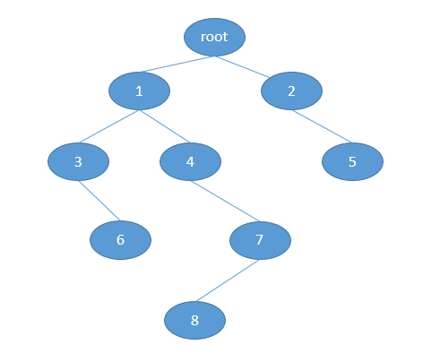

一、问题描述

1.遍历二叉树指定层次的所有结点

2.统计指定层的搜索结点个数

3.对二叉树进行层次遍历

4.找到二叉树中每一层的第一个结点或最后一个结点

二、问题分析

对树结构的问题我们首先会想到使用递归来解决，因为树结构完美适合递归，树的前序、中序、后序遍历使用递归很容易就可以解决，并且很容易理解。对于树结构的层次遍历则会稍微麻烦一点（当然，也很简单），基于层次遍历的问题也有很多，现在我们就着重来分析前面提到的3个问题。

什么是层次遍历 -- 即按照节点在每一层的顺序从上至下，由左到右进行遍历。

所有的结果都是基于如下的树结构：

树的数据结构的具体代码如下：

    
    
    class Node {
        private String data;
        private Node lChild;
        private Node rChild;
            
        public Node(String data) {
            this.data = data;
        }
        public Node(String data, Node lChild, Node rChild) {
            this.data = data;
            this.lChild = lChild;
            this.rChild = rChild;
        }
            
        public Node getLChild() {
            return lChild;
        }
            
        public Node getRChild() {
            return rChild;
        }
            
        public void setRChild(Node rChild) {
            this.rChild = rChild;
        }
            
        public void setLChild(Node lChild) {
            this.lChild = lChild;
        }
            
        @Override
        public String toString() {
            return data;
        }    
    }

View Code

问题1分析 --
如何遍历二叉树指定层次的所有结点？首先，我们考虑能不能使用递归进行遍历，因为树问题太适合用递归解决了，假定我们的函数名为traverseLevel，我们至少能够确定函数的参数应该会有树的根节点root，然后，仅仅只有这个参数还不足以解决问题，再添加一个int型的level参数，通过这两个参数能否解决问题呢？我们发现确实可以解决问题的。具体代码如下（其中树的数据结构需要自己建立，只给出了递归的核心代码）：

    
    
    public void traverseLevel(Node root, int level) {
        if(null == root)
            return;
        if (1 == level) { // 表示到达指定层
            System.out.println(root.data);
        } else {
            traverseLevel(root.lChild, level - 1);
            traverseLevel(root.rChild, level - 1);
        }
    }

View Code

问题2分析 -- 基于问题1，我们已经可以遍历树的指定层，现在我们要统计指定层的所有结点个数，只需要简单的修改问题1中的代码即可，具体的代码如下：

    
    
    public int levelNodeCount(Node root, int level) {
        if(null == root)
            return 0;
        if (1 == level) { // 表示到达指定层
            System.out.println(root.data);
            return 1;
        } else {
            return levelNodeCount(root.lChild, level - 1)
                    + levelNodeCount(root.rChild, level - 1);            
        }            
    }      

View Code

问题3分析 --
基于问题1的分析，我们可以进一步求解问题3，既然我们可以遍历指定层的所有结点，那么遍历按照层次结构遍历整棵树就只需要依次遍历第一层，第二层...最后一层（n）。  
这时，我们只需要求出树有多少层，即n的大小（树的高度）即可解决整个问题。求解树的高度我们也可以采拥递归的方法来进行，具体代码如下：

    
    
    public int treeHeight(Node root) {
        if (null == root)
            return 0;
        int lHeight = treeHeight(root.lChild);
        int rHeight = treeHeight(root.rChild);
        int max = -1;
        if (lHeight > rHeight)
            max = lHeight;
        else 
            max = rHeight;
        return max + 1;
    }

View Code

既然求得了树的高度，那么问题2也就迎刃而解了，具体代码如下：

    
    
    for (int i = 1; i <= treeHeight(root); i++) {
        traverseLevel(root, i);
    }

View Code

继续问题3分析 -- 如果我们不采拥递归的方法来解决，而使用队列的方式进行求解，可以得到如下的代码：

    
    
    public static void levelOrder(Node root) {
        Queue<Node> queue = new LinkedList<Node>();
        if (null != root) {
            if (null != root.lChild)
                queue.offer(root.lChild);
            if (null != root.rChild) {
                queue.offer(root.rChild);
            }
            System.out.println(root.data);
            while (!queue.isEmpty()) {
                Node node = queue.poll();
                System.out.println(node.data);
                if (null != node.lChild) {
                    queue.offer(node.lChild);
                } 
                if (null != node.rChild) {
                    queue.offer(node.rChild);
                }
            }
        }    
    }

View Code

问题4分析 --
有了解决问题1、问题2和问题3的基础，解决问题3也会容易很多，首先我们需要知道每一层的节点个数，然后使用一个计数器递增，当达到每一层的第一个结点时，进行遍历操作即可，具体代码如下：

    
    
    public static void printFirstNodeOfEachLevel(Node root) {
        Queue<Node> queue = new LinkedList<Node>();
        int preCount = 0;
        int levelNodeCount = 0;
        if (null != root) {
            System.out.println(root.data);
            if (null != root.lChild) {
                queue.offer(root.lChild);
                levelNodeCount++;
            }
            if (null != root.rChild) {
                queue.offer(root.rChild);
                levelNodeCount++;
            }
            int count = 0;
            preCount = levelNodeCount;
            levelNodeCount = 0;
            while (!queue.isEmpty()) {
                Node node = queue.poll();
                count++;
                if (count == 1) {
                    System.out.println(node.data);
                }
            
                if (null != node.lChild) {
                    queue.offer(node.lChild);
                    levelNodeCount++;
                } 
                if (null != node.rChild) {
                    queue.offer(node.rChild);
                    levelNodeCount++;
                }
                        
                if (count == preCount) { // 已经到了本层的最后一个结点            
                    count = 0;
                    preCount = levelNodeCount;
                    levelNodeCount = 0;
                }
            }
        }    
    }

View Code

同理，若理解了遍历每层的第一个结点的思路，那么遍历每层的最后一个结点就很简单了。只需要令count == preCount即可。

三、问题总结

对于树结构的相关问题我们首先应该想到的是使用递归来解决，然后思考能不能使用其他方法来解决。感谢各位园友观看，谢谢~

