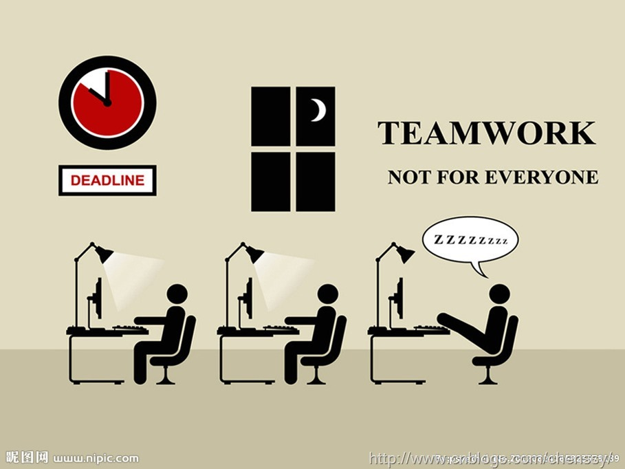
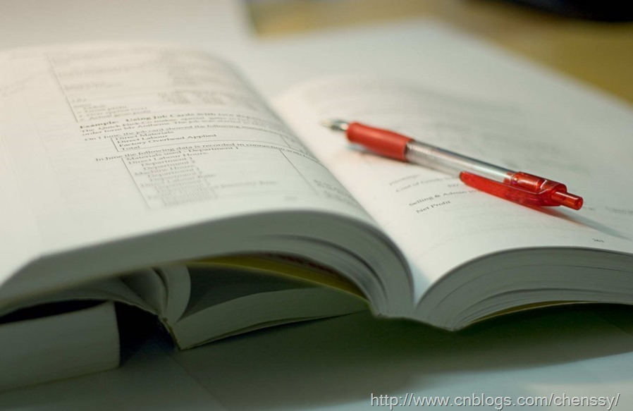
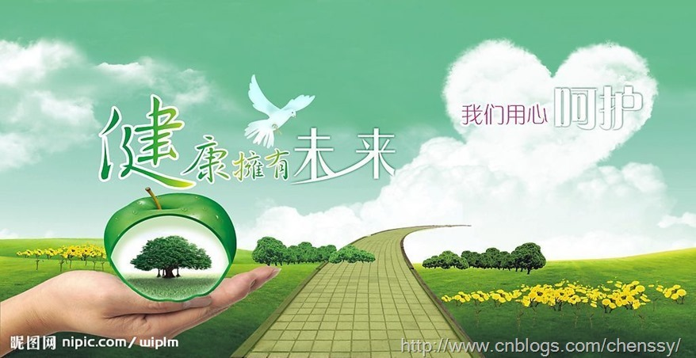
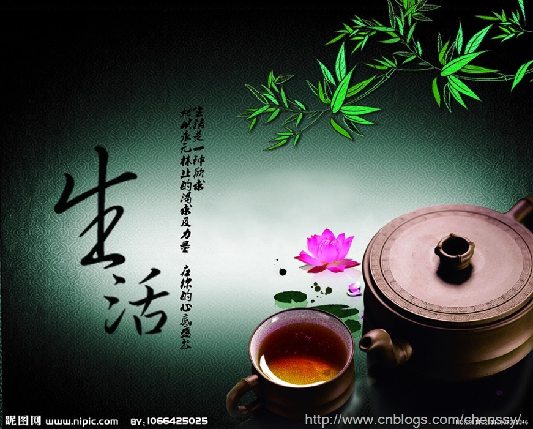

程序员？从事程序开发、维护的专业人员，LZ非常荣幸加入这个“神圣”的行业。别人都自嘲为“程序猿”，而我喜欢尊称为“软件开发工程师”。不为别的，就为自己爱这行。

## 大学

LZ大学才接触电脑，在大学之前连编程这个名词都没有听过，更不用说什么c、java、C#、C++了。高中时物理、化学、生物比较好，平时考试理综分数就没有低260，尤其是化学，所以填报志愿全部都是跟物理、化学相关的，奈何天不遂人愿，录取专业是与计算机相关专业。LZ接到通知书就想骂人（坑爹，LZ是复读生但是复读等于白复读，还是同样的学校……）。

虽然没有录取到心仪的专业，但是LZ有一颗不服输的心，大一开始我选择自学化学专业，搞双学士学位，但坚持了半年就放弃了，因为双学士学位那还真不是人能拿的，太TM的累了。LZ苦寻自己的出路，于大三选择走上编程这条路。

LZ觉得在大学最重要的不在于你拿了多少奖，而是你对未来的渴望和探索。在大学期间你有太多的选择了，摆在你面前的是一条条阳光大道，所谓条条大路通罗马就是这个道理。在选择中，你会面临很多诱惑，怎么做？最坑爹的说话就是跟着心走，最不靠谱的就是今天挖个井，明天挖个坑，后台再挖个洞。我选择的是做法是摸着石头过河寻找最适合自己的路。期间我搞个前端、考过研、做过销售、学过设计但是每条路都不是那么的适合我，在大三时选择学习java，走上编程之路。

一个人走，会有很多迷惑不解，当中过程的苦恼只有自己懂，但是坚持下来了就会柳暗花明又一村。在学java的过程中，我迷茫过，放弃过，欢乐过但是最终还是坚持了下来，当然结果是可喜可贺的。所以什么是成功？选择一条正确的路走到黑就是成功。

**总结：**

1、 选择一门感兴趣，坚持到底。

2、 能够找到一群志同道合的人是非常幸运的。LZ在大学就有几个，一起学习，一起扯淡，一起研究编程。

3、 对于编程，如果能够进入校实验室就再好不过了。因为这里除了有一群和你一样的人，而且能够提供比较好的学习环境。

## 工作

LZ有幸，参加校招时拿到四分offer，基于种种考虑，最后选择长沙的一家公司（谁知道是个坑）。于2013.03参加公司的培训，LZ有幸获得优秀学员。四月份进入部门实习，在实习过程中参与人生第一项目，在这其间和豹哥一起工作、一起加班、一起吃饭，豹哥对我指导非常多。7月份参与老大的项目，由于在前面那个项目表现比较好，老大和项目经理对我也比较放心，有很多东西都交给我做，包括核心模块的编写，参与系统设计。同时更是将该系统的第二版本交由我全权负责（老大辞职，只有我了，就只好赶鸭子上架了，当然还需要项目经理的信任）。

虽然在这个项目组比较开心，但是总有些理由会让你离开，“
员工的离职林林总总，只有两点最真实：1,钱，没有给到位。2、心，委屈了。这些归根到底就一条：干的不爽”。所以考虑很久就选择了离开，现在交接工作也差不多了，手续也快了。现在唯一要做的事情就是好好复习，年后去深圳奋斗！！！！！

**总结**

1、 作为新人你必须要满怀激情。 没有那个老板愿意见到一个刚刚毕业的人像条死鱼样。

2、
和老大搞好关系。从某种程度上来说，你老大就是你的老板，他直接决定你的工资、考勤、发展。如果你和他的关系不好，从某种程度上来说你死定了。人家不给你工作或者比较简单的任务，不给你指导，到最后直接不鸟你，这样对你的发展和提升是非常不好的。我和老大的关系非常融洽，有时候我就给他买个早餐，带个饭什么的，人家也非常乐意指导我，在这段时间我也提升比较快。

3、
适当表现自己，但别出头。你不表现自己，没有人知道你优秀，但是你过头了，就会适得其反。所以这个度一定要把握好。有段时间我就过于表现，搞得旁边几个人都不是很喜欢我。过度表现自己，就是自以为是，这类的人死得最快了。

4、
谦虚点，不断提升自己。没有自知之明的人等同于废物。好像全世界就他最厉害一样，遇到谁都不服。请教别人好像别人欠它似的，这类人是做不长久的。你需要做的是待人谦虚点，请教别人态度好点，然后努力提升自己，等到以后别人来问你的时候你就牛逼了。

5、
善于提问。有问题一定要问，别一个埋着头在那里做，做了很久也没有做出个所以然。从小的来说是浪费你的时间，从大方面来说你在拖延项目进度，所以有问题一定要问。但是不要什么问题都问要，经过你的大脑想想，别人也要工作，不可能什么问题都帮你解决，而且这样不利于你提升。我一般的做法是想30分钟，如果没有头绪就请教老大。

6、
善于汇报任务。对于一个新人而言，你除了需要好好努力工作之外还需要及时向老大汇报工作，让你老大知道你工作的进度。毕竟我们是新人，编码难免会存在这样那样的缺陷，当你完成一个任务后，及时向老大汇报，这是老大应该会帮你测试下，没有问题，会给你安排新任务，有问题会给你指出来打回去让你改。而且他也比较欢喜你向他汇报任务，这样起码能够证明你在努力工作。

## 学习

学历代表过去，能力代表现在，学习能力代表将来。所谓活到老学到老，这句话在我们程序员身上得到最好诠释。在大学我们最重要的就是培养综合能力，其中学习能力是非常重要的一项。

在知识日益更新的时代，作为站在“科技前沿”的我们，我们必须要具备良好的学习能力和坚持学习的觉悟。我不求你上知天文，下知地理，学富五车，博古通今。但愿你能够稍微超越你的工作，只是胜任工作是远远不够的。

诚然，我们必须要具备居安思危的意识，只有具备了这种意识我们才能够不断的激励自己，不断的进步，所谓冰冻三尺非一日之寒，任何东西存在其潜在，长期存在的因素，都不是突然之间就可以形成的。成功更是如此，是需要长期的积累，酝酿。大神也不是一日就修炼出来的，是需要知识的日益积累。所以作为菜鸟的我们必须要保持不断学习的状态，这样才能不断进步。

## 博客

LZ在2010年就开通了博客，但从来都是三天打鱼两天晒网，没有坚持过！直到学习java的时候才开始真正写博客。这不光是工作上的总结，技术的积累，更是自己对成功的一种向往，对梦想的一种追求。通过写博客让自己慢慢地坚持走完奋斗的路，当自己成菜鸟变成大神之后再回头看看自己走过的痕迹，这是多么美妙的事。

我也差不多认认真真写了一年的博客，在这过程中收获了很多，包括技术的提升，交际圈的扩展，表达能力的提高。将自己的心得，读书笔记，技术问题整体成文，这是一个非常值得关注的事情，可能刚刚开始我们能够坚持下来，但是三分热度过后呢？我非常庆幸自己能够坚持写一年，当然与各位朋友的支持密不可分，以后会一直坚持下来。

有人说写博客就是浪费时间，自己知道就行，整理成为纯属浪费。其实不然，首先你需要把你所知道的写成博文，这本身就是一个学习的过程，你必须要对你所阐述的问题理解，如果自己都不理解如何让看得人理解。其次别人可能指出你文中的错误或者对其进行补充，这对你又是一个提升的过程。再者这是一种分享精神，在越来开放的世界中我们缺少的就是分享精神，“你有一个想法，我有一个想法，相互交换，我们就有两个想法”。

目前LZ已经开通了博客园（<http://www.cnblogs.com/chenssy/>）、CSDN（<http://blog.csdn.net/chenssy>）的博客，同时也与2013.12正式开通个人博客网站（<http://cmsblogs.com/>），LZ会一直坚持写博文来记录自己的生长之路，等待日后回首之时也可看看自己曾经激情澎湃的时光。

## 健康

经过11月份和12月份两个月的高强度工作后（没有休息过几天），感觉身体到处不舒服，肠胃不舒服，头痛，全身无力，总之一句话就是到处都是毛病。

想我工作才出来半年不会就给落下毛病吧！抽个时间我去检查身体（医院真TM的赚钱，就一个体检1400+），还好，没有什么毛病。身体有点儿虚、肠胃功能不好、血脂正常但有脂肪肝的倾向。医生建议就是：注意饮食，经常锻炼，多休息。哎，戳中我的软肋。作为程序员如何注意饮食？平常加班加点，都是随便应付了事，夜宵一般都是泡面解决。经常锻炼？高中的时候每天早上还坚持跑步，大三也坚持过大半年。现在，呵呵……多休息？这真是一个问题，经常加班根本就没有时间休息，有次加班都凌晨快3点，第二天早上还是要7点起来工作。虽然没有通宵过，但是还是经常熬夜。

工作是老板的，身体是自己的。用现在的身体来换money真心的不值，天知道你现在赚的钱是不是帮医院赚的。所以用身体来换钱真不值，既是对自己不负责，也是对家庭不负责。当然我不是提倡不加班，干咱们这行不加班不现实，我是建议少加班。如何少加班？白天好好工作，别有事没事看看网页，聊聊QQ，当你任务完成了，是没有人要求你加班的，当然项目很赶例外。

很早以前就说：若干年后最畅销书是《颈椎病疗法》之类的书籍。所以颈椎问题是我们IT人士最严峻的问题，其实还有一个就是肾，久坐是容易引起肾虚的哦\\(^o^)/~！所以在工作过程中我们需要注意：别用身体来换业绩。对于我们从事IT工作的人而言，我们更加需要注重自己的身体。

## 生活

大学时我的生活是这样的：教室—宿舍—实验室，工作时我的生活是这样的：公司—家。大学时我的生活圈是10+个基友，工作后我的生活是only
one。儿时我们有一群伙伴，中学我们有多个共同奋斗的基友，大学就只剩几个可以扯淡、dota的室友，而工作后除了你之外就只有电脑和书陪伴了（可能还有女友）。是什么导致我们的生活圈子越来越小？

对于我们搞IT的人而言，除了技术就是游戏（貌似很多人都是这样，我也是，除了技术就是dota）。这样就势必会导致我们的生活圈子会越来越小，人生也会失去很多乐趣。可能有人会说我们在网上认识很多朋友，QQ上面也有很多基友，但是这些都是虚拟的，并是不是真正的，我所谓的朋友、生活圈是真真实实存在的，是能够陪你吃饭、闲聊，陪你欢喜，陪你悲伤的。这样还会认为你的生活圈大吗？

2013年我培养两个爱好，看电影，摄影。我会去电影院看每一部大片，虽然有时候是一个人。其实看电影是其次，关键就在于我走出来了，不再宅在那个房子里。我们现在每个周末都会花半天、一天的时间出去走走，哪怕是一个人，因为我不想宅，不想变成那个除了技术就是游戏的it宅男。摄影，一个非常高雅、高端的爱好，其实我开始并不是很喜欢这个，是跟着我们部门的一个搞前端一起去玩玩，慢慢喜欢上了，所以2014年一个愿望就是入手一台单反！！！

所以作为宅男的我们，都走出来吧！和朋友出来玩玩，广交朋友，扩大交际面，丰富业余生活。2014年我想这样度过我：每月看一两部电影，踩着自行车拿着单反在这个城市到处走走，留下我的足迹，身影。当然也不能忘记学习~~~\\(^o^)/~

## 梦想

Dream？在这里我们庸俗的问下各位：Do you have a
dream?可能你们会很鄙视的回答我谁会没有梦想？但是你坚持了几年呢？一年？两年？还是五年？甚至十年。我们当初满怀激情地进入社会，对未来充满幻想，和朋友闲聊时也不忘吹吹自己的理想是多么多么地宏伟。但是现在呢？生活的琐碎，工作的压力将我们激情磨得连渣都不剩。

作为刚刚进入社会的我，有理想，满怀激情，投入工作，热爱生活，甚至相信人性本善。我不相信生活能够将我理想磨平。但是事实胜于雄辩，没有激情的同事，重复的工作将我的激情抹掉一些，我发现堕落了！虽然我一直想用行动影响我们同一届的人，也许我太自己为是了，自以为能够影响到他们，但是得到的结果确实视而不见。群里的话题除了LOL、NBA就是DOTA和各种无节操的东西，我感觉我分享的是那么地格格不入。所以为了坚持那份理想，保持那份激情，我经常提醒自己，鞭笞自己，看各种励志的博文，浏览大神的博客，在技术群里面讨论技术。

这里推荐两篇博文：

###
>>>>>[IndieBros访谈：探寻《2+18+200万》背后的故事](http://www.csdn.net/article/2012-12-09/2812624-IndieBros-
interview)

###  >>>>>[ **专访雷果国：从1.5K到18K
一个程序员的5年成长之路**](http://www.csdn.net/article/2013-05-15/2815252)

当然我这里传达并不是他们有多么牛，赚了多少钱，而是：不要忘记心中的梦想，坚持梦想。

**梦想，不是怎么想，而是怎么做！！！**

啰嗦一句： **Do you have a Dream??**

## 总结

人最宝贵的是生命，生命属于人只有一次。人的一生应该这样度过：当他回首往事的时候，不会因为碌碌无为、虚度年华而悔恨，也不会因为人卑劣、生活庸俗而愧疚。这样。在临终的时候，他就能够说：我已经把自己整个的生命和全部的精力献给了世界上最壮丽的事业—为人类的解放而奋斗。虽然我们没有这么豪情壮志，但是我们依然可以豪情万丈地说：我将我整个的人生和全部精力献给献给了世界最具魅力的事业—为梦想而奋斗。最后送句一句话：
不求与人相比，但求超越自己，要哭就哭出激动的泪水，要笑就笑出成长的性格。

