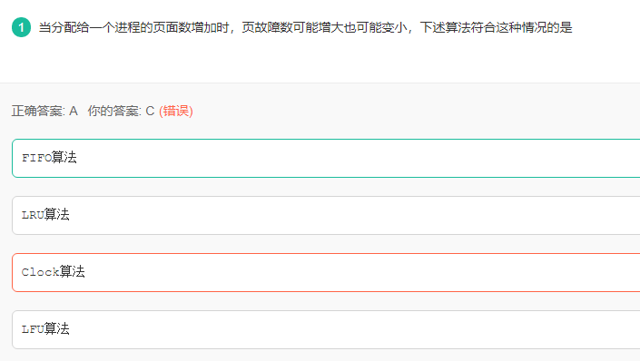
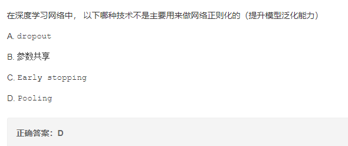
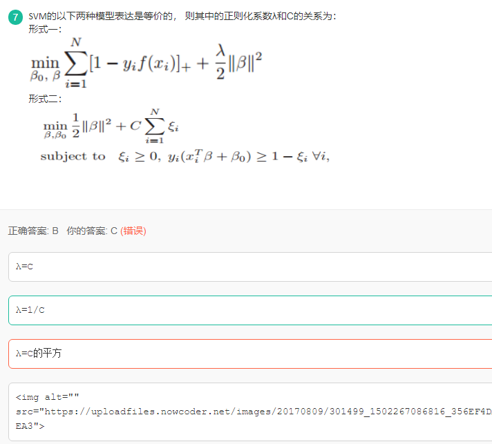
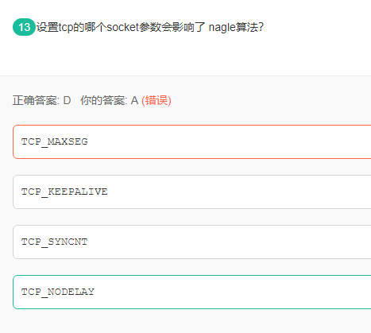

池化技术用于对卷积映射层的特征提取，有最大，最小，平均等等，仅作为特征提取的手段。

当然是参数共享，参数共享是为了减少训练参数，从而提高训练效率，较少训练时间

Hadoop实现Join的几种方法：

1) reduce side join  
  
reduce side join是一种最简单的join方式，其主要思想如下：  
  
在map阶段，map函数同时读取两个文件File1和File2，为了区分两种来源的key/value数据对，对每条数据打一个标签 （tag）,  
比如：tag=0表示来自文件File1，tag=2表示来自文件File2。即：map阶段的主要任务是对不同文件中的数据打标签。  
  
在reduce阶段，reduce函数获取key相同的来自File1和File2文件的value list，
然后对于同一个key，对File1和File2中的数据进行join（笛卡尔乘积）。  
即：reduce阶段进行实际的连接操作。  
  
2) map side join  
  
之所以存在reduce side join，是因为在map阶段不能获取所有需要的join字段，即：同一个key对应的字段可能位于不同map中。Reduce
side join是非常低  
效的，因为shuffle阶段要进行大量的数据传输。  
  
Map side join是针对以下场景进行的优化：两个待连接表中，有一个表非常大，而另一个表非常小，以至于小表可以直接存放到内存中。这样，我们可以将  
小表复制多 份，让每个map task内存中存在一份（比如存放到hash
table中），然后只扫描大表：对于大表中的每一条记录key/value，在hash table中  
查找是否有相同的key的记录，如果有，则连接后输出即可。  
  
为了支持文件的复制，Hadoop提供了一个类DistributedCache，使用该类的方法如下：  
  
（1）用户使用静态方法DistributedCache.addCacheFile()指定要复制的文件，它的参数是文件的URI（如果是
HDFS上的文件，可以这样：hdfs://namenode:9000/home/XXX/file，其中9000是自己配置的NameNode端口
号）。JobTracker在作业启动之前会获取这个URI列表，并将相应的文件拷贝到各个TaskTracker的本地磁盘上。（2）用户使用
DistributedCache.getLocalCacheFiles()方法获取文件目录，并使用标准的文件读写API读取相应的文件。  
  
3) SemiJoin  
  
SemiJoin，也叫半连接，是从分布式数据库中借鉴过来的方法。它的产生动机是：对于reduce side
join，跨机器的数据传输量非常大，这成了join操作的一个瓶颈，如果能够在map端过滤掉不会参加join操作的数据，则可以大大节省网络IO。  
  
实现方法很简单：选取一个小表，假设是File1，将其参与join的key抽取出来，保存到文件File3中，File3文件一般很小，可以放
到内存中。在map阶段，使用DistributedCache将File3复制到各个TaskTracker上，然后将File2中不在File3中的
key对应的记录过滤掉，剩下的reduce阶段的工作与reduce side join相同。  
  
更多关于半连接的介绍，可参考：半连接介绍：  
  
4) reduce side join + BloomFilter  
  
在某些情况下，SemiJoin抽取出来的小表的key集合在内存中仍然存放不下，这时候可以使用BloomFiler以节省空间。  
  
BloomFilter最常见的作用是：判断某个元素是否在一个集合里面。它最重要的两个方法是：add()
和contains()。最大的特点是不会存在false
negative，即：如果contains()返回false，则该元素一定不在集合中，但会存在一定的true
negative，即：如果contains()返回true，则该元素可能在集合中。

