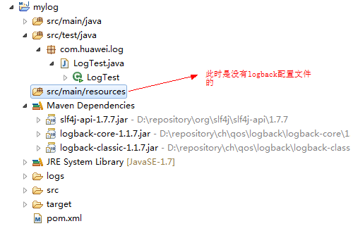
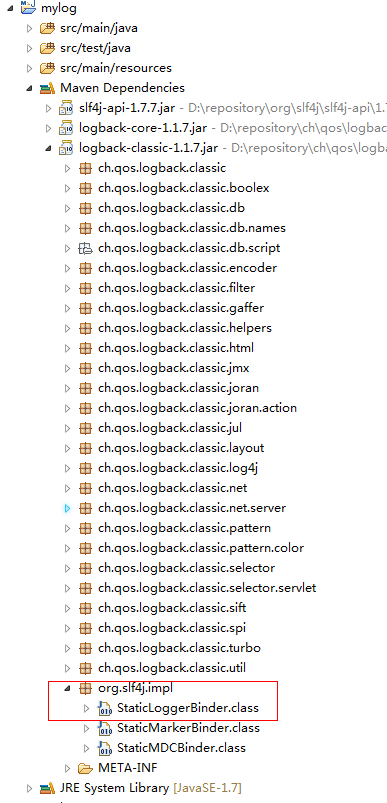
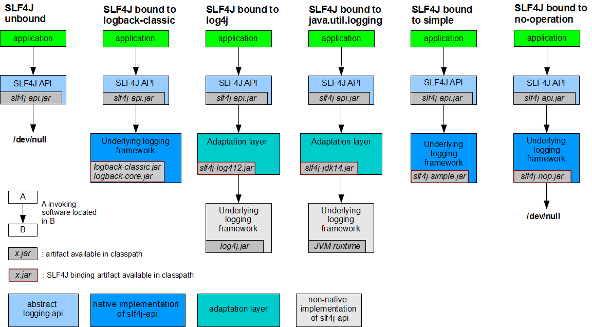

## 前言

项目中的日志系统使用的是slf4j + logback。slf4j作为一个简单日志门面，为各种loging APIs（像java.util.logging,
logback, log4j）提供一个简单统一的接口，有利于维护和各个类的日志处理方式统一。Logback作为一个具体的日志组件，完成具体的日志操作。

本博客旨在带领大家理清楚slf4j的绑定(logback如何绑定到slf4j的)，logback是何时加载配置文件的。至于具体的配置则需要大家自己去查阅资料了。

路漫漫其修远兮，吾将上下而求索！

github：[https://github.com/youzhibing](https://github.com/youzhibing)

码云(gitee)：[https://gitee.com/youzhibing](https://gitee.com/youzhibing)

## slf4j + logback的使用

使用非常简单，引入依赖的jar即可，如下图

pom.xml

    
    
    <project xmlns="http://maven.apache.org/POM/4.0.0" xmlns:xsi="http://www.w3.org/2001/XMLSchema-instance"
        xsi:schemaLocation="http://maven.apache.org/POM/4.0.0 http://maven.apache.org/xsd/maven-4.0.0.xsd">
        <modelVersion>4.0.0</modelVersion>
    
        <groupId>com.yzb</groupId>
        <artifactId>mylog</artifactId>
        <version>0.0.1-SNAPSHOT</version>
        <packaging>jar</packaging>
    
        <name>mylog</name>
        <url>http://maven.apache.org</url>
    
        <properties>
            <project.build.sourceEncoding>UTF-8</project.build.sourceEncoding>
            <maven.compiler.source>1.7</maven.compiler.source>
            <maven.compiler.target>1.7</maven.compiler.target>
        </properties>
    
        <dependencyManagement>
            <dependencies>
                <dependency>
                    <groupId>org.slf4j</groupId>
                    <artifactId>slf4j-api</artifactId>
                    <version>1.7.7</version>
                </dependency>
            </dependencies>
        </dependencyManagement>
    
        <dependencies>
            <dependency>
                <groupId>org.slf4j</groupId>
                <artifactId>slf4j-api</artifactId>
            </dependency>
            
            <dependency>
                <groupId>ch.qos.logback</groupId>
                <artifactId>logback-core</artifactId>
                <version>1.1.7</version>
            </dependency>
            <dependency>
                <groupId>ch.qos.logback</groupId>
                <artifactId>logback-classic</artifactId>
                <version>1.1.7</version>
            </dependency>
            
        </dependencies>
    </project>

View Code

测试代码

    
    
    public class LogTest
    {
        private static Logger LOGGER = LoggerFactory.getLogger(LogTest.class);
        
        public static void main(String[] args)
        {
            LOGGER.info("......info");
            LOGGER.debug("......debug");
            LOGGER.warn("......warn");
            LOGGER.error("......error");
            LOGGER.trace("......trace");
        }
    
    }

View Code

控制台输出结果

    
    
    15:24:48.840 [main] INFO com.huawei.log.LogTest - ......info
    15:24:48.842 [main] DEBUG com.huawei.log.LogTest - ......debug
    15:24:48.842 [main] WARN com.huawei.log.LogTest - ......warn
    15:24:48.842 [main] ERROR com.huawei.log.LogTest - ......error

使用真的简单，也正是这种简单让我产生了一些疑问。

**问题1** ：大家对spring使用的比较多的话，就知道将某个实现类注给其接口的时候，都是需要明确指出的，无论是通过配置文件的方式还是注解的方式。如下

    
    
    <?xml version="1.0" encoding="UTF-8"?>
    <beans xmlns="http://www.springframework.org/schema/beans" xmlns:xsi="http://www.w3.org/2001/XMLSchema-instance"
        xmlns:context="http://www.springframework.org/schema/context" xmlns:task="http://www.springframework.org/schema/task"
        xsi:schemaLocation="http://www.springframework.org/schema/beans
        http://www.springframework.org/schema/beans/spring-beans-3.1.xsd
        http://www.springframework.org/schema/context
        http://www.springframework.org/schema/context/spring-context-3.1.xsd
        http://www.springframework.org/schema/task
        http://www.springframework.org/schema/task/spring-task-3.1.xsd">
        
        <!--
            applicationContext.xml实际是不会存在
                            配置文件会报错，因为缺少spring的jar包，这里只是模拟spring的依赖注入 
                            更详细代码请看附件
         -->
        
        <bean id="daoImpl" class="com.yzb.dao.impl.DaoImpl" />
        
        <bean id="studentService" class="com.yzb.service.StudentService">
           <!-- dao对应private IDao dao; 将实现daoImpl绑定到接口dao -->
           <property name="dao" ref="daoImpl"/>  
        </bean>
    
    </beans>

可slf4j + logback没有其他任何的配置，工程就能跑起来，能够打印各种类型的日志，这是怎么实现的呢？

**问题2**
：我们加上logback的配置文件，仅仅在src/main/resources(相当于classpath)下加logback.xml，发现生成了日志文件(若没有设置日志文件路径，那么日志文件生成在当前工程下)，并且控制台输出结果如下：

    
    
    2017-05-13 15:57:27|INFO|......info
    2017-05-13 15:57:27|WARN|......warn
    2017-05-13 15:57:27|ERROR|......error

仅仅在src/main/resources下配置logback.xml，就能达到这种效果，logback.xml是什么时候加载的呢？

## 源码解析

从LogTest.java开始

    
    
    public class LogTest
    {
        private static Logger LOGGER = LoggerFactory.getLogger(LogTest.class);
        
        public static void main(String[] args)
        {
            // 下面5个方法相当于接口调用实现
            LOGGER.info("......info");
            LOGGER.debug("......debug");
            LOGGER.warn("......warn");
            LOGGER.error("......error");
            LOGGER.trace("......trace");
        }
    
    }

代码非常简单，很明显我们只需要看private static Logger LOGGER =
LoggerFactory.getLogger(LogTest.class)的实现。

跟进getLogger方法 2步，来到

    
    
        /**
         * Return a logger named according to the name parameter using the statically
         * bound {@link ILoggerFactory} instance.
         *
         * @param name The name of the logger.
         * @return logger
         */
        public static Logger getLogger(String name) {
          // 获取日志工厂
          ILoggerFactory iLoggerFactory = getILoggerFactory();
          // 返回日志实例
          return iLoggerFactory.getLogger(name);
        }

我们跟进getILoggerFactory方法

    
    
      /**
       * Return the {@link ILoggerFactory} instance in use.
       * 

       * 

       * ILoggerFactory instance is bound with this class at compile time. // 编译时绑定工厂实例
       *
       * @return the ILoggerFactory instance in use
       */
      public static ILoggerFactory getILoggerFactory() {
        if (INITIALIZATION_STATE == UNINITIALIZED) {
          INITIALIZATION_STATE = ONGOING_INITIALIZATION;
          
          // 执行初始化 
          performInitialization();
        }
        switch (INITIALIZATION_STATE) {
          case SUCCESSFUL_INITIALIZATION:
            // 若初始化成功，则返回日志工厂
            return StaticLoggerBinder.getSingleton().getLoggerFactory();
          case NOP_FALLBACK_INITIALIZATION:
            return NOP_FALLBACK_FACTORY;
          case FAILED_INITIALIZATION:
            throw new IllegalStateException(UNSUCCESSFUL_INIT_MSG);
          case ONGOING_INITIALIZATION:
            // support re-entrant behavior.
            // See also http://bugzilla.slf4j.org/show_bug.cgi?id=106
            return TEMP_FACTORY;
        }
        throw new IllegalStateException("Unreachable code");
      }　

很显然，接着跟进performInitialization方法

    
    
      private final static void performInitialization() {
        bind();
        if (INITIALIZATION_STATE == SUCCESSFUL_INITIALIZATION) {
          versionSanityCheck();
        }
      }

跟进bind方法

    
    
    private final static void bind() {
        try {
          // 从classpath获取可能的日志绑定者，就是找出所有slf4j的实现，并将它们的资源路径存放到staticLoggerBinderPathSet
          Set<URL> staticLoggerBinderPathSet = findPossibleStaticLoggerBinderPathSet();
          // 若有多个(多余1个)绑定者，就是从classpath中找到了多个slf4j的实现，那么就打印警告。这个方法就不跟进了，感兴趣的自己跟进
          reportMultipleBindingAmbiguity(staticLoggerBinderPathSet);
          // the next line does the binding 真正的绑定，将具体的实现绑定到slf4j
          StaticLoggerBinder.getSingleton();
          // 修改初始化状态为初始化成功
          INITIALIZATION_STATE = SUCCESSFUL_INITIALIZATION;
          // 报告真实的绑定信息
          reportActualBinding(staticLoggerBinderPathSet);
          fixSubstitutedLoggers();
        } catch (NoClassDefFoundError ncde) {    // 若有多个绑定者，则会抛此异常，Java虚拟机在编译时能找到合适的类，而在运行时不能找到合适的类导致的错误，jvm不知道用哪个StaticLoggerBinder
          String msg = ncde.getMessage();
          if (messageContainsOrgSlf4jImplStaticLoggerBinder(msg)) {
            INITIALIZATION_STATE = NOP_FALLBACK_INITIALIZATION;
            Util.report("Failed to load class \"org.slf4j.impl.StaticLoggerBinder\".");
            Util.report("Defaulting to no-operation (NOP) logger implementation");
            Util.report("See " + NO_STATICLOGGERBINDER_URL
                    + " for further details.");
          } else {
            failedBinding(ncde);
            throw ncde;
          }
        } catch (java.lang.NoSuchMethodError nsme) {
          String msg = nsme.getMessage();
          if (msg != null && msg.indexOf("org.slf4j.impl.StaticLoggerBinder.getSingleton()") != -1) {
            INITIALIZATION_STATE = FAILED_INITIALIZATION;
            Util.report("slf4j-api 1.6.x (or later) is incompatible with this binding.");
            Util.report("Your binding is version 1.5.5 or earlier.");
            Util.report("Upgrade your binding to version 1.6.x.");
          }
          throw nsme;
        } catch (Exception e) {
          failedBinding(e);
          throw new IllegalStateException("Unexpected initialization failure", e);
        }
      }

跟进findPossibleStaticLoggerBinderPathSet方法

    
    
      // We need to use the name of the StaticLoggerBinder class, but we can"t reference
      // the class itself.
      private static String STATIC_LOGGER_BINDER_PATH = "org/slf4j/impl/StaticLoggerBinder.class";
    
      // 从classpath找出所有slf4j的实现，并记录下它们的资源路径
      private static Set<URL> findPossibleStaticLoggerBinderPathSet() {
        // use Set instead of list in order to deal with  bug #138
        // LinkedHashSet appropriate here because it preserves insertion order during iteration 用LinkedHashSet能够保证插入的顺序
        Set<URL> staticLoggerBinderPathSet = new LinkedHashSet<URL>();
        try {
          ClassLoader loggerFactoryClassLoader = LoggerFactory.class
                  .getClassLoader();
          Enumeration<URL> paths;
          if (loggerFactoryClassLoader == null) {
            paths = ClassLoader.getSystemResources(STATIC_LOGGER_BINDER_PATH); 　
          } else {
            paths = loggerFactoryClassLoader
                    .getResources(STATIC_LOGGER_BINDER_PATH);
          }
          while (paths.hasMoreElements()) {
            // path的值 jar:file:/D:/repository/ch/qos/logback/logback-classic/1.1.7/logback-classic-1.1.7.jar!/org/slf4j/impl/StaticLoggerBinder.class
            URL path = (URL) paths.nextElement();
            staticLoggerBinderPathSet.add(path);
          }
        } catch (IOException ioe) {
          Util.report("Error getting resources from path", ioe);
        }
        return staticLoggerBinderPathSet;
      }

至此，问题1的答案就很明显了，slf4j会在classpath中找所有org/slf4j/impl/StaticLoggerBinder.class的资源路径，一般而言只有一个，在本博客中就在logback的jar中，如图

那么logback与slf4j就关联起来了，接下来看logback对配置文件的加载。我们回到bind方法，跟进StaticLoggerBinder.getSingleton()，方法很简单

    
    
    public static StaticLoggerBinder getSingleton() {
    　　return SINGLETON;
    }

很显然，执行此方法之前，对配置文件的加载已经执行完了，也就是说在编译器已经完成对配置文件的加载了。那么我们需要换目标跟进了，StaticLoggerBinder中只有一段静态块

    
    
        static {
            SINGLETON.init();
        }

那么我们跟进init方法

    
    
        /**
         * Package access for testing purposes.
         */
        void init() {
            try {
                try {
                    // 上下文初始化器
                    new ContextInitializer(defaultLoggerContext).autoConfig();
                } catch (JoranException je) {
                    Util.report("Failed to auto configure default logger context", je);
                }
                // logback-292
                if (!StatusUtil.contextHasStatusListener(defaultLoggerContext)) {
                    StatusPrinter.printInCaseOfErrorsOrWarnings(defaultLoggerContext);
                }
                contextSelectorBinder.init(defaultLoggerContext, KEY);
                initialized = true;
            } catch (Throwable t) {
                // we should never get here
                Util.report("Failed to instantiate [" + LoggerContext.class.getName() + "]", t);
            }
        }

接着跟进上下文初始化器的autoConfig方法

    
    
        public void autoConfig() throws JoranException {
            StatusListenerConfigHelper.installIfAsked(loggerContext);
            // 寻找默认配置文件
            URL url = findURLOfDefaultConfigurationFile(true);
            if (url != null) {
                configureByResource(url);
            } else {
                Configurator c = EnvUtil.loadFromServiceLoader(Configurator.class);
                if (c != null) {
                    try {
                        c.setContext(loggerContext);
                        c.configure(loggerContext);
                    } catch (Exception e) {
                        throw new LogbackException(String.format("Failed to initialize Configurator: %s using ServiceLoader", c != null ? c.getClass()
                                        .getCanonicalName() : "null"), e);
                    }
                } else {
                    // 没有找到配置文件，则使用默认的配置器，那么日志只会打印在控制台
                    BasicConfigurator basicConfigurator = new BasicConfigurator();
                    basicConfigurator.setContext(loggerContext);
                    basicConfigurator.configure(loggerContext);
                }
            }
        }

跟进findURLOfDefaultConfigurationFile方法

    
    
        public URL findURLOfDefaultConfigurationFile(boolean updateStatus) {
            // 获取当前实例的类加载器，目的是在classpath下寻找配置文件
            ClassLoader myClassLoader = Loader.getClassLoaderOfObject(this);
            
            // 先找logback.configurationFile文件
            URL url = findConfigFileURLFromSystemProperties(myClassLoader, updateStatus);
            if (url != null) {
                return url;
            }
            
            // logback.configurationFile文件没找到，再找logback.groovy
            url = getResource(GROOVY_AUTOCONFIG_FILE, myClassLoader, updateStatus);
            if (url != null) {
                return url;
            }
            
            // logback.groovy没找到，再找logback-test.xml
            url = getResource(TEST_AUTOCONFIG_FILE, myClassLoader, updateStatus);
            if (url != null) {
                return url;
            }
            
            // logback-test.xml没找到，最后找logback.xml
            return getResource(AUTOCONFIG_FILE, myClassLoader, updateStatus);
        }　

自此，问题2的答案也清楚了，编译期间logback就完成了对配置文件的加载。

## 总结

编译期间，完成slf4j的绑定已经logback配置文件的加载。slf4j会在classpath中寻找org/slf4j/impl/StaticLoggerBinder.class(会在具体的日志框架如log4j、logback等中存在)，找到并完成绑定；同时，logback也会在classpath中寻找配置文件，先找logback.configurationFile、没有则找logback.groovy，若logback.groovy也没有，则找logback-
test.xml，若logback-
test.xml还是没有，则找logback.xml，若连logback.xml也没有，那么说明没有配置logback的配置文件，那么logback则会启用默认的配置(日志信息只会打印在控制台)。

slf4j只能绑定某一个特定的日志框架，若没有绑定，则会有如下警告，说明没有找到合适的日志框架

    
    
    SLF4J: Failed to load class "org.slf4j.impl.StaticLoggerBinder".
    SLF4J: Defaulting to no-operation (NOP) logger implementation
    SLF4J: See http://www.slf4j.org/codes.html#StaticLoggerBinder for further details.

若找到多个日志框架，slf4j会发出警告，并在运行时抛出NoClassDefFoundError异常

最后来一张图

