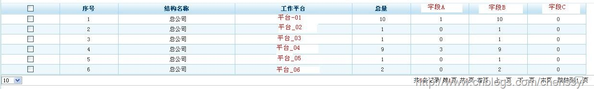

从上个星期起就在开始做统计图，各种统计图，昨天做的统计效果图如下：

在这里要根据工作平台和机构做统计，其中当字段A等于某个值时需要统计起来，也就是说假设等于2时需要做统计，字段B和字段C为在数据库中为某个字段ZT的某种状态统计值，就是说当ZT==”1”时统计到字段B中，否则统计到字段C中。

对于这个我一开始想到的是查询出全部数据，然后在java代码中做逻辑判断，但是这样的效率太低了，如果数据量一大，那么处理的速度会有影响。

于是我开始考虑使用函数，觉得函数应该可以解决问题，而且效率还可以。所以决定使用函数来实现。但是在编写函数的过程中，这个函数还真不是一般的复杂。处理过程如下：

首先我们需要建立一个type，将查询的结果集放入type中。

    
    
    CREATE OR REPLACE TYPE type_wlzh as   object
    (
      gzmb varchar2(200),           --工作平台
      czdwdm varchar(100),          --机构
      accountSum varchar(100),      --总量
      jpAccountSum varchar(100),    --字段A
      yxAccountSum varchar(100),    --字段B
      wxAccountSum varchar(100)     --字段C
    )

然后建立函数Function。在这个函数的建立中需要处理连接四块

1、 最左边部分，也就是最根本的统计元素：工作平台、机构。、

    
    
    select t.gzmb,t.czdwdm from t_xtgl_account t
     group by t.gzmb,t.czdwdm

2、 然后开始统计字段C，并将其union到前面一部分

    
    
    (select t.gzmb,t.czdwdm from t_xtgl_account t
     group by t.gzmb,t.czdwdm) wlzh
     union
    (select t.gzmb,t.czdwdm ,count(*) jpAccountSum from t_xtgl_account t
     where t.account_lx = "2"
     group by t.gzmb,t.czdwdm,t.account_lx) jpsl
     on wlzh.gzmb = jpsl.gzmb and wlzh.czdwdm = jpsl.czdwdm

3、 重复字段B、字段C

4、 最后循环这个部分，将其赋值到新建的type中去，最后返回type。

看到这个过程，你是不是头晕了？不管你晕没晕，反正我是晕了。正当我在哪里想有没有什么更好的解决办法时，陈老板（部门技术总监）从我身边经过，
到我这个比较多的Function时，问我怎么写出了这么复杂的function，于是我就将需求将给他听，人家直接丢一句话：靠，这么简单的，你竟然用函数，吃多了没事干吧。于是敲起来，不到一分钟搞定，结果完全是我想要的。

    
    
    select t.gzmb,t.czdwdm ,count(*) accountSum,
    sum(decode(t.account_lx,"5AD391F6E23C2BC9836337E6C51E28D2",1,0)) jpAccountSum,
    sum(decode(t.accountisyx,"D588249D3081C4028646D7AAE432B506",1,0)) yxAccountSum
    from t_xtgl_account t
    group by t.gzmb,t.czdwdm

这里由于数据是加密的，所以对于状态的选择只能是密文了。

在这里我们需要对decode函数有一定的了解。其实对于decode我们可以认为是一个简单的if-then-else语句。语法如下：

DECODE(value, if1, then1, if2,then2, if3,then3, . . . else )

Value 代表某个表的任何类型的任意列或一个通过计算所得的任何结果。当每个value值被测试，如果value的值为if1，Decode
函数的结果是then1；如果value等于if2，Decode函数结果是then2；等等。事实上，可以给出多个if/then
配对。如果value结果不等于给出的任何配对时，Decode 结果就返回else 。

    
    
    select t.id,t.name,decode(t.sex,"1","男","2","女","人妖")
    from person t

对于上面的SQL语句，当sex==1时，输出男，==2时输出女，否则输出人妖。

所以对于上面的统计求和：sum(decode(t.account_lx,"5AD391F6E23C2BC9836337E6C51E28D2",1,0))就很好分析了，如果account_lx==5AD391F6E23C2BC9836337E6C51E28D2那么等于1，否则等于0，当等于1是就会增加1，等于0时就会加0，这样就实现统计了。

