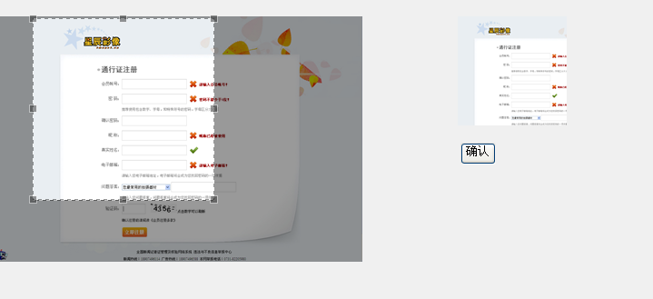
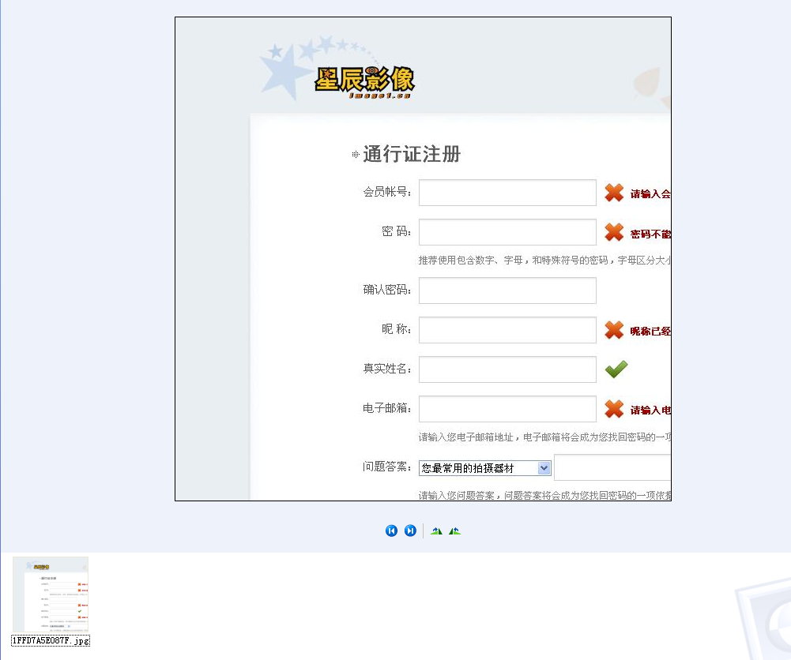

项目需要做一个头像截取的功能，类似于QQ头像截取功能。在网上搜了下，最后使用jQuery插件jcrop来截取，

在后台来进行图片切割。

头像截取的原理：在前台使用jcrop获取切面的x轴坐标、y轴坐标、切面高度、切面宽度，然后将这四个值传给后

台。在后台要进行放大处理：将切面放大N倍，N=原图/前台展示的头像。即X = X*原图宽/前图宽，Y = Y*原图高/前

图高，W = W*原图宽/前图宽,H = H*原图高/前图高。

实例：

JSP:

    
    
    

            

                
            

            

                
            

                
            

            <form action="" method="post" id="crop_form">
                 <input type="hidden" id="bigImage" name="bigImage"/>
                      <input type="hidden" id="x" name="x" />
                      <input type="hidden" id="y" name="y" />
                      <input type="hidden" id="w" name="w" />
                      <input type="hidden" id="h" name="h" />
                      
<input type="button" value="确认" id="crop_submit"/>

                </form>
           

        

样式：大图、小图展示都需要固定高度、宽度，因为后台需要进行放大处理。即：

然后是使用jcrop了。在使用jcrop前我们需要下载jcrop：[http://deepliquid.com/content/Jcrop.html](http://deepliquid.com/content/Jcrop.html)。

将下载的压缩包解压后可以看到三个文件夹及一个index.html文件，/
css下放置的是Jcorp的样式文件，/demo下放置的是几个简单的例子（index.html中引用的链接就是放置在这个文件夹下），/js下放置的是Jcorp中最重要的脚本文件。我们只需要使用三个文件即可：jquery.Jcrop.css、jquery.Jcrop.js、JQuery.js

使用方法：

    
    
     1 //裁剪图像
     2 function cutImage(){
     3     $("#srcImg").Jcrop( {
     4             aspectRatio : 1,
     5             onChange : showCoords,
     6             onSelect : showCoords,
     7             minSize :[200,200]
     8         });
     9         //简单的事件处理程序，响应自onChange,onSelect事件，按照上面的Jcrop调用
    10         function showCoords(obj) {
    11             $("#x").val(obj.x);
    12             $("#y").val(obj.y);
    13             $("#w").val(obj.w);
    14             $("#h").val(obj.h);
    15             if (parseInt(obj.w) > 0) {
    16                 //计算预览区域图片缩放的比例，通过计算显示区域的宽度(与高度)与剪裁的宽度(与高度)之比得到
    17                 var rx = $("#preview_box").width() / obj.w;
    18                 var ry = $("#preview_box").height() / obj.h;
    19                 //通过比例值控制图片的样式与显示
    20                 $("#previewImg").css( {
    21                     width : Math.round(rx * $("#srcImg").width()) + "px", //预览图片宽度为计算比例值与原图片宽度的乘积
    22                     height : Math.round(rx * $("#srcImg").height()) + "px", //预览图片高度为计算比例值与原图片高度的乘积
    23                     marginLeft : "-" + Math.round(rx * obj.x) + "px",
    24                     marginTop : "-" + Math.round(ry * obj.y) + "px"
    25                 });
    26             }
    27         }
    28 }

在使用jcrop前一定要先将$(“”).jcrop();进行预初始化，否则没有效果。

还有一种调用的方法，

    
    
    1 var api = $.Jcrop("#cropbox",{
    2                   onChange: showPreview,
    3                   onSelect: showPreview,
    4                   aspectRatio: 1
    5            });

这种方法是将Jcrop生成的对象赋给一个全局变量，这样操作就会比较方便。

通过上面的js，就将X轴坐标、Y轴坐标、高度H、宽度W这个四个值传递给后台了，后台就只需要根据这四个值

进行放大处理，然后切割即可。

Action

    
    
     1     /**
     2      * 裁剪头像
     3      */
     4     public String cutImage(){
     5         /*
     6          * 获取参数
     7          * x,y,w,h,bigImage
     8          */
     9         HttpServletRequest request = (HttpServletRequest) ActionContext.getContext().get(ServletActionContext.HTTP_REQUEST);
    10         int x = Integer.valueOf(request.getParameter("x"));
    11         int y = Integer.valueOf(request.getParameter("y"));
    12         int w = Integer.valueOf(request.getParameter("w"));
    13         int h = Integer.valueOf(request.getParameter("h"));
    14         String bigImage = request.getParameter("bigImage");          
    15         
    16         //获取文件真实路径
    17         //获取文件名
    18         String[] imageNameS = bigImage.split("/");
    19         String imageName = imageNameS[imageNameS.length-1];
    20         //文件正式路径
    21         String imagePath = getSavePath()+"\\"+imageName;
    22         
    23         //切割图片
    24         ImageCut imageCut = new ImageCut();
    25         imageCut.cutImage(imagePath, x, y, w, h);
    26         
    27         //头像裁剪完成后，将图片路径保存到用户
    28         UserBean userBean = (UserBean) request.getSession().getAttribute("userBean");
    29         userBean.setUserPhoto(bigImage);
    30         //保存头像
    31         UserCenterService centerService = new UserCenterService();
    32         centerService.updatePhoto(userBean);
    33         //将修改后的用户保存到session中
    34         request.getSession().setAttribute("userBean", userBean);
    35         
    36         return "updatePhoto";
    37     }
    38 }

裁剪图片工具类：ImageCut.java

    
    
     1 public class ImageCut {
     2     
     3     /**
     4      * 图片切割
     5      * @param imagePath  原图地址
     6      * @param x  目标切片坐标 X轴起点
     7      * @param y     目标切片坐标 Y轴起点
     8      * @param w  目标切片 宽度
     9      * @param h  目标切片 高度
    10      */
    11     public void cutImage(String imagePath, int x ,int y ,int w,int h){
    12         try {
    13             Image img;
    14             ImageFilter cropFilter;
    15             // 读取源图像
    16             BufferedImage bi = ImageIO.read(new File(imagePath));
    17             int srcWidth = bi.getWidth();      // 源图宽度
    18             int srcHeight = bi.getHeight();    // 源图高度
    19             
    20             //若原图大小大于切片大小，则进行切割
    21             if (srcWidth >= w && srcHeight >= h) {
    22                 Image image = bi.getScaledInstance(srcWidth, srcHeight,Image.SCALE_DEFAULT);
    23                 
    24                 int x1 = x*srcWidth/400;
    25                 int y1 = y*srcHeight/270;
    26                 int w1 = w*srcWidth/400;
    27                 int h1 = h*srcHeight/270;
    28                 
    29                 cropFilter = new CropImageFilter(x1, y1, w1, h1);
    30                 img = Toolkit.getDefaultToolkit().createImage(new FilteredImageSource(image.getSource(), cropFilter));
    31                 BufferedImage tag = new BufferedImage(w1, h1,BufferedImage.TYPE_INT_RGB);
    32                 Graphics g = tag.getGraphics();
    33                 g.drawImage(img, 0, 0, null); // 绘制缩小后的图
    34                 g.dispose();
    35                 // 输出为文件
    36                 ImageIO.write(tag, "JPEG", new File(imagePath));
    37             }
    38         } catch (IOException e) {
    39             e.printStackTrace();
    40         }
    41     }
    42 }

效果图：

点击确认后，就会在指定路径下生成相应的图片：

OVER！！

