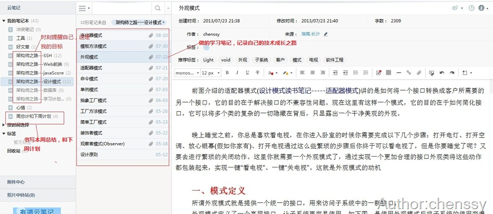

这是一篇迟到的博文，应该说是心得，本来月初就计划写的，但是由于最近项目很赶（几乎天天加班，但是没有加班费，坑啊!!!），所以一直拖到现在，幸好今天老大大发慈悲，说是七夕，让我们过节去(没有女朋友只能陪电脑过节啦，)，所以就今晚把这个总结给写了。

# 实习

从3.1号开始到公司实习，到现在也有4个月了（中间一个月回学校搞毕设），在这个四个月中，真的学到了非常多的东西，不管是知识上的，还是为人上的。

在实习期间一去向各位一样，不断的看文档，看代码，刚刚开始感觉还挺新鲜的，也看的进去，但是随着时间的递增，发现真的很无聊，于是主动跟老大说，“老大，有没有任务交给我做啊“。

老大说：文档你看完啦？项目流程你搞懂了？

我很“诚恳”点头说：大概都搞懂了！（其实我也不知道自己有没有搞懂？？）

老大就说：好吧，你给我加两个功能，********（主要是完成两个功能，同户人员的批量下载，以及身份证信息的批量校验）。

于是我参考着做，也许由于我大学的项目经验还可以，这个两个功能我一个星期给完成了（老大给我两个星期时间，其实这两个任务还比较难，处理的东西比较多，尤其是身份证信息的校验）。

在这个过程中，第一次参与到公司的实际项目当中，觉得与学校的项目差别很大，要考虑的东西也很多，对于我接触的这个项目，由于数据量非常大，所以效率是最重要的，刚刚开始写的一条SQL语句，我貌似查了将近2分钟，老大就给我丢一句话：重写。由于大学对SQL优化接触不是很多，所以搞了好久都没有什么大的成果，请教我们的陈老板（咱公司的技术总监），终于搞定。

在这个实习的过程中学到了几样东西：

1、你一定要虚心，满怀空瓶子的心态，你可以认为你其实什么也不会。

2、一定要和你的指导老师搞好关系。你的指导老师可以不是很牛，但一定要肯教你，找一个肯教你的指导老师比找一个技术牛的人更重要。

3、要很身边的人搞好关系，你指导老师不是很教你，没关系，你可以问你身边的人，你身边的人都是你的资源。

4、保存无与伦比的厚脸皮。到部门的第一天陈老板就告诉我们，不要怕自己不知道，不知道的就问别人。遇到不懂的问题，不要怕别人说你，要问。当然你不是无限制的问，你问的问题肯定是已经经过你脑袋了的，但是没有结果的问题。注：一开始如果一个问题你纠结了30分钟还没有搞出来，差不多就可以请教别人了。

5、没有任务一定要找老大要。这个一定要自己主动去找老大要任务，不要怕自己不会，不会请参看第4点。

# 试用

一毕业就转试用了，当初听到这个信息，惊喜了我（公司规定要实习三个月，由于我之前的项目表现的比较好，所以就提前转试用了）。在试用的这一个月当中，那就叫一个辛苦，每周最少加班3天，有时会天天加班，虽然很累，但很充实，学习的东西非常多，进步也比较大，尤其是数据库和业务分析方面(项目比较大，业务流程处理很复杂)，同时自己的逻辑能力也得到了一定的锻炼。

其中最好的就是在这个地方工作非常轻松，由于做的项目是涉密的，所以我工作的地方变成了酒店，有沙发，有喝茶、休息的地方。再加上项目经理就是“老少不良”，经常开我们玩笑，有事打麻将赢钱了请我们去吃大餐，去唱歌，总之就一句话，这个工作非常爽。

工作虽然爽，但是项目有时真叫人蛋疼，由于业务逻辑比较复杂，有时做的想死人，比如一次发一条***，有八个状态，什么草稿、呈批、驳回、审阅、已呈批…，各种机构、各种下发、各种生成作业，做起来那叫一个蛋疼。还有一次做统计图，数据处理、逻辑处理也很复杂，做起来也比较蛋疼。不过只有做你不知道的，你才能有长进，天天增删改查，重复代码，重复业务让人进步的幅度太小了，只有让你头痛的东西，才会让进步。

# 学习

来公司之前你不要忘记一个最根本，最核心的东西，你除了帮公司创造价值之外，还有就是学习。对于公司而言你最主要的是创造价值，对于我而言最主要的是学习，不管是知识，还是职业素养，都是我们需要学习的地方。

## 参与项目

从开始到现在四个月的时间自己亲力亲为参与了两个项目，其中一个是比较小的，做一个门户网站：省公安厅摄影门户网站(类似于[星辰影院](http://www.image1.cn/)：[http://www.image1.cn/](http://www.image1.cn/
"http://www.image1.cn/"))。从需求分析，项目设计已经最后的项目部署都参与其中。自己主要负责用户那块，包括用户注册、已经登录后的所有操作，由于在大学期间做门户网站有两个所以并没有遇到什么难题，所以学习到的东西就有限了（验证了只有让你头痛的东西，才会让你进步）。不过在这个过程中与另一位同事相处的非常融洽，提前转试用与他有莫大关系。

在参与的第二个项目，我们叫它为XX系统，为国家一级涉密项目，所以项目细节就不阐述。这这个项目中学的东西就非常多了，由于业务逻辑比较复杂，开始是用脑袋想，想了这里忘记那里，于是我就开始用本子记，遇到流程就画图，导致我现在都有点儿离不开笔和本子了，遇到问题我就喜欢记录下来，用图画出来。在这个过程中遇到了很多问题，由于不能上网只能请教老大，老大也非常细心的给我讲解，尤其是数据库方面（自己的数据库方面比较薄弱，对于java编码还是比较熟练）。所以找一位肯帮你，热心帮你的老大非常重要。

## 学习计划

从一毕业开始我就决定给自己每周都要下一个学习计划，因为白天由于工作，学习的时间有限，所以在回家我每晚都会学到最少10点，有句话是说：每晚的8点到10点决定了你以后的成就。所以学无止境，我们只有保持不断学习的动力才能更好的成就自己，对于我们IT行业更是如此。

曾听过这样一句让我受益匪浅的话：“忙的人是WINNER，闲的人是LOSER。”人生活在世上，过什么样的生活是由自己选择的。有的人怕吃苦就选择一份清闲的工作，有的人想实现自己更高的价值就选择勤奋努力来改变现状...其实忙碌也是一种积极的生活态度，它体现了一个人的真正的价值所在，让生活处于一种饱满的，充满活力的状态。这正是所谓的生而不息，学而不止。

在学习的过程中我是这样来保持学习动力和记录学习行迹的。

每次我电脑开机必定会启动三个软件：小孩桌面便签、佳盟个人信息管理软件和有道云笔记。

1、我用“小孩桌面便签”来记录每周需要完成的任务，它有一个提示功能，到点就会提示你该做的事情，非常方便。

2、我有佳盟个人信息管理软件管理自己的日程任务。这个软件功能非常强大，比如我现在同时还使用他来理财。

3、我用有道云笔记来记录自己的学习笔记。来记录自己的技术成长路径。

## 阅读

阅读使人充实,会谈使人敏捷,写作使人精确。阅读会增加我们的知识面，培养情操和良好的世界观。所以每当无聊的时候我最喜欢做的就是看书。曾几何时我最喜欢干的事情就是买书，因为我一般都只喜欢看自己买的书。我现在在看着两本书。其中自控力是看一位园友写的心得，觉得不错，就买了。

# 心态

在实习的过程中心态一定要好，因为你本来就是来学东西的，所以第一条就是要谦虚，那么第二天就是顽固不化的道理：厚脸皮。

在实习的过程中除了那两点还有就是要保持空瓶子的心态。不要怕什么不知道，就怕那种不知道还装着知道，以为自己很牛逼的人物。这样你是什么都学不到的。

第四、不要怕被骂。你被骂证明你还有救，最怕那种什么都不鸟你的老大了。想当初一个月我几乎每个月都被老大骂，有几次我都想揍他，所以一定要淡定淡定。

第五、表现好。我一直都是这样不求最晚走，但我一定是晚走的，不求最早到，但绝对不会退出前五。我一般都是我们部门第一个到，每天最晚7：40到，虽然不会给你加工资，给你来个全勤奖，但你给他们的态度绝对不会差。

第六、跟随老大。老大加班你最好也跟着加班，尽管你的任务早就完成了。

第七、主动。有时候老大给你任务量少了，你提前完成了，一定要找老大要任务，这样会给老大一个不错的印象。

第八、尽量不要拖项目后腿。我进项目组就给自己定下一个一定不能违背的原则：绝不拖项目后腿。没有完成的任务加班都要完成。

