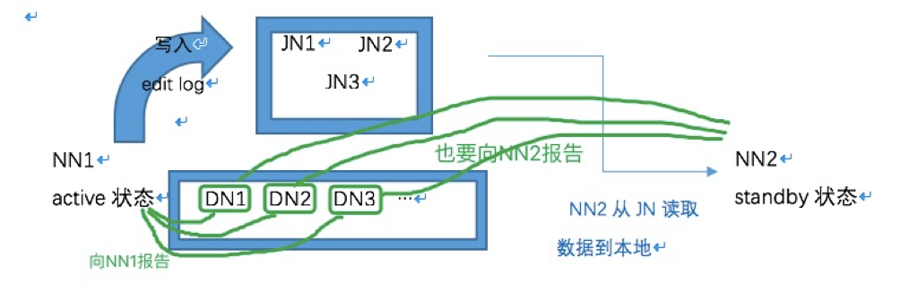
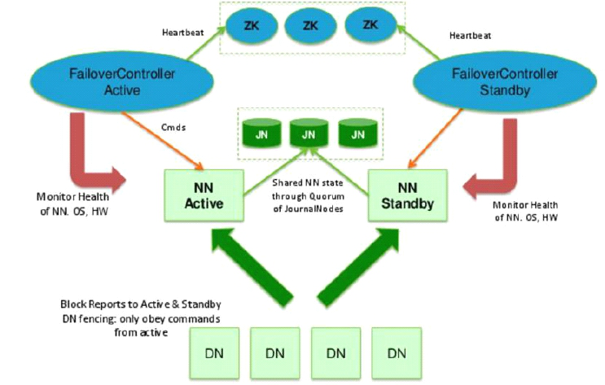

**Hadoop中** **NameNode** **单点故障解决方案**

Hadoop
1.0内核主要由两个分支组成：MapReduce和HDFS,这两个系统的设计缺陷是单点故障，即MR的JobTracker和HDFS的NameNode两个核心服务均存在单点问题，这里只讨论HDFS的NameNode单点故障的解决方案。

需求：

实现namenode元数据的备份，解决namenode单点宕机导致集群不可用的问题。

方案描述：

当namenode所在服务器宕机的时候，我们可以利用namenode备份的元数据迅速重构新的namenode来投入使用。

1.Hadoop本身提供了可利用secondarynamenode的备份数据来恢复namenode的元数据的方案，但因为checkpoint(在每次
checkpoint的时候secondarynamenode才会合并并同步namenode的数据)的问题，secondarynamenode的备份数据并不能时刻保持与namenode同步，也就是说在namenode宕机的时候secondarynamenode可能会丢失一段时间的数据，这段
时间取决于checkpoint的周期。我们可以减小checkpoint的周期来减少数据的丢失量，但由于每次checkpoint很耗性能，而且这种方案也不能从根本上解决数据丢失的问题。所以如果需求上不允许这种数据的丢失，这种方案可直接不予考虑。

2.Hadoop提供的另一种方案就是NFS，一种即时备份namenode元数据的方案，设置多个data目录（包括NFS目录），让namenode在持
久化元数据的时候同时写入多个目录，这种方案较第一种方案的优势是能避免数据的丢失（这里我们暂时不讨论NFS本身会丢失数据的可能性，毕竟这种几率很小
很小）。既然可以解决数据丢失的问题，说明这套方案在原理上是可行的

**[问题]**

HDFS仿照google
GFS实现的分布式存储系统，由NameNode和DataNode两种服务组成，其中NameNode是存储了元数据信息（fsimage）和操作日志（edits），由于它是唯一的，其可用性直接决定了整个存储系统的可用性。因为客户端对HDFS的读、写操作之前都要访问name
node服务器，客户端只有从name node获取元数据之后才能继续进行读、写。一旦NameNode出现故障，将影响整个存储系统的使用。

**[解决方案]**

Hadoop官方提供了一种quorum journal manager来实现高可用，在高可用配置下，edit
log不再存放在名称节点，而是存放在一个共享存储的地方，这个共享存储由若干Journal Node组成，一般是3个节点(JN小集群)，
每个JN专门用于存放来自NN的编辑日志，编辑日志由活跃状态的名称节点写入。

要有2个NN节点，二者之中只能有一个处于活跃状态（active），另一个是待命状态（standby），只有active节点才能对外提供读写HDFS服务，也只有active态的NN才能向JN写入编辑日志；standby的名称节点只负责从JN小集群中的JN节点拷贝数据到本地存放。另外，各个DATA
NODE也要同时向两个NameNode节点报告状态(心跳信息、块信息)。

一主一从的2个NameNode节点同时和3个JN构成的组保持通信，活跃的NameNode节点负责往JN集群写入编辑日志，待命的NN节点负责观察JN组中的编辑日志,并且把日志拉取到待命节点（接管Secondary
NameNode的工作）。再加上两节点各自的fsimage镜像文件，这样一来就能确保两个NN的元数据保持同步。一旦active不可用，standby继续对外提供服。架构分为手动模式和自动模式，其中手动模式是指由管理员通过命令进行主备切换，这通常在服务升级时有用，自动模式可降低运维成本，但存在潜在危险。这两种模式下的架构如下。

**[手动模式]**

**模拟流程:**

1\. 准备3台服务器分别用于运行JournalNode进程（也可以运行在date
node服务器上），准备2台namenode服务器用于运行NameNode进程（两台配置 要一样），DataNode节点数量不限。

2\. 分别启动3台JN服务器上的JournalNode进程，分别在date node服务器启动DataNode进程。

3\. 需要同步2台name
node之间的元数据。具体做法：从第一台NN拷贝元数据到放到另一台NN，然后启动第一台的NameNode进程,再到另一台名称节点上做standby引导。

4\. 把第一台名节点的edit日志初始化到JN节点，以供standby节点到JN节点拉取数据。

5\. 启动standby状态的NameNode节点，这样就能同步fsimage文件。

6\. 模拟故障，手动把active状态的NN故障，转移到另一台NameNode。

**[** **自动模式** **]**

**模拟流程：**

在手动模式下引入了ZKFC（DFSZKFailoverController）和zookeeper集群

ZKFC主要负责: 健康监控、session管理、leader选举

zookeeper集群主要负责：服务同步

1-6步同手动模式

7\. 准备3台主机安装zookeeper，3台主机形成一个小的zookeeper集群.

8\. 启动ZK集群每个节点上的QuorumPeerMain进程

9\. 登录其中一台NN, 在ZK中初始化HA状态

10\. 模拟故障：停掉活跃的NameNode进程，提前配置的zookeeper会把standby节点自动变为active,继续提供服务。

**脑裂**

脑裂是指在主备切换时，由于切换不彻底或其他原因，导致客户端和Slave误以为出现两个active
master，最终使得整个集群处于混乱状态。解决脑裂问题，通常采用隔离(Fencing)机制。

**共享存储** **fencing：确保只有一个Master往共享存储中写数据** **，使用QJM实现fencing。** ****

**Qurom Journal Manager，基于Paxos（基于消息传递的一致性算法** **），**
**Paxos算法是解决分布式环境中如何就某个值达成一致** **。**

**[原理]**

a.
初始化后，Active把editlog日志写到JN上，每个editlog有一个编号，每次写editlog只要其中大多数JN返回成功（过半）即认定写成功。

b. Standby定期从JN读取一批editlog，并应用到内存中的FsImage中。

c.
NameNode每次写Editlog都需要传递一个编号Epoch给JN，JN会对比Epoch，如果比自己保存的Epoch大或相同，则可以写，JN更新自己的Epoch到最新，否则拒绝操作。在切换时，Standby转换为Active时，会把Epoch+1，这样就防止即使之前的NameNode向JN写日志，也会失败。

**客户端** **fencing：确保只有一个Master可以响应客户端的请求。**

**[原理]** ****

在RPC层封装了一层，通过FailoverProxyProvider以重试的方式连接NN。通过若干次连接一个NN失败后尝试连接新的NN，对客户端的影响是重试的时候增加一定的延迟。客户端可以设置重试此时和时间

**Slave fencing：确保只有一个Master可以向Slave下发命令。**

**[原理]**

a. 每个NN改变状态的时候，向DN发送自己的状态和一个序列号。

b.
DN在运行过程中维护此序列号，当failover时，新的NN在返回DN心跳时会返回自己的active状态和一个更大的序列号。DN接收到这个返回是认为该NN为新的active。

b. 如果这时原来的active（比如GC）恢复，返回给DN的心跳信息包含active状态和原来的序列号，这时DN就会拒绝这个NN的命令。

