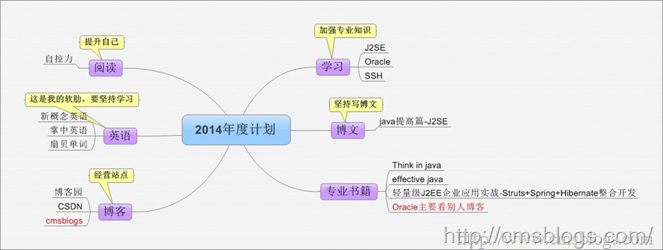

岁月如梭，时光如流，2014年就这样从指间不经意间流过了！在这个流行写年总结的时候，我也按照惯例来份总结。

## 细说2014

时间总是这么不经意间地就流失了，在这不经意间我较为苦逼地，不甘地，欣慰地，满怀干劲地度过了2014。苦逼那是因为我不知道加班了多少个日日夜夜，不甘是因为我今年并没有很好地完成今年的计划，欣慰是因为我辛苦的工作得到了相应的回报，满怀干劲这也许是我的性格吧，不管遇到什么困难我都能已很好的心态来面对，在风雨面前我总是干劲十足地前进。所以
**苦逼、不甘、欣慰、激情这四个词是对我2014年最好的总结** 。

### 工作

我在今年不知道加班了多少个日日夜夜，3月到鄂尔多斯连续工作三个月，中间没有周末，几乎每天都是11、12点回家，当然周末是可以休息的，但是在一个陌生的城市，我不是很喜欢走动，所以没事就往办公司跑。等到出差北京了，也是经常加班其中印象最深刻的就是，由于项目投产整整一个星期睡眠不足24个小时，每天都是4、5点左右休息8点就起来了，还通宵了两个晚上，经过这段时间的折腾我感觉我人都崩溃了。好不容易到了深圳总部又碰到项目赶，又是苦逼连续一两个的加班。最近一个月还是稍微轻松了。

总之在2014年最大的收获就是加班加班，那叫一个让人欲仙欲死啊！不过在自己辛勤的工作下，自己的努力老板也是看在眼里，付出得到了一定的回报。薪资水平我还稍微满意，毕竟我现在需要的不是工资，是锻炼，是机遇，是品尝和公司一起成长的酸甜苦辣。

首先我所从事的行业是我比较喜欢的金融行业，前景较为乐观（过程较为艰辛），所涉及的技术也是方方正正的java，SSH框架，oracle数据库较为满意吧。但是我心有不甘：

**1、工作并没有时常做自己喜欢的服务器端，跑到前端去了。**
这是最坑爹的事情，作为一个经常写服务器代码的程序员，让我去调试CSS、DIV那叫一个让人头疼啊（Ｏ(≧口≦)Ｏ）。好吧，刚刚开始让我做的时候，我就想没事就当做学门技术吧，谁知一干就是大半年啊(
⊙ o ⊙
)！导致现在我感觉我有变成前端工程师的趋向了，这是我所不能容忍的，所以在上周就给老板发了封邮件，强烈要求明年给我安排其他服务器编码工作！虽然今年大部分时间是在编写前端程序，但是后端的程序代码我并没松弛，也会经常去编写代码，对现有代码进行简单的重构、优化！

**2、课余时间没有把握，任务未完成度较大。**
这是今年最大的失误，其根本原因就在于自己的计划实施能力较弱，自我控制能力不够强。当然外在因素也有点就是加班太疯了，休息时间就想睡觉。所以在2015年需要提高自己的计划实施能力和自我控制力。

**3、没有总结，没有形成文档。**
在今年工作过程中，我遇到了很多问题，包括技术方面的，也包括为人处世方面的。但是在技术方面我并没有把遇到的问题总结出来或者说总结的比较少，有这个意识但是没有去付出行动。在工作涉及到的业务方面也没有去认真总结形成文档，导致后面遇到相同的业务问题还是要去问同事，对业务的理解不够。

**4、没有涉及到核心业务。** 在今年工作过程中有两次机会要我涉及到了核心的业务包括代码，但是没有去把握（第一次没有把握，第二次给溜掉了），后悔啊！！！！

### 生活

工作这么忙，想都不用想，平时生活肯定乱七八糟（当然不是那个乱七八糟）、颠三倒四，有时迷迷糊糊，只想睡觉。饮食方面也没有怎么注意过，今年吃坏了几次肚子，急性肠胃炎那叫一个痛啊！！

由于出差原因，今年玩的地方还是蛮多的，鄂尔多斯、呼伦贝尔大草原、北京、郑州、深圳、长沙、广州，到处飞，到处玩。当然还有就是体验各地的风土民情和特产美食。

出差平时放假没事干呢，就会跑出去看电影，有时晚上无聊也会跑去电影院，美国大片几乎全部都在电影院看的，国产的也看了将近10来部。国产不乏好片，但大多数都让人容易睡觉。在深圳的有机会一起出来看个电影O(∩_∩)O~……

今年，
**最大的收获就是找到了自己一生中的另一半，有些时候缘分就是这么神奇，它可以把两个毫不相干的人变成世上最亲密的一对。和她相识、相遇、相知、相恋所有有关她的一切都是这么美好，美好的让我心醉**
。

### 学习

**SSH：**
由于上家公司所使用的框架并不是SSH，只是简单的使用了Struts，所以LZ今年的重点就放在了Struts和Spring上面了。对于Struts，我应该说对它有了更深一步的认识了吧，初步了解了Struts底层的实现和原理。对于Spring，还是只停留在表面上，可以应用，但是对于底层原理还没有去深究。

**WEB前端：**
在其余的学习方面最大的收获部分就是前端。由一个对前端不是很懂的人，变成了熟手，可以这么说，85%前端效果我都可以实现。对jQuery、css的使用还是蛮熟练的。在jquery方面自己写了三个扩展插件，一个对highchart的封装、一个图片轮播、一个元素的拖曳。

**java提高篇：**
同时对java基础有了更深刻的认识，在java提高篇系列博客方面，我写了38篇博客，一直写到了java的集合部分。对于IO、多线程、反射、动态代理等等java高级特性，我认为我现在还没有那个能力去写好她，源码、原理级别的解析我现在肯定还不够格，所以这个系列的博客暂且搁置了，不过以后肯定会写。

**Android：**
从10月份开始就想学了，买了一本书，刚刚开始学习，就碰到了工作很忙，业余时间也不是很够，加上那个时间在研究Struts，所以就把Android的学习给耽搁了，所以Android目前我还只会简单的布局，也可以说我现在就只会简单的UI。在2015年我需要掌握Android！！！

## 总结2014

我苦逼地，不甘地，欣慰地，满怀激情地度过了2014年，其中的滋味只有我自己清楚，什么是苦，什么是甜我都尝了个遍。在这痛苦并快乐的日子里总会有些收获，当然也不免存在一些遗憾之处。

### 完成计划

下图是我2014年初做的计划

在2014年里整体方向还是没有错，但是有几个地方没有去完成。Oracle数据库、英语，这两个部分没有完成。可能是当初制定的计划太小了，导致有些任务算是超额完成吧！

**学习：** 今年主要J2SE、Struts、Spring、WEB前端、Android。

**博客：**
今年总共写了34篇博客，每篇博客都是自己心血，在写博客过程中一边参考别人博客和书籍，一边自己总结知识。当然由于工作加班时间太多了，到了9月份的时候发现今年还有好多学习计划没有完成，于是在9月份的时候就停更了，挺遗憾的。

**专业书籍：** 今年看的专业书有：《Think in java》、《Struts 2技术内幕》、《Spring技术内幕》.《编写搞质量代码-----
改善java程序的151个建议》。感觉看的专业书籍有点儿少啊！在2015年需要看8本左右！

**英语：** 开始几个月都还在坚持记单词，看阅读。到了后面就不了了之了。今年一定要坚持下来。

**阅读：** 整体来说今年看的书籍还可以：《拆掉思维的墙--
原来我们可以这样活》、《程序员，你伤不起》、《如何变的有思想》、《自控力》、《人性的弱点》、《你的生命有什么可能》。

### 收获

1、收获了最珍贵的东西---将会与自己度过一生的伴侣。

2、对Struts，Spring掌握更加深层次了，对面向对象编程进一步理解。

3、熟练掌握WEB前端开发。能够熟练使用jQuery、CSS进行前端设计。

4、对java基础认识更加清晰，通过源码分析掌握java基础，从底层再一次认识java。

5、尝试着在项目中使用设计模式，开始重构项目中的代码。

### 遗憾

1、阅读书籍较少，不管是课外的还是专业的。

2、看别人博客少了，没有怎么去逛论坛、去看博客。

3、缺少锻炼，致使今年估计也长了10多斤肥肉吧。

4、没有放开思想，认识的朋友较少（非常想通过博客、论坛认识一些志同道合的朋友。如有朋友有想和我交谈的兴趣，可以加我QQ：995812509）！

