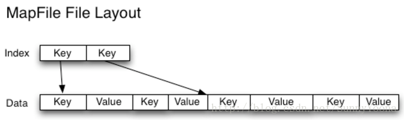

************************************************************************************************************

### 1\. HDFS上的小文件问题

小文件是指文件大小明显小于HDFS上块（block）大小（默认64MB）的文件。如果存储小文件，必定会有大量这样的小文件，否则你也不会使用Hadoop（If
you’re storing small files, then you probably have lots of them (otherwise you
wouldn’t turn to
Hadoop)），这样的文件给hadoop的扩展性和性能带来严重问题。当一个文件的大小小于HDFS的块大小（默认64MB），就将认定为小文件否则就是大文件。为了检测输入文件的大小，可以浏览Hadoop
DFS 主页 http://machinename:50070/dfshealth.jsp ，并点击Browse filesystem（浏览文件系统）。

首先，在HDFS中，任何一个文件，目录或者block在NameNode节点的内存中均以一个对象表示（元数据）（Every file, directory
and block in HDFS is represented as an object in the namenode’s
memory），而这受到NameNode物理内存容量的限制。每个元数据对象约占150byte，所以如果有1千万个小文件，每个文件占用一个block，则NameNode大约需要2G空间。如果存储1亿个文件，则NameNode需要20G空间，这毫无疑问1亿个小文件是不可取的。

其次，处理小文件并非Hadoop的设计目标，HDFS的设计目标是流式访问大数据集（TB级别）。因而，在HDFS中存储大量小文件是很低效的。访问大量小文件经常会导致大量的寻找，以及不断的从一个DatanNde跳到另一个DataNode去检索小文件（Reading
through small files normally causes lots of seeks and lots of hopping from
datanode to datanode to retrieve each small file），这都不是一个很有效的访问模式，严重影响性能。

最后，处理大量小文件速度远远小于处理同等大小的大文件的速度。每一个小文件要占用一个slot，而task启动将耗费大量时间甚至大部分时间都耗费在启动task和释放task上。

### 2\. MapReduce上的小文件问题

Map任务（task）一般一次处理一个块大小的输入（input）（默认使用FileInputFormat）。如果文件非常小，并且拥有大量的这种小文件，那么每一个map
task都仅仅处理非常小的input数据，因此会产生大量的map tasks，每一个map task都会额外增加bookkeeping开销（each of
which imposes extra bookkeeping overhead）。一个1GB的文件，拆分成16个块大小文件（默认block
size为64M），相对于拆分成10000个100KB的小文件，后者每一个小文件启动一个map task，那么job的时间将会十倍甚至百倍慢于前者。

Hadoop中有一些特性可以用来减轻bookkeeping开销：可以在一个JVM中允许task JVM重用，以支持在一个JVM中运行多个map
task，以此来减少JVM的启动开销(通过设置mapred.job.reuse.jvm.num.tasks属性，默认为1，－1表示无限制)。（译者注：如果有大量小文件，每个小文件都要启动一个map
task，则必相应的启动JVM，这提供的一个解决方案就是重用task 的JVM，以此减少JVM启动开销）；另
一种方法是使用MultiFileInputSplit，它可以使得一个map中能够处理多个split。

### 3\. 为什么会产生大量的小文件

至少有两种场景下会产生大量的小文件：

（1）这些小文件都是一个大逻辑文件的一部分。由于HDFS在2.x版本开始支持对文件的append，所以在此之前保存无边界文件（例如，log文件）（译者注：持续产生的文件，例如日志每天都会生成）一种常用的方式就是将这些数据以块的形式写入HDFS中（a
very common pattern for saving unbounded files (e.g. log files) is to write
them in chunks into HDFS）。

（2）文件本身就是很小。设想一下，我们有一个很大的图片语料库，每一个图片都是一个独一的文件，并且没有一种很好的方法来将这些文件合并为一个大的文件。

### 4\. 解决方案

这两种情况需要有不同的解决方 式。

#### 4.1 第一种情况

对于第一种情况，文件是许多记录（Records）组成的，那么可以通过调用HDFS的sync()方法(和append方法结合使用)，每隔一定时间生成一个大文件。或者，可以通过写一个程序来来合并这些小文件（可以看一下Nathan
Marz关于Consolidator一种小工具的文章）。

#### 4.2 第二种情况

对于第二种情况，就需要某种形式的容器通过某种方式来对这些文件进行分组。Hadoop提供了一些选择：

##### 4.2.1 HAR File

Hadoop Archives （HAR
files）是在0.18.0版本中引入到HDFS中的，它的出现就是为了缓解大量小文件消耗NameNode内存的问题。HAR文件是通过在HDFS上构建一个分层文件系统来工作。HAR文件通过hadoop
archive命令来创建，而这个命令实
际上是运行了一个MapReduce作业来将小文件打包成少量的HDFS文件（译者注：将小文件进行合并几个大文件）。对于client端来说，使用HAR文件没有任何的改变：所有的原始文件都可见以及可访问（只是使用har://URL，而不是hdfs://URL），但是在HDFS中中文件数却减少了。

读取HAR中的文件不如读取HDFS中的文件更有效，并且实际上可能较慢，因为每个HAR文件访问需要读取两个索引文件以及还要读取数据文件本身（如下图）。尽管HAR文件可以用作MapReduce的输入，但是没有特殊的魔法允许MapReduce直接操作HAR在HDFS块上的所有文件（although
HAR files can be used as input to MapReduce, there is no special magic that
allows maps to operate over all the files in the HAR co-resident on a HDFS
block）。 可以考虑通过创建一种input format，充分利用HAR文件的局部性优势，但是目前还没有这种input
format。需要注意的是：MultiFileInputSplit，即使在HADOOP-4565（[https://issues.apache.org/jira/browse/HADOOP-4565）的改进，但始终还是需要每个小文件的寻找。我们非常有兴趣看到这个与SequenceFile进行对比。](https://issues.apache.org/jira/browse/HADOOP-4565%EF%BC%89%E7%9A%84%E6%94%B9%E8%BF%9B%EF%BC%8C%E4%BD%86%E5%A7%8B%E7%BB%88%E8%BF%98%E6%98%AF%E9%9C%80%E8%A6%81%E6%AF%8F%E4%B8%AA%E5%B0%8F%E6%96%87%E4%BB%B6%E7%9A%84%E5%AF%BB%E6%89%BE%E3%80%82%E6%88%91%E4%BB%AC%E9%9D%9E%E5%B8%B8%E6%9C%89%E5%85%B4%E8%B6%A3%E7%9C%8B%E5%88%B0%E8%BF%99%E4%B8%AA%E4%B8%8ESequenceFile%E8%BF%9B%E8%A1%8C%E5%AF%B9%E6%AF%94%E3%80%82)
在目前看来，HARs可能最好仅用于存储文档（At the current time HARs are probably best used purely
for archival purposes.）。

##### 4.2.2 SequenceFile

通常对于"小文件问题"的回应会是：使用序列文件（SequenceFile）。这种方法的思路是，使用文件名（filename）作为key，并且文件内容（file
contents）作为value，如下图。在实践中这种方式非常有效。我们回到10,000个100KB小文件问题上，你可以编写一个程序将它们放入一个单一的SequenceFile，然后你可以流式处理它们（直接处理或使用MapReduce）操作SequenceFile。这样同时会带来两个优势：（1）SequenceFiles是可拆分的，因此MapReduce可以将它们分成块并独立地对每个块进行操作；（2）它们同时支持压缩，不像HAR。
在大多数情况下，块压缩是最好的选择，因为它将压缩几个记录为一个块，而不是一个记录压缩一个块。（Block compression is the best
option in most cases, since it compresses blocks of several records (rather
than per record)）。

将现有数据转换为SequenceFile可能很慢。 但是，完全可以并行创建SequenceFile的集合。（It can be slow to
convert existing data into Sequence Files. However, it is perfectly possible
to create a collection of Sequence Files in parallel.）Stuart
Sierra写了一篇关于将tar文件转换为SequenceFile的文章（<https://stuartsierra.com/2008/04/24/a-million-
little-files>
），像这样的工具是非常有用的，我们应该多看看。展望未来，最好设计数据管道，将源数据直接写入SequenceFile（如果可能），而不是作为中间步骤写入小文件。

与HAR文件不同，没有办法列出SequenceFile中的所有键，所以不能读取整个文件。Map
File，就像对键进行排序的SequenceFile，只维护了部分索引，所以他们也不能列出所有的键，如下图。

SequenceFile是以Java为中心的。
TFile（<https://issues.apache.org/jira/browse/HADOOP-4565>
）设计为跨平台，并且可以替代SequenceFile，不过现在还不可用。

##### 4.2.3 HBase

如果你生产很多小文件，那么根据访问模式，不同类型的存储可能更合适（If you are producing lots of small files,
then, depending on the access pattern, a different type of storage might be
more appropriate）。HBase以Map
Files（带索引的SequenceFile）方式存储数据，如果您需要随机访问来执行MapReduce式流式分析，这是一个不错的选择（ HBase
stores data in MapFiles (indexed SequenceFiles), and is a good choice if you
need to do MapReduce style streaming analyses with the occasional random look
up）。如果延迟是一个问题，那么还有很多其他选择 - 参见Richard
Jones对键值存储的调查（<http://www.metabrew.com/article/anti-rdbms-a-list-of-
distributed-key-value-stores/>）。

原文：<http://blog.cloudera.com/blog/2009/02/the-small-files-problem/>

###############################################################################################################

# Hadoop对小文件的解决方案

2015年06月07日 22:07:51

阅读数：3469

小文件指的是那些size比HDFS的block
size(默认64M)小的多的文件。任何一个文件，目录和block，在HDFS中都会被表示为一个object存储在namenode的内存中，
每一个object占用150 bytes的内存空间。所以，如果有10million个文件， 每一个文件对应一个block，那么就将要消耗namenode
3G的内存来保存这些block的信息。如果规模再大一些，那么将会超出现阶段计算机硬件所能满足的极限。  
控制小文件的方法有：

> 1、应用程序自己控制  
> 2、archive  
> 3、Sequence File / Map File  
> 4、CombineFileInputFormat***  
> 5、合并小文件，如HBase部分的compact

### 1、应用程序自己控制

    
    
    final Path path = new Path("/combinedfile");
    final FSDataOutputStream create = fs.create(path);
    final File dir = new File("C:\\Windows\\System32\\drivers\\etc");
    for(File fileName : dir.listFiles()) 
    {
        System.out.println(fileName.getAbsolutePath());
        final FileInputStream fileInputStream = new
    FileInputStream(fileName.getAbsolutePath());
        final List<String> readLines = IOUtils.readLines(fileInputStream);
        for (String line : readLines) 
        {
            create.write(line.getBytes());
        }
        fileInputStream.close();
    }
    create.close();

### 2、archive 命令行操作

具体参考如下：  
<http://blog.csdn.net/scgaliguodong123_/article/details/46341587>

#### 文件归档 Archive

hadoop不适合小文件的存储，小文件本身就占用了很多metadata,就会造成namenode越来越大。  
Hadoop Archives (HAR files)是在0.18.0版本中引入的，它的出现就是为了  
缓解大量小文件消耗namenode内存的问题。  
HAR文件是通过在HDFS上构建一个层次化的文件系统来工作。一个HAR文件是通过hadoop的archive命令来创建，而这个命令实际上也是运行了一个MapReduce任务来将小文件打包成HAR。对于client端来说，使用HAR文件没有任何影响。所有的原始文件都使用har://URL。但在HDFS端它内部的文件数减少了。  
通过HAR来读取一个文件并不会比直接从HDFS中读取文件高效，而且实际上可能还会稍微低效一点，因为对每一个HAR文件的访问都需要完成两层读取，index文件的读取和文件本身数据的读取。并且尽管HAR文件可以被用来作为MapReduce
job的input，但是并没有特殊的方法来使maps将HAR文件中打包的文件当作一个HDFS文件处理。  
创建文件 `hadoop archive -archiveName xxx.har -p /src /dest`  
查看内容 `hadoop fs -lsr har:///dest/xxx.har`

    
    
    [root@master liguodong]# hadoop archive
    archive -archiveName NAME -p <parent path> <src>* <dest>
    [root@master liguodong]# hadoop fs -lsr /liguodong
    drwxrwxrwx   - hdfs      hdfs          0 2015-05-04 19:40 /liguodong/output
    -rwxrwxrwx   3 hdfs      hdfs          0 2015-05-04 19:40 /liguodong/output/_SUCCESS
    -rwxrwxrwx   3 hdfs      hdfs         23 2015-05-04 19:40 /liguodong/output/part-r-00000
    
    [root@master liguodong]# hadoop archive -archiveName liguodong.har -p /liguodong output /liguodong/har
    
    [root@master liguodong]# hadoop fs -lsr /liguodong
    drwxr-xr-x   - root      hdfs          0 2015-06-03 11:15 /liguodong/har
    drwxr-xr-x   - root      hdfs          0 2015-06-03 11:15 /liguodong/har/liguodong.har
    -rw-r--r--   3 root      hdfs          0 2015-06-03 11:15 /liguodong/har/liguodong.har/_SUCCESS
    -rw-r--r--   5 root      hdfs        254 2015-06-03 11:15 /liguodong/har/liguodong.har/_index
    -rw-r--r--   5 root      hdfs         23 2015-06-03 11:15 /liguodong/har/liguodong.har/_masterindex
    -rw-r--r--   3 root      hdfs         23 2015-06-03 11:15 /liguodong/har/liguodong.har/part-0
    drwxrwxrwx   - hdfs      hdfs          0 2015-05-04 19:40 /liguodong/output
    -rwxrwxrwx   3 hdfs      hdfs          0 2015-05-04 19:40 /liguodong/output/_SUCCESS
    -rwxrwxrwx   3 hdfs      hdfs         23 2015-05-04 19:40 /liguodong/output/part-r-00000
    
    查看内容
    [root@master liguodong]# hadoop fs -lsr har:///liguodong/har/liguodong.har
    lsr: DEPRECATED: Please use "ls -R" instead.
    drwxr-xr-x   - root hdfs          0 2015-05-04 19:40 har:///liguodong/har/liguodong.har/output
    -rw-r--r--   3 root hdfs          0 2015-05-04 19:40 har:///liguodong/har/liguodong.har/output/_SUCCESS
    -rw-r--r--   3 root hdfs         23 2015-05-04 19:40 har:///liguodong/har/liguodong.har/output/part-r-00000
    
    ---------------------------------------------------------------
    [root@master liguodong]# hadoop archive -archiveName liguodong2.har -p /liguodong/output /liguodong/har
    
    [root@master liguodong]# hadoop fs -lsr har:///liguodong/har/liguodong2.har
    -rw-r--r--   3 root hdfs          0 2015-05-04 19:40 har:///liguodong/har/liguodong2.har/_SUCCESS
    -rw-r--r--   3 root hdfs         23 2015-05-04 19:40 har:///liguodong/har/liguodong2.har/part-r-00000

### 3、Sequence File/Map File

Sequence File  
通常对于”the small files problem”的回应会是：使用SequenceFile。  
这种方法是说，使用filename作为key，并且file contents作为value。实践中这种方式非常管用。  
如果有10000个100KB的文件，可以写一个程序来将这些小文件写入到一个单独的 SequenceFile中去，然后就可以在一个streaming
fashion(directly or using
mapreduce)中来使用这个sequenceFile。不仅如此，SequenceFiles也是splittable的，所以mapreduce
可以break them into chunks，并且分别的被独立的处理。和HAR不同的是，这种方式还支持压缩。
block的压缩在许多情况下都是最好的选择，因为它将多个 records压缩到一起，而不是一个record一个压缩。

在存储结构上， SequenceFile主要由一个Header后跟多条Record组成。  
Header主要包含了Key classname， Value
classname，存储压缩算法，用户自定义元数据等信息，此外，还包含了一些同步标识，用于快速定位到记录的边界。

每条Record以键值对的方式进行存储，用来表示它的字符数组可依次解析成：记录的长度、 Key的长度、
Key值和Value值，并且Value值的结构取决于该记录是否被压缩。

数据压缩有利于节省磁盘空间和加快网络传输， SeqeunceFile支持两种格式的数据压缩，分别是： record compression和block
compression。  
record compression是对每条记录的value进行压缩  
block compression是将一连串的record组织到一起，统一压缩成一个block。  
block信息主要存储了：块所包含的记录数、每条记录Key长度的集合、每条记录Key值的集合、每条记录Value长度的集合和每条记录Value值的集合  
注：每个block的大小是可通过`io.seqfile.compress.blocksize`属性来指定的。

    
    
    Configuration conf=new Configuration();
    FileSystem fs=FileSystem.get(conf);
    Path seqFile=new Path("seqFile.seq");
    //Reader内部类用于文件的读取操作
    SequenceFile.Reader reader=new SequenceFile.Reader(fs,seqFile,conf);
    //Writer内部类用于文件的写操作,假设Key和Value都为Text类型
    SequenceFile.Writer writer=new SequenceFile.Writer(fs,conf,seqFile,Text.class,Text.class);
    //通过writer向文档中写入记录
    writer.append(new Text("key"),new Text("value"));
    IOUtils.closeStream(writer);//关闭write流
    //通过reader从文档中读取记录
    Text key=new Text();
    Text value=new Text();
    while(reader.next(key,value))
    {
        System.out.println(key);
        System.out.println(value);
    }
    IOUtils.closeStream(reader);//关闭read流

具体可参考：  
<http://blog.csdn.net/scgaliguodong123_/article/details/46391061>

MapFile  
MapFile是排序后的SequenceFile,通过观察其目录结构可以看到  
MapFile由两部分组成，分别是data和index。  
index作为文件的数据索引，主要记录了每个Record的key值，以及  
该Record在文件中的偏移位置。  
在MapFile被访问的时候,索引文件会被加载到内存，通过索引映射关系可迅速定位到指定Record所在文件位置，因此，相对SequenceFile而言，
MapFile的检索效率是高效的，缺点是会消耗一部分内存来存储index数据。  
需注意的是，
MapFile并不会把所有Record都记录到index中去，默认情况下每隔128条记录存储一个索引映射。当然，记录间隔可人为修改，通过MapFIle.Writer的setIndexInterval()方法，或修改`io.map.index.interval`属性；  
另外，与SequenceFile不同的是， MapFile的KeyClass一定要实现  
WritableComparable接口 ,即Key值是可比较的。

    
    
    Configuration conf=new Configuration();
    FileSystem fs=FileSystem.get(conf);
    Path mapFile=new Path("mapFile.map");
    //Writer内部类用于文件的写操作,假设Key和Value都为Text类型
    MapFile.Writer writer=new MapFile.Writer(conf,fs,mapFile.toString(),Text.class,Text.class);
    //通过writer向文档中写入记录
    writer.append(new Text("key"),new Text("value"));
    IOUtils.closeStream(writer);//关闭write流
    //Reader内部类用于文件的读取操作
    MapFile.Reader reader=new MapFile.Reader(fs,mapFile.toString(),conf);
    //通过reader从文档中读取记录
    Text key=new Text();
    Text value=new Text();
    while(reader.next(key,value))
    {
        System.out.println(key);
        System.out.println(value);
    }
    IOUtils.closeStream(reader);//关闭read流

### 5、CombineFileInputFormat

相对于大量的小文件来说，hadoop更合适处理少量的大文件。  
CombineFileInputFormat可以缓解这个问题，它是针对小文件而设计的。  
**注：**CombineFileInputFormat是一个抽象类，需要编写一个继承类。  
使用CombineFileInputFormat作为Map任务的输入规格描述，首先需要实现一个自定义的RecordReader。

CombineFileInputFormat的大致原理  
它会将输入多个数据文件（小文件）的元数据全部包装到CombineFileSplit类里面。也就是说，因为小文件的情况下，在HDFS中都是单Block的文件，即一个文件一个Block，一个CombineFileSplit包含了一组文件Block，包括每个文件的起始偏移（offset），长度（length），Block位置（localtions）等元数据。

如果想要处理一个
CombineFileSplit，很容易想到，对其包含的每个InputSplit（实际上这里面没有这个，你需要读取一个小文件块的时候，需要构造一
个FileInputSplit对象）。  
在执行MapReduce任务的时候，需要读取文件的文本行（简单一点是文本行，也可能是其他格式数据）。  
那么对于CombineFileSplit来说，你需要处理其包含的小文件Block，就要对应设置一个RecordReader，才能正确读取文件数据内容。  
通常情况下，我们有一批小文件，格式通常是相同的，只需要在CombineFileSplit实现一个RecordReader的时候，  
内置另一个用来读取小文件Block的RecordReader，这样就能保证读取CombineFileSplit内部聚积的小文件。

我们基于Hadoop内置的CombineFileInputFormat来实现处理海量小文件，需要做的工作，如下所示：  
1、实现一个RecordReader来读取CombineFileSplit包装的文件Block  
2、继承自CombineFileInputFormat实现一个使用我们自定义的RecordReader的输入规格说明类。  
3、处理数据的Mapper实现类  
4、配置用来处理海量小文件的MapReduce Job

    
    
    package SmallFile;
    
    import java.io.IOException;
    
    import org.apache.hadoop.fs.Path;
    import org.apache.hadoop.io.BytesWritable;
    import org.apache.hadoop.io.LongWritable;
    import org.apache.hadoop.mapreduce.InputSplit;
    import org.apache.hadoop.mapreduce.RecordReader;
    import org.apache.hadoop.mapreduce.TaskAttemptContext;
    import org.apache.hadoop.mapreduce.lib.input.CombineFileInputFormat;
    import org.apache.hadoop.mapreduce.lib.input.CombineFileRecordReader;
    import org.apache.hadoop.mapreduce.lib.input.CombineFileSplit;
    import org.apache.hadoop.mapreduce.lib.input.FileSplit;
    import org.apache.hadoop.mapreduce.lib.input.LineRecordReader;
    
    public class CombineSmallfileInputFormat extends
                CombineFileInputFormat<LongWritable,BytesWritable>
    {
        @Override
        public RecordReader<LongWritable, BytesWritable> createRecordReader(
                InputSplit split, TaskAttemptContext context) throws IOException
        {
            CombineFileSplit combineFileSplit = (CombineFileSplit)(split);
            CombineFileRecordReader<LongWritable,BytesWritable> recordReader = 
                new CombineFileRecordReader<LongWritable,BytesWritable>
                (combineFileSplit, context,CombineSmallfileRecordReader.class);
            try
            {
                recordReader.initialize(combineFileSplit, context);
            }
            catch (InterruptedException e)
            {
                e.printStackTrace();
            }
            return recordReader;
        }
    }
    
    
    class CombineSmallfileRecordReader extends RecordReader<LongWritable,BytesWritable>
    {
        private CombineFileSplit combineFileSplit;
        private LineRecordReader lineRecordReader = new LineRecordReader();
        private Path[] paths;
        private int totalLength;
        private int currentIndex;
        private float currentProgress = 0;
        private LongWritable currentKey;
        private BytesWritable currentValue;
    
        public CombineSmallfileRecordReader(CombineFileSplit combineFileSplit,TaskAttemptContext context,Integer index)
        {
            super();
            this.combineFileSplit = combineFileSplit;
            this.currentIndex = index;
        }
    
         @Override
         public void initialize(InputSplit split, TaskAttemptContext context)
           throws IOException, InterruptedException
         {
              FileSplit fileSplit = new FileSplit(combineFileSplit.getPath(currentIndex),
                      combineFileSplit.getOffset(currentIndex),combineFileSplit.getLength(currentIndex),
                      combineFileSplit.getLocations());
              lineRecordReader.initialize(fileSplit, context);
              this.paths = combineFileSplit.getPaths(); //分区所在的所有地址
              context.getConfiguration().set("map.input.file.name", 
                      combineFileSplit.getPath(currentIndex).getName()); //设置输入文件名
         }
    
         @Override
         public boolean nextKeyValue() throws IOException, InterruptedException
         {
             if(currentIndex>=0 && currentIndex<totalLength)
             {
                 return lineRecordReader.nextKeyValue();
             }
             return false;
         }
    
         @Override
         public LongWritable getCurrentKey() throws IOException, InterruptedException
         {
              currentKey = lineRecordReader.getCurrentKey();
              return currentKey;
         }
    
         @Override
         public BytesWritable getCurrentValue() throws IOException, InterruptedException
         {
              byte[]value = lineRecordReader.getCurrentValue().getBytes();
              currentValue.set(value, 0, value.length);
              return currentValue;
         }
    
         @Override
         public float getProgress() throws IOException, InterruptedException
         {
              if(currentIndex>=0 && currentIndex<totalLength)
              {
                   currentProgress = currentIndex/totalLength;
                   return currentProgress;
              }
              return currentProgress;
         }
    
         @Override
         public void close() throws IOException
         {
             lineRecordReader.close();
         }
    }  
      
    

