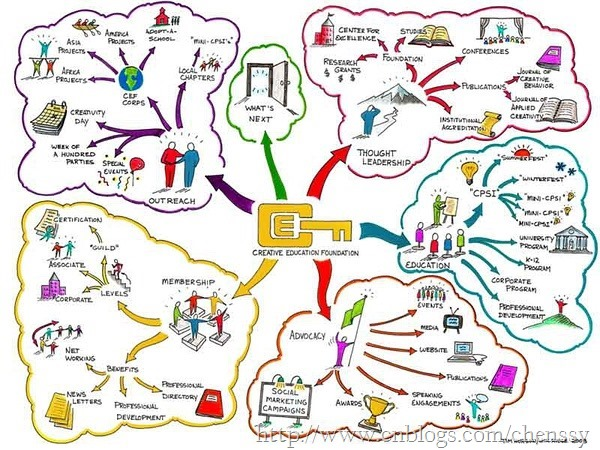

##工作和学习矛盾之我见

##
##LZ最近两天工作有点儿心不在焉，不在状态，对此LZ对老板、经理、老大说声抱歉。

##
##从一踏入社会工作，我就告诫自己一定要认真工作、努力学习，尽最大努力提升自己，尽早实现自己的目标。所以我在经常利用工作以外的时间来坚持学习，有时如果工作不忙的话，我可能会利用工作时间在学习。但是最近LZ发现自己对工作的业务理解并不是那么好，别人问我关于业务的方面的东西自己也是一知半解，对此LZ深表惭愧。虽然在新公司干了三个月，但是对具体的核心业务理解还不是那么深。虽然每天完成都是坐在那里工作，但对工作的收获并没有超出我的预期（最近发现）。所以LZ深思，我发现其根本原因就在于我们没有很好地处理工作和学习之间的关系。

##
##你问我工作和学习有没有矛盾？我说一定有，一定存在！起码我遇到了，在我的认知里面我也许在这段时间内把自身的学习看得比工作还重，这点在我看来是千错万错的做法！！！！

##
##工作和学习是一对“朋友”，如果能和睦相处，就能产生很大的能量，使你有更多的精神食粮，面对生活中许多意想不到的事件。就会自然地迎韧而解。如果不能合理运用他们，那么这两个“朋友”就会吵架，产生矛盾，也许就会接二连三的遇到更多的困惑，产生负面的心理压力，精神压力，甚至体力的透支。那么，我们如何处理好工作和学习的矛盾呢？让工作和学习的矛盾减少到最低限度，甚至还会产生向前的有效动力，芝麻开花节节高。我认为主要有如下三点。
##一、分清主次关系   

##
##主观上要摆正学习与工作的关系，始终保持良好的学习态度。 

##
##对待工作和学习我们必须要有一个非常清晰的认识，出了社会我们不再是那个单纯、已学习为主的学生了，而是一个正式的、在为别人服务的上班族了。对于上班族而言，工作应该是放在第首位，学习应该居其后。当然LZ不是说有了工作就可以放弃学习，而是要区分它们之间的主次关系。前面LZ已经说过，工作与学习是一体的，密不可分！！要想将工作做好是需要有良好的专业技能来做保障的，而这是需要依靠学习才能得来的。

##
##工作是需要良好的学习来做保障，而学习是为更好的工作服务！工作是我们的衣食父母，我们必须对其付出人家才会给与我们报酬，不好好工作，人家凭什么给予money！！LZ一直认为，学习是为了更好的工作，知识只有产生了价值才有存在的意义，要不然你学习他干嘛？？

##
##学习工作化，要把学习与工作一样认真对待；工作学习化，要把工作的过程看成是学习的过程。学习工作化，意味着你必须要想对工作一样认真对待他，你三天打鱼两天晒网是学不到任何东西的。不认真学习就没有好工作，没有好工作就没有money，没有money就没有…，如里如果我们这样想会不会有那么点动力呢？工作学习化，就是说我们完全可以把工作看成学习的过程，本身工作就是一种学习，在工作过程中我们与同事保持乐观的交流，找出与同事之间的差距，然后针对差距选择性的学习，这样就能很好地避短，为工作服务。   

##
##工作学习密不可分！但工作为主导地位！    

##
##工作是需要良好的学习来做保障，而学习是为更好的工作服务！    

##
##学习工作化，要把学习与工作一样对待；工作学习化，要把工作的过程看成是学习的过程！ 
##二、合理安排时间   

##
##提高效率，学会运用时间的艺术。 

##
##上帝是公平的，它给予每个人都是24个小时！正是因为时间的有限，才会产生工作和学习之间的矛盾！每一月、每一周、每一天时间都是固定的，但是对于我们来说，工作、学习时间是弹性的。如果我们能够很好地处理、精心地规划时间，做到工作、学习两不误，我想他们之间的矛盾自然而然就化解了。

##
##比如我们利用下班之余，自己在家看看书、coding、学习专业知识来充实自己！坐地铁、公交看看博客、记记单词也是不错的选择。当然可能有人会说天天加班累死了，哪有精力看书，我说难道你一月30天天天在工作，一年365天时时在工作，如果这样，好吧我想你那不是工作，是玩命，不要命！！！

##
##所以，计划好自己的时间，提前合理的规划自己的学习时间，我想时间就像海绵里的水，挤挤总会有的！！   

##
##在事业上有所成就的人无一不是利用时间的好帮手。------华罗庚 
##三、专注   

##
##一心不二用，认真、专注做好一件事！！ 

##
##专注也就意味着你必须舍弃很多“有趣”的事情，比如游戏、手机、甚至逛街等等！对于我们来说很多时候我们是需要抵御诱惑的！工作时你是否时不时的看下QQ、微信，刷下微博，看下新闻，淘下宝。学习时你是不是有事没事就玩下手机，玩下电脑。如果是这样那么你所积累的工作、学习任务就会越来越多，在有效的24小时内他们所产生的交集就会越来越大，当然矛盾就会越明显，越大！

##
##所以我们是否应该这样做：工作时专心致志雷厉风行，珍惜时间的价值，用最短的时间完成工作，多余熟悉公司业务，学习工作相关的技术，从分利用业余的时间来做有意义的事情。同时科学地安排摸准自己的生物钟，充分利用最佳时间来创造良好的工作、学习效果。
##四、最后

##
##LZ不才，只是一个初入社会小子，对工作和学习的把握度也不是很准，这个需要我不断去摸索！同时对于上面的意见只是鄙人的拙见，难登大雅，如有初入望各位前辈、同仁指正。

##
##同时由于每个人的具体情况各不相同，没有一个适合所有人的万全之策。所以每个人解决工作、学习之间的矛盾方法各不相同，如你有更好的建议，希望你能分享出来。

##
##最后，如果你学习的目的是为了考学，请把重点放在学习上。如果你学习的目的是为了更好的工作，在做好本职工作的基础上，挤点时间学习，因为这学习是为了提高工作能力和效率。

##
## 