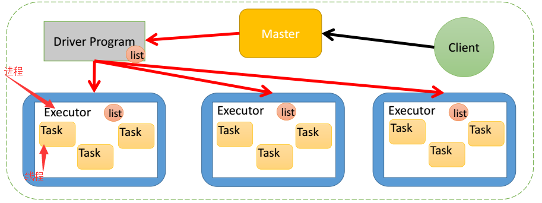
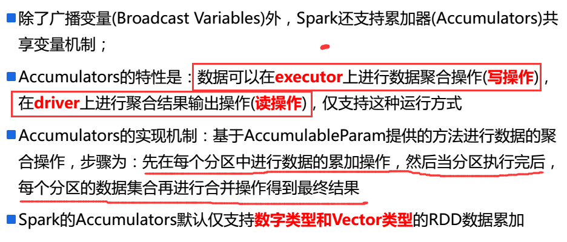

[广播变量与累加器](https://www.cnblogs.com/juncaoit/p/6542166.html)

1.广播变量机制

将传递给task的值，变成传递给executor。

为什么可以共用，因为task是executor下的线程。

只读的变量，在task中不允许修改

2.累加器介绍

在只写的变量，在task中只允许被修改，不允许读的操作。

但是在driver中就只能读操作。

一：如何定义一个广播变量？

val a = Array(1,2,3,4,5)

val b = sc.broadcast(a)

二：如何还原一个广播变量？

val c = b.value

三：定义广播变量需要的注意点？

变量一旦被定义为一个广播变量，那么这个变量只能读，不能修改

四：为什么要将变量定义成广播变量？

如果我们要在分布式计算里面分发大对象，eg：字典，集合，黑白名单等，这个都会用driver端进行分发，一般来讲，如果这个变量不是广播变量，那么每个task就会分发一份，这在task数目十分多的情况下driver的带宽会成为系统的瓶颈，如果将这个变量声明为广播变量，那么知识每个executor拥有一份，这个executor启动的task会共享这个变量，节省了通信的成本

一：如何定义一个累加器？

val a = sc.accumulator(0)

二：如何还原一个累加器？

val b = a.value

三：为什么要将一个变量定义为一个累加器？

在spark应用程序中，我们经常会有这样的需求，如异常监控，调试，记录符合某特性的数据的数目，这种需求都需要用到计数器，如果一个变量不被声明为一个累加器，那么它将在被改变时不会再driver端进行全局汇总，即在分布式运行时每个task运行的知识原始变量的一个副本，并不能改变原始变量的值，但是当这个变量被声明为累加器后，该变量就会有分布式计数的功能。

