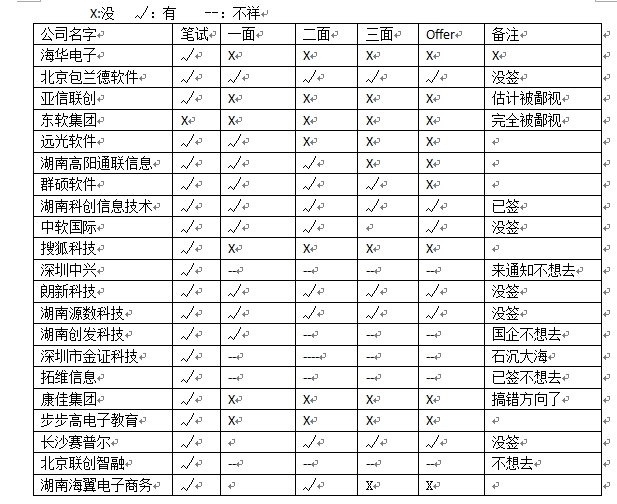

从找到工作到现在已经将近快两个星期了,这两个星期除了每天上课就是在寝室玩,还真有点堕落的感觉。同时中间也经历一些事情，让自己看清楚了某些东西，应该说是自己更加明白了自己想要的是什么吧。

国庆后开始找工作，开始信心满满，自认为学的不错，应该能够找到一份自己满意的工作。从开始希望的5000+，变成4000+。从开始的信心满满到失落、迷茫。在这个过程中学到了很多东西：更加坚强、遗漏知识的弥补、为人处事的方法。

国庆期间自己就开始写简历，注册了不知道多少家网站，将以前做过的项目整理出来，在这个过程中发现自己的大学过的也不是那么的完美。10月7号我整理了三天的求职行程，打印了一些简历、证书、奖励。10月8号上午9点的火车正式到达中南大学。晚上参加海华电子—我的第一场宣讲会就献给他们了。信心满满做在哪里听他们的宣讲，信心满满的做笔试，但是结果是我被鄙视了。

在这次求职历程中我觉得最悲剧的就是学历的歧视，连笔试的机会都不给我，直接看我简历不是211、985学校就给过滤掉了，真心的想扁人。我清晰的记得某个公司的HR(名字就不透露了)：我们不是歧视你们的学历，而是我们要继承具有中国特色的高考制度。继承你妹啊，歧视就歧视还讲这么冠冕堂皇的理由。听到这样的话，我立马就走，你瞧不起哥，哥还瞧不起你呢。此处不留爷，自由留爷处。想我当初拿下第一个offer的时候，群劈两个中南，两个湖大的，不照样地给哥干掉了么。事实证明哥是优秀的。

在求职中我认为最重要的就是心态要好。心态决定出路，每个人的求职历程不是那么的顺利，你肯定会失落，迷茫。这个时候一定要调整好心态，相信自己是优秀，总会有那么一家公司是适合自己的，公司不要你，不是你不优秀，而是你不适合这个岗位。

在求职中我认为最忌讳的就是谎言。真诚永远都是最好的。莎士比亚说：真诚质朴却比巧妙的言语更能打动我。我去求职时，没有看任何面试技巧方面的东西，什么西装、领带、皮鞋都没有，也没有准备什么很花俏的自我介绍。面试的时候完全是凭借自己的那份真诚去面对HR。记得有一次技术面的时候，那个技术总监问我几个我问题我都不知道，我就很爽快的说我不知道。但是还是上了，最后那个技术总监说我够坦率。那是啦，不知道就是不知道，何必在哪里纠结呢，浪费双方的时间。还有就是不要再简历上面作假，是什么就是什么，懂什么就写什么，没有必要欺骗那些HR。天网恢恢疏而不漏….

在笔试的过程中，不知道的可以把你的想法写出来。记得在群硕软件的时候，最后那个算法题目真心的不会，但是我还是把我的想法给写出来了，面试的时候技术总监还说我的想法不错，但是我还是实现不了。有次XML文件找错，我靠，我真的没有看过XML的语法，最后还是写了那个什么什么求情的话，说什么我没有看过这个，只是在做项目的时候做过一些配置，对其中的语法不是很清楚，给我时间的话，我可以很快的掌握，这个既然还有用，那个HR说我还蛮有趣的。呵呵。。。我自己也认为我蛮有趣。

最后把我应聘的公司给写记录下来吧！毕竟是一份珍贵的经历啊…

我觉得对一个毕业生而言前5年是最重要的，这五年可以决定未来的发展。这个时候我们需要如何去选择呢？选择正确的行业，正确的公司从事着正确的工作。工薪待遇倒是其次，关键就在于这个公司能够给你最好的发展。至于我为什么去选择这个待遇不是很好的科创，理由由上….

