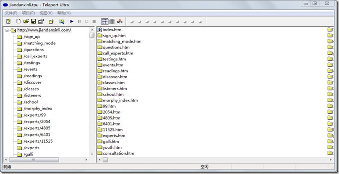
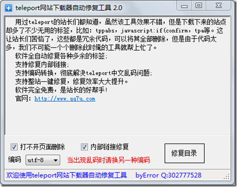

经常由于某些原因我们需要爬取某一个网站或者直接复制某一个站点，到网上找了很多工具进行测试，试了很多各有各的问题，最终选择了Teleport
Ultra，用起来效果很好；具体的操作手册等东西就不在这里说了，网上搜索一下有很多，这里主要说遇到的问题：

软件下载地址：<http://download.csdn.net/detail/ityouknow/9506423>

工具截图：

测试抓取的网站为简单心理：[www.jiandanxinli.com](http://www.jiandanxinli.com)

抓取后的效果图

一般我会选择复制100级基本上也就把网站的东西全部copy下来了，但是因为Teleport Ultra
是以UTF-8的编码进行的抓取如果文件中有中文字符，或者gbk编码的文件就会出现乱码如下图：

当然手动在浏览器选择UTF-8也可以，但是咱不能每次打开都这样干吧。于是到网站找到一款软件叫：TelePort乱码修复工具（siteRepair-v2.0），经过测试可以解决乱码的问题，这款工具也会清除一些无效的链接和html符号等。

软件下载地址：<http://download.csdn.net/detail/ityouknow/9506429>

软件截图：

绝大数网站再经过这两个步骤应该都已经OK了，但是有的网站的层级结构中用到了中文目录或者中文的文件名就会出现乱码，类似下面的URL地址：

[http://www.xxxx.com/.com/question/](http://www.xxxx.com/.com/question/)除了加锁，还有什么方法解决资源竞争的问题？/解决方案.html

这样网站的结构抓取下来就会出现两种乱码：1）文件夹名乱码 2）文件名乱码

遇到这个问题siteRepair-v2.0工具就会报错，我估计是不能识别乱码的文件夹或者文件吧。

后来在网上找了一个PHP的程序，进行了简单的修改测试可以解决这个问题

PHP代码:convert.php

    
    
    <?php
    function listDir($dir)
    {
        if(is_dir($dir))
        {
            if ($dh = opendir($dir)) 
            {
                while (($file = readdir($dh)) !== false)
                {
                    if((is_dir($dir."/".$file)) && $file!="." && $file!="..")
                    {
                        rename($dir."/".$file,$dir."/".mb_convert_encoding($file,"GBK", "UTF-8"));
                        listDir($dir."/".$file."/");
                    }
                    else
                    {
                        if($file!="." && $file!="..")
                        {
                             $name=rename($dir."/".$file,$dir."/".str_replace("\\","",mb_convert_encoding($file,"GBK", "UTF-8")));
                             echo "路径：".$dir."/".$file." ";
                             echo "结果： ".str_replace("\\","",mb_convert_encoding($file,"GBK", "UTF-8"))." ";
                        }
                    }
                }
                closedir($dh);
            }
        }
    }
    ?>
    <?php
    //开始运行
    listDir("./convert");
    
    ?>

在代码的同级目录下，新建 convert文件夹，把乱码的文件放入这个目录，然后执行convert.php即可。

