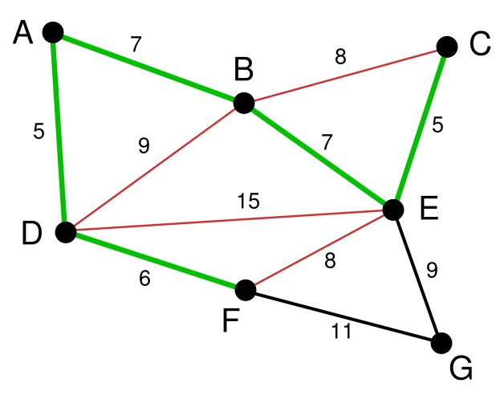
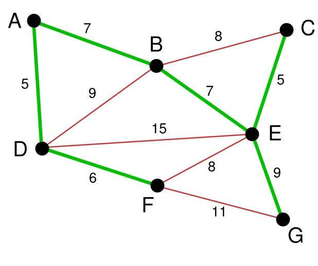

**Prim算法**

**1.概览**

**普里姆算法**
（Prim算法），图论中的一种算法，可在加权连通图里搜索最小生成树。意即由此算法搜索到的边子集所构成的树中，不但包括了连通图里的所有顶点（英语：Vertex
(graph theory)），且其所有边的权值之和亦为最小。该算法于1930年由捷克数学家沃伊捷赫·亚尔尼克（英语：Vojtěch
Jarník）发现；并在1957年由美国计算机科学家罗伯特·普里姆（英语：Robert C.
Prim）独立发现；1959年，艾兹格·迪科斯彻再次发现了该算法。因此，在某些场合，普里姆算法又被称为DJP算法、亚尔尼克算法或普里姆－亚尔尼克算法。

**2.算法简单描述**

1).输入：一个加权连通图，其中顶点集合为V，边集合为E；

2).初始化：Vnew = {x}，其中x为集合V中的任一节点（起始点），Enew = {},为空；

3).重复下列操作，直到Vnew = V：

a.在集合E中选取权值最小的边<u,
v>，其中u为集合Vnew中的元素，而v不在Vnew集合当中，并且v∈V（如果存在有多条满足前述条件即具有相同权值的边，则可任意选取其中之一）；

b.将v加入集合Vnew中，将<u, v>边加入集合Enew中；

4).输出：使用集合Vnew和Enew来描述所得到的最小生成树。

下面对算法的图例描述  
  
<table>  
<tr>  
<th>

图例

</th>  
<th>

说明

</th>  
<th>

不可选

</th>  
<th>

可选

</th>  
<th>

已选（Vnew）

</th></tr>  
<tr>  
<td>

</td>  
<td>

此为原始的加权连通图。每条边一侧的数字代表其权值。

</td>  
<td>

-
</td>  
<td>

-
</td>  
<td>

-
</td> </tr>  
<tr>  
<td>

</td>  
<td>

顶点 **D** 被任意选为起始点。顶点 **A** 、 **B** 、 **E** 和 **F** 通过单条边与 **D** 相连。 **A** 是距离
**D** 最近的顶点，因此将 **A** 及对应边 **AD** 以高亮表示。

</td>  
<td>

C, G

</td>  
<td>

A, B, E, F

</td>  
<td>

D

</td> </tr>  
<tr>  
<td>

</td>  
<td>

下一个顶点为距离 **D** 或 **A** 最近的顶点。 **B** 距 **D** 为9，距 **A** 为7， **E** 为15， **F**
为6。因此， **F** 距 **D** 或 **A** 最近，因此将顶点 **F** 与相应边 **DF** 以高亮表示。

</td>  
<td>

C, G

</td>  
<td>

B, E, F

</td>  
<td>

A, D

</td> </tr>  
<tr>  
<td>

</td>  
<td>

算法继续重复上面的步骤。距离 **A** 为7的顶点 **B** 被高亮表示。

</td>  
<td>

C

</td>  
<td>

B, E, G

</td>  
<td>

A, D, F

</td> </tr>  
<tr>  
<td>

</td>  
<td>

在当前情况下，可以在 **C** 、 **E** 与 **G** 间进行选择。 **C** 距 **B** 为8， **E** 距 **B** 为7，
**G** 距 **F** 为11。 **E** 最近，因此将顶点 **E** 与相应边 **BE** 高亮表示。

</td>  
<td>

无

</td>  
<td>

C, E, G

</td>  
<td>

A, D, F, B

</td> </tr>  
<tr>  
<td>

</td>  
<td>

这里，可供选择的顶点只有 **C** 和 **G** 。 **C** 距 **E** 为5， **G** 距 **E** 为9，故选取 **C** ，并与边
**EC** 一同高亮表示。

</td>  
<td>

无

</td>  
<td>

C, G

</td>  
<td>

A, D, F, B, E

</td> </tr>  
<tr>  
<td>

</td>  
<td>

顶点 **G** 是唯一剩下的顶点，它距 **F** 为11，距 **E** 为9， **E** 最近，故高亮表示 **G** 及相应边 **EG** 。

</td>  
<td>

无

</td>  
<td>

G

</td>  
<td>

A, D, F, B, E, C

</td> </tr>  
<tr>  
<td>

</td>  
<td>

现在，所有顶点均已被选取，图中绿色部分即为连通图的最小生成树。在此例中，最小生成树的权值之和为39。

</td>  
<td>

无

</td>  
<td>

无

</td>  
<td>

A, D, F, B, E, C, G

</td> </tr> </table>

**3.简单证明prim算法**

反证法：假设prim生成的不是最小生成树

1).设prim生成的树为G0

2).假设存在Gmin使得cost(Gmin)<cost(G0) 则在Gmin中存在<u,v>不属于G0

3).将<u,v>加入G0中可得一个环，且<u,v>不是该环的最长边(这是因为<u,v>∈Gmin)

4).这与prim每次生成最短边矛盾

5).故假设不成立，命题得证.

**4.算法代码实现(未检验)**

    
    
    #define MAX  100000
    #define VNUM  10+1                                             //这里没有ID为0的点,so id号范围1~10
    
    int edge[VNUM][VNUM]={/*输入的邻接矩阵*/};
    int lowcost[VNUM]={0};                                         //记录V

new

    
    
    中每个点到V中邻接点的最短边
    int addvnew[VNUM];                                             //标记某点是否加入V

new

    
    
    int adjecent[VNUM]={0};                                        //记录V中与V

new

    
    
    最邻近的点
    
    
    void prim(int start)
    {
         int sumweight=0;
         int i,j,k=0;
    
         for(i=1;i<VNUM;i++)                                      //顶点是从1开始
         {
            lowcost[i]=edge[start][i];
            addvnew[i]=-1;                                         //将所有点至于V

new

    
    
    之外,V之内，这里只要对应的为-1，就表示在V

new

    
    
    之外
         }
    
         addvnew[start]=0;                                        //将起始点start加入V

new

    
    
         adjecent[start]=start;
                                                     
         for(i=1;i<VNUM-1;i++)                                        
         {
            int min=MAX;
            int v=-1;
            for(j=1;j<VNUM;j++)                                      
            {
                if(addvnew[j]!=-1&&lowcost[j]<min)                 //在V

new

    
    
    之外寻找最短路径
                {
                    min=lowcost[j];
                    v=j;
                }
            }
            if(v!=-1)
            {
                printf("%d %d %d\n",adjecent[v],v,lowcost[v]);
                addvnew[v]=0;                                      //将v加V

new

    
    
    中
    
                sumweight+=lowcost[v];                             //计算路径长度之和
                for(j=1;j<VNUM;j++)
                {
                    if(addvnew[j]==-1&&edge[v][j]<lowcost[j])      
                    {
                        lowcost[j]=edge[v][j];                     //此时v点加入V

new

    
    
     需要更新lowcost
                        adjecent[j]=v;                             
                    }
                }
            }
        }
        printf("the minmum weight is %d",sumweight);
    }

**5.时间复杂度**

这里记顶点数v，边数e

邻接矩阵:O(v2) 邻接表:O(elog2v)

**Kruskal算法**

**1.概览**

**Kruskal算法** 是一种用来寻找最小生成树的算法，由Joseph
Kruskal在1956年发表。用来解决同样问题的还有Prim算法和Boruvka算法等。三种算法都是贪婪算法的应用。和Boruvka算法不同的地方是，Kruskal算法在图中存在相同权值的边时也有效。

**2.算法简单描述**

1).记Graph中有v个顶点，e个边

2).新建图Graphnew，Graphnew中拥有原图中相同的e个顶点，但没有边

3).将原图Graph中所有e个边按权值从小到大排序

4).循环：从权值最小的边开始遍历每条边 直至图Graph中所有的节点都在同一个连通分量中

if 这条边连接的两个节点于图Graphnew中不在同一个连通分量中

添加这条边到图Graphnew中

图例描述：

首先第一步，我们有一张图Graph，有若干点和边

将所有的边的长度排序，用排序的结果作为我们选择边的依据。这里再次体现了贪心算法的思想。资源排序，对局部最优的资源进行选择，排序完成后，我们率先选择了边AD。这样我们的图就变成了右图

在剩下的变中寻找。我们找到了CE。这里边的权重也是5

依次类推我们找到了6,7,7，即DF，AB，BE。

下面继续选择，
BC或者EF尽管现在长度为8的边是最小的未选择的边。但是现在他们已经连通了（对于BC可以通过CE,EB来连接，类似的EF可以通过EB,BA,AD,DF来接连）。所以不需要选择他们。类似的BD也已经连通了（这里上图的连通线用红色表示了）。

最后就剩下EG和FG了。当然我们选择了EG。最后成功的图就是右：

**3.简单证明Kruskal算法**

对图的顶点数n做归纳，证明Kruskal算法对任意n阶图适用。

**归纳基础：**

n=1，显然能够找到最小生成树。

**归纳过程：**

假设Kruskal算法对n≤k阶图适用，那么，在k+1阶图G中，我们把最短边的两个端点a和b做一个合并操作，即把u与v合为一个点v"，把原来接在u和v的边都接到v"上去，这样就能够得到一个k阶图G"(u,v的合并是k+1少一条边)，G"最小生成树T"可以用Kruskal算法得到。

我们证明T"+{<u,v>}是G的最小生成树。

用反证法，如果T"+{<u,v>}不是最小生成树，最小生成树是T，即W(T)<W(T"+{<u,v>})。显然T应该包含<u,v>，否则，可以用<u,v>加入到T中，形成一个环，删除环上原有的任意一条边，形成一棵更小权值的生成树。而T-{<u,v>}，是G"的生成树。所以W(T-{<u,v>})<=W(T")，也就是W(T)<=W(T")+W(<u,v>)=W(T"+{<u,v>})，产生了矛盾。于是假设不成立，T"+{<u,v>}是G的最小生成树，Kruskal算法对k+1阶图也适用。

由数学归纳法，Kruskal算法得证。

**4.代码算法实现**

    
    
    typedef struct          
    {        
        char vertex[VertexNum];                                //顶点表         
        int edges[VertexNum][VertexNum];                       //邻接矩阵,可看做边表         
        int n,e;                                               //图中当前的顶点数和边数         
    }MGraph; 
     
    typedef struct node  
    {  
        int u;                                                 //边的起始顶点   
        int v;                                                 //边的终止顶点   
        int w;                                                 //边的权值   
    }Edge; 
    
    void kruskal(MGraph G)  
    {  
        int i,j,u1,v1,sn1,sn2,k;  
        int vset[VertexNum];                                    //辅助数组，判定两个顶点是否连通   
        int E[EdgeNum];                                         //存放所有的边   
        k=0;                                                    //E数组的下标从0开始   
        for (i=0;i<G.n;i++)  
        {  
            for (j=0;j<G.n;j++)  
            {  
                if (G.edges[i][j]!=0 && G.edges[i][j]!=INF)  
                {  
                    E[k].u=i;  
                    E[k].v=j;  
                    E[k].w=G.edges[i][j];  
                    k++;  
                }  
            }  
        }     
        heapsort(E,k,sizeof(E[0]));                            //堆排序，按权值从小到大排列       
        for (i=0;i<G.n;i++)                                    //初始化辅助数组   
        {  
            vset[i]=i;  
        }  
        k=1;                                                   //生成的边数，最后要刚好为总边数   
        j=0;                                                   //E中的下标   
        while (k<G.n)  
        {   
            sn1=vset[E[j].u];  
            sn2=vset[E[j].v];                                  //得到两顶点属于的集合编号   
            if (sn1!=sn2)                                      //不在同一集合编号内的话，把边加入最小生成树   
            {
                printf("%d ---> %d, %d",E[j].u,E[j].v,E[j].w);       
                k++;  
                for (i=0;i<G.n;i++)  
                {  
                    if (vset[i]==sn2)  
                    {  
                        vset[i]=sn1;  
                    }  
                }             
            }  
            j++;  
        }  
    }  

