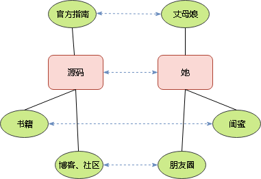
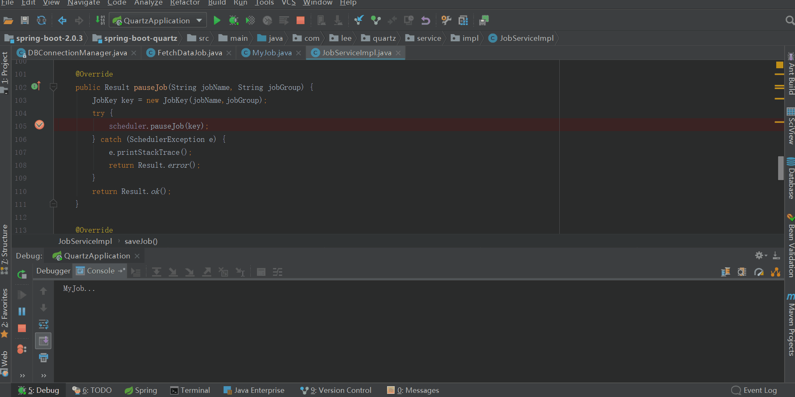

## 前言

开心一刻

今天上课不小心睡着了，结果被老师叫起来回答问题，这是背景。无奈之下看向同桌寻求帮助，同桌小声说到选C，结果周围的人都说选C，向同桌投去一个感激的眼神后大声说道选C。刚说完教室就笑开了，老师一脸恨铁不成钢的表情说选你个头，我叫你翻译文言文你选C！你出去，你给我出去。看着同桌挤眉弄眼的表情，劳资真想说，这帮畜生

路漫漫其修远兮，吾将上下而求索！

github：[https://github.com/youzhibing](https://github.com/youzhibing)

码云(gitee)：[https://gitee.com/youzhibing](https://gitee.com/youzhibing)

## 读源码的经历

刚参加工作那会，没想过去读源码，更没想过去改框架的源码；总想着别人的框架应该是完美的、万能的，应该不需要改；另外即使我改了源码，怎么样让我的改动生效了？
项目中引用的不还是没改的jar包吗。回想起来觉得那时候的想法确实挺......

工作了一年多之后准备跳槽了，开始了一轮的面试，其中有几个面试官就问到了相关的源码问题：ArrayList、HashMap的底层实现，spring、mybatis的相关源码。问源码的面试一般就是回去等消息，然后就没然后了。那时候开始意识到，源码这东西在之前的工作的中感受不到，但是在面试中好像面的还挺频繁的，从此有意识的开始了jdk部分源码的阅读（主要是集合）。一开始看源码，看的特别糙，知道个大概，知道ArrayList的底层实现是数组，HashMap的底层是散列表（数组+链表）；更深入一点的扩容、hash碰撞等等就不知道了。

读spring源码起于工作中遇到了一个问题（[spring
jdbcTemplate事务，各种诡异，包你醍醐灌顶！](http://www.cnblogs.com/youzhibing/p/6127250.html)），排查一段时间最终是解决了，但过程让我非常难受，各种上网查资料、各种尝试，感觉就像大海捞针一样，遥遥无期。我下定决心，我要看一看spring的源码，于是我买了一本《spring源码深度解析》，结合着这本书、打开着eclipse，开始了spring的源码阅读之旅。至此，读源码成了习惯，源码已经进入了我的心里。

后来，springboot的火热，让我也想蹭上一蹭，于是有了springboot的[启动源码系列](https://www.cnblogs.com/youzhibing/category/1285197.html)，虽然还在进行中，但是我相信我能将其完成；工作中用到了shiro，我又结合着《跟我学shiro》将shiro的源码看了个大概，有了[shiro源码系列](https://www.cnblogs.com/youzhibing/category/1314285.html)博文，还差一篇认证与授权（应该很快就能面世），shiro源码系列就封笔了。最近在搭建自己的后台管理系统，用到了quartz，集成的过程也遇到了一些问题，因此有了[quartz的两篇文章](https://www.cnblogs.com/youzhibing/category/1352653.html)。

慢慢的，从一味的网上找资料变成了很多时候会从源码中找答案。不求能读太多的源码，但愿自己接触的技术都能读上一读，路漫漫其修远兮，吾将上下而求索！

## 我为什么读源码

很多人一定和我一样的感受：源码在工作中有用吗？ 用处大吗？很长一段时间内我也有这样的疑问，认为哪些有事没事扯源码的人就是在装，只是为了提高他们的逼格而已。

那为什么我还要读源码呢？
一刚开始为了面试，后来为了解决工作中的问题，再后来就是个人喜好了。说的好听点是有匠人精神；说的委婉点是好奇（底层是怎么实现的）；说的不自信点是对黑盒的东西我用的没底，怕用错；说的简单直白点是提升自我价值，为了更高的薪资待遇（这里对真正的技术迷说声抱歉）。

源码中我们可以学到很多东西，学习别人高效的代码书写、学习别人对设计模式的熟练使用、学习别人对整个架构的布局，等等。如果你还能找出其中的不足，那么恭喜你，你要飞升了！会使用固然重要，但知道为什么这么使用同样重要。从模仿中学习，从模仿中创新。

读源码不像围城（外面的人想进来，里面的人想出去），它是外面的人不想进来，里面的人不想出去；当我们跨进城内，你会发现（还是城外好，皮！）城内风光无限，源码的海洋任我们遨游！

你想好入城了吗？

## 我是怎么样读源码的

###  内容了解

首先我们要对我们的目标有所了解，知道她有什么特点，有些什么功能。对对方都还不了解，就想着进入别人的内心世界，那不是臭不要脸嘛，我们要做一个有着流氓心的绅士；对她有个大致的了解了，就可以发起攻势，一举拿下。

那么怎么样了解了，方式有很多，我这里提供几种，经供参考

最好的方式就是官方参考指南，亲生父母往往对孩子是最了解的，对孩子的描述也是最详细的；比如[Spring Boot Reference
Guide](https://docs.spring.io/spring-
boot/docs/2.1.1.RELEASE/reference/htmlsingle/)就是对springboot最详细的描述，怎么样使用springboot、springboot特性等等，通过此指南，springboot在你面前一览无遗；但是，springboot毕竟是外国人的孩子，如果英语不好，估计读起来有点头疼了，不过我们有google翻译呀，咬咬牙也是能看的。源码世界的丈母娘、老岳丈是非常慷慨的！

其次是书籍，国外优秀的有很多，国内也不乏好书，比较推荐此方式，自成体系，让我们掌握的知识点不至于太散。这就是好比是源码的闺蜜，对源码非常了解，重点是挺大方，会尽全力帮助我们了解源码。

再次就是博客，虽然可能觉得知识点比较散，但是针对某个知识点却特别的细，对彻底掌握非常有帮助，园子内就有很多技术大牛，写的博客自然也是非常棒，非常具有学习价值。当然还有社区、论坛、github、码云等等。这就是源码的朋友圈，我们从中也能获取到非常多关于源码的信息。

###  设计模式的了解

优秀的框架、技术从不乏设计模式；jdk源码中就应用了很多设计模式，比如IO流中的适配器模式与装饰模式、GUI的观察者模式、集合中的迭代器模式等等；spring源码中也是用到了大量的设计模式。设计模式有什么优点、各适用于什么场景，不是本文的内容，需要我们大家自行去了解。

我们只需要对一些常用的设计模式有个大致了解，再去读源码是比较好的；不需要将23种设计模式都通读，也不需要将常用设计模式完全理解透；对于全部通读，我们时间有限，另外有些模式确实不太好理解、用的少，性价比不高，没必要全部都读。

推荐书籍：《Head First Design Patterns》（中文版：《Head First 设计模式》）、《Java与模式》；

常用设计模式：单例模式、工厂模式、适配器模式、装饰模式、外观模式、代理模式、迭代器模式、观察者模式、命令模式

另外我比较推荐的一种学习设计模式的方式是读别人博客：[java_my_life](https://www.cnblogs.com/java-my-
life/)，[刘伟技术博客](https://blog.csdn.net/lovelion)，[chenssy的设计模式](https://www.cnblogs.com/chenssy/category/482229.html)；

设计模式之于源码，就好比逛街购物之于女人，想顺利勾搭源码，我们需要好好掌握设计模式这个套路。

###  配合ide进行断点追踪

我们通过源码的圈子对源码的了解终究只是停在表面，终究还是没有走进她的内心，接下来我就和大家分享下，我是如何走进她的内心的！

相信看过我的源码博客的小伙伴都知道，我非常喜欢通过idea断点来进行源码追踪，断点追踪源码是我非常推荐的一种方式。断点不仅可以用来调试我们的代码，也可以用来调试我们用到的框架源码。面对未知的、茫茫多的源码，我们往往没有足够的时间、经历和耐心去通读所有源码，我们只需要去读我们关注的部分即可（有人可能会说我都不关心，这...）。那为什么要用断掉调试的方式来跟源码，而不是直接从源代码入手去跟我们关注的部分呢？尝试过的小伙伴应该知道，如果我们对源码不熟悉，直接通过源码的方式去跟，一方面很容易迷路（多态，会有很多子类实现），不知道接下来跟哪一个，另一方面也很容易跟丢，当我们跟入的很深的时候，很有可能就忘记上一步跟到哪了。

下面我会举例来说明我是如何进行断点追踪的，以[spring-
boot-2.0.3之quartz集成，不是你想的那样哦！](https://www.cnblogs.com/youzhibing/p/10024558.html)和
[spring-
boot-2.0.3之quartz集成，数据源问题，源码探究](https://www.cnblogs.com/youzhibing/p/10056696.html)
为背景来讲，需要搞清楚两个点：springboot是如何向quartz注入数据源的，quartz是如何操作数据库的

####  springboot向quartz注入数据源

QuartzAutoConfiguration是springboot自动配置quartz的入口

将quartz的配置属性设置给SchedulerFactoryBean；将数据源设置给SchedulerFactoryBean：如果有@QuartzDataSource修饰的数据源，则将@QuartzDataSource修饰的数据源设置给SchedulerFactoryBean，否则将应用的数据源（druid数据源）设置给SchedulerFactoryBean，显然我们的应用中没有@QuartzDataSource修饰的数据源，那么SchedulerFactoryBean中的数据源就是应用的数据源；将事务管理器设置给SchedulerFactoryBean。SchedulerFactoryBean，负责创建和配置quartz
Scheduler，并将其注册到spring容器中。SchedulerFactoryBean实现InitializingBean的afterPropertiesSet方法，里面有可以设置数据源的过程

可以看到通过org.quartz.jobStore.dataSource设置的dsName（值为quartzDs）最后会被替换成springTxDataSource.加scheduler实例名（我们的应用中是：springTxDataSource.quartzScheduler）。springboot会注册两个ConnectionProvider给quartz：一个dsName叫springTxDataSource.quartzScheduler，有事务；一个dsName叫springNonTxDataSource.quartzScheduler，没事务。

####  quartz如何操作数据库

我们通过停止定时任务来跟下quartz对数据库的操作

发现quartz用如下方式获取connection

    
    
    conn = DBConnectionManager.getInstance().getConnection(getDataSource());

那么我们的job中就可以按如下方式操作数据库了

    
    
    package com.lee.quartz.job;
    
    import org.quartz.JobExecutionContext;
    import org.quartz.JobExecutionException;
    import org.quartz.utils.DBConnectionManager;
    import org.springframework.scheduling.quartz.LocalDataSourceJobStore;
    import org.springframework.scheduling.quartz.QuartzJobBean;
    
    import java.sql.Connection;
    import java.sql.PreparedStatement;
    import java.sql.SQLException;
    
    public class FetchDataJob extends QuartzJobBean {
    
        // private String dataSourceName = "quartzDs";                                  // 用此会找不到
        // private String dataSourceName = "springNonTxDataSource.quartzScheduler";     // 不支持事务
        // private String dataSourceName = "springTxDataSource.quartzScheduler";        // 支持事务
        private final String insertSql = "INSERT INTO tbl_sys_user(name, age) VALUES(?,?) ";
    
        private String schedulerInstanceName = "quartzScheduler";                       // 可通过jobDataMap注入进来
    
        @Override
        protected void executeInternal(JobExecutionContext context) throws JobExecutionException {
            String dsName = LocalDataSourceJobStore.NON_TX_DATA_SOURCE_PREFIX
                    + schedulerInstanceName;    // 不支持事务
            //String dsName = LocalDataSourceJobStore.TX_DATA_SOURCE_PREFIX + schedulerInstanceName;    // 支持事务
            try {
                Connection connection = DBConnectionManager.getInstance().getConnection(dsName);
                PreparedStatement ps = connection.prepareStatement(insertSql);
                ps.setString(1, "张三");
                ps.setInt(2, 25);
                ps.executeUpdate();
    
                ps.close();
                connection.close();             // 将连接归还给连接池
                System.out.println("插入成功");
            } catch (SQLException e) {
                e.printStackTrace();
            }
        }
    
        public void setSchedulerInstanceName(String schedulerInstanceName) {
            this.schedulerInstanceName = schedulerInstanceName;
        }
    }

View Code

明确我们的目的，找到合适的切入点，进入断点调试追踪也就容易了。

任我说的天花乱坠，你仍无动于衷，那也只是我一厢情愿，只有局中人才能体会到其中的奥妙！

## 总结与感悟

从上至下全部通读的方式，个人不太推荐，这是建立在很熟悉的基础上的，当我们对某个框架已经比较熟悉了，再从上至下进行通读，彻底了解，这是我认为正确的方式；但是从不熟悉到熟悉这个过程，个人不推荐全部通读，而是推荐上面我推荐的方式
- 断点局部追踪。

很多时候，我们的博文都只是授之以鱼，而我们也只是从中得到鱼；而这篇的目的则是授之以渔，我希望大家从中学到捕鱼的方法，而不是一味的等待别人的鱼；希望大家能够自给自足，也能把鱼和渔都授予其他人。

只要我们开始去读源码，慢慢的就会形成自己的一套读源码的方式；每个人的方式都不一样，合适自己的才是最好的。行动起来，用合适的方式去俘获你的的她吧！

纯属个人之拙见，不喜请喷！

