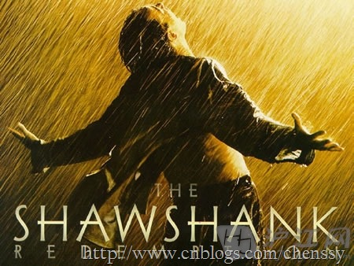

> 人生可以归结为一种简单的选择：不是忙着活，就是忙着死。------《肖申克的救赎》

古人云：吾当三日而自省吾身。意思就是说每个人都需要自我反思。首先我们要相信群众的眼睛是雪亮的，一个人好与不好并不是自己说了算，而是他人说的和与昨天的自我对比。LZ毕业差不多快一年了，遥想刚刚毕业时的豪情壮志虽仍记忆犹新，但早已抛之九霄云外。遥记今年刚刚找了工作的种种计划，虽历历在目，但早已随风而去。

五一时有位美女说我是好男人，我说何以见得？她说你上进、努力、幽默、踏实、体贴。说我幽默也好、踏实也罢，上进、努力我想这是去年的我，现在的我应该是堕落的上进者。为什么是堕落的上进者呢？因为我思想是上进的，而行为却是堕落的。于是我反思到底是什么让我堕落了？在网上看到这样一个人：拥有规律的作息时间、每个月坚持阅读几本有意义的书、每个月坚持看几部电影、闲下来没事就去健身、高效的工作效率让他在工作中如鱼得水，现代人所有的压力在他面前好像一切都是那么的轻松自如。看到这样的一个人我就在思考我与他的差距在那里，或者说人与人之间的差距在哪里？

## 这是我（你）吗？

我始终坚信存在这样一类人，他们总是因为拖延而把自己搞的焦头烂额，留下了一堆需要处理但又不想立马开工的工作；一直在说嚷嚷要减肥但从来就没有运动过或者说运动了但是坚持不下来的；面对电脑控制不住在那里聊天看电影，等到最后发现忙了一下午其实什么都没有做；买了一堆的书但是从来就没有翻过或者说就在买的时候翻了可怜的几页。这就是“你”，一个对社会充满激情，梦想很丰满行为却很骨干的“你”。没有人比你更了解自己，你认为你只是偶尔控制不住自己的行为，但是每次的偶尔导致了你的梦想/计划延迟了好几天、好几十天、好几年。再看看前面的那个朋友，我想差距一目了然了。

看看现在的我。毕业豪情壮志，坚持看书，坚持健身，坚持学英语，去年下半年我确实做到了，我坚持每晚看书、周末锻炼、早上读英语。但是现在呢？我可以晚上玩手机玩到1点，早上8点多才起床，周末可以打游戏一整天。是的就是这样，种种迹象表名，我仅仅只用了两个月就将曾经那个积极上进的变成了自甘堕落的我了。

**学习。** 以前我每晚看书，坚持写博客，逛论坛。半年时间我把《Think in Java》看了一遍，把《编写高质量代码-
改善Java程序的151个建议》看了80%，《header
first》看了遍，做了几十篇笔记。在看看现在：两个月时间专业书籍没有碰过，带过来的两本书《编写高质量代码-改善Java程序的151个建议》
、《Struts2技术内幕》放在桌上早已蒙上一层灰了。在看《Struts2权威指南》时也是心不在焉、走马观花。

**英语。**
刚刚毕业我就知道英语以后很可能会成为我发展道路上的最大绊脚石，为了最低限度削弱这个绊脚石，我坚持每天早上记单词，每天看一篇英语阅读，听一会儿VOA。而且自从大二过了四级后我就没有怎么碰过英语了，虽然刚刚开始有点儿吃力，但是到后来我越来越习惯了，我对英语也越来越有自信了。但是好景不长，坚持半年后，与今年的2月份我不知怎么地就放弃了，一直到现在都没有怎么碰过英语了。

**阅读。**
LZ业余爱好就只有几个看书、听英语、看电影还有摄影（单反一直是LZ的梦想）。尤其是看书，高中时每期的《读者》、《意林》是必看的，大学之后就看得少了，但我仍然经常看书，在我看来阅读是提炼一个人灵魂、心灵的最佳途径，它能够让人心平气和的看待问题。但是现在呢？买的《自控力》到现在还没有看完，《影响力》也是在走马观花得过且过。

**锻炼。** 锻炼对于我来说已经是很遥远的词了。以前我们还跑跑步，现在爬楼梯成了我唯一的锻炼机会。

**这是我吗？不，不是，这就是你！一个憧憬着未来，做着美梦而自甘堕落的你！**

曾经的你又或者是现在的你，因为一度受不了自己的拖延，尝试各种方法。列清单，写规划，做计划，内心的煎熬始终无法躲避，就差没去找心理医生谈谈这个问题了，最后依旧还是力不从心。有时我都会自嘲为自甘堕落的癌症晚期患者。诚然，为了改变在这种内心煎熬我们必须要完成自我救赎。

## 自我救赎

> 每个人都是自己的上帝。如果你自己都放弃自己了，还有谁会救你？------《肖申克的救赎》

生活，不是生下来好好活着，而是要有目标，有追求，这样才能活的精彩，活出滋味。

**每个人都是自己的上帝。如果你自己都放弃自己了，还有谁会救你？每个人都在忙，有的忙着生，有的忙着死。忙着追名逐利的你，忙着柴米油盐的你，停下来想一秒：你的大脑，是不是已经被体制化了？你的上帝在哪里？------《肖申克的救赎》**

你的上帝在哪里呢？每个人都是自己的上帝，所谓 **god helps those who help themselves，**
就是这个道理。人生最可怕的不是没有找到救赎的方法，而是错过了最佳的救赎机会，导致一错再错而无法回到正轨上来。什么时候是最佳机会，当你对自己不满的时候就是最佳机会。你对自己不满肯定是因为某些地方做的不尽人意，设想如果连自己都觉得不满，别人就更是如此。

你到底什么时候才能自我救赎？在开始写这篇博文时LZ就反问自己：你到底什么时候才能自我救赎。可能有人说我们还年轻，别的不多就是时间多，还有让自己折腾犯错的资本，他们认为眼前的问题都不会是问题，等等再说吧。但是对于另外一些人来说，可能他们最懊悔的就是年轻时纵容自己犯错，没有留下时间来好好反思自己。是的，自我就睡越早越好，不救赎你就这样一步一步走向堕落，等到年长时后悔莫及再也没有挽回的机会。

当然，可能有人认为LZ这里好像有点儿说教的味道，没办法LZ一介文人只能卖弄那些少得可怜的文字了。

## 这才是我（你）

> 佛曰：云非云雾非雾。只有认识自我才能改变自我。

大千世界我们只不过沧海一粟。人这一生或忙于生或忙于死。在短暂的生命长河中我们不断的做出抉择，一面是正一面是反，一面是上进一面是堕落。命运掌握在自己手中，道路也要靠自己来选择。人整个的一生都是在自我救赎，不沉迷与流言蜚语，不留恋现世的安宁沉寂，不沉浸于苦痛的彷徨迷茫。努力改变自我或许才能涅磐重生。

对于我来说，我只需找回半年前的我即可！那么你呢？曾经那个积极上进的你是否被遗忘在某个不为人知的角落里。find it!!!!

> 对生活充满热情，对工作包含激情，热爱技术，好读书，爱阅读，常锻炼，这是我，也是你。

