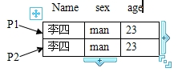
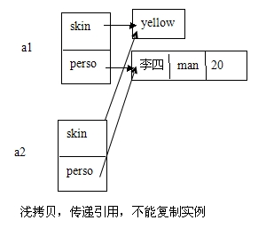
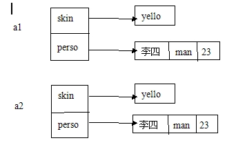

##渐析java的浅拷贝和深拷贝

##
## 首先来看看浅拷贝和深拷贝的定义：

##
## 浅拷贝：使用一个已知实例对新创建实例的成员变量逐个赋值，这个方式被称为浅拷贝。

##
## 深拷贝：当一个类的拷贝构造方法，不仅要复制对象的所有非引用成员变量值，还要为引用类型的成员变量创建新的实例，并且初始化为形式参数实例值。这个方式称为深拷贝

##
## 也就是说浅拷贝只复制一个对象，传递引用，不能复制实例。而深拷贝对对象内部的引用均复制，它是创建一个新的实例，并且复制实例。

##
## 对于浅拷贝当对象的成员变量是基本数据类型时，两个对象的成员变量已有存储空间，赋值运算传递值，所以浅拷贝能够复制实例。但是当对象的成员变量是引用数据类型时，就不能实现对象的复制了。

##
## 存在一个对象Person，代码如下：

##
##

	 1  public class Person {
 2     private String name;
 3     private String sex;
 4     private int age;
 5     
 6     public Person(String name,String sex,int age){
 7         this.name = name;
 8         this.sex = sex;
 9         this.age = age;
10     	}
11     
12     public Person(Person p){                   //拷贝构造方法，复制对象
13         this.name = p.name;
14         this.sex = p.sex;
15         this.age = p.age;
16     	}
17 	}


##
##

##
## 上面的对象Person有三个成员变量。name、sex、age。两个构造方法。第二个的参数为该对象，它称为拷贝构造方法，它将创建的新对象初始化为形式参数的实例值，通过它可以实现对象复制功能。

##
## 又有一个对象Asian,如下：

	 1  public class Asian {
 2     private String skin;
 3     Person person;
 4     
 5     public Asian(String skin,Person person){
 6         this.skin = skin;
 7         this.person = person;                    //引用赋值
 8     	}
 9 
10     public Asian(Asian asian){                 //拷贝构造方法，复制对象
11         this(asian.skin,asian.person);           
12     	}
13 	}

上面对象也存在着两个成员变量，skin和Person对象

##
## 对于person对象有如下：

	1 Person p1 = new Person("李四","mam",23);
2 
3 Person p2 = new Person(P1);



##
## 当调用上面的语句时。P2对象将会对P1进行复制。执行情况如下如下图：

##
##  

	1 Asian a1 = new Asian("yellow",new Person("李四","mam",23));
2 
3 Asian a2 = new Asian(a1);


##
##

##
##

##
## 对于Asian对象有：

##
## NewAsian(a1)执行Asian类的拷贝构造方法，由于对象赋值是引用赋值。使得a1和a2引用同一个对象

##
## 如下图：

##
##  

##
## 

##
##当a1执行某条可以改变该值的语句时，那么a1将会通过这个语句也可以改变a2对象的成员变量

##
## 如果执行以下语句：

##
##

	a2.name = new Person(a1.name)


##
##

##
## 这时将会创建一个新的Person对象

##
## 如下图：

##
## 

##
##

##
##

##
##

##
##

##
##

##
##

##
##

##
####渐析java的浅拷贝和深拷贝

##
## 首先来看看浅拷贝和深拷贝的定义：  

##
## 浅拷贝：使用一个已知实例对新创建实例的成员变量逐个赋值，这个方式被称为浅拷贝。  

##
## 深拷贝：当一个类的拷贝构造方法，不仅要复制对象的所有非引用成员变量值，还要为引用类型的成员变量创建新的实例，并且初始化为形式参数实例值。这个方式称为深拷贝  

##
## 也就是说浅拷贝只复制一个对象，传递引用，不能复制实例。而深拷贝对对象内部的引用均复制，它是创建一个新的实例，并且复制实例。  

##
## 对于浅拷贝当对象的成员变量是基本数据类型时，两个对象的成员变量已有存储空间，赋值运算传递值，所以浅拷贝能够复制实例。但是当对象的成员变量是引用数据类型时，就不能实现对象的复制了。   

##
## 存在一个对象Person，代码如下：     	public class Person {
    private String name;
    private String sex;
    private int age;
    
    public Person(String name,String sex,int age){
        this.name = name;
        this.sex = sex;
        this.age = age;
    	}
    
    public Person(Person p){                   //拷贝构造方法，复制对象
        this.name = p.name;
        this.sex = p.sex;
        this.age = p.age;
    	}
	}



##
## 上面的对象Person有三个成员变量。name、sex、age。两个构造方法。第二个的参数为该对象，它称为拷贝构造方法，它将创建的新对象初始化为形式参数的实例值，通过它可以实现对象复制功能。


##
## 又有一个对象Asian,如下：


  	public class Asian {
    private String skin;
    Person person;
    
    public Asian(String skin,Person person){
        this.skin = skin;
        this.person = person;                    //引用赋值
    	}

    public Asian(Asian asian){                 //拷贝构造方法，复制对象
        this(asian.skin,asian.person);           
    	}
	}



##
## 上面对象也存在着两个成员变量，skin 和Person对象


##
## 对于person对象有如下：


  	Person p1 = new Person("李四","mam",23);

 Person p2 = new Person(P1);



##
## 当调用上面的语句时。P2对象将会对P1进行复制。执行情况如下如下图：


##
## 


##
## 对于Asian对象有：


##
##
    
      	Asian a1 = new Asian("yellow",new Person("李四","mam",23));
Asian a2 = new Asian(a1);
    

     New Asian(a1)执行Asian类的拷贝构造方法，由于对象赋值是引用赋值。使得a1和a2引用同一个对象


##
## 如下图：


##
## 


##
## 当a1执行某条可以改变该值的语句时，那么a1将会通过这个语句也可以改变a2对象的成员变量


##
## 如果执行以下语句：a2.name = new Person(a1.name) 


##
## 这时将会创建一个新的Person对象


##
## 如下图：


##
## 


##
##