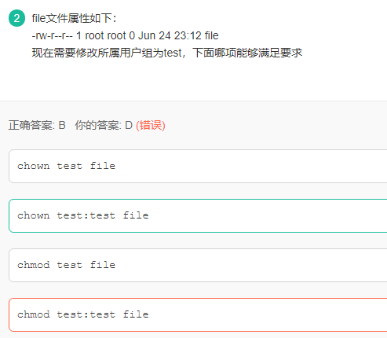
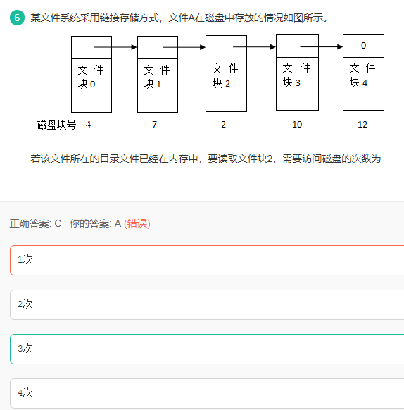
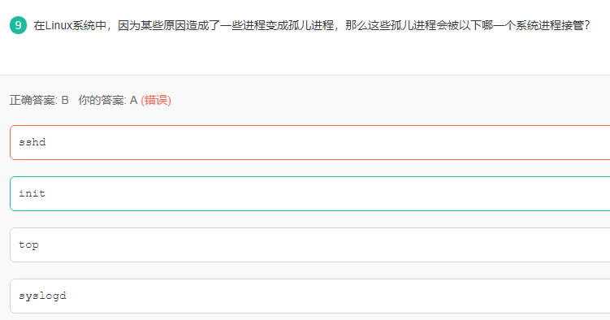
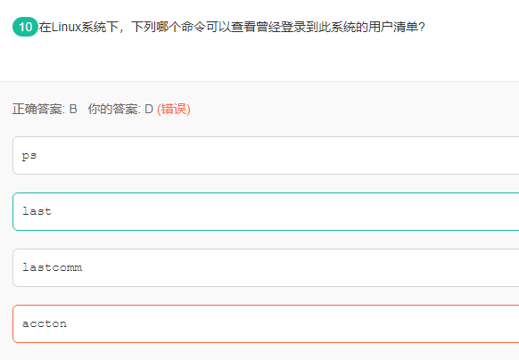
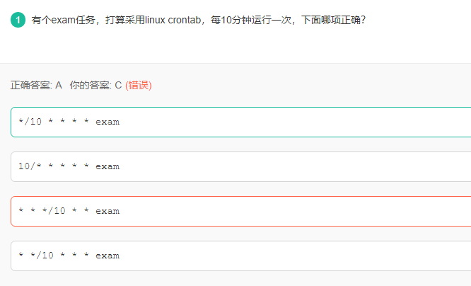
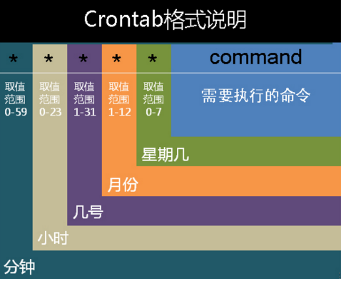
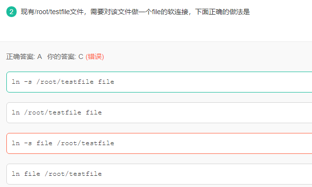

chown语法：

chown [user[:group]] filename

当我们需要修改所属用户组时， 前面必须有冒号表示修改的是用户组，所以合法的语句为：

chown :test file

chown test:test file

Hadoop调度器：

**（1）默认的调度器FIFO**

Hadoop中默认的调度器，它先按照作业的优先级高低，再按照到达时间的先后选择被执行的作业。

**（2） 计算能力调度器Capacity Scheduler**

支持多个队列，每个队列可配置一定的资源量，每个队列采用FIFO调度策略，为了防止同一个用户的作业独占队列中的资源，该调度器会对同一用户提交的作业所占资源量进行限定。调度时，首先按以下策略选择一个合适队列：计算每个队列中正在运行的任务数与其应该分得的计算资源之间的比值，选择一个该比值最小的队列；然后按以下策略选择该队列中一个作业：按照作业优先级和提交时间顺序选择，同时考虑用户资源量限制和内存限制。

**（3）公平调度器Fair Scheduler**

同计算能力调度器类似，支持多队列多用户，每个队列中的资源量可以配置，同一队列中的作业公平共享队列中所有资源，具体算法参见我的博文《[Hadoop公平调度器算法解析](http://dongxicheng.org/mapreduce/hadoop-
fair-scheduler/ "Hadoop公平调度器算法解析")》

实际上，Hadoop的调度器远不止以上三种，最近，出现了很多针对新型应用的Hadoop调度器。

**（4）适用于异构集群的调度器LATE**

现有的Hadoop调度器都是建立在同构集群的假设前提下，具体假设如下：

1）集群中各个节点的性能完全一样

2）对于reduce task，它的三个阶段：copy、sort和reduce，用时各占1/3

3）同一job的同类型的task是一批一批完成的，他们用时基本一样。

现有的Hadoop调度器存在较大缺陷，主要体现在探测落后任务的算法上：如果一个task的进度落后于同类型task进度的20%，则把该task当做落后任务(这种任务决定了job的完成时间，需尽量缩短它的执行时间)，从而为它启动一个备份任务（speculative
task）。如果集群异构的，对于同一个task，即使是在相同节点上的执行时间也会有较大差别，因而在异构集群中很容易产生大量的备份任务。

LATE（Longest Approximate Time to
End，参考资料[4]）调度器从某种程度上解决了现有调度器的问题，它定义三个阈值：SpeculativeCap，系统中最大同时执行的speculative
task数目（作者推荐值为总slot数的10%）；
SlowNodeThreshold（作者推荐值为25%）：得分（分数计算方法见论文）低于该阈值的node（快节点）上不会启动speculative
task；SlowTaskThreshold（作者推荐值为25%）：当task进度低于同批同类task的平均进度的SlowTaskThreshold时，会为该task启动speculative
task。它的调度策略是：当一个节点出现空闲资源且系统中总的备份任务数小于SpeculativeCap时，（1）如果该节点是慢节点（节点得分高于SlowNodeThreshold），则忽略这个请求。
（2）对当前正在运行的task按估算的剩余完成时间排序
（3）选择剩余完成时间最大且进度低于SlowTaskThreshold的task，为该task启动备份任务。

**（5）适用于实时作业的调度器Deadline Scheduler和Constraint-based Scheduler**

这种调度器主要用于有时间限制的作业（Deadline
Job），即给作业一个deadline时间，让它在该时间内完成。实际上，这类调度器分为两种，软实时（允许作业有一定的超时）作业调度器和硬实时（作业必须严格按时完成）作业调度器。

Deadline
Scheduler（参考资料[5]）主要针对的是软实时作业，该调度器根据作业的运行进度和剩余时间动态调整作业获得的资源量，以便作业尽可能的在deadline时间内完成。

Constraint-based
Scheduler（参考资料[6]）主要针对的是硬实时作业，该调度器根据作业的deadline和当前系统中的实时作业运行情况，预测新提交的实时作业能不能在deadline时间内完成，如果不能，则将作业反馈给用户，让他重调整作业的deadline。

