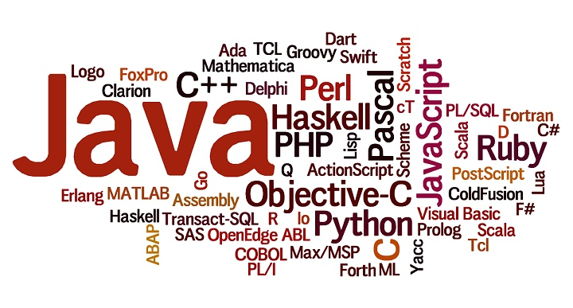
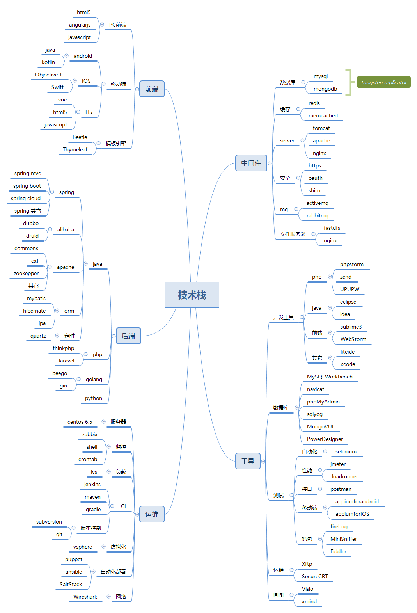
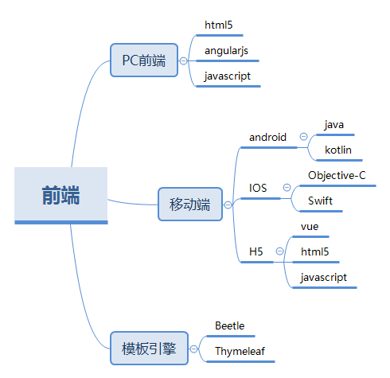
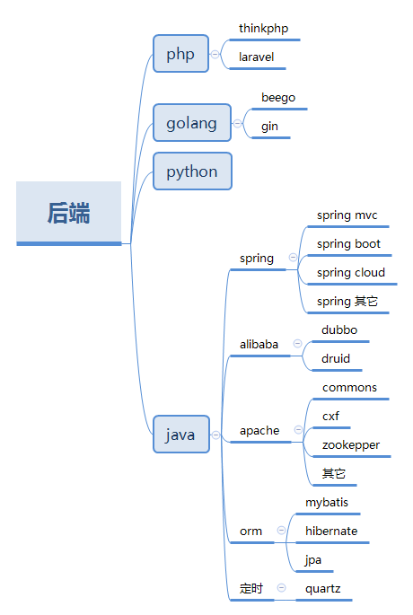
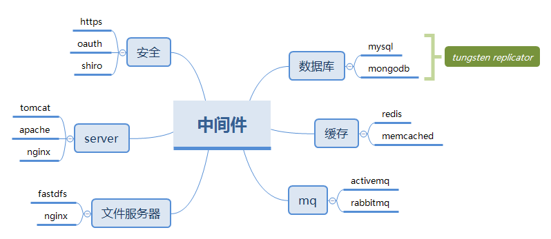
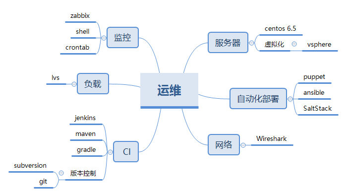
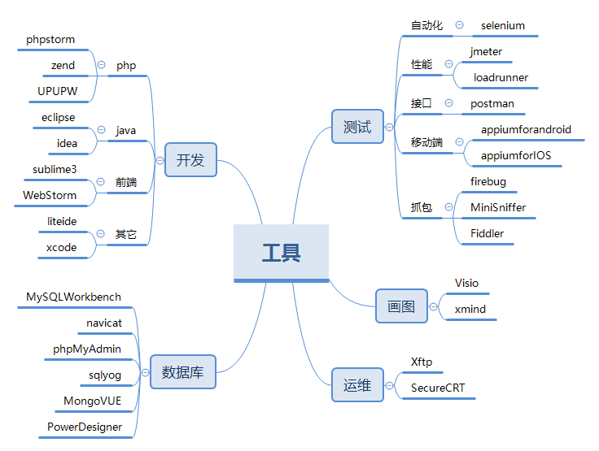

技术栈(technology
stack)就是一个公司的透视镜，从某些程度上可以展示出公司的技术实力。从技术桟也可以看出整个平台的技术要素，平台大小规模等，今天来给大家分享我司的技术全家桶。

## 总览

闲来无事就想着还可以总结总结什么，平台架构、事故解决方案等以前都写过了，这次就主要写写我们都用过那些技术吧。我分了五块内容来介绍我们的技术栈：前端、后端、中间件、运维和工具。画了一个思维导图方便大家整体预览。

  
[点击这里看大图](../md/img/ityouknow/technology-stack.png)

接下来就展开来说

## 前端

我司的前端比较简单主要分为了三大块：PC前端、移动端、模板引擎。

  * PC前端 主要使用了H5、JS，还有很多其它的组件，但以前两者为主。少量的使用过angularjs，最后效果不是特别好，放弃了  

  * 移动端 分了三块：安卓、IOS、WAP。安卓前期主要以Java语言为主，现在慢慢在考虑kotlin；IOS以Objective-c为主，少量使用Swift；WAP又称H5，用于微信或者手机浏览器，也是使用Html5、js、少量使用了VUE，H5端的一些JS组件和PC会有不同，一般都有对应的替代品比如：使用zepto替代jquery。  

  * 模板引擎 前期一直使用的是Beetle，大量使用springboot后替换为Thymeleaf，Thymeleaf使用体验很不错。

## 后端

后端以开发语言的角度给大家介绍

后端使用的开发语言有：php、golang、python和Java。

  * php 我们公司的前端的网站都是使用php开发，框架主要使用了thinkphp，小项目试验性的用了laravel。
  * golang 主要用于大数据，使用gin框架，用beego做过一个后台。
  * python 没有在公司用过，自己写小爬虫玩。
  * java 公司最主要的开发语言，核心系统、支撑系统、服务组件均使用Java开发，下面详细介绍一下。

Java技术栈比较多，这里挑选了几个具有代表性的来讲：

  * spring 做Java开发的，几乎离不开spring全家桶了，不需要多介绍。  

  * alibaba 阿里这两年非常牛逼，也开源了不少的东西，主要使用过dubbo和druid，都很优秀。
  * apache 如果说搞Java的离不开spring，那么搞开发的就离不开apache，我们主要使用了commons、cxf、zookepper等。  

  * orm框架 基本以mybatis为主，hibernate和jpa为辅的模式。
  * quartz 定时任务使用的quartz

## 中间件

这里面是比较泛的中间件集合，把相关的组件也都包含进来，主要分为：数据库、web容器、消息、缓存、文件服务器和安全。

  * 数据库 业务主要使用mysql，需要跑批统计的离线数据由tungsten replicator同步到mongodb。  

  * web容器 php使用的apache，Java使用的tomcat，静态资源代理使用的是nginx  

  * 消息 最开始使用activemq，后来架构升级全面替换为rabbitmq  

  * 缓存 满标控制使用memcached，后端业务缓存使用redis  

  * 文件服务器 最开始使用nginx做图片服务器，后来上线合同就全面使用了fastdfs  

  * 安全 https证书保证传输安全，shiro做权限控制，oauth做登录认证。

## 运维

运维是平台的生命线，主要分为六部分：监控、负载均衡、CI（持续集成）、服务器、自动化部署和网络

  * 监控 主要使用了zabbix来监控服务器的各项指标，少量使用shell脚本和crontab  

  * 负载 使用VIP来做均衡负载，也就是LVS。  

  * CI 持续集成工具主要使用了jenkins。Java依赖使用maven为主，gradle少量使用，版本控制svn为主，少量使用git  

  * 服务器 线上服务器大多使用的是centos 6.5。少量使用7.0。测试环境使用vsphere来虚拟化  

  * 自动化部署 这块还在研究，备选有：puppet、ansible、saltstack。
  * 网络 使用Wireshark做网络分析

## 工具

优秀的工具可以让工作事半功倍，节省很多时间。这里分开发、测试、数据库、画图和运维五个维度来介绍

  * 开发 Java常用的开发工具：eclipse和idea。前两年一直使用的是eclipse，但eclipse对spring boot支持的不够友好，后来就全面使用了idea；php开发工具比较多，我司开发人员主要使用phpstorm和zend，集成环境使用upupw；前端使用WebStorm和sublime3；golang开发工具liteide，IOS使用xcode。  

  * 测试 自动化测试工具selenjum，性能测试使用jmeter或者loadrunner，开发人员一般使用jmeter。接口测试使用postman；移动端测试使用 appiumforandroid和appiumforIOS；抓包工具使用 firebug、MIniSniffer、Fiddler。  

  * 数据库 mysql数据库可视化工具常用navicat，生产使用Workbench，少部分开发人员使用sqlyog和phpMyAdmin。mongodb使用MongoVUE，表设计用PowerDesigner。  

  * 画图 架构图设计使用Visio，也尝试过processon；思维导图使用Xmind。  

  * 运维 运维工具使用xftp或者SecureCRT

> 本文所有示例图均使用xmind，需要原图的同学请在公众号回复:xmind。

_互金文章系列：_

  * [从零到百亿互联网金融架构发展史](http://www.ityouknow.com/%E6%9E%B6%E6%9E%84/2017/01/10/%E4%BB%8E%E9%9B%B6%E5%88%B0%E7%99%BE%E4%BA%BF%E4%BA%92%E8%81%94%E7%BD%91%E9%87%91%E8%9E%8D%E6%9E%B6%E6%9E%84%E5%8F%91%E5%B1%95%E5%8F%B2.html)
  * [一次生产事故的优化经历](http://www.ityouknow.com/%E4%BC%98%E5%8C%96/2017/02/06/%E4%B8%80%E6%AC%A1%E7%94%9F%E4%BA%A7%E4%BA%8B%E6%95%85%E7%9A%84%E4%BC%98%E5%8C%96%E7%BB%8F%E5%8E%86.html)  

  * [一次dns缓存引发的惨案](http://www.ityouknow.com/%E4%BC%98%E5%8C%96/2017/02/09/%E4%B8%80%E6%AC%A1dns%E7%BC%93%E5%AD%98%E5%BC%95%E5%8F%91%E7%9A%84%E6%83%A8%E6%A1%88.html)  

  * [一个脚本引发的血案](http://www.ityouknow.com/%E4%BC%98%E5%8C%96/2017/02/12/%E4%B8%80%E4%B8%AA%E8%84%9A%E6%9C%AC%E5%BC%95%E5%8F%91%E7%9A%84%E8%A1%80%E6%A1%88.html)  

  * [互联网金融大战黑客](http://www.ityouknow.com/%E4%BC%98%E5%8C%96/2017/02/15/%E4%BA%92%E8%81%94%E7%BD%91%E9%87%91%E8%9E%8D%E5%A4%A7%E6%88%98%E9%BB%91%E5%AE%A2.html)  

  * [百亿互金平台救火故事](http://www.ityouknow.com/%E4%BC%98%E5%8C%96/2017/02/16/%E7%99%BE%E4%BA%BF%E4%BA%92%E9%87%91%E5%B9%B3%E5%8F%B0%E6%95%91%E7%81%AB%E6%95%85%E4%BA%8B.html)  

  * [如何做一个对账系统](http://www.ityouknow.com/pay/2017/06/13/reconciliation-system.html)

