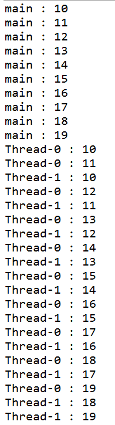
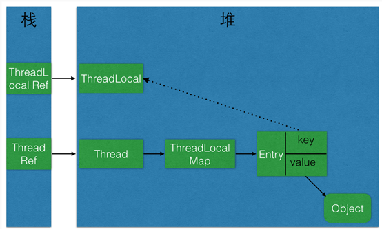

## 前言

在我的博客[spring事务源码解析](http://www.cnblogs.com/youzhibing/p/6414780.html)中，提到了一个很关键的点：将connection绑定到当前线程来保证这个线程中的数据库操作用的是同一个connection。但是没有细致的讲到如何绑定，以及为什么这么绑定；另外也没有讲到连接池的相关问题：如何从连接池获取，如何归还连接到连接池等等。那么下面就请听我慢慢道来。

路漫漫其修远兮，吾将上下而求索！

github：[https://github.com/youzhibing](https://github.com/youzhibing)

码云(gitee)：[https://gitee.com/youzhibing](https://gitee.com/youzhibing)

## ThreadLocal

讲spring事务之前，我们先来看看ThreadLocal，它在spring事务中是占据着比较重要的地位；不管你对ThreadLocal熟悉与否，且都静下心来听我唐僧般的念叨。

先强调一点：ThreadLocal不是用来解决共享变量问题的，它与多线程的并发问题没有任何关系。

###  基本介绍

当使用ThreadLocal维护变量时，ThreadLocal为每个使用该变量的线程提供独立的变量副本，所以每一个线程都可以独立地改变自己的副本，而不会影响其它线程所对应的副本，如下例：

    
    
    public class ThreadLocalTest
    {
        ThreadLocal<Long> longLocal = new ThreadLocal<Long>();
        ThreadLocal<String> stringLocal = new ThreadLocal<String>();
        
        public void set()
        {
            longLocal.set(1L);
            stringLocal.set(Thread.currentThread().getName());
        }
        
        public long getLong()
        {
            return longLocal.get();
        }
        
        public String getString()
        {
            return stringLocal.get();
        }
        
        public static void main(String[] args) throws InterruptedException
        {
            final ThreadLocalTest test = new ThreadLocalTest();
            
            test.set();     // 初始化ThreadLocal
            for (int i=0; i<10; i++)
            {
                System.out.println(test.getString() + " : " + test.getLong() + i);
            }
            
            Thread thread1 = new Thread(){
                public void run() {
                    test.set();
                    for (int i=0; i<10; i++)
                    {
                        System.out.println(test.getString() + " : " + test.getLong() + i);
                    }
                };
            };
            thread1.start();
            
            Thread thread2 = new Thread(){
                public void run() {
                    test.set();
                    for (int i=0; i<10; i++)
                    {
                        System.out.println(test.getString() + " : " + test.getLong() + i);
                    }
                };
            };
            thread2.start();
        }
    }

执行结果如下

可以看到，各个线程的longLocal值与stringLocal值是相互独立的，本线程的累加操作不会影响到其他线程的值，真正达到了线程内部隔离的效果。

###  源码解读

这里我就不进行ThreadLocal的源码解析，建议大家去看我参考的博客，个人认为看那两篇博客就能对ThreadLocal有个很深地认知了。

做个重复的强调（引用[[Java并发包学习七]解密ThreadLocal](http://qifuguang.me/2015/09/02/%5BJava%E5%B9%B6%E5%8F%91%E5%8C%85%E5%AD%A6%E4%B9%A0%E4%B8%83%5D%E8%A7%A3%E5%AF%86ThreadLocal/)中的一段话）：

    
    
    Thread与ThreadLocal对象之间的引用关系图
     
    
    
    看了ThreadLocal源码，不知道大家有没有一个疑惑：为什么像上图那么设计？ 如果给你设计，你会怎么设计？相信大部分人会有这样的想法，我也是这样的想法：
    　　”每个ThreadLocal类创建一个Map，然后用线程的ID作为Map的key，实例对象作为Map的value，这样就能达到各个线程的值隔离的效果“
    JDK最早期的ThreadLocal就是这样设计的。（不确定是否是1.3）之后ThreadLocal的设计换了一种方式，也就是目前的方式，那有什么优势了：
    　　1、这样设计之后每个Map的Entry数量变小了：之前是Thread的数量，现在是ThreadLocal的数量，能提高性能，据说性能的提升不是一点两点(没有亲测)
    　　2、当Thread销毁之后对应的ThreadLocalMap也就随之销毁了，能减少内存使用量。

## Spring事务中的ThreadLocal

最常见的ThreadLocal使用场景为 用来解决数据库连接、Session管理等，那么接下来我们就看看spring事务中ThreadLocal的应用

    
    
    ApplicationContext ac = new ClassPathXmlApplicationContext("applicationContext-jdbc.xml");
    DaoImpl daoImpl = (DaoImpl) ac.getBean("daoImpl");
    System.out.println(daoImpl.insertUser("yes", 25));

只要某个类的方法、类或者接口上有事务配置，spring就会对该类的实例生成代理。所以daoImpl是DaoImpl实例的代理实例的引用，而不是DaoImpl的实例（目标实例）的引用；当我们调用目标实例的方法时，实际调用的是代理实例对应的方法，若目标方法没有被@Transactional(或aop注解，当然这里不涉及aop)修饰，那么代理方法直接反射调用目标方法，若目标方法被@Transactional修饰，那么代理方法会先执行增强（例如判断当前线程是否存在connection，不存在则新建并绑定到当前线程等等）,然后通过反射执行目标方法，最后回到代理方法执行增强（例如，事务回滚或事务提交、connection归还到连接池等等处理）。这里的绑定connection到当前线程就用到了ThreadLocal，我们来看看源码

    
    
    @Override
    protected void doBegin(Object transaction, TransactionDefinition definition) {
        DataSourceTransactionObject txObject = (DataSourceTransactionObject) transaction;
        Connection con = null;
    
        try {
            
            if (txObject.getConnectionHolder() == null ||
                    txObject.getConnectionHolder().isSynchronizedWithTransaction()) {
                // 从连接池获取一个connection
                Connection newCon = this.dataSource.getConnection();
                if (logger.isDebugEnabled()) {
                    logger.debug("Acquired Connection [" + newCon + "] for JDBC transaction");
                }
                // 包装newCon，并赋值到txObject，并标记是新的ConnectionHolder
                txObject.setConnectionHolder(new ConnectionHolder(newCon), true);
            }
    
            txObject.getConnectionHolder().setSynchronizedWithTransaction(true);
            con = txObject.getConnectionHolder().getConnection();
    
            Integer previousIsolationLevel = DataSourceUtils.prepareConnectionForTransaction(con, definition);
            txObject.setPreviousIsolationLevel(previousIsolationLevel);
    
            // Switch to manual commit if necessary. This is very expensive in some JDBC drivers,
            // so we don"t want to do it unnecessarily (for example if we"ve explicitly
            // configured the connection pool to set it already).
            if (con.getAutoCommit()) {
                txObject.setMustRestoreAutoCommit(true);
                if (logger.isDebugEnabled()) {
                    logger.debug("Switching JDBC Connection [" + con + "] to manual commit");
                }
                con.setAutoCommit(false);
            }
            txObject.getConnectionHolder().setTransactionActive(true);
    
            int timeout = determineTimeout(definition);
            if (timeout != TransactionDefinition.TIMEOUT_DEFAULT) {
                txObject.getConnectionHolder().setTimeoutInSeconds(timeout);
            }
    
            // 若是新的ConnectionHolder，则将它绑定到当前线程中
            // Bind the session holder to the thread.
            if (txObject.isNewConnectionHolder()) {
                TransactionSynchronizationManager.bindResource(getDataSource(), txObject.getConnectionHolder());
            }
        }
    
        catch (Throwable ex) {
            if (txObject.isNewConnectionHolder()) {
                DataSourceUtils.releaseConnection(con, this.dataSource);
                txObject.setConnectionHolder(null, false);
            }
            throw new CannotCreateTransactionException("Could not open JDBC Connection for transaction", ex);
        }
    }
    
    
    /**
     * Bind the given resource for the given key to the current thread.
     * @param key the key to bind the value to (usually the resource factory)
     * @param value the value to bind (usually the active resource object)
     * @throws IllegalStateException if there is already a value bound to the thread
     * @see ResourceTransactionManager#getResourceFactory()
     */
    public static void bindResource(Object key, Object value) throws IllegalStateException {        //key：通常指资源工厂，也就是connection工厂，value：通常指活动的资源，也就是活动的ConnectionHolder
        
        // 必要时unwrap给定的连接池; 否则按原样返回给定的连接池。
        Object actualKey = TransactionSynchronizationUtils.unwrapResourceIfNecessary(key);
        Assert.notNull(value, "Value must not be null");
        Map<Object, Object> map = resources.get();
        // set ThreadLocal Map if none found   如果ThreadLocal Map不存在则新建，并将其设置到resources中
        // private static final ThreadLocal<Map<Object, Object>> resources = new NamedThreadLocal<Map<Object, Object>>("Transactional resources");  
    　　// 这就到了ThreadLocal流程了
        if (map == null) {
            map = new HashMap<Object, Object>();
            resources.set(map);
        }
        Object oldValue = map.put(actualKey, value);
        // Transparently suppress a ResourceHolder that was marked as void...
        if (oldValue instanceof ResourceHolder && ((ResourceHolder) oldValue).isVoid()) {
            oldValue = null;
        }
        if (oldValue != null) {
            throw new IllegalStateException("Already value [" + oldValue + "] for key [" +
                    actualKey + "] bound to thread [" + Thread.currentThread().getName() + "]");
        }
        if (logger.isTraceEnabled()) {
            logger.trace("Bound value [" + value + "] for key [" + actualKey + "] to thread [" +
                    Thread.currentThread().getName() + "]");
        }
    }

## 总结

1、ThreadLocal能解决的问题，那肯定不是共享变量(多线程并发)问题，只是看起来有些像并发；像火车票、电影票这样的真正的共享变量的问题用ThreadLocal是解决不了的，同一时间，同一趟车的同一个座位，你敢用ThreadLocal来解决吗？

2、每个Thread维护一个ThreadLocalMap映射表，这个映射表的key是ThreadLocal实例本身，value是真正需要存储的Object

3、druid连接池用的是数组来存放的connectionHolder，不是我认为的list，connectionHolder从线程中解绑后，归还到数组连接池中；connectionHolder是connection的封装

## 疑问

private static final ThreadLocal<Map<Object, Object>> resources = new
NamedThreadLocal<Map<Object, Object>>("Transactional resources");

1、 为什么是ThreadLocal<Map<Object, Object>>，而不是ThreadLocal<ConnectionHolder>

2、 ThreadLocal<Map<Object, Object>> 中的Map的key是为什么是DataSource

望知道的朋友赐教下，评论留言或者私信都可以，谢谢！

## 参考

[[Java并发包学习七]解密ThreadLocal](http://qifuguang.me/2015/09/02/%5BJava%E5%B9%B6%E5%8F%91%E5%8C%85%E5%AD%A6%E4%B9%A0%E4%B8%83%5D%E8%A7%A3%E5%AF%86ThreadLocal/)

[Java并发编程：深入剖析ThreadLocal](http://www.cnblogs.com/dolphin0520/p/3920407.html)

