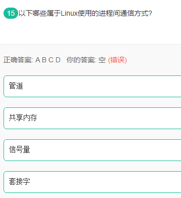

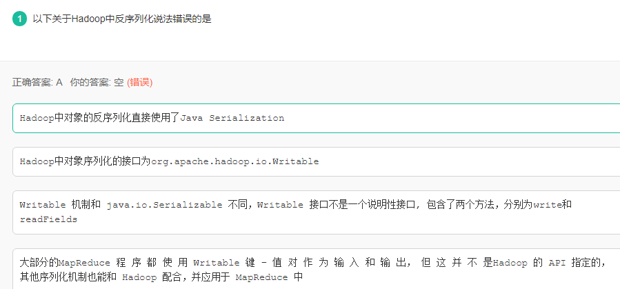

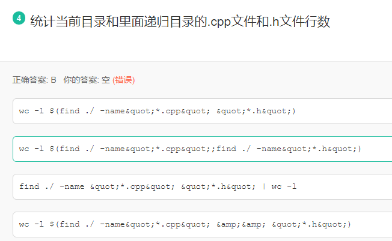

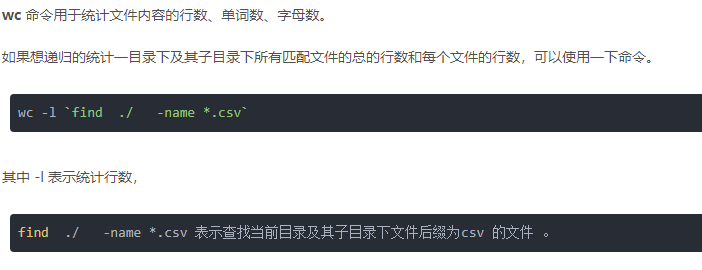

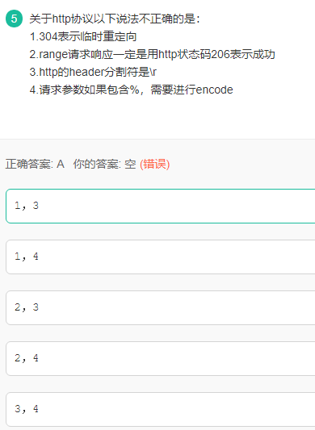

302[临时重定向](http://www.baidu.com/link?url=ltv7YXZ1nOzOZ8_IndSoVvLznUhLbDOqORiq99NdtTks9hc9Z_haw3kfPDIOOOnS)

HTTP协议规定，HTTP首部（headers）和HTTP主体之间是以一个空行分割的。因为HTTP每一行（每一行是指一个头部字段）是以\r\n结束的，一个空行的\r\n，再加上最后一行的结束符\r\n，一起是\r\n\r\n，也就是说，当检测到\r\n\r\n四个字符时，下一个字符开始就是HTTP
body的内容了

[POP3](https://www.baidu.com/s?wd=POP3&tn=SE_PcZhidaonwhc_ngpagmjz&rsv_dl=gh_pc_zhidao)协议默认传输协议：TCP
SMTP属于TCP协议
dns同时占用tcp和udp的[53端口](https://www.baidu.com/s?wd=53%E7%AB%AF%E5%8F%A3&tn=SE_PcZhidaonwhc_ngpagmjz&rsv_dl=gh_pc_zhidao)！
区域传送时使用TCP
域名解析时使用[UDP协议](https://www.baidu.com/s?wd=UDP%E5%8D%8F%E8%AE%AE&tn=SE_PcZhidaonwhc_ngpagmjz&rsv_dl=gh_pc_zhidao)

telnet tcp 23 端口

snmp udp 161

_dns tcp udp
都有用到[53端口](https://www.baidu.com/s?wd=53%E7%AB%AF%E5%8F%A3&tn=SE_PcZhidaonwhc_ngpagmjz&rsv_dl=gh_pc_zhidao)_

_______dhcp udp 67 68 都有用到 一接一发_____

_____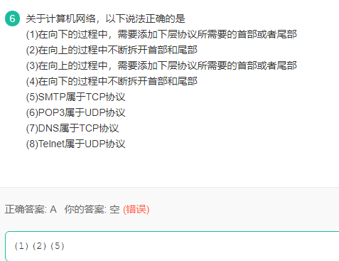_____

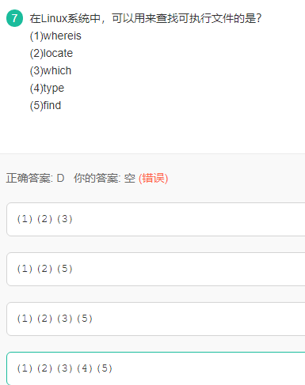

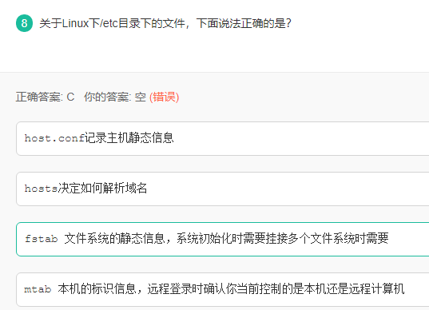

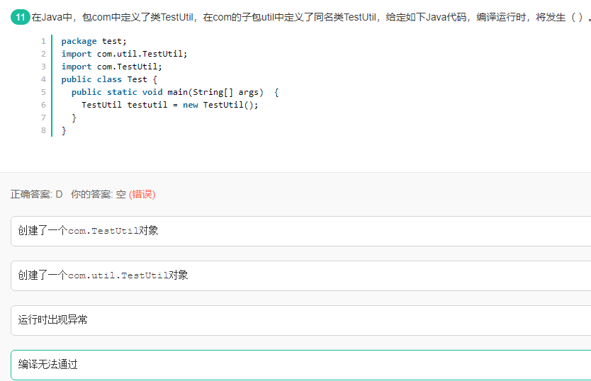

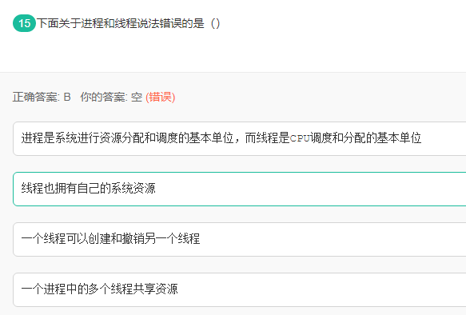

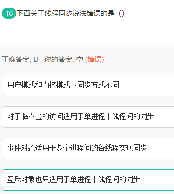

