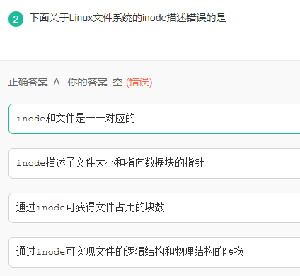
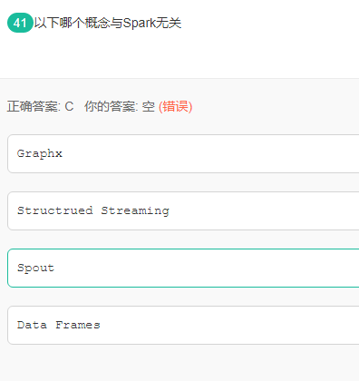

许多个文件名指向同一个inode

256是二的八次方，共有1M个色块每个色块要八位二进制储存信息，一个B为八个bit所以一桢占用1M。

由于该树度数为3,即该树为三叉树；

树的总结点数=度数为0的个数+度数为1的个数+度数为2的个数+度数为3的个数=n0+n1+n2+n3;

树的边数=n0*0+n1*1+n2*2+n3*3;

树的总结点树=树的边数+1；

即n0*0+n1*1+n2*2+n3*3+1=n0+n1+n2+n3;====>n3=6;

Linux用户分为：拥有者、组群(Group)、其他（other）  
linux中的文件属性过分四段，如 -rwzrwz---  
第一段 - 是指文件类型 表示这是个普通文件  
文件类型部分  
-为：表示文件  
d为：表示文件夹  
l为：表示<a
href="https://www.baidu.com/s?wd=%E9%93%BE%E6%8E%A5%E6%96%87%E4%BB%B6&tn=44039180_cpr&fenlei=mv6quAkxTZn0IZRqIHckPjm4nH00T1Y3nWnzPWbzmHNBn1RYuHmd0ZwV5Hcvrjm3rH6sPfKWUMw85HfYnjn4nH6sgvPsT6KdThsqpZwYTjCEQLGCpyw9Uz4Bmy-
bIi4WUvYETgN-TLwGUv3En1TvPHmzn1b4" target="_blank">链接文件，可以理解为
windows中的快捷方式（link file）  
b为：表示里面可以供存储周边设备  
c为：表示里面为一次性读取装置  
  
第二段 rwz 是指拥有者具有可读可写可执行的权限  
类似于windows中的所有者权限比如 administrator 对文件具有 修改、读取和执行权限  
  
第三段 rwz 是指所属于这个组的成员对于这个文件具有，可读可写可执行的权限  
类似于windows中的组权限比如administrators组，属于这个组的成员对于文件的都有 可读可写可执行权限  
  
第四段 --- 是指其他人对于这个文件没有任何权限

类似于windows中的 anyone 一样就是说所有人对着个文件都会有一个怎样的权限

  
死锁是指多个进程因竞争系统资源或相互通信而处于永远阻塞状态，若无外力作用，这些进程都无法向前推进。死锁的产生与资源的使用相关，死锁产生的原因之一就是资源竞争，如果系统中只有一个进程在运行，所有资源为一个进程独享，则不会产生死锁现象。  
死锁产生的另外一个原因是进程的推进顺序不当，竞争资源虽然可能导致死锁，但是资源竞争并不等于死锁，只有在进程运行顺序不当的时候才会出现死锁。死锁产生的必要条件包括：互斥条件、不剥夺条件、请求和保持条件、循环等待条件，当发生死锁时候，这四个条件必须都满足。

在本题目中，当有三个并发进程同时对资源进行申请时，最可能发生死锁的情况是三个进程当前各自都占据了3个资源，此时，只再需要1个该类资源，即可以在这种情况下不发生死锁。

  
  
选临界值，即发生死锁时刻，m个进程，每个进程需要n台机器，（n-1,n-1,n-1……n-1）先给m个进程依次分配
n-1台机器，之后这m台机器都去抢夺最后一台机器，进入死锁状态，则总得机器资源数目为：(n-1)*m+1 上面m=3, n=4代入得 10

共享内存是常用的进程间通信，两个进程可以直接共享访问同一块内存区域。

实现共享内存的步骤如下：

（1） 创建内存共享区

进程1通过操作系统提供的api从内存中申请一块共享区域，linux系统中可以通过shmget函数实现，生成的共享内存块与某个特定的key进行绑定。

（2） 映射共享内存到进程1中

在linux环境中，可以通过shmat实现。

（3）映射共享内存到进程2中

进程2通过进程1的shmget函数和同一个key值，然后执行shmat，将这个内存映射到进程2中。

（4）进程1与进程2中相互通信

共享内存实现两个映射后，可以利用该区域进行信息交换，由于没有同步机制，需要参与通信的进程自己协商处理。

（5）撤销内存映射关系

完成通信之后，需要撤销之前的映射操作，通过shmdt函数实现。

（6）删除共享内存区

在linux中通过shctl函数来实现。

归并排序的辅助空间复杂度是O(n),快速排序的辅助空间复杂度是O(nlog2n)，

插入排序、希尔排序、选择排序、堆排序和冒泡排序的辅助空间复杂度是O(1)。

广度队列深度栈

-m 设置用户权限

第一个是spark MLlib，第二个就是spark streaming，第四个是sparkSQL

