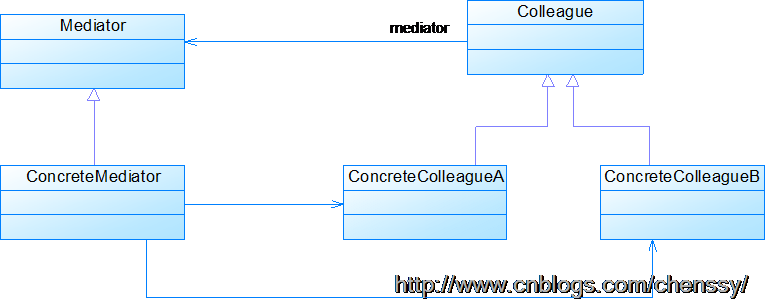
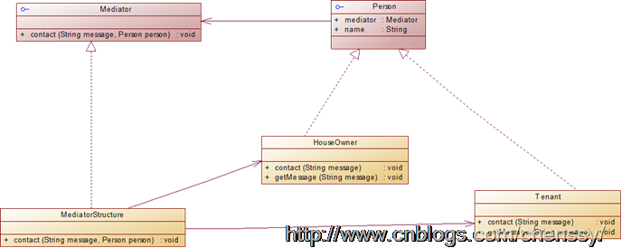

##设计模式读书笔记-----中介者模式

##
## 在我们的生活中处处充斥着“中介者”，比如你租房、买房、出国留学、找工作、旅游等等可能都需要那些中介者的帮助，同时我们也深受其害，高昂的中介费，虚假信息。在地球上最大的中介者就是联合国了，它主要用来维护国际和平与安全、解决国际间经济、社会、文化和人道主义性质的问题。国与国之间的关系异常复杂，会因为各种各样的利益关系来结成盟友或者敌人，熟话说没有永远的朋友，也没有永远的敌人，只有永远的利益！所以国与国之间的关系同样会随着时间、环境因为利益而发生改变。在我们软件的世界也同样如此，对象与对象之间存在着很强、复杂的关联关系，如果没有类似于联合国这样的“机构”会很容易出问题的，譬如：  

##
## 1、 对象与对象之间存在大量的关联关系，这样势必会导致系统的结构变得很复杂，同时若一个对象发生改变，我们也需要跟踪与之相关联的对象，同时做出相应的处理。  

##
## 2、 对象之间的连接增加会导致对象可复用性降低。  

##
## 3、 系统的可扩展性低。增加一个新的对象，我们需要在其相关连的对象上面加上引用，这样就会导致系统的耦合性增高，使系统的灵活性和可扩展都降低。  

##
## 在前面我就知道如果两个类不必彼此通信，那么这两个类就不应当发生直接关联的关系。如果其中一个类需要调用另一个类中的方法，我们可以通过第三方来转发这个调用。所以对于关系比较复杂的系统，我们为了减少对象之间的关联关系，使之成为一个松耦合系统，我们就需要使用中介者模式。  

##
## 通过中介者模式，我们可以将复杂关系的网状结构变成结构简单的以中介者为核心的星形结构，每个对象不再和它与之关联的对象直接发生相互作用，而是通过中介者对象来另一个对象发生相互作用。  

##
##   

##
##  一、 模式定义  

##
## 所谓中介者模式就是用一个中介对象来封装一系列的对象交互，中介者使各对象不需要显式地相互引用，从而使其耦合松散，而且可以独立地改变它们之间的交互。  

##
## 通过定义我们可以看出中介者主要是通过中介对象来封装对象之间的关系，使之各个对象在不需要知道其他对象的具体信息情况下通过中介者对象来与之通信。同时通过引用中介者对象来减少系统对象之间关系，提高了对象的可复用和系统的可扩展性。  

##
## 但是就是因为中介者对象封装了对象之间的关联关系，导致中介者对象变得比较庞大，所承担的责任也比较多。它需要知道每个对象和他们之间的交互细节，如果它出问题，将会导致整个系统都会出问题。所以它比较容易应用也很容易误用。故当系统中出现了“多对多”交互复杂的关系群时，千万别急着使用中介者模式，你首先需要做的就是反思你的系统在设计上是不是合理。  二、 模式结构  

##
## 下图是中介者模式的UML结构图：  

##
##   

##
## 它主要包含如下几个角色：  

##
## Mediator: 抽象中介者。定义了同事对象到中介者对象之间的接口。  

##
## ConcreteMediator: 具体中介者。实现抽象中介者的方法，它需要知道所有的具体同事类，同时需要从具体的同事类那里接收信息，并且向具体的同事类发送信息。  

##
## Colleague: 抽象同事类。  

##
## ConcreteColleague: 具体同事类。每个具体同事类都只需要知道自己的行为即可，但是他们都需要认识中介者。  

##
##在中介者模式中中介者对象处于核心地位，因为它定义了整个系统中所有具体同事类之间的关系。在整个系统中它主要承担两个方面的责任。  

##
## 1、 结构上起到中转作用。通过中介者对象对关系的封装，使得具体的同事类不再需要显示的引用其他对象，它只需要通过中介者就可以完成与其他同事类之间的通信。  

##
## 2、 行为上起到协作作用。中介者对同事类之间的关系进行封装，同事类在不需要知道其他对象的情况下通过中介者与其他对象完成通信。在这个过程中同事类是不需要指明中介者该如何做，中介者可以根据自身的逻辑来进行协调，对同事的请求进一步处理，将同事成员之间的关系行为进行分离和封装。  

##
## 同时由于中介者对对象的关系进行了封装，使得各个同事类之间的耦合减少了，使得他们可以独立改变和复用。  三、 模式实现  

##
## 这里我们就以租房为例，这里中介机构充当租房者与房屋所有者之间的中介者。UML结构图：  

##
##   

##
##  

##
## 首先是抽象中介者:Mediator.java     	public abstract class Mediator {
    //申明一个联络方法
    public abstract void constact(String message,Person person);
	}



##
## 然后是抽象同事对象:Person.java


  	public abstract class Person {
    protected String name;
    protected Mediator mediator;
    
    Person(String name,Mediator mediator){
        this.name = name;
        this.mediator = mediator;
    	}
    
	}



##
## 两个具体同事类：HouseOwner.java


  	public class HouseOwner extends Person{

    HouseOwner(String name, Mediator mediator) {
        super(name, mediator);
    	}
    
    /**
     * @desc 与中介者联系
     * @param message
     * @return void
     */
    public void constact(String message){
        mediator.constact(message, this);
    	}

    /**
     * @desc 获取信息
     * @param message
     * @return void
     */
    public void getMessage(String message){
        System.out.println("房主:" + name +",获得信息：" + message);
    	}
	}



##
## Tenant.java


  	public class Tenant extends Person{
    
    Tenant(String name, Mediator mediator) {
        super(name, mediator);
    	}
    
    /**
     * @desc 与中介者联系
     * @param message
     * @return void
     */
    public void constact(String message){
        mediator.constact(message, this);
    	}

    /**
     * @desc 获取信息
     * @param message
     * @return void
     */
    public void getMessage(String message){
        System.out.println("租房者:" + name +",获得信息：" + message);
    	}
	}



##
## 具体中介者对象：中介结构、MediatorStructure.java


  	public class MediatorStructure extends Mediator{
    //首先中介结构必须知道所有房主和租房者的信息
    private HouseOwner houseOwner;
    private Tenant tenant;

    public HouseOwner getHouseOwner() {
        return houseOwner;
    	}

    public void setHouseOwner(HouseOwner houseOwner) {
        this.houseOwner = houseOwner;
    	}

    public Tenant getTenant() {
        return tenant;
    	}

    public void setTenant(Tenant tenant) {
        this.tenant = tenant;
    	}

    public void constact(String message, Person person) {
        if(person == houseOwner){          //如果是房主，则租房者获得信息
            tenant.getMessage(message);
        	}
        else{       //反正则是房主获得信息
            houseOwner.getMessage(message);
        	}
    	}
	}



##
## 客户端：Client.java


  	public class Client {
    public static void main(String[] args) {
        //一个房主、一个租房者、一个中介机构
        MediatorStructure mediator = new MediatorStructure();
        
        //房主和租房者只需要知道中介机构即可
        HouseOwner houseOwner = new HouseOwner("张三", mediator);
        Tenant tenant = new Tenant("李四", mediator);
        
        //中介结构要知道房主和租房者
        mediator.setHouseOwner(houseOwner);
        mediator.setTenant(tenant);
        
        tenant.constact("听说你那里有三室的房主出租.....");
        houseOwner.constact("是的!请问你需要租吗?");
    	}
	}



##
## 运行结果：

房主:张三,获得信息：听说你那里有三室的房主出租.....
   租房者:李四,获得信息：是的!请问你需要租吗?


##
##


##
##


##
##


##
##


##
##


##
##


##
##


##
##


##
##


##
##


##
##


##
##


##
##


##
##


##
##


##
##

四、 模式优缺点

##优点


##
##1、 简化了对象之间的关系，将系统的各个对象之间的相互关系进行封装，将各个同事类解耦，使系统成为松耦合系统。


##
##2、 减少了子类的生成。


##
##3、 可以减少各同事类的设计与实现。

##缺点


##
##由于中介者对象封装了系统中对象之间的相互关系，导致其变得非常复杂，使得系统维护比较困难。

五、 模式适用场景


##
##1、 系统中对象之间存在比较复杂的引用关系，导致他们之间的依赖关系结构混乱而且难以复用该对象。


##
##2、 想通过一个中间类来封装多个类中的行为，而又不想生成太多的子类。

六、 模式总结


##
##1、 在中介者模式中通过引用中介者对象，将系统中有关的对象所引用的其他对象数目减少到最少。它简化了系统的结构，将系统由负责的网状结构转变成简单的星形结构，中介者对象在这里起到中转和协调作用。


##
##2、 中介者类是中介者模式的核心，它对整个系统进行控制和协调，简化了对象之间的交互，还可以对对象间的交互进行进一步的控制。


##
##3、 通过使用中介者模式，具体的同事类可以独立变化，通过引用中介者可以简化同事类的设计和实现。


##
##4、 就是由于中介者对象需要知道所有的具体同事类，封装具体同事类之间相互关系，导致中介者对象变得非常复杂，系统维护起来较为困难。