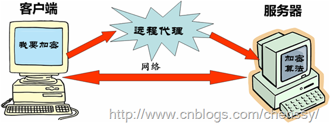
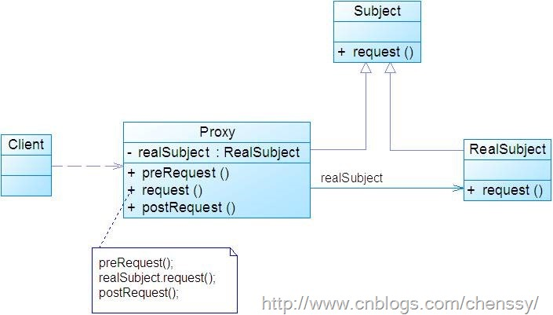

在我们实际生活中代理情况无处不在！你在淘宝上面买东西，你使用支付宝平台支付，卖家请物流公司发货、你请朋友帮你拿包裹，在这个过程汇总支付宝、物流公司、你朋友都扮演者“第三者”的角色在帮你完成物品的购买,这里的第三者我们可以将其称之为代理者。

所谓代理就通过引用一个新的对象来实现对真实对象的操作或者将新的对象当做真实对象的一个替身，这种实现的机制就是代理模式，通过引用代理对象来访问真实对象就是代理模式的设计动机。

# 一、 模式定义

代理模式就是给一个对象提供一个代理，并由代理对象控制对原对象的引用。

在代理模式中，“第三者”代理主要是起到一个中介的作用，它连接客户端和目标对象。

# 二、 模式结构

下图是代理模式UML结构图

在代理模式中有如下三个角色：

Subject: 抽象角色。声明真实对象和代理对象的共同接口。

Proxy:
代理角色。代理对象与真实对象实现相同的接口，所以它能够在任何时刻都能够代理真实对象。代理角色内部包含有对真实对象的引用，所以她可以操作真实对象，同时也可以附加其他的操作，相当于对真实对象进行封装。

RealSubject: 真实角色。它代表着真实对象，是我们最终要引用的对象

# 三、 模式实现

读大学的时候都追过女生吧！某天你看到一位美女，一见钟情，心里发誓要她做你女朋友。但是你想这样直接上去可能会唐突了。于是你采用迂回政策，先和她室友搞好关系，然后通过她室友给她礼物，然后……。

首先出现的就是美女一枚：BeautifulGirl.java

    
    
    public class BeautifulGirl {
        String name;
        
        public BeautifulGirl(String name){
            this.name = name;
        }
    
        public String getName() {
            return name;
        }
    
        public void setName(String name) {
            this.name = name;
        }
        
    }

然后是抽象主题，送礼物接口：GiveGift.java

    
    
    public interface GiveGift {
        /**
         * 送花
         */
        void giveFlowers();
        
        /**
         * 送巧克力
         */
        void giveChocolate();
        
        /**
         * 送书
         */
        void giveBook();
    }

你小子：You.java

    
    
    public class You implements GiveGift {
        BeautifulGirl mm ;     //美女
        
        public You(BeautifulGirl mm){
            this.mm = mm;
        }
        
    
        public void giveBook() {
            System.out.println(mm.getName() +",送你一本书....");
        }
    
        public void giveChocolate() {
            System.out.println(mm.getName() + ",送你一盒巧克力....");
        }
    
        public void giveFlowers() {
            System.out.println(mm.getName() + ",送你一束花....");
        }
    
    }

她闺蜜室友：HerChum.java

    
    
    public class HerChum implements GiveGift{
    
        You you;
        
        public HerChum(BeautifulGirl mm){
            you = new You(mm);
        }
        
        public void giveBook() {
            you.giveBook();
        }
    
        public void giveChocolate() {
            you.giveChocolate();
        }
    
        public void giveFlowers() {
            you.giveFlowers();
        }
    
    }

客户端：Client.java

    
    
    public class Client {
        public static void main(String[] args) {
            BeautifulGirl mm = new BeautifulGirl("小屁孩...");
            
            HerChum chum = new HerChum(mm);
            
            chum.giveBook();
            chum.giveChocolate();
            chum.giveFlowers();
        }
    }

运行结果

小屁孩...,送你一本书....

小屁孩...,送你一盒巧克力....

小屁孩...,送你一束花....

好了礼物已经送出去了，能不能搞定就看你的魅力了！！！！

# 四、 模式优缺点

## 优点

1、 代理模式能够协调调用者和被调用者，在一定程度上降低了系统的耦合度。

2、 代理对象可以在客户端和目标对象之间起到中介的作用，这样起到了的作用和保护了目标对象的

## 缺点

1、由于在客户端和真实主题之间增加了代理对象，因此有些类型的代理模式可能会造成请求的处理速度变慢。

2、 实现代理模式需要额外的工作，有些代理模式的实现非常复杂。

# 五、 模式适用场景

1、 远程代理：为一个对象在不同的地址空间提供局部代表。这样可以隐藏一个对象存在于不同地址空间的事实。

2、 虚拟代理：通过使用过一个小的对象代理一个大对象。这样就可以减少系统的开销。

3、 保护代理：用来控制对真实对象的访问权限。

# 六、 模式总结

1、代理模式是通过使用引用代理对象来访问真实对象，在这里代理对象充当用于连接客户端和真实对象的中介者。

2、代理模式主要用于远程代理、虚拟代理和保护代理。其中保护代理可以进行访问权限控制。

