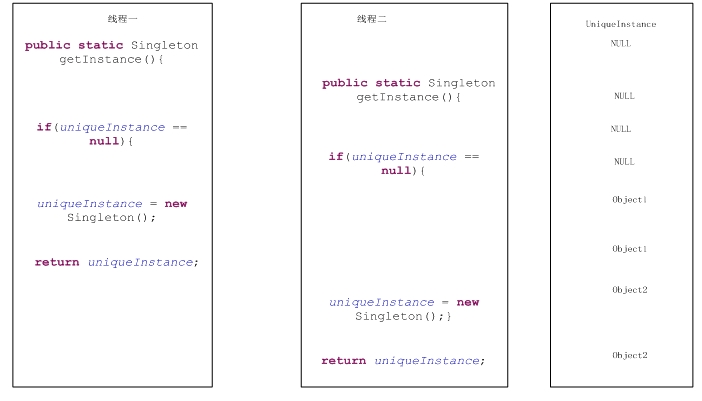

有时候某些对象我们只需要一个，如：线程池、缓存、对话框等等，对于这类对象我们只能有一个实例，如果我

们制造出多个实例，就会导致很多问题产生。

但是我们怎样才能保证一个类只有一个实例并且能够便于访问？这里我们想到了全局变量，全局变量确实是可以

保证该类可以随时访问，但是它很难解决只有一个实例问题。最好的办法就是让该自身来负责保存它的唯一实例。这

个类必须要保证没有其他类来创建它。这里我们可以将其构造方法私有化。即

    
    
    1 Public MyClass{
    2          PrivateMyClass(){}
    3 }

含有私有化构造器的类就能保证它不能被其他类实例化了。但是我们如何来获取这个实例化类呢？提供一个方法

用于返回该类的实例对象即可实现。

    
    
    1 public class MyClass {
    2     private MyClass(){
    3         
    4     }
    5     
    6     public static MyClass getInstance(){
    7         return new MyClass();
    8     }
    9 }

一、基本定义

通过上面简单介绍，我们可以对单例模式有一个简单的认识。所谓单例模式就是确保某一个类只有一个实例，并

且提供一个全局访问点。

从上面可以看出单例模式有如下几个特点：

一、它只有一个实例。

二、它必须要自行实例化。

三、它必须自行想整个系统提供访问点。

二、模式结构

单例模式可以说是最简单的设计模式了，它仅有一个角色Singleton。

Singleton：单例。

三、模式实现

    
    
     1 public class Singleton {
     2     //利用静态变量来记录Singleton的唯一实例
     3     private static Singleton uniqueInstance;
     4     
     5     /*
     6      * 构造器私有化，只有Singleton类内才可以调用构造器
     7      */
     8     private Singleton(){
     9         
    10     }
    11     
    12     public static Singleton getInstance(){
    13         if(uniqueInstance == null){
    14             uniqueInstance = new Singleton();
    15         }
    16         
    17         return uniqueInstance;
    18     }
    19     
    20 }

在《Head First》有这样一个场景，就是说有两个线程都要执行这段代码，很有可能会产生两个实例对象。如下图：

这里有三种解决方案。

第一、 使用synchronized来处理。也就是说将getInstance()方法变成同步方法即可。

    
    
     1 public class Singleton {
     2     //利用静态变量来记录Singleton的唯一实例
     3     private static Singleton uniqueInstance;
     4     
     5     /*
     6      * 构造器私有化，只有Singleton类内才可以调用构造器
     7      */
     8     private Singleton(){
     9         
    10     }
    11     
    12     public static synchronized Singleton getInstance(){
    13         if(uniqueInstance == null){
    14             uniqueInstance = new Singleton();
    15         }
    16         
    17         return uniqueInstance;
    18     }
    19     
    20 }

第二、 直接初始化静态变量。这样就保证了线程安全。

    
    
     1 public class Singleton {
     2     /*
     3      * 利用静态变量来记录Singleton的唯一实例
     4      * 直接初始化静态变量，这样就可以确保线程安全了
     5      */
     6     private static Singleton uniqueInstance = new Singleton();
     7     
     8     /*
     9      * 构造器私有化，只有Singleton类内才可以调用构造器
    10      */
    11     private Singleton(){
    12         
    13     }
    14     
    15     public static Singleton getInstance(){
    16         return uniqueInstance;
    17     }
    18     
    19 }

第三、 用“双重检查加锁”，在getInstance()中减少使用同步。

    
    
     1 public class Singleton {
     2     /*
     3      * 利用静态变量来记录Singleton的唯一实例
     4      * volatile 关键字确保：当uniqueInstance变量被初始化成Singleton实例时，
     5      * 多个线程正确地处理uniqueInstance变量
     6      * 
     7      */
     8     private volatile static Singleton uniqueInstance;
     9     
    10     /*
    11      * 构造器私有化，只有Singleton类内才可以调用构造器
    12      */
    13     private Singleton(){
    14         
    15     }
    16     
    17     /*
    18      * 
    19      * 检查实例，如果不存在，就进入同步区域
    20      */
    21     public static Singleton getInstance(){
    22         if(uniqueInstance == null){
    23             synchronized(Singleton.class){    //进入同步区域
    24                 if(uniqueInstance == null){     //在检查一次，如果为null，则创建
    25                     uniqueInstance  = new Singleton();
    26                 }
    27             }
    28         }
    29         
    30         return uniqueInstance;
    31     }
    32     
    33 }

在这里是首先检查是否实例已经创建了，如果尚未创建，才会进行同步。这样一来。只有第一次会同步。

四、模式优缺点

优点

一、节约了系统资源。由于系统中只存在一个实例对象，对与一些需要频繁创建和销毁对象的系统而言，单

例模式无疑节约了系统资源和提高了系统的性能。

二、因为单例类封装了它的唯一实例，所以它可以严格控制客户怎样以及何时访问它。

缺点

一、由于单例模式中没有抽象层，因此单例类的扩展有很大的困难。

二、单例类的职责过重，在一定程度上违背了“单一职责原则”。

五、模式使用场景

下列几种情况可以使用单例模式。

一、系统只需要一个实例对象，如系统要求提供一个唯一的序列号生成器，或者需要考虑资源消耗太大而只允许创建一个对象。

二、客户调用类的单个实例只允许使用一个公共访问点，除了该公共访问点，不能通过其他途径访问该实例。

六、总结

1\. 单例模式中确保程序中一个类最多只有一个实例。

2\. 单例模式的构造器是私有了，而且它必须要提供实例的全局访问点。

3\. 单例模式可能会因为多线程的问题而带来安全隐患。

