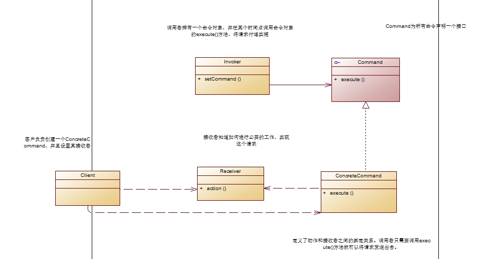
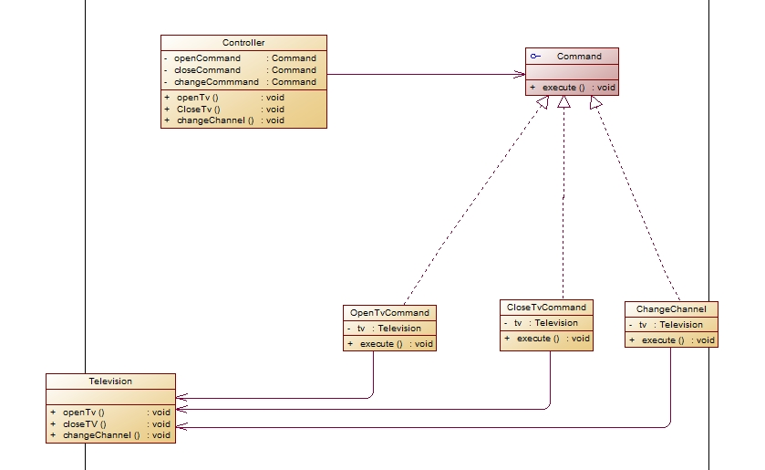
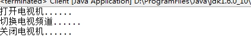
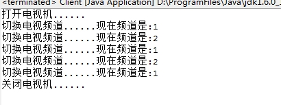

##设计模式读书笔记-----命令模式    在开发过程中，我可能会需要向某些对象发送一些请求，但是我们不知请求的具体接收者是谁，也不知道被请求的操作是那个，我们只知道在程序运行中指定具体的请求接收者即可。打个比方，电视遥控器，我们只需要知道按那个按钮能够打开电视、关闭电视和换台即可，并不需要知道是怎么开电视、关电视和换台的。对于这种情况，我们可以采用命令模式来进行设计。
    一、基本定义
    命令模式将请求封装成对象，以便使用不同的请求、队列或者日志来参数化其他对象。命令模式支持可撤销的操作。
    命令模式可以对发送者额接受者完全解耦，发送者也接收者之间并没有直接的联系，发送者只需要知道如何发送请求，不需要关心请求是如何完成了。这就是命令模式，命令模式将方法调用给封装起来了。

二、模式结构   
 
    从上图可以看出命令模式包含如下几个角色：
     Command: 抽象命令类
     ConcreteCommand: 具体命令类
     Invoker: 调用者
     Receiver: 接收者
     Client:客户类
    命令模式的本质就在于将命令进行封装，将发出命令的责任和执行命令的责任分开，是的发送者只需要知道如何发送命令即可，不需要命令是如何实现的，甚至命令执行是否成功都不需要理会。同时命令模式使得请求也变成了一个对象，它像其他对象一样可以被存储和传递。

    三、模式实现
    这里以电视机为例。电视剧是请求的接受者，遥控器是请求的发送者，遥控器上有一些按钮，不同的按钮对应着不同的操作。在这里遥控器需要执行三个命令：打开电视机、关闭电视机、换台。
    UML图：
 
    代码的实现
    抽象命令类：Command.java

	1 /**
2  * Command命令接口，为所有的命令声明一个接口。所有的命令都应该实现它
3  */
4 public interface Command {
5     public void execute();
6 	}


##
##电视机类：Television.java

	 1 public class Television {
 2     public void open(){
 3         System.out.println("打开电视机......");
 4     	}
 5     
 6     public void close(){
 7         System.out.println("关闭电视机......");        
 8     	}
 9     
10     public void changeChannel(){
11         
12         System.out.println("切换电视频道......");
13     	}
14 	}


##
##遥控器类：Controller.java

	 1 public class Controller {
 2     private Command openTVCommand;
 3     private Command closeTVCommand;
 4     private Command changeChannelCommand;
 5     
 6     public Controller(Command openTvCommand,Command closeTvCommand,Command changeChannelCommand){
 7         this.openTVCommand = openTvCommand;
 8         this.closeTVCommand = closeTvCommand;
 9         this.changeChannelCommand = changeChannelCommand;
10     	}
11     
12     /**
13      * 打开电视剧
14      */
15     public void open(){
16         openTVCommand.execute();
17     	}
18     
19     /**
20      * 关闭电视机
21      */
22     public void close(){
23         closeTVCommand.execute();
24     	}
25     
26     /**
27      * 换频道
28      */
29     public void change(){
30         
31         changeChannelCommand.execute();
32     	}
33     
34 	}


##
##遥控器的三个按钮

	 1 public class OpenTvCommand implements Command{
 2     private Television tv;
 3     
 4     public OpenTvCommand(){
 5         tv = new Television();
 6     	}
 7     
 8     public void execute() {
 9         tv.open();
10     	}
11 
12 	}


##
##

	 1 public class ChangeChannelCommand implements Command{
 2     private Television tv;
 3     
 4     public ChangeChannelCommand(){
 5         tv = new Television();
 6     	}
 7     
 8     public void execute() {
 9         tv.changeChannel();
10     	}
11 
12 	}


	 1 public class CloseTvCommand implements Command{
 2     private Television tv;
 3     
 4     public CloseTvCommand(){
 5         tv = new Television();
 6     	}
 7     
 8     public void execute() {
 9         tv.close();
10     	}
11     
12 	}


##
##客户端：Client.java

	 1 public class Client {
 2         public static void main(String a[])
 3         {
 4             Command openCommand,closeCommand,changeCommand;
 5             
 6             openCommand = new OpenTvCommand();
 7             closeCommand = new CloseTvCommand();
 8             changeCommand = new ChangeChannelCommand();
 9             
10             Controller control = new Controller(openCommand,closeCommand,changeCommand);
11             
12             control.open();           //打开电视机
13             control.change();         //换频道
14             control.close();          //关闭电视机
15         	}
16 
17 	}


##
##运行结果
 

    四、模式优缺点
    优点
      1. 降低了系统耦合度
      2. 新的命令可以很容易添加到系统中去。
    缺点
      使用命令模式可能会导致某些系统有过多的具体命令类。

五、模式使用场景
      1.系统需要将请求调用者和请求接收者解耦，使得调用者和接收者不直接交互。
      2.系统需要在不同的时间指定请求、将请求排队和执行请求。
      3.系统需要支持命令的撤销(Undo)操作和恢复(Redo)操作。
      5.系统需要将一组操作组合在一起，即支持宏命令。

六、模式扩展
      1. 撤销命令
      在电视遥控器中，我们还有这样一个按钮，那就是返回。用于切换到上面一个频道中去。在命令模式中也支持撤销操作，在这里我们只需要记录上一个频道，然后将上一个频道传入即可。
      在这里将Command进行一个简单的修改：将execute()改为execute(int I );i表示频道，用于进行频道切换。

	 1 /**
 2  * Command命令接口，为所有的命令声明一个接口。所有的命令都应该实现它
 3  */
 4 public interface Command {
 5     /**
 6      * 为了方便切换频道，这里使用参数i将频道传递
 7      * @param i
 8      */
 9     public void execute(int i);
10 	}


##
##然后在Controller中添加channelUndo()方法，用于进行频道返回。并且需要进行一些简单的修改。

	 1 public class Controller {
 2     private Command openTVCommand;
 3     private Command closeTVCommand;
 4     private Command changeChannelCommand;
 5     
 6     public int nowChannel = 0;       //当前频道
 7     public int priorChannel;     //前一个频道，用于执行返回操作
 8     
 9     public Controller(Command openTvCommand,Command closeTvCommand,Command changeChannelCommand){
10         this.openTVCommand = openTvCommand;
11         this.closeTVCommand = closeTvCommand;
12         this.changeChannelCommand = changeChannelCommand;
13     	}
14     
15     /**
16      * 打开电视剧
17      */
18     public void open(){
19         openTVCommand.execute(0);
20     	}
21     
22     /**
23      * 关闭电视机
24      */
25     public void close(){
26         closeTVCommand.execute(0);
27     	}
28     
29     /**
30      * 换频道：只在当前频道递增
31      */
32     public void change(){
33         priorChannel = nowChannel;            //换频道前记录当前频道
34         nowChannel++;       //频道+1
35         changeChannelCommand.execute(nowChannel);
36     	}
37     
38     /**
39      * 频道返回
40      */
41     public void ChannelUndo(){
42         changeChannelCommand.execute(priorChannel);          //将以前的频道传入
43         //当前频道与前一个频道进行互换
44         int tempChannel;
45         tempChannel = priorChannel;
46         priorChannel = nowChannel;
47         nowChannel = tempChannel;
48     	}
49 	}


##
##客户端


	 1 public class Client {
 2         public static void main(String a[])
 3         {
 4             Command openCommand,closeCommand,changeCommand;
 5             
 6             openCommand = new OpenTvCommand();
 7             closeCommand = new CloseTvCommand();
 8             changeCommand = new ChangeChannelCommand();
 9             
10             Controller control = new Controller(openCommand,closeCommand,changeCommand);
11             
12             control.open();           //打开电视机
13             control.change();         //换频道
14             control.change();
15             control.ChannelUndo();
16             control.ChannelUndo();
17             control.ChannelUndo();
18             control.close();          //关闭电视机
19         	}
20 
21 	}


##
##运行结果。
 

七、总结 
      1. 命令模式的本质就是将命令对象进行封装打包，将发出命令的责任和执行命令的责任进行割开。
      2. 命令模式中发送者只需要知道如何发送请求命令，无须关心命令执行具体过程。
      3. 在发送者和接收者两者间是通过命令对象进行沟通的。请求命令本身就当做一个对象在两者间进行传递，它封装了接收者和一组动作。
      4. 命令模式支持撤销。
      5. 命令模式队列请求和日志请求。
