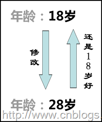
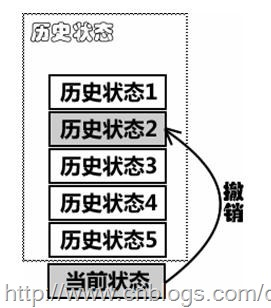
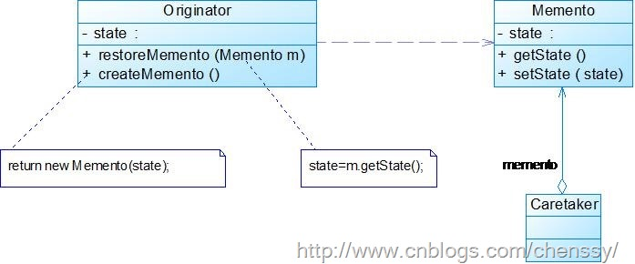
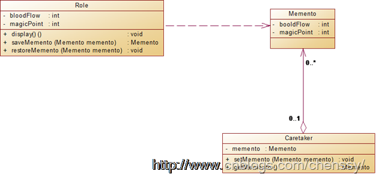
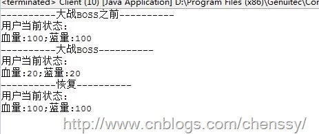

个人比较喜欢玩单机游戏，什么仙剑、古剑、鬼泣、使命召唤、三国无双等等一系列的游戏我都玩过(现在期待凡人修仙传)，对于这些游戏除了剧情好、场面大、爽快之外，还可以随时存档，等到下次想玩了又可以从刚开始的位置玩起(貌似现在的游戏都有)。这里的所谓存档就是将当前的状态记录下来，打开存档的时候只需要将这些状态读取出来即可。还有我们小时候期待长大，长大了希望回到小时候。18岁想长到28岁，到了28想还是18好!!!

上面所提到的就是“后悔药”机制。在我们生活中，做错事了我们都期望可以从新开始，希望这个世界上有后悔药可以吃，但现实是残酷的，这个世界是没有后悔药可以吃！虽然在现实社会中不可以实现，我们可以在软件的世界里实现(现在好多软件有撤销功能：Ctrl+Z不就是么)。

在应用开发中，很多时候我们总是需要记录一个对象的内部状态，这样做的目的就是为了允许用户取消不确定或者错误的操作，能够恢复到他原先的状态，使得他有“后悔药”可吃。

备忘录模式是一种给我们的软件提供后悔药的机制，通过它可以使系统恢复到某一特定的历史状态。

# 一、 模式定义

所谓备忘录模式就是在不破坏封装的前提下，捕获一个对象的内部状态，并在该对象之外保存这个状态，这样可以在以后将对象恢复到原先保存的状态。

备忘录模式将要保存的细节给封装在备忘录中，就是那天要改变保存的细节也不会影响到客户端。

# 二、 模式结构

下图是备忘录模式的UML结构图：

备忘录模式主要包含入下几个角色：

Originator:
原发器。负责创建一个备忘录，用以记录当前对象的内部状态，通过也可以使用它来利用备忘录恢复内部状态。同时原发器还可以根据需要决定Memento存储Originator的那些内部状态。

Memento:
备忘录。用于存储Originator的内部状态，并且可以防止Originator以外的对象访问Memento。在备忘录Memento中有两个接口，其中Caretaker只能看到备忘录中的窄接口，它只能将备忘录传递给其他对象。Originator可以看到宽接口，允许它访问返回到先前状态的所有数据。

Caretaker: 负责人。负责保存好备忘录，不能对备忘录的内容进行操作和访问，只能够将备忘录传递给其他对象。

在备忘录模式中，最重要的就是备忘录Memento了。我们都是备忘录中存储的就是原发器的部分或者所有的状态信息，而这些状态信息是不能够被其他对象所访问了，也就是说我们是不可能在备忘录之外的对象来存储这些状态信息，如果暴漏了内部状态信息就违反了封装的原则，故备忘录是除了原发器外其他对象都是不可以访问的。

所以为了实现备忘录模式的封装，我们需要对备忘录的访问做些控制：

对原发器：可以访问备忘录里的所有信息。

对负责人：不可以访问备忘录里面的数据，但是他可以保存备忘录并且可以将备忘录传递给其他对象。

其他对象：不可访问也不可以保存，它只负责接收从负责人那里传递过来的备忘录同时恢复原发器的状态。

所以就备忘录模式而言理想的情况就是只允许生成该备忘录的那个原发器访问备忘录的内部状态。

典型的备忘录代码如下：

    
    
    class Memento {
        private String state;
        public Memento(Originator o){
        　　state = o.state;
        }
        public void setState(String state){
           this.state=state;
        }
        public String getState(){
           return this.state;
        }　　
    }

# 三、 模式实现

实现场景：我们就以游戏挑战BOSS为实现场景，在挑战BOSS之前，角色的血量、蓝量都是满值，然后存档，在大战BOSS时，由于操作失误导致血量和蓝量大量损耗，所以只好恢复到刚刚开始的存档点，继续进行大战BOSS了。这里使用备忘录模式来实现。UML结构图如下：

首先是游戏角色类：Role.java

    
    
    private int bloodFlow;
        private int magicPoint;
        
        public Role(int bloodFlow,int magicPoint){
            this.bloodFlow = bloodFlow;
            this.magicPoint = magicPoint;
        }
    
        public int getBloodFlow() {
            return bloodFlow;
        }
    
        public void setBloodFlow(int bloodFlow) {
            this.bloodFlow = bloodFlow;
        }
    
        public int getMagicPoint() {
            return magicPoint;
        }
    
        public void setMagicPoint(int magicPoint) {
            this.magicPoint = magicPoint;
        }
        
        /**
         * @desc 展示角色当前状态
         * @return void
         */
        public void display(){
            System.out.println("用户当前状态:");
            System.out.println("血量:" + getBloodFlow() + ";蓝量:" + getMagicPoint());
        }
        
        /**
         * @desc 保持存档、当前状态
         * @return
         * @return Memento
         */
        public Memento saveMemento(){
            return new Memento(getBloodFlow(), getMagicPoint());
        }
        
        /**
         * @desc 恢复存档
         * @param memento
         * @return void
         */
        public void restoreMemento(Memento memento){
            this.bloodFlow = memento.getBloodFlow();
            this.magicPoint = memento.getMagicPoint();
        }
    }

备忘录：Memento.java

    
    
    class Memento {
        private int bloodFlow;
        private int magicPoint;
    
        public int getBloodFlow() {
            return bloodFlow;
        }
    
        public void setBloodFlow(int bloodFlow) {
            this.bloodFlow = bloodFlow;
        }
    
        public int getMagicPoint() {
            return magicPoint;
        }
    
        public void setMagicPoint(int magicPoint) {
            this.magicPoint = magicPoint;
        }
        
        public Memento(int bloodFlow,int magicPoint){
            this.bloodFlow = bloodFlow;
            this.magicPoint = magicPoint;
        }
    }

负责人：Caretaker.java

    
    
    public class Caretaker {
        Memento memento;
    
        public Memento getMemento() {
            return memento;
        }
    
        public void setMemento(Memento memento) {
            this.memento = memento;
        }
    
    }

客户端：Client.java

    
    
    public class Client {
        public static void main(String[] args) {
            //打BOSS之前：血、蓝全部满值
            Role role = new Role(100, 100);
            System.out.println("----------大战BOSS之前----------");
            role.display();
            
            //保持进度
            Caretaker caretaker = new Caretaker();
            caretaker.memento = role.saveMemento();
            
            //大战BOSS，快come Over了
            role.setBloodFlow(20);
            role.setMagicPoint(20);
            System.out.println("----------大战BOSS----------");
            role.display();
            
            //恢复存档
            role.restoreMemento(caretaker.getMemento());
            System.out.println("----------恢复----------");
            role.display();
            
        }
    }

运行结果

# 四、 模式的优缺点

## 优点

1、 给用户提供了一种可以恢复状态的机制。可以是用户能够比较方便地回到某个历史的状态。

2、 实现了信息的封装。使得用户不需要关心状态的保存细节。

## 缺点

消耗资源。如果类的成员变量过多，势必会占用比较大的资源，而且每一次保存都会消耗一定的内存。

# 五、 模式适用场景

1、 需要保存一个对象在某一个时刻的状态或部分状态。

2、
如果用一个接口来让其他对象得到这些状态，将会暴露对象的实现细节并破坏对象的封装性，一个对象不希望外界直接访问其内部状态，通过负责人可以间接访问其内部状态。

# 六、 模式总结

1、 备忘录模式可以实现在不破坏封装的前提下，捕获一个类的内部状态，并且在该对象之外保存该对象的状态，保证该对象能够恢复到历史的某个状态。

2、 备忘录模式实现了内部状态的封装，除了创建它的原发器之外其他对象都不能够访问它。

3、 备忘录模式会占用较多的内存，消耗资源。

