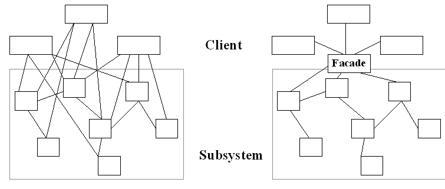
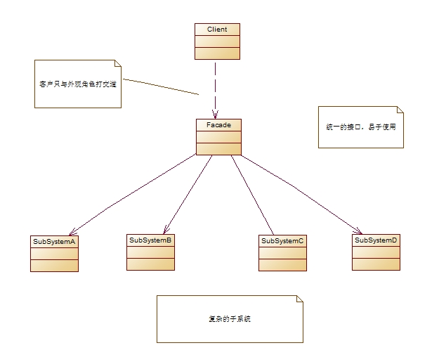
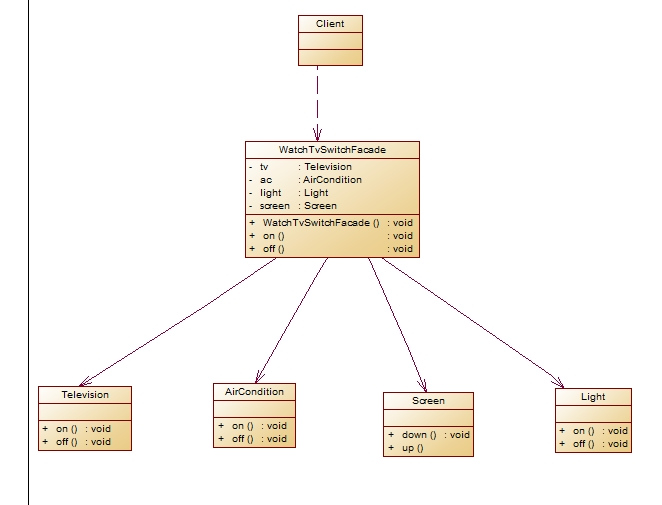
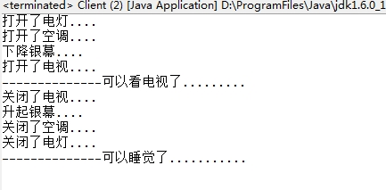

前面介绍的适配器模式([设计模式读书笔记-----
适配器模式](http://www.cnblogs.com/chenssy/p/3204504.html))讲的是如何将一个接口转换成客户所需要的另一个接口，它的目的在于

解决接口的不兼容性问题。现在这里有这样一个模式，它的目的在于如何简化接口，它可以将多个类的复杂的一切隐藏在背后，只显露

出一个干净美观的外观。

晚上睡觉之前，你总是喜欢看电视，在你进入卧室的时候你需要完成以下几个步骤：打开电灯、打开空调、放心银幕(假如你家

有)、打开电视通过这么些繁琐的步骤后你终于可以看电视了，但是你要睡觉了呢？又要去进行繁琐的关闭动作。这里你就需要一个外观

模式了，通过实现一个更加合理的接口外观类将这些动作都包装起来，实现一键“看电视”、一键“关电视”。这就是外观模式的动机

**一、模式定义**

所谓外观模式就是提供一个统一的接口，用来访问子系统中的一群接口。

外观模式定义了一个高层接口，让子系统更容易使用。如下图，是使用外观模式后将子系统的使用变得更加简单。

在引入外观模式后，客户只需要与外观角色打交道，客户与子系统的复杂关系有外观角色来实现，从而降低了系统的耦合度。

**二、模式结构**

外观模式包含如下两个角色：

Facade: 外观角色

SubSystem:子系统角色

**三、模式实现**

场景就是上面那个“睡觉看电视”的场景。

实例的UML图

首先是四个组件（电视、电灯、空调、银幕）

    
    
    1 public class Television {
    2     public void on(){
    3         System.out.println("打开了电视....");
    4     }
    5     
    6     public void off(){
    7         System.out.println("关闭了电视....");
    8     }
    9 }
    
    
    1 public class Light {
    2     public void on(){
    3         System.out.println("打开了电灯....");
    4     }
    5     
    6     public void off(){
    7         System.out.println("关闭了电灯....");
    8     }
    9 }
    
    
    1 public class AirCondition {
    2     public void on(){
    3         System.out.println("打开了空调....");
    4     }
    5     
    6     public void off(){
    7         System.out.println("关闭了空调....");
    8     }
    9 }
    
    
    1 public class Screen {
    2     public void up(){
    3         System.out.println("升起银幕....");
    4     }
    5     
    6     public void down(){
    7         System.out.println("下降银幕....");        
    8     }
    9 }
    
    
        然后是比较强大、干净、美观的外观
    
    
     1 public class WatchTvSwtichFacade {
     2     Light light;
     3     AirCondition ac;
     4     Television tv;
     5     Screen screen;
     6     
     7     public WatchTvSwtichFacade(Light light,AirCondition ac,Television tv,Screen screen){
     8         this.light = light;
     9         this.ac = ac;
    10         this.tv = tv;
    11         this.screen = screen;
    12     }
    13     
    14     public void on(){
    15         light.on();       //首先开灯
    16         ac.on();          //然后是打开空调
    17         screen.down();    //把银幕降下来
    18         tv.on();          //最后是打开电视
    19     }
    20     
    21     public void off(){
    22         tv.off();         //首先关闭电视机
    23         screen.up();      //银幕升上去
    24         ac.off();         //空调关闭
    25         light.off();      //最后关灯
    26     }
    27 }

客户端

    
    
     1 public class Client {
     2     public static void main(String[] args) {
     3         //实例化组件
     4         Light light = new Light();
     5         Television tv = new Television();
     6         AirCondition ac = new AirCondition();
     7         Screen screen = new Screen();
     8         
     9         WatchTvSwtichFacade watchTv = new WatchTvSwtichFacade(light, ac, tv, screen);
    10         
    11         watchTv.on();
    12         System.out.println("--------------可以看电视了.........");
    13         watchTv.off();
    14         System.out.println("--------------可以睡觉了...........");
    15     }
    16 }

运行结果

从上面的使用通过使用外观模式，客户可以非常方便的实现比较复杂的功能。

** 四、模式优缺点**

**优点**

1、引入外观模式，是客户对子系统的使用变得简单了，减少了与子系统的关联对象，实现了子系统与客户之间的松耦合关系。

2、只是提供了一个访问子系统的统一入口，并不影响用户直接使用子系统类

3、降低了大型软件系统中的编译依赖性，并简化了系统在不同平台之间的移植过程

** 缺点**

1、不能很好地限制客户使用子系统类，如果对客户访问子系统类做太多的限制则减少了可变性和灵活性

2、在不引入抽象外观类的情况下，增加新的子系统可能需要修改外观类或客户端的源代码，违背了“开闭原则”

**五、使用场景**

1、当要为一个复杂子系统提供一个简单接口时可以使用外观模式。

2、客户程序与多个子系统之间存在很大的依赖性。引入外观类将子系统与客户以及其他子系统解耦，可以提高子系统的独立性和

可移植性

** 六、模式总结**

1、 外观模式的主要优点就在于减少了客户与子系统之间的关联对象，使用客户对子系统的使用变得简单了，也实现了客户与子

系统之间的松耦合关系。它的缺点就在于违背了“开闭原则”。

2、 如果需要实现一个外观模式，需要将子系统组合进外观中，然后将工作委托给子系统执行。

