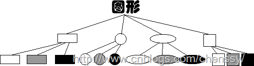
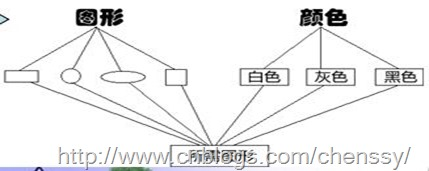
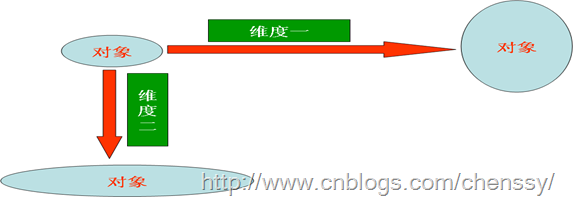
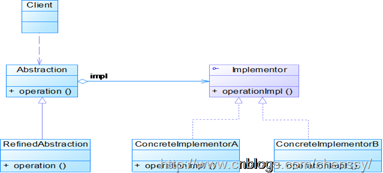
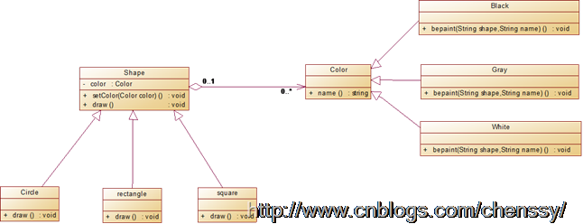

在开始学java的时候老师讲到继承的时候，总是喜欢用一个例子来讲解，那就是画图，这里有一个画笔，可以画正方形、长方形、圆形（这个大家都知道怎么做吧，我就不解释了）。但是现在我们需要给这些形状进行上色，这里有三种颜色：白色、灰色、黑色。这里我们可以画出3*3=9中图形：白色正方形、白色长方形、白色圆形。。。。。。到这里了我们几乎到知道了这里存在两种解决方案：

方案一：为每种形状都提供各种颜色的版本。

方案二：根据实际需要对颜色和形状进行组合。

我们我们采用方案一来实现的话，我们是不是也可以这样来理解呢？为每种颜色都提供各种形状的版本呢？这个是完全的可以的。如下：

对于中两个图形，我们都会很清楚这样一个问题：加入我们添加椭圆，我们是不是又要增加三种颜色呢？假如我们在增加一个绿色，我们就要增加其四种形状了，继续加。继续加……每次增加都会增加若干个类(如果增加颜色则会增加形状个数个类，若增加形状则会增加颜色个数个类)，这样的情况我想每个程序员都不会想要吧！那么我们看方案二。

方案二所提供的就是解决方法是：提供两个父类一个是颜色、一个形状，颜色父类和形状父类两个类都包含了相应的子类，然后根据需要对颜色和形状进行组合。

对于有几个变化的维度，我们一般采用方案二来实现，这样除了减少系统中的类个数，也利于系统扩展。对于方案二的应用我们称之为桥接模式。

# 一、 模式定义

桥接模式即将抽象部分与它的实现部分分离开来，使他们都可以独立变化。

桥接模式将继承关系转化成关联关系，它降低了类与类之间的耦合度，减少了系统中类的数量，也减少了代码量。

将抽象部分与他的实现部分分离这句话不是很好理解，其实这并不是将抽象类与他的派生类分离，而是抽象类和它的派生类用来实现自己的对象。这样还是不能理解的话。我们就先来认清什么是抽象化，什么是实现化，什么是脱耦。

抽象化：其概念是将复杂物体的一个或几个特性抽出去而只注意其他特性的行动或过程。在面向对象就是将对象共同的性质抽取出去而形成类的过程。

实现化：针对抽象化给出的具体实现。它和抽象化是一个互逆的过程，实现化是对抽象化事物的进一步具体化。

脱耦：脱耦就是将抽象化和实现化之间的耦合解脱开，或者说是将它们之间的强关联改换成弱关联，将两个角色之间的继承关系改为关联关系。

对于那句话：将抽象部分与他的实现部分分离套用《大话设计模式》里面的就是实现系统可能有多个角度分类，每一种角度都可能变化，那么把这种多角度分类给分离出来让他们独立变化，减少他们之间耦合。

桥接模式中的所谓脱耦，就是指在一个软件系统的抽象化和实现化之间使用关联关系（组合或者聚合关系）而不是继承关系，从而使两者可以相对独立地变化，这就是桥接模式的用意。

# 二、 模式结构

下图是桥接模式的UML结构图：

桥接模式主要包含如下几个角色：

Abstraction：抽象类。  
RefinedAbstraction：扩充抽象类。  
Implementor：实现类接口。  
ConcreteImplementor：具体实现类 。  

# 三、 模式实现

模式场景我们就采用哪个画图的。其UML结构图如下：

首先是形状类：该类为一个抽象类，主要提供画形状的方法：Shape.java

    
    
    public abstract class Shape {
        Color color;
    
        public void setColor(Color color) {
            this.color = color;
        }
        
        public abstract void draw();
    }

然后是三个形状 。圆形：Circle.java

    
    
    public class Circle extends Shape{
    
        public void draw() {
            color.bepaint("正方形");
        }
    }

长方形：Rectangle.java

    
    
    public class Rectangle extends Shape{
    
        public void draw() {
            color.bepaint("长方形");
        }
    
    }

正方形：Square.java

    
    
    public class Square extends Shape{
    
        public void draw() {
            color.bepaint("正方形");
        }
    
    }

颜色接口：Color.java

    
    
    public interface Color {
        public void bepaint(String shape);
    }

白色：White.java

    
    
    public class White implements Color{
    
        public void bepaint(String shape) {
            System.out.println("白色的" + shape);
        }
    
    }

灰色：Gray.java

    
    
    public class Gray implements Color{
    
        public void bepaint(String shape) {
            System.out.println("灰色的" + shape);
        }
    }

黑色：Black.java

    
    
    public class Black implements Color{
    
        public void bepaint(String shape) {
            System.out.println("黑色的" + shape);
        }
    }

客户端：Client.java

    
    
    public class Client {
        public static void main(String[] args) {
            //白色
            Color white = new White();
            //正方形
            Shape square = new Square();
            //白色的正方形
            square.setColor(white);
            square.draw();
            
            //长方形
            Shape rectange = new Rectangle();
            rectange.setColor(white);
            rectange.draw();
        }
    }

运行结果：

白色的正方形  
白色的长方形

# 四、 模式优缺点

## 优点

1、分离抽象接口及其实现部分。提高了比继承更好的解决方案。

2、桥接模式提高了系统的可扩充性，在两个变化维度中任意扩展一个维度，都不需要修改原有系统。

3、实现细节对客户透明，可以对用户隐藏实现细节。

## 缺点

1、桥接模式的引入会增加系统的理解与设计难度，由于聚合关联关系建立在抽象层，要求开发者针对抽象进行设计与编程。  
2、桥接模式要求正确识别出系统中两个独立变化的维度，因此其使用范围具有一定的局限性。

# 五、 模式使用场景

1、如果一个系统需要在构件的抽象化角色和具体化角色之间增加更多的灵活性，避免在两个层次之间建立静态的继承联系，通过桥接模式可以使它们在抽象层建立一个关联关系。

2、对于那些不希望使用继承或因为多层次继承导致系统类的个数急剧增加的系统，桥接模式尤为适用。

3、一个类存在两个独立变化的维度，且这两个维度都需要进行扩展。

# 六、 模式总结

1、桥接模式实现了抽象化与实现化的脱耦。他们两个互相独立，不会影响到对方。

2、对于两个独立变化的维度，使用桥接模式再适合不过了。

3、对于“具体的抽象类”所做的改变，是不会影响到客户。

